# 📰 关于VPN搭建

上一条推文很多人都私信我，已经炸了

考虑了一下，还是发出来吧，要是某些人利用这个来变现也没办法了，主要还是为了粉丝分享出来，谁叫我的粉丝都特别好呢

这里感谢 @yaojingkl 和分享脚本的老哥 CMLiussss

---

这里需要拥有一个自己的域名地址（重要）

---

教程开始：

 下载zip  [edgetunnel-main](https://github.com/cmliu/edgetunnel/archive/refs/heads/main.zip) 备用（点击这里就能下载）

准备一个 Cloudflare 账号，点击 计算和AI &gt; Workers 和 Pages &gt; 创建应用程序

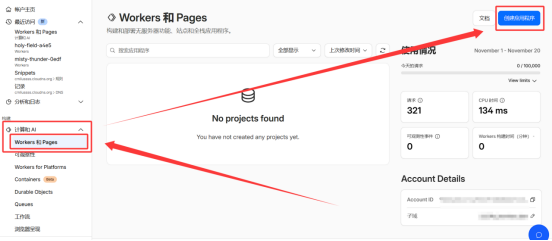

或

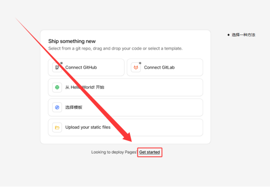

选择 Pages 选项卡，点击 拖放文件 &gt; 开始使用

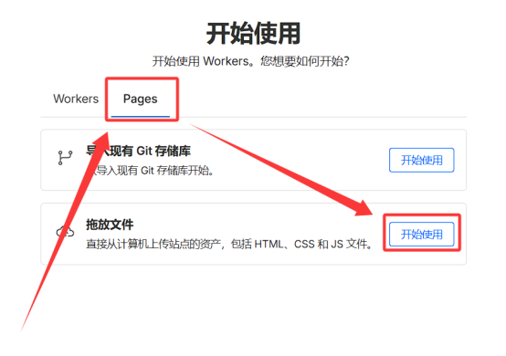

项目名称 填写任意值，但必须是全新的名字，避免出现1101错误，推荐末尾补上任意数字，如 edt123123123

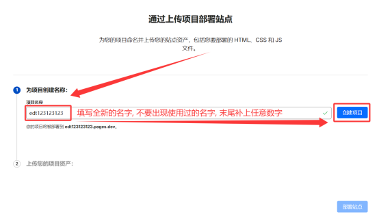

点击 从计算机中选择 &gt; 上传压缩文件，选择第一步下载的 direct-upload-demo.zip 压缩包，等待上传完成；

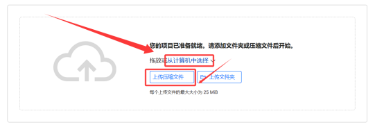

点击 部署站点，等待部署完成

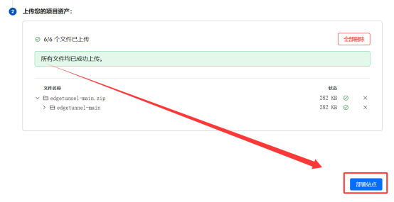

提示成功，代表初始化部署完成！点击 继续处理项目 进入下一步设置变量绑定KV的操作

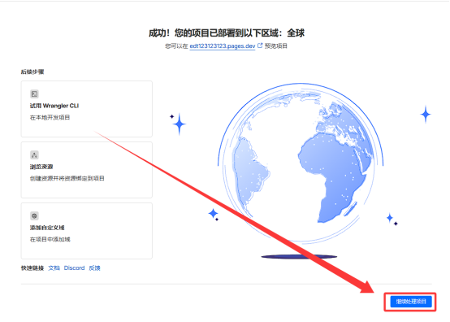

设置管理员变量

进入项目设置页面，点击 设置 选项卡，添加变量和机密

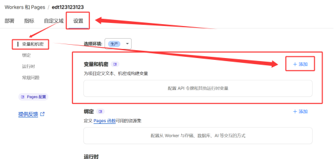

点击 + 添加，类型 文本 变量名称 ADMIN 变量，变量值为WebUI管理员密码，建议设置复杂密码，避免被暴力破解

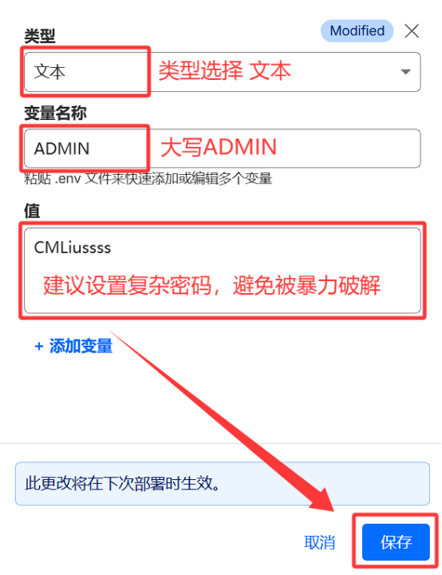

变量即可设置完成，如忘记密码可返回此页面查看

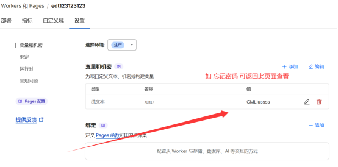

绑定 KV 命名空间

点击 存储和数据库 &gt; Workers KV &gt; + Create Instance 创建一个命名空间；

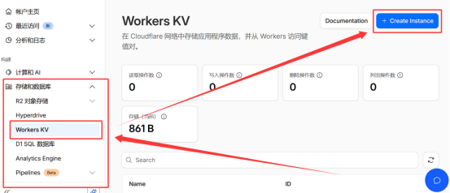

命名空间名称可自定义，建议命名为 EDT2 以便区分，点击 创建 完成创建

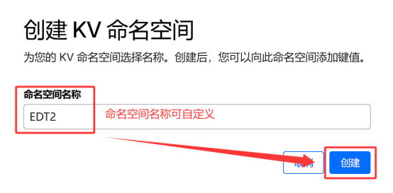

返回项目设置页面，点击 设置 &gt; 绑定 &gt; + 添加 &gt; KV 命名空间；

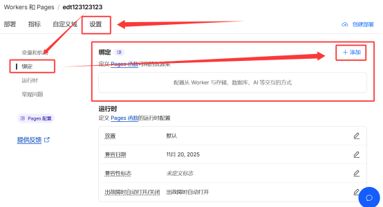

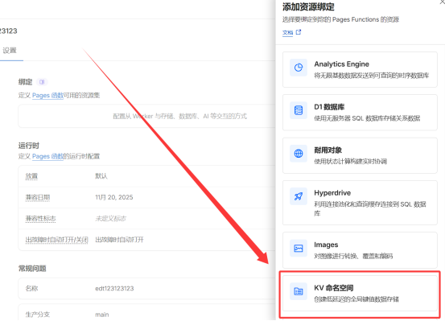

变量名称必须填写大写 KV ，命名空间选择刚刚创建的 EDT2，点击 保存 完成绑定；

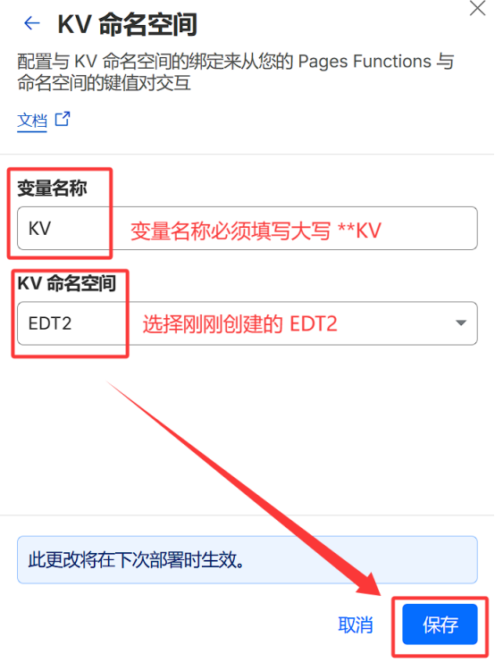

返回项目设置页面，确认绑定成功；

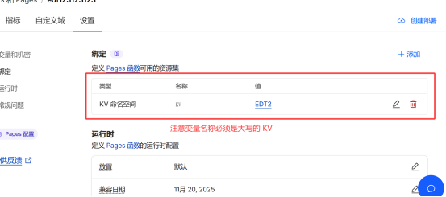

重试部署，使其变量生效！

点击右上角 创建部署 ，上传第一步刚刚下载的 edgetunnel-main.zip 压缩包；

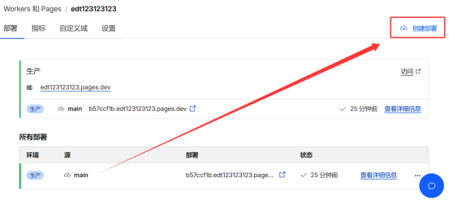

部署环境选择 生产，点击 从计算机中选择 &gt; 上传压缩文件，选择第一步下载的 edgetunnel-main.zip 压缩包，等待上传完成

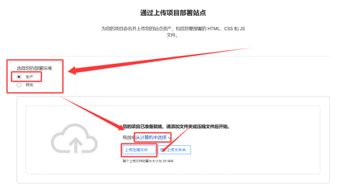

点击 保存并部署，等待部署完成

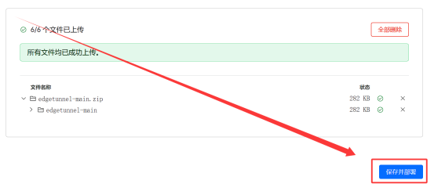

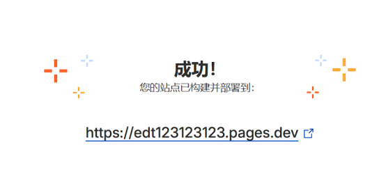

如需修改管理员密码，修改完变量之后必须重新上传部署，否则变量无法生效！

绑定 自定义域名

进入 Pages 应用程序，点击 自定义域 选项卡，点击 设置自定义域 ；

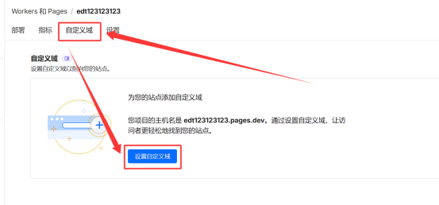

添加自定义域

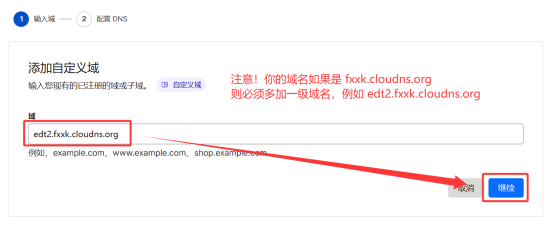

选择开始 CNAME 设置

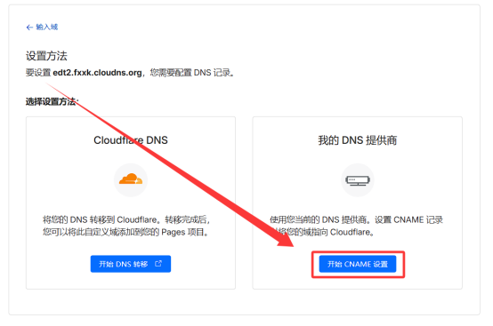

记录名称 edt2 和 CNAME 记录值 edt123123123.pages.dev ；

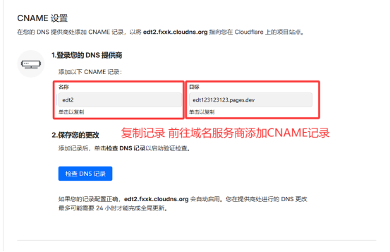

添加前往域名服务商添加CNAME记录

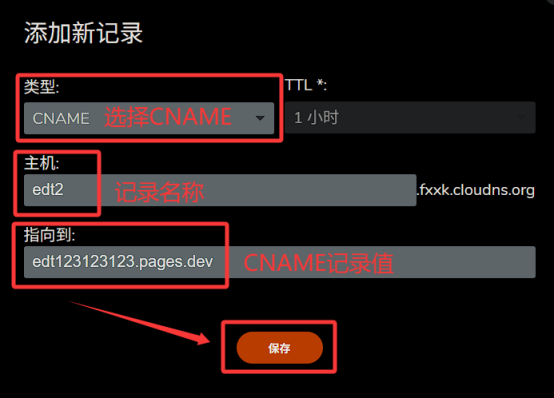

返回 自定义域 选项卡，点击 稍后完成 DNS 设置 等待域名验证成功

等待10\~30分钟，域名验证成功后即可看到域名绑定成功提示

---

登录 EDT2 管理页面

·访问/admin即可登录管理页面，例如您绑定的自定义域名 edt2.fxxk.cloudns.org ，则您需访问 https://edt2.fxxk.cloudns.org/admin；

输入管理员密码，点击 登录 即可进入管理页面

登录成功后，即可看到管理页面，如果您是小白，无需折腾直接订阅使用即可

部署成功后访问主页提示Welcome to nginx!，这只是默认伪装页，说明你已部署成功，请访问 /admin 进入管理页面

---

## 自助优选订阅

当前 Edgetunnel2.0 自带了三种优选订阅生成方式，分别是：

随机优选 - 简单

内置三网优选IP，根据订阅时的网络自动自动分配对应三网优选IP，优选IP想要多少就有多少！

---

视频教程：https://youtu.be/3iofnKld-8I

### 🖼️ Attached Media

## 💬 Replies

### 1 @ferdie_jhovie (Oxye漆华) (Author)

*Tue Apr 28 17:19:58 +0000 2026*

这条推文在目前含金量还是很高的，对于快连退出中国市场之后，重中之重了，怎么都学习一下，留个备用吧

### 2 @earn_going (A8猪脚饭)

*Tue Apr 07 00:44:05 +0000 2026*

@ferdie\_jhovie 牛啊，这个IP也是固定吗？

### 3 @dngzhngji3 (do)

*Mon Apr 06 23:06:07 +0000 2026*

@ferdie\_jhovie 你这是CM大佬的呀，属性抄袭

### 4 @ferdie_jhovie (Oxye漆华) (Author)

*Tue Apr 07 01:10:30 +0000 2026*

@dngzhngji3 我不是备注了吗

### 5 @0x_Fenda (芬达)

*Mon Apr 06 15:17:53 +0000 2026*

@ferdie\_jhovie 优秀  华哥

### 6 @Airdrop_Guard (小熊饼干 . var⛵)

*Thu Apr 16 07:14:47 +0000 2026*

@ferdie\_jhovie 感谢华佬，分享无价！

### 7 @Hikjljb (Hik 🕊️)

*Mon Apr 06 23:40:02 +0000 2026*

@ferdie\_jhovie 干货收藏就是多，多发！

### 8 @Phoenix_AlphaX (须影吟者🕊️)

*Wed Apr 08 02:23:14 +0000 2026*

@ferdie\_jhovie @Arthurh70700 达人👍👍👍

### 9 @yishilvao (医士吕奥🕊️)

*Tue Apr 07 01:22:10 +0000 2026*

@ferdie\_jhovie 之前玩过，域名到期了
再试试，谢谢好人

### 10 @XinXiao80368 (木星)

*Mon Apr 06 17:28:19 +0000 2026*

@ferdie\_jhovie 找了一个[edgetunnel-main.zip](http://edgetunnel-main.zip) 的下载地址，成功部署，大佬功德无量。
[github.com/cmliu/edgetunn…](https://github.com/cmliu/edgetunnel/archive/refs/heads/main.zip) 

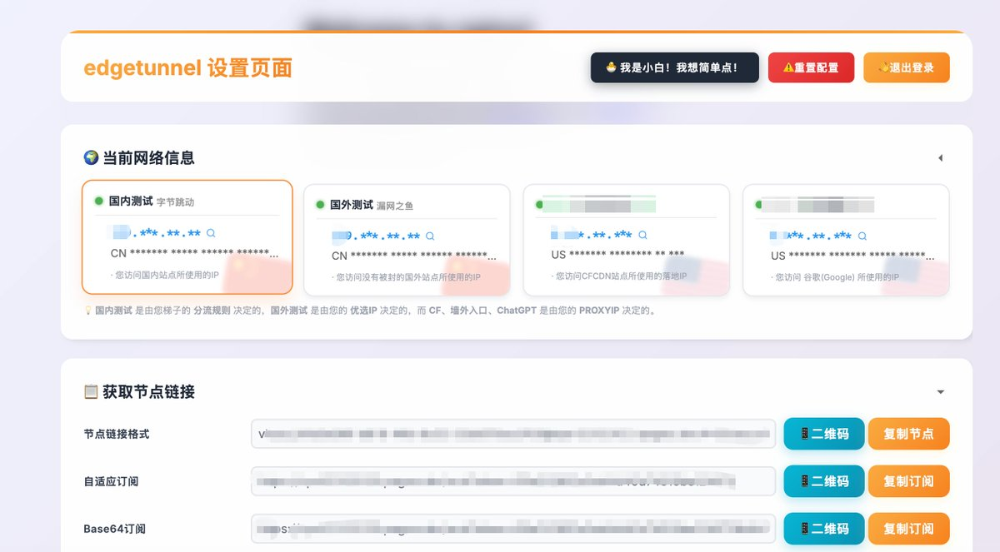

### 11 @DearHua2025 (DearHua)

*Tue Apr 07 00:43:44 +0000 2026*

@ferdie\_jhovie 3个风险关注下，特别是有涉及GPT，金融网站的。1、IP 段信誉度低：很多爬虫、自动化脚本甚至攻击者都会利用 Cloudflare 的免费计划。2、IP 跳变频繁：账号被判定异常甚至封号3、如果同一个 Cloudflare 出口 IP 下，有其他用户正在进行恶意扫描，你作为同 IP 的“账号”会被一并标注。【不登录账号可以用

### 12 @Tifrty (CoiR*)

*Tue Apr 07 03:30:13 +0000 2026*

@ferdie\_jhovie 别再给cm的项目推流了，之前大面积1101和封号就是因为喜欢滥用的cs太多导致的

### 13 @hangkun_wangshu (熏🈚️🈳️🉐️醺)

*Mon Apr 06 23:38:59 +0000 2026*

@ferdie\_jhovie edt在cf规则里面属于滥用。还是别大力推了，到时候又被cf清洗一堆账号，收紧pages使用范围。而且小白弄不懂优选的话，体验并不太好。另外proxy ip也是个问题，如果真能解决的估计都在cmliu的群组里面混了两年了，低调使用别滥用，保护cf大善人

### 14 @qi1462578 (叁仟客)

*Tue Apr 07 03:09:52 +0000 2026*

@ferdie\_jhovie 干

### 15 @Galax2u (Galaxy | π²)

*Mon Apr 06 15:18:39 +0000 2026*

@ferdie\_jhovie 👍👍

### 16 @wanshe47 (X)

*Mon Apr 06 16:11:12 +0000 2026*

@ferdie\_jhovie [edgetunnel-main.zip](http://edgetunnel-main.zip)  这个压缩文件在哪

### 17 @alvinhoLPK (V)

*Tue Apr 07 18:41:25 +0000 2026*

@ferdie\_jhovie 免费申请5个域名，邀请码ZYF5E6AF3B
[my.dnshe.com/index.php?m=do…](https://my.dnshe.com/index.php?m=domain_hub)

### 18 @Subeiwang123 (Su 🦜)

*Mon May 18 16:05:32 +0000 2026*

@ferdie\_jhovie 有点蒙圈，IP代理那块要固定的话，不需要购买吗？那为啥不直接选择代理IP或指纹浏览器呢，都有客户端，直接就能用。
不固定IP的话，为啥还要费劲的搭建edgetunnel呢。CF的1.1.1.1app不好用吗？免费的和付费的隧道都有啊

### 19 @Euston_Vault (鸡腿子)

*Tue Apr 07 01:06:24 +0000 2026*

@ferdie\_jhovie 刚搭建好了！太牛了👍

### 20 @TrueXaea12 (X Æ A-XII)

*Mon Apr 06 15:47:40 +0000 2026*

@ferdie\_jhovie building szn fr

### 21 @RyanYourBaby (守财奴1号)

*Thu Apr 09 10:37:18 +0000 2026*

@ferdie\_jhovie 配置完了，显示延迟，可是就是连不上网。

### 22 @laohong0606 (fdc888)

*Wed Apr 08 08:46:55 +0000 2026*

@ferdie\_jhovie 华佬牛逼，太需要了

### 23 @yundoufu (晕豆腐 ✌︎( ᐛ )✌︎ 狗宝真帅🐕)

*Tue Apr 07 12:29:30 +0000 2026*

@ferdie\_jhovie 牛逼

### 24 @z_zning (zning z)

*Tue Apr 07 02:49:12 +0000 2026*

@ferdie\_jhovie 留存备份及感谢。

### 25 @Caaroliinaleiva (Caro.ETH)

*Mon Apr 06 17:01:27 +0000 2026*

@ferdie\_jhovie feels like a real build

### 26 @zhwilliam3 (William.Lam)

*Thu Apr 09 06:21:15 +0000 2026*

@ferdie\_jhovie 牛逼，谢谢分享，我也成功了。

### 27 @chang_ao_tian (常傲天)

*Mon Apr 06 16:09:51 +0000 2026*

@ferdie\_jhovie 厉害的华哥

### 28 @superMam88 (BTC钱多多🪂💰)

*Tue Apr 07 00:41:22 +0000 2026*

@ferdie\_jhovie 华哥牛逼

### 29 @zhangpeng328 (Wandering)

*Tue Apr 07 06:21:00 +0000 2026*

@ferdie\_jhovie 太干了，这就去🤙

### 30 @realyorkz (York)

*Tue Apr 07 02:44:07 +0000 2026*

@ferdie\_jhovie @Simon72842383

### 31 @Yzw026 (Coconut flavor)

*Mon Apr 06 19:40:01 +0000 2026*

@ferdie\_jhovie 刚弄完，弄了个十年域名
筛选一下延迟低的线可以跑满网速
就是不知道能用多久当个备用的还不错

### 32 @trenchgym (trench🚢)

*Tue Apr 07 02:10:35 +0000 2026*

@ferdie\_jhovie 先收藏干货

### 33 @Whiskey7711 (一把｜使徒)

*Mon Apr 06 16:46:04 +0000 2026*

@ferdie\_jhovie 忠言逆耳，只有被摁住了，你才信，那時已經晚了。

直接打開觀看：
[youtube.com/watch?v=0ndrmF…](https://www.youtube.com/watch?v=0ndrmFNU80k)

圖片預覽：
[youtu.be/0ndrmFNU80k](https://youtu.be/0ndrmFNU80k)

### 34 @rockefeller_tom (不听不信)

*Tue Apr 07 01:42:31 +0000 2026*

@ferdie\_jhovie 自建机场都是韭菜，不要信

### 35 @0x00YY (Daniel ❤️)

*Tue Apr 07 01:32:41 +0000 2026*

@ferdie\_jhovie 牛逼华哥

### 36 @ez4y2f (ez4y2f)

*Tue Apr 07 02:54:09 +0000 2026*

@ferdie\_jhovie abuse.

