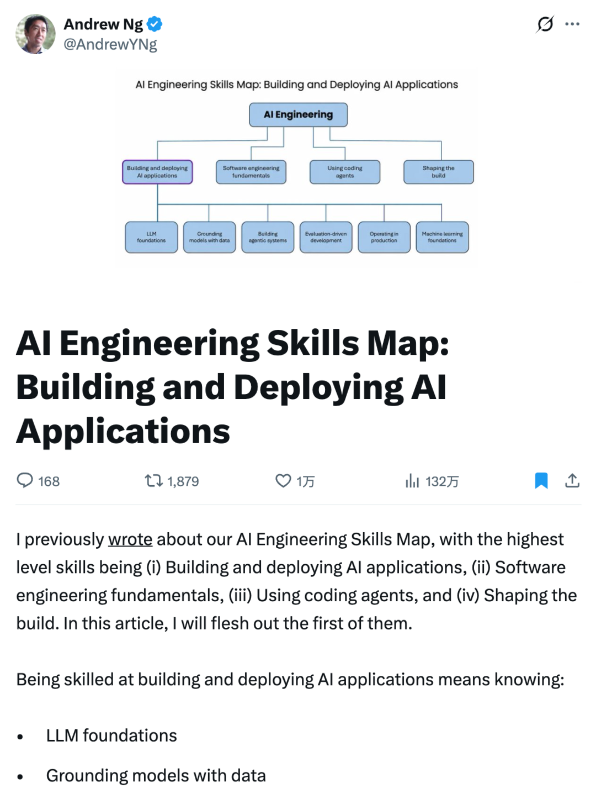
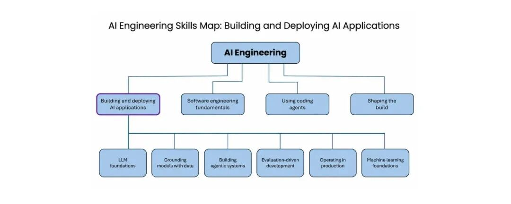

# 📰 吴恩达说，demo 人人能跑，AI 工程的分水岭是 evals

上周那份 AI 工程技能图谱，续篇来得比我想象快。

吴恩达（Andrew Ng），斯坦福教授、DeepLearning.AI 创始人。

8 月 22 日他在 X 上发了篇长文，把图谱四大项里的第一项单独拆开细讲。没读过上周那篇的朋友只需要知道一件事，这份图谱把 AI 时代工程师最值钱的技能收敛成了四项，**构建和部署 AI 应用**排第一。

上周他说过接下来会逐项展开。

作业交了。

这一项底下压着六项子技能。**LLM 基础**，**用数据接地**，**构建 agentic 系统**，**评测驱动开发**，**生产环境运营**，**机器学习基础**。

老实讲，第一眼有点失望。

没有新词，没有框架名，每一项拎出来都像认识多年的老熟人。但把他六项的排布逻辑读下去，你会发现这份朴素里藏着一整个判断，**AI 应用的输出不可预测**，所以开发这门手艺的根基变了。

## 输出不可预测，所以开发方式变了

为什么这一项底下是这六块，吴恩达先给了个总前提，AI 应用的输出不可预测。这条上周展开聊过，不重讲，只说后果。

瀑布式开发的前提是流程能预先画清楚，可预写好的流程图在这里对不上账。吴恩达的判断很直接，**构建 AI 系统是一个远比传统软件更迭代的过程**。熟练的工程师反复构建，看中间结果，再决定下一步试什么，每一步都被上一轮的产出牵着走。

>
>
> 熟练地决定下一步做什么，让你能够用不可靠的 AI 组件，造出可靠的软件系统。  
> \-- Andrew Ng（吴恩达）
>
>

这句话我读了好几遍……它把这个工种的天花板说清楚了。组件不可靠是常态，把不可靠的组件组织成可靠的系统，才是这门手艺真正值钱的部分。

那迭代靠什么导航？你反复跑，反复看结果，总得有什么东西告诉你这次比上次好，方向该往哪边打。

这个东西就是 evals。评测，加上错误分析，一起构成迭代开发的**方向盘**。

## 方向盘握在会做 evals 的人手里

六项子技能里，吴恩达自己钦点了权重，就压在这一项上。

>
>
> 以我的经验，区分一个 AI 系统构建者是否出色的最重要特质，是能否驾驭一套有纪律的评测与错误分析循环，用它来驱动开发。  
> \-- Andrew Ng（吴恩达）
>
>

注意他的用词，the most important trait。

不是会调 API 的手速，是 evals 的功力。

他说这项技能难掌握，因为正确的做法随项目变，甚至随项目的阶段变。你得看系统的 trace 和输出，做探索性数据分析，再结合产品和业务判断什么值得测。

什么时候用代码写死的确定性评测，什么时候让 LLM 当裁判，什么时候请人进场，甚至怎么评测你的评测，让评测本身跟着项目一起进化。

跑通一个 demo 和做成一个可靠系统之间，隔着的就是这套循环。demo 人人能跑，**可靠性才是分水岭**。

这套循环的价值，用他的话说，是让进展从随机变成系统。没有它，你是在一百个方向里瞎试，试到哪个算哪个。有了它，每一步都踩在上一步的证据上，力气花在更可能出结果的地方。这就是为什么这项技能的正式名字，是评测驱动开发，一个直接写进方法论层的词。

我自己看别人项目的习惯，这两年悄悄变了。以前最爱问这个用什么模型，现在第一句问的是，**你怎么知道它是对的**。

能拿出 evals 方案的，和支支吾吾的，几乎一眼就分开了。

## 把六项摊开当自查表

六项全部展开太长，我挑密度最高的部分摊给你，对着自查会很有数。

**LLM 基础**。tokenize 怎么工作，context window 里放什么、放多少，缓存命中和 knowledge cutoff 怎么算，采样参数怎么调，什么时候上多模态，什么时候开 tool calling。

懂这些你才知道**什么时候能指望模型，什么时候它会掉链子**。选模型、混模型、微调还是自托管，都从这层理解出发。

**用数据接地**。LLM 要有好上下文才有好输出。RAG 和向量检索只是早期的起点，现在你要决定**哪些信息直接塞 prompt，哪些让模型按需去取**；数据放向量索引、知识图谱，还是给结构化数据加一层语义描述。

文档怎么变成 LLM 能吃的输入，管道怎么让数据保持干净新鲜，全是实打实的工程。

**构建 agentic 系统**。从固定流程的 workflow 到让模型自己决定下一步的 agent harness，架构你来选，**哪些步骤串行，哪些并行，哪些交给代码哪些交给模型**。工具开哪些口子（MCP、CLI、沙箱环境），记忆怎么设计，长会话的 context 怎么管，什么时候需要多 agent 编排。

要上生产，还得懂 **guardrails、对抗输入**，防着数据被人从对话里一点点勾走。

**生产环境运营**。AI 软件线上运营的难题是**不可预测、成本、延迟**三件套。观测怎么做，性能漂移怎么测，模型出错怎么快速响应，回归测试和 CI/CD 怎么适配统计式的评测。

他还有个很工程的提醒，**测试投入要跟出错的代价挂钩**，判错的成本越高，测得越狠。用户量上来之后，蒸馏、微调、简化 agentic 工作流，这些降本提速的手段要会按需组合。

**机器学习基础**。他补了句很实在的话，**他认识的每个擅长用 LLM 的人，都懂一些机器学习和深度学习**。bias/variance，错误分析，数据工程，这些老框架在面对不确定输出时依然是思维底座。偷感很重地把老教材翻出来补课，一点不丢人。

六项全满的人有吗……大概有，但多半不是在看这篇文章的你我。每个人手里都有两三块薄板。

顺一遍你还会发现，六项其实是一条链。基础告诉你模型能干什么，接地给它喂对的上下文，agent 把能力组织成流程，evals 盯着每一步别走偏，生产运营让它持续活着，机器学习是这一切底下的语言。缺了哪一环，链条就在哪里断。

## 别集邮，先补最薄的那块

看到六项清单，第一反应想全学的人，我劝一句缓一缓。

这份图谱来自大量招聘信息、结构化访谈和问卷，它描述的是市场已经开出价的位置。但学习不是把六项集齐换证书，demo 会过期，**手感不会**。真正拉开差距的循环，值得你用一整个项目去磨，哪怕只是一个小脚本。

他自己也说了，要学的东西很多，这个领域有实实在在的技术深度，但你学的每一点，都会让你变成更好的 AI 工程师。

最后是钩子。他在文末预告，下一篇写软件工程基础，四大项的第二块。照这个节奏，整张图谱拆完还得一阵子。

地图不用等。今晚就能做两件事，把上面的六项过一遍，找到自己最薄的那块；再拿那句话问一遍手头的项目，你怎么知道它是对的。答不上来的，evals 就是你的下一课。

地图会继续长。先动手的人，不等地图画完。

---

---

Macaron 🧁 | 方向盘在会做 evals 的人手里

