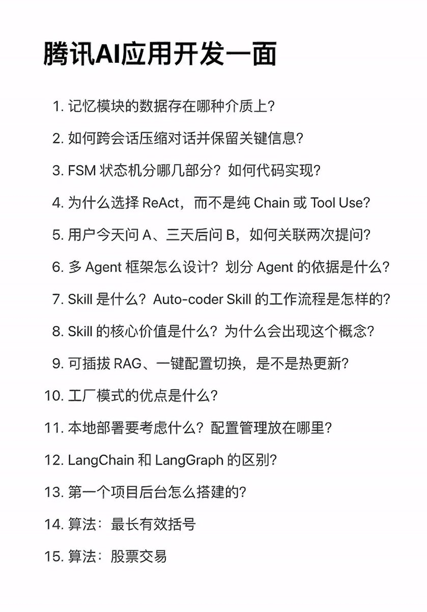

今天来看腾讯的开发工程师的初面题。

Q1 - Q9, Q12我感觉这是整张卷子最值钱的部分。面试官非常懂行，他关注的是大模型在实际业务中的控制流和记忆管理。

先说Q1, Q2, Q5。
大模型的 Token 是要算钱且有长度限制的。怎么存用户的聊天记录？
怎么在跨系统、跨时间的情况下，还能让大模型记得用户是谁、之前说了什么？
这是做智能助手最核心的痛点。

Q3, Q4, Q6, Q12。终于开始考架构了。
面试官在考查你对大模型调用框架的底层认知。问 FSM和 LangGraph，说明腾讯需要用强控制、确定性高的流式架构去规范大模型的胡言乱语。
问为什么选 ReAct 而不是纯 Chain，估计是在看面试者对Reason-Action与死板工程流水线之间平衡点的理解。

Q7, Q8，毫无疑问的Skill。
这通常是大型 Agent 框架，比如字节的 Coze、腾讯自己的类似产品里的核心概念，考查的是能不能把复杂的工具调用封装成标准化、可复用的插件。

Q10、Q11，还有Q13。
这应该算是传统后端的知识。
工厂模式、本地部署与配置管理以及后台怎么搭建，是在淘汰那些只会调 OpenAI 接口，但连基本的后端架构、高可用、设计模式都不懂的包装型选手。
腾讯的团队，要的是能直接上手写生产环境代码的熟练工。

Q14、Q15，没啥可说的，算法基本功。
最长有效括号考Stack或者动态规划，挺考验逻辑严密性。
股票交易，也属于LeetCode 经典系列，我经常刷，典型的动态规划、贪心算法。经典的大厂核心算法大礼包，虽然和 AI 没直接关系，但用来刷掉代码基本功不过关的人非常有效。

现在大厂要的 AI 工程师，既要懂大模型的特性，比如Token限制、Agent流控、RAG挂载这些，又要是一个扎实的传统后端高手。 
如果能把前 12 道关于 Agent 架构和记忆管理的题解释得既深又透，哪怕后面项目稍微薄弱一点，腾讯那边也会觉得你对大模型应用开发是有深度思考的。

### 🖼️ Attached Media

## 💬 Replies

### 1 @Saccc_c (Sac)

*Thu Jun 11 03:06:33 +0000 2026*

@Phoenixyin13 有点意思🤔

### 2 @Phoenixyin13 (Phoenix Yin) (Author)

*Thu Jun 11 03:11:22 +0000 2026*

@Saccc\_c 可以看看 欢迎阅读

### 3 @conanxin (Conan Xin)

*Wed Jun 10 18:06:36 +0000 2026*

@Phoenixyin13 AI 应用 = 大模型 + 记忆 + 工具 + 状态管理 + RAG + 工程化部署 + 后端能力 + 基础算

### 4 @Phoenixyin13 (Phoenix Yin) (Author)

*Wed Jun 10 18:09:21 +0000 2026*

@conanxin 柯南总结的好

### 5 @suyang_233 (苏阳～♡)

*Thu Jun 11 06:07:13 +0000 2026*

@Phoenixyin13 害怕。。。
都在搞后端，和agent，前端人现在连面试都不敢了qwq

### 6 @Phoenixyin13 (Phoenix Yin) (Author)

*Thu Jun 11 06:10:39 +0000 2026*

@suyang\_233 还是要全栈

### 7 @Insignie2049 (Insignie)

*Wed Jun 10 20:32:52 +0000 2026*

@Phoenixyin13 蛮务实的，破除了我对国内大厂面试题的刻板印象

### 8 @Phoenixyin13 (Phoenix Yin) (Author)

*Wed Jun 10 23:02:18 +0000 2026*

@Insignie2049 哈哈 平时我也会找一些 自己做一些

分析一下

### 9 @Arctique4 (Arctique)

*Wed Jun 10 18:15:18 +0000 2026*

@Phoenixyin13 真是腾讯一面题？react的失败还不够显然吗？现在大厂都没用react啊，都是自己写function calling，react本身不确定性太大了，在实际场景中就是不可控的

### 10 @Phoenixyin13 (Phoenix Yin) (Author)

*Wed Jun 10 18:22:22 +0000 2026*

@Arctique4 其实在当前的工业界实际落地中，不会在核心、高并发的业务场景里直接使用原生的 ReAct 模式。因为它的失败和局限性在生产环境里太明显了，不确定性太大。

我理解这道题，其实它就是在考查大模型自主决策与工程确定性之间的权衡。

### 11 @qsz35130683 (菌汤锅好吃)

*Wed Jun 10 17:53:06 +0000 2026*

@Phoenixyin13 Q1这问法可扩展性很强啊，按理讲记忆模块的数据应该每种介质上都有😂

### 12 @Phoenixyin13 (Phoenix Yin) (Author)

*Wed Jun 10 17:54:03 +0000 2026*

@qsz35130683 面试的话 应该会延伸问问

很灵活

### 13 @im_morganwang (MorganWang)

*Wed Jun 10 23:53:05 +0000 2026*

@Phoenixyin13 可以可以，等我到公司搜一下这些题怎么回答

### 14 @Phoenixyin13 (Phoenix Yin) (Author)

*Wed Jun 10 23:53:50 +0000 2026*

@im\_morganwang 还比较有趣是吧

### 15 @Microstrongs (microstrong)

*Thu Jun 11 05:57:21 +0000 2026*

@Phoenixyin13 看起来质量不错啊

### 16 @Phoenixyin13 (Phoenix Yin) (Author)

*Thu Jun 11 05:59:30 +0000 2026*

@Microstrongs 蛮好的题目

感兴趣都可以思考下

### 17 @MoonInAI (MoonInAI)

*Thu Jun 11 00:21:22 +0000 2026*

@Phoenixyin13 分析的很有道理，似懂非懂

### 18 @Phoenixyin13 (Phoenix Yin) (Author)

*Thu Jun 11 00:25:56 +0000 2026*

@Oracal1203 没关系 可以拆分一下
结合一些实操的项目

### 19 @bitesized_3mzz (一口一个三明治🥪)

*Thu Jun 11 01:59:02 +0000 2026*

@Phoenixyin13 mkmk

### 20 @Phoenixyin13 (Phoenix Yin) (Author)

*Thu Jun 11 01:59:38 +0000 2026*

@bitesized\_3mzz 觉得有用的话 可以看看

### 21 @Wang_Crypto_00 (蜡笔小王❤️互🔶BNB)

*Wed Jun 10 16:37:01 +0000 2026*

@Phoenixyin13 Mid我一共只刷了20道题，巧了，刚好有这两道题

### 22 @Phoenixyin13 (Phoenix Yin) (Author)

*Wed Jun 10 16:55:05 +0000 2026*

@Wang\_Crypto\_00 我平时就喜欢看看这种

感觉还是可以打开一些思路的

### 23 @GOGEJessFU (大符)

*Wed Jun 10 16:53:30 +0000 2026*

@Phoenixyin13 收藏了

### 24 @Phoenixyin13 (Phoenix Yin) (Author)

*Wed Jun 10 16:54:37 +0000 2026*

@GOGEJessFU 哈哈 比较好玩的题目 可以看看

### 25 @icycat (冷酷小猫 IcyCat)

*Wed Jun 10 15:31:31 +0000 2026*

@Phoenixyin13 非科班 这些东西大部分都看不明白😢

### 26 @Phoenixyin13 (Phoenix Yin) (Author)

*Wed Jun 10 15:32:31 +0000 2026*

@icycat 哦哦 这几个题都是比较有意思的

有算法基础的同学比较轻松 尤其是OI

### 27 @Ryrenz (Ren)

*Wed Jun 10 19:58:19 +0000 2026*

@Phoenixyin13 泄题了啊，赶紧总结大纲照着卖课

### 28 @Phoenixyin13 (Phoenix Yin) (Author)

*Wed Jun 10 20:31:01 +0000 2026*

@ryrenz 哈哈哈哈 也算一个灵感

### 29 @date_reina (伊达铃奈)

*Thu Jun 11 04:06:06 +0000 2026*

@Phoenixyin13 这些不都是很简单的吗 最大的问题是学校和专业不对口直接简历关就刷掉了 阶级固化不是闹着玩的

### 30 @Phoenixyin13 (Phoenix Yin) (Author)

*Thu Jun 11 04:06:59 +0000 2026*

@date\_reina 哦哦 其实面试题还是有探讨的价值的

学校和专业只能保3年

剩下的还是能力

### 31 @DangcingAI (Dangcing Chan)

*Wed Jun 10 22:38:03 +0000 2026*

@Phoenixyin13 确实光会调接口不够。平时自己跑二创工作流也碰到过，上下文一长记忆就断，最后还得靠后端状态机兜底。懂模型只是门槛，能把流控和工程架构揉透才站得住脚。

### 32 @xhl99011 (qWait)

*Thu Jun 11 03:49:11 +0000 2026*

@Phoenixyin13 确实都是些很有扩展性的问题，不过感觉有些没头没尾。应该有一些前提条件吧，比如为什么选择react

### 33 @cynicalmi (novi红猫)

*Thu Jun 11 05:58:57 +0000 2026*

@Phoenixyin13 大厂高考泄题了

### 34 @AssageRv (AI Insider)

*Thu Jun 11 13:48:42 +0000 2026*

@Phoenixyin13 难怪腾讯的AI不行，面试官根本不懂AI开发

