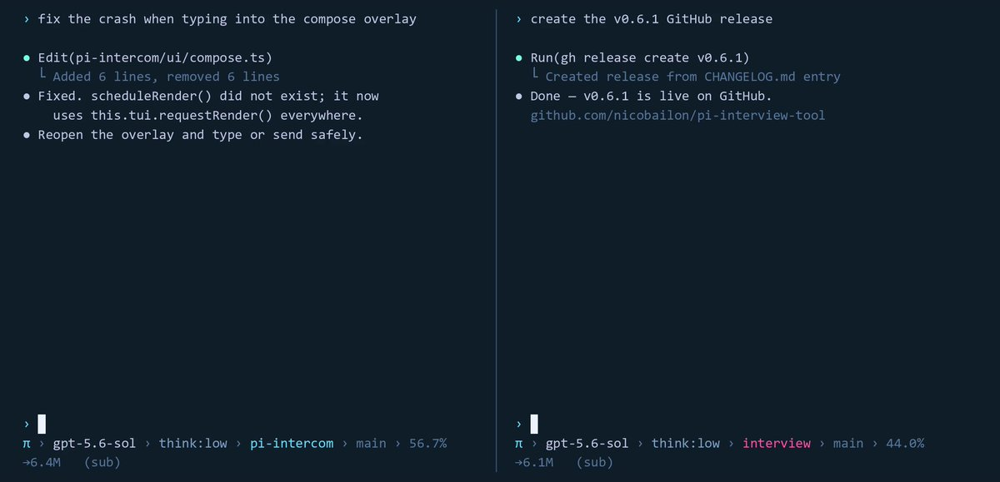

Our sessions have been messaging each other for months btw ;) 

@nicopreme’s pi-intercom extension makes it easy for one session to pick up where another left off. 

Open source Pi packages mean there are multiple ways you can customize Pi. Link to this package and more below. 

## 💬 Replies

### 1 @pidotdev (Pi) (Author)

*Sat Aug 08 11:33:27 +0000 2026*

Learn more about pi-intercom and our extension ecosystem here

[pi.dev/packages/pi-in…](https://pi.dev/packages/pi-intercom)

### 2 @jx199111 (jx)

*Sat Aug 08 12:13:14 +0000 2026*

@pidotdev @nicopreme Once sessions can message each other they need names. I ran into this building agent identity into a browser: a session had to be addressable before any consent I granted it meant anything. Does intercom give a session a stable id across restarts, or is it per-process?

### 3 @pidotdev (Pi) (Author)

*Sat Aug 08 12:20:17 +0000 2026*

@jx199111 @nicopreme Intercom is open source so you can find out for yourself here 

[github.com/nicobailon/pi-…](https://github.com/nicobailon/pi-intercom)

### 4 @hjanuschka (👉hjanuschka 👨‍💻🤖)

*Sat Aug 08 13:43:01 +0000 2026*

@pidotdev @nicopreme and dont forget there is [shitty.chat](https://shitty.chat/) \- that even allows non-techies join chat with their desktop harness with a MCP

### 5 @asm3r96 (Mohammed Reschreiter)

*Sat Aug 08 15:12:06 +0000 2026*

@pidotdev @nicopreme Pi is way ahead than others. Imagination is unlimited and people can just create with it what ever they want.

### 6 @themodev (Amine)

*Sat Aug 08 12:21:53 +0000 2026*

@pidotdev @nicopreme imagine they could message each other over the web

### 7 @_wannabeabaddie (Rt. Hon. Me)

*Sat Aug 08 12:36:20 +0000 2026*

@pidotdev @nicopreme annnddd we are back to interrupt programming

### 8 @BaronsAdvisor (Baron Trades)

*Sat Aug 08 14:16:58 +0000 2026*

@pidotdev @nicopreme Need a better packages/extensions page. It’s very hard to know what is legitimately popular and safe than someone gaming the system and triggering lots of downloads to get some nefarious package installed on peoples machines

### 9 @7777audio (( ₱ _ ₱ ))

*Sat Aug 08 17:09:54 +0000 2026*

@pidotdev @nicopreme finally.  a screen recording without random ass nausea inducing zoom ins every single fucking time someone is typing in a text field

### 10 @iamautojoe (Joseph Cannon)

*Sun Aug 09 18:37:13 +0000 2026*

@pidotdev @nicopreme All my pi agents talk to each other, my pi also takes to Claude and codex desktop apps

### 11 @indesjyo (花椰菜)

*Sat Aug 08 12:36:01 +0000 2026*

@pidotdev @nicopreme 你們需要分享更多這種東西！👏🏻

### 12 @solanky (Deependra Solanky)

*Sat Aug 08 11:52:18 +0000 2026*

@pidotdev @nicopreme I was using herdr for this. Good to know that it can be done within pi itself .

### 13 @DeeZiD (Dennis Schmitz)

*Sat Aug 08 12:54:42 +0000 2026*

@pidotdev @nicopreme Oh, I actually need to try this. I have a workflow where this will be handy. :D

### 14 @angelsalamanca (Ángel Salamanca 🇪🇺)

*Sat Aug 08 12:11:03 +0000 2026*

@pidotdev @nicopreme Yeah, people discover how to make fire every now and then! Keep up the good work!

### 15 @hahazazaha1 (smiles and cries)

*Sat Aug 08 14:25:02 +0000 2026*

@pidotdev @nicopreme Yup great tool in my workflow. So flexible to have.

### 16 @0xxVex (Vex)

*Sun Aug 09 09:04:51 +0000 2026*

Cross-session messaging looks useful.

While building a native Windows desktop client around Pi, I ran into the harder handoff problem: how do you make the transfer inspectable?

Does pi-intercom pass only messages, or can it include the source workspace, task state, and files touched?

### 17 @Tinwung11 (李寻欢)

*Sat Aug 08 22:31:22 +0000 2026*

@pidotdev @nicopreme @grok 解释下

### 18 @aiseomastery (AI Mastery Guide)

*Sat Aug 08 23:28:48 +0000 2026*

@pidotdev @nicopreme Sessions messaging each other is such a clever way to preserve context.

### 19 @Jordy_vD_ (Jordy.app)

*Sat Aug 08 15:36:40 +0000 2026*

@pidotdev @nicopreme Is that pi codex conversion I see or a diff apply patch plugin

### 20 @digi_literacy (digital_literacy)

*Sat Aug 08 15:30:00 +0000 2026*

@pidotdev @nicopreme Can you use fable in pi or anthropic still forces claude code only?

### 21 @ans4175 (ans)

*Sun Aug 09 14:30:46 +0000 2026*

@pidotdev @nicopreme i am using “pi-link” for this kind of features.

### 22 @vibecodeiro (TEAGÁ)

*Sun Aug 09 04:07:45 +0000 2026*

@pidotdev @nicopreme @grok qual a diferença entre isso e uso de subagentes?

### 23 @mrvnse (Marvin)

*Sat Aug 08 12:26:10 +0000 2026*

@pidotdev @nicopreme session handoff is the missing primitive

### 24 @luckccc8 (Jasper L.)

*Sat Aug 08 17:25:13 +0000 2026*

@pidotdev @nicopreme Beautiful demo! Which extensions produce this exact look? The footer reads like pi-powerline-footer and the message box like pi-intercom, but the ● Edit(...) / └ tool cards don't match any published package I could find. Are these pre-release builds?

### 25 @__llevy__ (llevy)

*Sat Aug 08 21:03:48 +0000 2026*

@pidotdev @nicopreme [x.com/\_\_llevy\_\_/stat…](https://x.com/__llevy__/status/2086187421389947253?s=46)

### 26 @patchworkmd (Patchwork)

*Sat Aug 08 20:25:56 +0000 2026*

@pidotdev @nicopreme Is there a shared plug-in or mcp that can have models work and communicate together — in real time?🤔

### 27 @AlexSandiyarov (Alex)

*Sat Aug 08 13:53:40 +0000 2026*

@pidotdev @nicopreme Did you here something about tmux? Stop selling it like innovation

### 28 @Bilaltariq37714 (Bilal tariq)

*Sat Aug 08 16:20:33 +0000 2026*

@pidotdev @nicopreme Is there any video to learn customization of pi cli?

### 29 @luhngbn484103 (罗洪彬)

*Sat Aug 08 13:59:29 +0000 2026*

@pidotdev @nicopreme 今天刚做了一整套mcp来实现相同的功能🤡

