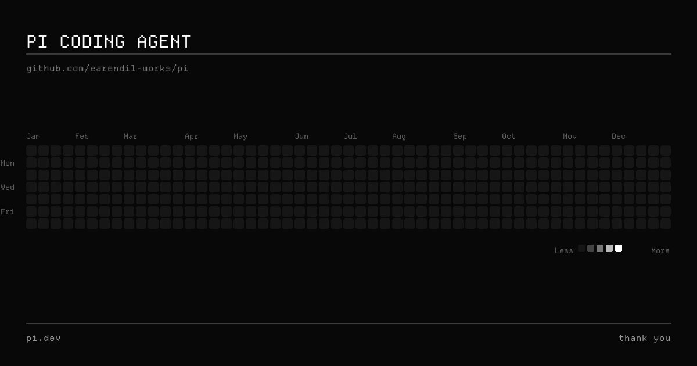

Pi now has 100000 stars on GitHub⭐️Thank you People of Pi for your contributions and support. The community is growing faster than ever!

Pi v2 coming soon… 

## 💬 Replies

### 1 @spectredxxx (spectredxxx)

*Tue Sep 01 12:10:57 +0000 2026*

@pidotdev 很期待

### 2 @jaredpalmer (Jared Palmer)

*Tue Sep 01 13:48:31 +0000 2026*

@pidotdev Congrats. Well deserved!

### 3 @Ronny_MiniMax (RonnyHe)

*Wed Sep 02 04:59:05 +0000 2026*

@pidotdev Pi is my favorite Agent framework. kudos to the Pi team.

### 4 @ChristianLempa (Christian Lempa)

*Tue Sep 01 13:56:42 +0000 2026*

@pidotdev Oh my god I can’t wait for it! This is by far my most favorite agent 🔥❤️

### 5 @gergomoricz (Gergő Móricz)

*Tue Sep 01 12:06:56 +0000 2026*

@pidotdev congrats &amp; well deserved!

### 6 @Lonely__MH (Lonely)

*Tue Sep 01 16:59:17 +0000 2026*

@pidotdev Congrats 🍾🎈🎉

### 7 @morganlinton (Morgan)

*Wed Sep 02 00:33:16 +0000 2026*

@pidotdev Very well deserved!

### 8 @chriskim_dev (Chris Kim)

*Tue Sep 01 22:34:47 +0000 2026*

@pidotdev Congrats team!

### 9 @gm_mertd (Mert Deveci)

*Tue Sep 01 12:13:44 +0000 2026*

@pidotdev well deserved

### 10 @joshnomics (joshnomics)

*Tue Sep 01 16:36:15 +0000 2026*

@pidotdev Zero compaction

### 11 @nevwegas (nevwegas)

*Tue Sep 01 12:31:31 +0000 2026*

@pidotdev some info on what's will be new in v2?

### 12 @luongnv89 (Luong NGUYEN)

*Tue Sep 01 15:31:14 +0000 2026*

@pidotdev this is the way - the way of Pi

### 13 @QaisLaMukh (قيس الفتى المُخ👌)

*Tue Sep 01 12:29:00 +0000 2026*

@pidotdev Pi is so GOOOD 100k stars is STILL an insult ‼ ..... Pi deserves WAY MORE stars.... like..... waaaaaaaaaaaay moaaar

### 14 @juan_barbat (Juan Barbat)

*Tue Sep 01 15:51:45 +0000 2026*

@pidotdev Me pareció que habías dicho Gentle-Pi y entré como loco a verlo. (En español 🤪🤪🤪). 

Con lo que hace @G\_Programming por Pi…. y no le dan su endorsement … que tristeza.

### 15 @PengZhiLe6 (Neo)

*Tue Sep 01 12:25:26 +0000 2026*

@pidotdev Looking forward to it

### 16 @yonyoniz (Yonatan Gross)

*Tue Sep 01 12:35:06 +0000 2026*

@pidotdev awesome Pi !!!!!!

### 17 @xiaoxian1090317 (xiaoxian)

*Tue Sep 01 12:09:30 +0000 2026*

@pidotdev desktop app version???

### 18 @p2atri8ckanth3o (libinops)

*Tue Sep 01 13:37:33 +0000 2026*

@pidotdev Thanks, Pi, my favourite coding agent.

### 19 @sshbeetle (Mohamed Messaad)

*Tue Sep 01 13:45:27 +0000 2026*

@pidotdev The Linux of harnesses! Well deserved! 💪

### 20 @bartslodyczka (bartslodyczka)

*Tue Sep 01 13:40:24 +0000 2026*

@pidotdev Well done! My favourite harness for local AI!

### 21 @XiJin12 (Jason Jin)

*Tue Sep 01 16:32:22 +0000 2026*

@pidotdev Very inspiring repo. I learned a lot from it.

### 22 @petercheng (Peter Cheng)

*Tue Sep 01 15:01:59 +0000 2026*

@pidotdev Great job， Well done！

### 23 @rowanrdouglas (R. Douglas)

*Tue Sep 01 14:39:40 +0000 2026*

@pidotdev 100k stars is nuts. congrats y'all

### 24 @baanditeagle (Abhishek Tiwari)

*Tue Sep 01 21:39:41 +0000 2026*

@pidotdev What a steady growth!

### 25 @jimmy_longbow_ (JimiLonbo)

*Tue Sep 01 13:40:42 +0000 2026*

@pidotdev v2是rust吗

### 26 @BartInTheField (BartInTheField)

*Tue Sep 01 14:40:01 +0000 2026*

@pidotdev Great DIY harness!

### 27 @pantasw2 (Havriil Pietukhin)

*Tue Sep 01 12:46:00 +0000 2026*

@pidotdev give a raise to the author of this animation (if it is not an llm)

### 28 @melvindvivas (Melvin Vivas)

*Wed Sep 02 06:07:44 +0000 2026*

@pidotdev we love Pi

### 29 @Lando52165139 (Lando)

*Tue Sep 01 12:23:52 +0000 2026*

@pidotdev the rust port ... finally.

### 30 @FrancescoRugolo (franso)

*Tue Sep 01 14:15:41 +0000 2026*

@pidotdev you deserve it!

### 31 @draslan_eth (draslan.eth)

*Tue Sep 01 13:47:25 +0000 2026*

@pidotdev But what about Pi vP?

### 32 @jlucas (Jeremy Lucas)

*Wed Sep 02 11:53:25 +0000 2026*

@pidotdev Great work. Very excited to see what’s cooking

### 33 @satriyop (satriyo pamungkas)

*Tue Sep 01 17:21:26 +0000 2026*

@pidotdev @grok  what is the best use case for using pi. If a already use codex, claude, grok build (with their subs).

### 34 @scalingfactor (sayan)

*Tue Sep 01 12:30:21 +0000 2026*

@pidotdev @grok what will be new in v2?

### 35 @FoxRick01 (Rick A.F.)

*Tue Sep 01 17:38:00 +0000 2026*

@pidotdev Well deserved, let’s go Pi!

### 36 @MaxPW777 (Max Pinder-White)

*Tue Sep 01 15:07:08 +0000 2026*

@pidotdev Awesome ! really well deserved

