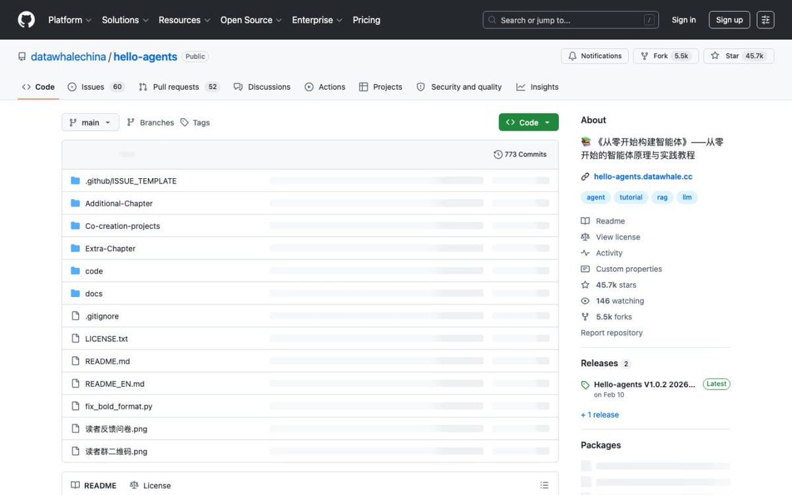

GitHub 45k星星优秀项目介绍：hello-agents
Datawhale 出品，7天涨1200+，正在疯涨

这个项目是干什么的？
一句话描述：从零开始教你构建真正的 AI Agent，不是调 API 那种，是理解核心原理、系统设计、多智能体协作的那种。

它把 Agent 系统拆成了 16 个章节，从基础概念到实战项目，层层递进。学了之后你能从用 GPT 写文案的人变成能设计 Agent 系统的人。

核心技术特点
第一性原理教学。不教你怎么调 API，教你怎么从零构建 Agent 的心智模型——记忆模块、工具调用、自主规划、协议通信。

多智能体协作。从单体 Agent 进阶到多 Agent 分工、协作、辩论的系统设计。

涵盖所有主流框架。AutoGen、AgentScope、LangGraph、Coze、Dify——主流框架全部覆盖，不是 API 调用教学，是设计思路教学。

ReAct / Plan-and-Solve / Reflection 等经典范式，全部从原理到代码手写实现。

支持功能
16 个章节，5 个阶段：基础→单体→高级→实战→毕业设计。

配套完整代码仓，理论+实战结合，每一个知识点都有可运行的代码。

综合实战项目：智能旅行助手（多 Agent 协作）、赛博小镇（Agent 模拟社会）、DeepResearch Agent 复现。

额外章节持续更新：Agent 面试题、Dify 保姆级教程、GUI Agent 实战、环境配置、Skill 写法。

适合哪些人用？
第一类：想从AI 调用者升级为AI 系统设计者"的开发者。不是学怎么用 ChatGPT，是学怎么构建能自动工作的 Agent。

第二类：对多智能体系统感兴趣的研究者或工程师。多 Agent 怎么通信、协作、评估，这本书讲得很透。

第三类：想转行 AI 或者准备面试 AI 相关岗位的朋友。里面有专门的 Agent 面试题总结和答案。

学习路径：基础篇→单体篇→高级篇→实战篇→毕业设计。每一阶段都有代码，都有可跑的项目。

项目地址：[github.com/datawhalechina…](https://github.com/datawhalechina/hello-agents)

Polo的看法：
2025 年最容易被取代的人，是还在追新模型发布的人。
真正难被取代的，是能设计 Agent 系统、能让多个 AI 协作完成复杂任务的人。

大模型会越来越便宜，越来越开源。但怎么用这些模型构建可靠的系统，这个能力不会过剩。

hello-agents 这本书厉害的地方，在于它不教你追潮流，它教你建系统。

### 🖼️ Attached Media

## 💬 Replies

### 1 @Ruhani_xyz (Rᴜʜꫝɴ)

*Sun May 10 03:27:27 +0000 2026*

@xiaojianjian567 真正厉害的人 不追模型热点 而是构建Agent系统能力

### 2 @xiaojianjian567 (Polo贱🕊️| 来Gate事件合约抢百万积分) (Author)

*Sun May 10 03:48:34 +0000 2026*

@Ruhani\_xyz 对的

### 3 @Steam_Diary123 (区块链日记 🎒)

*Sun May 10 04:20:45 +0000 2026*

@xiaojianjian567 这个不错呀

### 4 @Atan778 (ATan_🥥| 美股合约首选Gate)

*Sun May 10 03:50:33 +0000 2026*

@xiaojianjian567 学完我都想试试看

### 5 @Vibe718 (Vibe✨元气桃桃 | 买美股上WEEX)

*Sun May 10 03:26:06 +0000 2026*

@xiaojianjian567 俺写个智能管家

### 6 @0z_Dustin136 (T_Khanh2026.eth 🐬TermMax)

*Sun May 10 02:41:20 +0000 2026*

@xiaojianjian567 Polo说得太对 搞系统才是真未来

### 7 @adelbucetta (Adel Bucetta)

*Sun May 10 15:55:02 +0000 2026*

@xiaojianjian567 the reason most ai projects struggle is they focus on getting a model to work rather than understanding what problem it's solving in the first place. this project seems to be tackling that gap effectively.

### 8 @zhaoguohong18 (风婷吖)

*Sun May 10 03:09:16 +0000 2026*

@xiaojianjian567 这项目真不错 系统设计才是硬道理

### 9 @LuoKemin94871 (阿军)

*Sun May 10 03:08:22 +0000 2026*

@xiaojianjian567 学完这个项目设计AI系统不是梦

### 10 @orange_xxyy (GGbond🎒)

*Sun May 10 03:52:08 +0000 2026*

@xiaojianjian567 这套工具挺实用的

### 11 @Web3_Core_ (Web3_Core)

*Sun May 10 02:51:16 +0000 2026*

@xiaojianjian567 多智能体协调可能成为下一个人工智能周期中最有价值的工程技能之一

### 12 @nice11018 (淘淘web3版| Gate Card刷遍全球)

*Mon May 11 09:19:10 +0000 2026*

@xiaojianjian567 わあ、45kスターすごすぎ！✨ Datawhaleの本気が伝わるね、7日で爆上げとか私も頑張ら...

### 13 @CuongAir9x (Oja.eth)

*Sun May 10 03:40:29 +0000 2026*

@xiaojianjian567 我看不懂GitHub上的代码。 😪

### 14 @DuGuankui (杜冠魁)

*Mon May 11 11:22:14 +0000 2026*

@xiaojianjian567 @mranti 直接喂给AI是不是可以提高AI开发herness的能力呢😆😆😆

### 15 @datawhale2018 (Datawhale)

*Mon May 11 12:16:07 +0000 2026*

@xiaojianjian567 感谢推荐

### 16 @hongbin52075148 (hongbin)

*Mon May 11 05:11:52 +0000 2026*

@xiaojianjian567 another LangChain?

