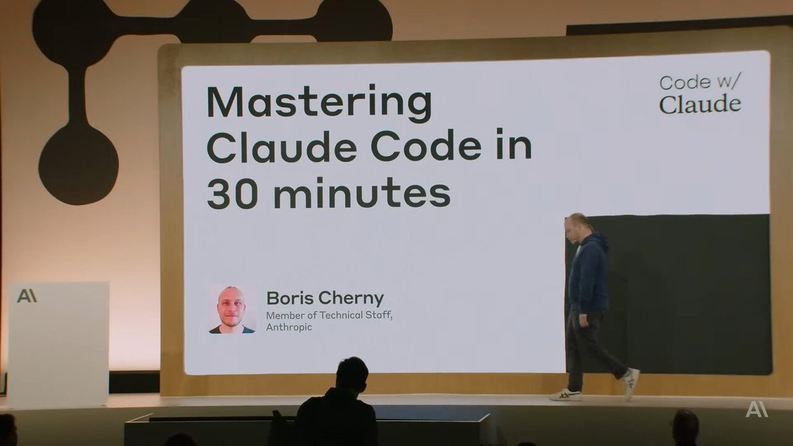

The builders shipping AI apps in 2026 are splitting into two groups.

One group watched a 28-minute video from May 2025. They built a compounding system. They ship faster every week.

The other group is still paying $300 for courses that don't cover what Anthropic shipped for free.

The gap is widening fast.

Boris Cherny, the creator of Claude Code, demoed the entire playbook in that video. 6 primitives. Free. 1.3M views. Most builders never bothered to watch it.

→ CLAUDE .md as living memory
→ Slash commands as reusable workflows
→ Sub-agents as parallel specialists
→ Hooks as deterministic post-actions
→ Git worktrees as parallel execution
→ Plan-first, verify-always discipline

Bookmark this. Set it up this week.

(full breakdown in the article)

### 🖼️ Attached Media

## 💬 Replies

### 1 @nrqa__ (Nelly;)

*Mon Jun 08 17:18:29 +0000 2026*

@PrajwalTomar\_ honestly yes, the widening gap is very real

### 2 @ajs6888 (安叫兽|Bird🕊️ 🔶 BNB)

*Tue Jun 09 01:13:12 +0000 2026*

@PrajwalTomar\_ 这类信息差有时候比技术差还吓人

### 3 @alphabatcher (Alpha Batcher)

*Mon Jun 08 17:41:32 +0000 2026*

@PrajwalTomar\_ agreed Prajwal

and yes, building AI apps in 2026 is good decision

### 4 @Serantych (sunick)

*Mon Jun 08 18:52:44 +0000 2026*

@PrajwalTomar\_ watched this video twice and still finding new stuff. boris just handed people a full system for free

### 5 @radar24hvn (Radar 24h)

*Tue Jun 09 04:24:39 +0000 2026*

@PrajwalTomar\_ Interesting, adaptability is key for success in AI development.

### 6 @SSXToTheMoon (StarShipX)

*Mon Jun 08 17:10:40 +0000 2026*

記事の内容に関連するコメンtはこちら: 開発者は2026年に出荷されるAIアプリを2つのグループに分けている。一方は、2025年5月の28分の動画を視聴し、毎週より速く出荷している。もう一方は、まだAnthropicが無料で提供しているものをカバーしていないコースに300ドルを支払っている。差は急速に広がっている。Claude Codeの作成者であるBoris Chernyは、その動画でプレイブック全体をデモした。6つのプリミティブ。無料。1.3Mビュー。ほとんどの開発者はそれを気にもせずにいました。→ CLAUDE .md as living memory → Slash commands as reusable workflows → Sub-agents as parallel specialists → Hooks as deterministic post-actions → Git worktrees as parallel execution → Plan-first, verify-always discipline この記事で詳しく説明されています。今週中にブックマークを設定してください。

### 7 @alwayshalpin (HalpinSolutions-ai.com)

*Tue Jun 09 03:00:11 +0000 2026*

@PrajwalTomar\_ see my site. I am 10,000 feet in AI

