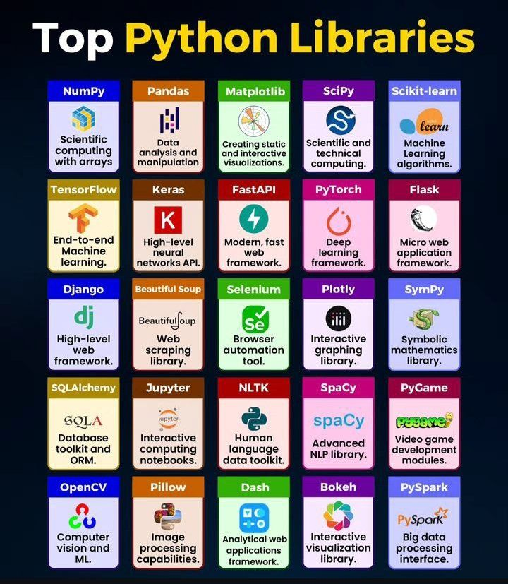

Top Python Libraries 

## 💬 Replies

### 1 @kbarnea24 (oladipupo akintade)

*Sat Dec 06 18:32:10 +0000 2025*

@PythonPr @grok  is Jupiter a library?

### 2 @Owl_centered (Owl🦉)

*Sat Dec 06 14:45:10 +0000 2025*

@PythonPr Bien que ça , toujours fragile au système critique.

### 3 @alhwysh787472 (جمال عبد الناصر الهويش)

*Sun Dec 07 04:13:17 +0000 2025*

@PythonPr If you didn't start building you Don't go the right way 

Python can keep your money specially on hosting apps, just if you understand how to use it!!!

