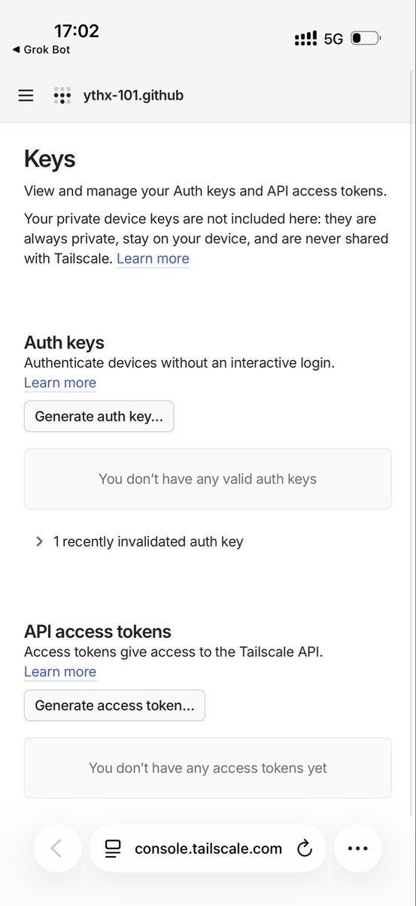
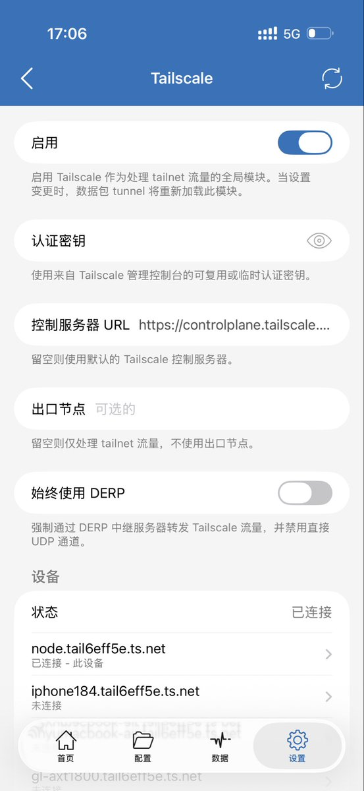
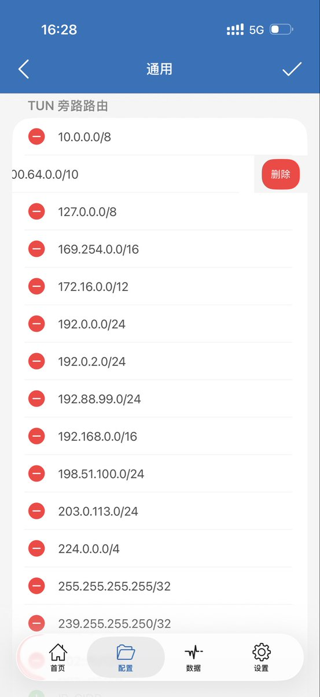
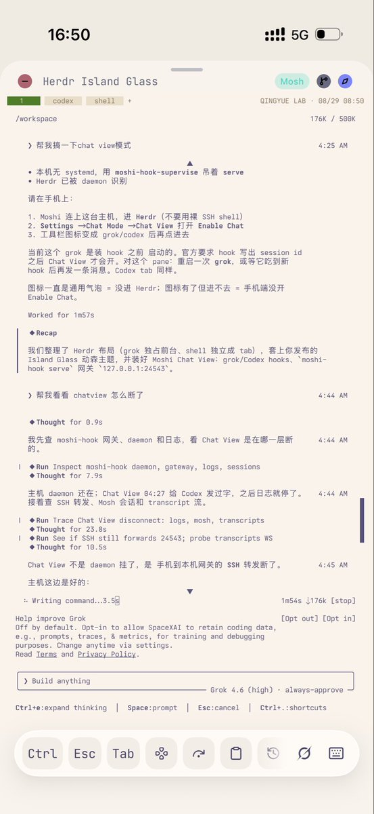

泪目！在 小火箭中配置 Taiscale，我终于做到了！

起因：我现在大量使用moshi，但是用moshi就要用到 Taiscale 也就以为着你不能使用shadowrocket，所以bot干活的时候只能刷小红书不能来推特和大家交流学习！

经过：今天我终于在grok bot 的指导下搞定了这个配置过程，接下来我就逐步讲解。

1.打开 Taiscale 页面，点击Generate auth key，生成密钥，然后拿好它准备下一步。不知道去哪里找的我把直达链接放评论区。

2.拿着这个密钥去小火箭中，打开设置，点击Taiscale，然后在认证密钥的地方输入刚才生成的Key，点击右上方的启用，其余地方保持内容不变。

3.点击配置，点击本地文件，点击编辑配置，点击通用，在通用中找到TUN 旁路路由，然后删掉100.64.0.0/10删掉，如图三。

4.返回通用，在右上角的➕点击，添加以下两条规则：
规则1:

类型 IP-CIDR，策略Tailscale，域名输入100.64.0.0/10。

规则2:

类型 DOMAIN-SUFFIX，策略也是 TAILSCALE，域名填写 [ts.net](http://ts.net)。

这两条搞定之后，关掉Tailscale 打开小火箭，然后你就会发现 Taiscale 和 shadowrocket 终于不用一起抢 Vpn 通道了。yeah 🎉完结撒花。

### 🖼️ Attached Media

## 💬 Replies

### 1 @YuLin807 (QingYue) (Author)

*Sat Aug 29 09:24:00 +0000 2026*

[console.tailscale.com/admin/settings…](https://console.tailscale.com/admin/settings/keys)

### 2 @neohob (Neo@Matrix)

*Sat Aug 29 11:11:51 +0000 2026*

@YuLin807 小火箭的tailscale总觉得有问题，速度不稳定，不如原始tailscale好，其次moshi完全可以被rootshell替代

### 3 @YuLin807 (QingYue) (Author)

*Sat Aug 29 11:18:52 +0000 2026*

@neohob rootshell 新出的吗

### 4 @gliang9 (Leo Ge)

*Sat Aug 29 10:06:09 +0000 2026*

@YuLin807 速度如何？

### 5 @YuLin807 (QingYue) (Author)

*Sat Aug 29 10:09:43 +0000 2026*

@gliang9 还行 没感觉慢

### 6 @JimmyYao666 (JimmyYao)

*Sat Aug 29 09:43:17 +0000 2026*

@YuLin807 但是会巨耗电。

### 7 @YuLin807 (QingYue) (Author)

*Sat Aug 29 10:00:23 +0000 2026*

@JimmyYao666 我来体验下 刚搞定

### 8 @sogakeji (ゼフィ)

*Sat Aug 29 11:21:39 +0000 2026*

@YuLin807 啊、、你为什么现在才发呀，我瞎捣鼓一上午，就因为旁路路由那条没删掉，怎么也连不上

### 9 @YuLin807 (QingYue) (Author)

*Sat Aug 29 11:23:54 +0000 2026*

@sogakeji 我也捣鼓好几天了 codex是笨蛋一样
刚才grok 指导好的

### 10 @weixiong0 (Wilsen)

*Sat Aug 29 11:30:14 +0000 2026*

@YuLin807 感谢感谢，以前上talescale只能去刷b站🤣

### 11 @YuLin807 (QingYue) (Author)

*Sat Aug 29 11:33:03 +0000 2026*

@weixiong0 哈哈哈哈 哈哈哈 我也是只能刷刷国内媒体看看短视频时间接浪费了

### 12 @ejsk33382 (靖)

*Sat Aug 29 10:25:25 +0000 2026*

@YuLin807 龙虾、codex，现在又是grok bot了😂，哥感觉本质你也是在看到哪个火就用哪个了😂

### 13 @YuLin807 (QingYue) (Author)

*Sat Aug 29 10:34:03 +0000 2026*

@ejsk33382 是啊 一直往前走

### 14 @supersonic9099 (supersonic)

*Sun Aug 30 00:39:58 +0000 2026*

@YuLin807 成了！！！

### 15 @YuLin807 (QingYue) (Author)

*Sun Aug 30 03:39:31 +0000 2026*

@supersonic9099 恭喜

### 16 @3_p72 (yu)

*Sat Aug 29 12:15:01 +0000 2026*

@YuLin807 我那天也让 agent 告诉我配好了一下 tailscale over shadowrocket，稍微有点曲折，不过还是成功了

### 17 @YuLin807 (QingYue) (Author)

*Sat Aug 29 12:25:49 +0000 2026*

@3\_p72 我都是在Agent的指导下干的

### 18 @Wanwan37hh (Wanwan)

*Sat Aug 29 15:28:49 +0000 2026*

@YuLin807 小火箭的tailscale有问题 ipv6 不稳定 不支持自定义的derp 不是很好用

### 19 @YuLin807 (QingYue) (Author)

*Sat Aug 29 15:41:42 +0000 2026*

@Wanwan37hh 还有其他软件或者办法的吗

### 20 @FyzureX (Freeaswind)

*Sat Aug 29 16:01:54 +0000 2026*

@YuLin807 其实mihomo内核都支持的

### 21 @YuLin807 (QingYue) (Author)

*Sat Aug 29 16:10:59 +0000 2026*

@FyzureX ios 有推荐的吗

### 22 @QT9277 (阿台🕊️)

*Sat Aug 29 14:22:58 +0000 2026*

@YuLin807 牛逼啊大佬！

### 23 @DaviRainivaa (DaviRain)

*Sat Aug 29 09:30:54 +0000 2026*

@YuLin807 我这也专门写了篇文章，怎么去配置[x.com/DaviRainivaa/s…](https://x.com/DaviRainivaa/status/2093281357200032201?s=20)

### 24 @tetsu76 (Tetsu)

*Sat Aug 29 11:46:38 +0000 2026*

@YuLin807 问我一句，大概能帮你省下 n 的 token 以及 n 的时间……

### 25 @Zby1149587 (MMoBAi)

*Sat Aug 29 13:46:45 +0000 2026*

@YuLin807 要分流的话，还得把出口节点配上的吧？另外，可以用官方客户端测测是不是直连，可以尝试ipv6打通，网速会快几个量级

### 26 @daodaoshao (excexcffcds)

*Sat Aug 29 16:12:02 +0000 2026*

@YuLin807 有bug 不能访问 tailscale 的子网路由

### 27 @xingsibiji (风旅)

*Sat Aug 29 10:59:13 +0000 2026*

@YuLin807 感觉很费电

### 28 @EvanHujsm (zjsjn)

*Sat Aug 29 14:38:32 +0000 2026*

@YuLin807 Which grok bot package do you use, plus or basic?

### 29 @jestcome (Jasper)

*Sun Aug 30 07:10:41 +0000 2026*

@YuLin807 没有小飞机的号。在用clashmi

### 30 @sonaldc (sonald)

*Sun Aug 30 08:11:02 +0000 2026*

@YuLin807 明天试试

