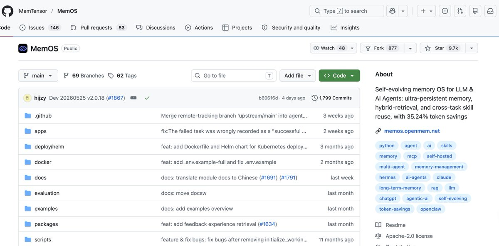
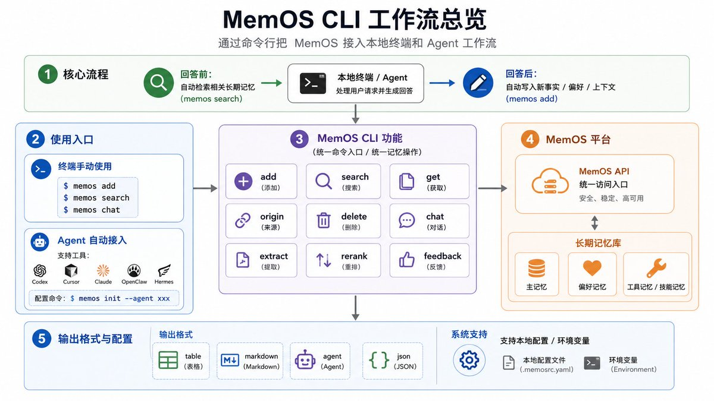
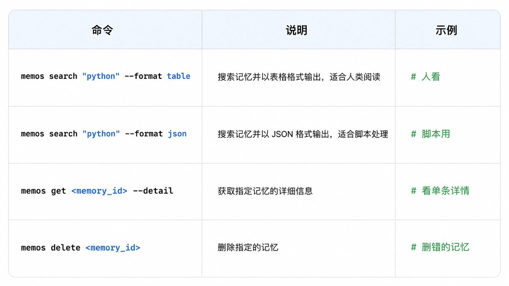
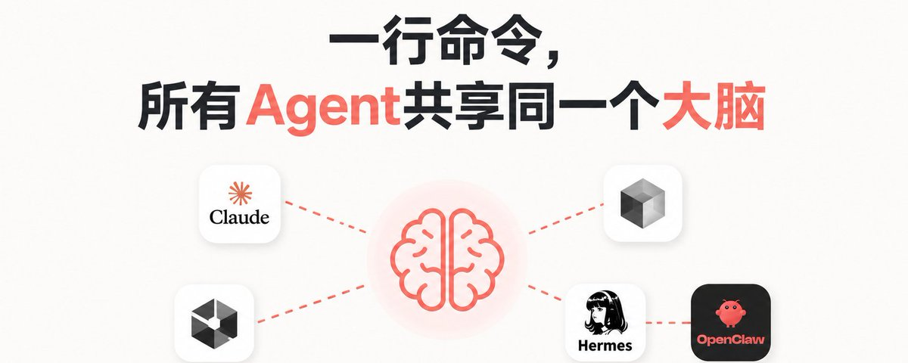

# 📰 一行命令，让所有Agent共享大脑

上周三下午，我在Claude Code里花了20分钟，把一个老项目的重构方案敲定了：后端统一用FastAPI，文档风格口语化，变量命名用下划线。Claude记得很清楚，配合得很顺。第二天早上切到Codex继续写，它上来就给我生成了camelCase的变量名，没有用下划线。

那一刻我意识到：这些AI工具各自都很聪明，但它们不认识同一个我。于是我折腾了一周，把5 个 常用AI 工具的记忆打通了。

一行命令，所有Agent共享同一个大脑。

这是我的配置方法，全部告诉你

如果你同时用Claude Code、Cursor、Codex、Hermes等等，你一定经历过：

\- Claude刚帮你定好"文档要口语化"，切到Cursor又要说一遍

\- Codex跑完重构，回Claude问"刚才改了啥"，它一脸懵

\- 每个AI都很聪明，但它们互相不认识你

我的判断是：

这事儿不能依赖任何一个客户端的插件，今天插 Claude，明天 Cursor 出新版本又得重配。得找一个所有 Agent 都能接进来的。

我选的是MemOS CLI，github已有近1w星标。

这是一个让所有能跑shell的Agent共享长期记忆的命令行工具。

它跟其他CLI不一样的地方在于：它既能为人所用，亦能为Agent服务，旨在成为人与Agent、Agent与Agent、人与人之间无缝沟通的纽带。

传统CLI多为人机交互设计，而MemOS CLI则在此基础上，更进一步让Agent能够自主学习并养成习惯。你配置一次，Agent就自动养成习惯。不挑客户端，只要能执行命令，就能接进来。

安装30秒搞定：

\`\`\`markdown
npm install -g @memtensor/memos-cloud-cli
memos config set platform.api\_key YOUR\_API\_KEY
memos config set defaults.user\_id user\_123

\`\`\`

装完了，写入第一条记忆

比如：memos add "这个项目后端用Python，文档风格要口语化"

这条信息现在存进了MemOS，所有接入的Agent都能读到。

接入Agent（关键步骤）

\`\`\`markdown
memos init --agent claude
memos init --agent cursor
memos init --agent codex
\`\`\`

我目前主力接了这三个。Hermes 和 OpenClaw 跑的是同一套 CLI，配置完全一致。

检索验证，memos search "文档风格"

如果能召回刚才那条，说明链路通了。

还可以直接用对话验证：

memos chat "你知道我的文档偏好吗？"

装完后，每个 Agent 自动养成两个习惯：

\- 回答前：检索相关记忆放进上下文

\- 回答后：把新事实写入MemOS

给每个Agent培养了事前翻笔记、事后写日报的习惯。

配完之后我没立刻信，专门测了一周:

\- Day1 用Claude定项目规范

\- Day2 切Cursor写代码，它直接知道我要Python+口语化文档

\- Day3 用Codex跑批量重构，它读到了前两天的上下文

没有重复喂一个字。

用了几天后，它记住了我三周前随口说过的一句"不用写太多注释"。

后来 Claude 生成代码时，注释明显变少了。

附件上我自用的调试技巧，记得收藏：

亲测当agent的记忆出问题时，用 CLI 排查比在agent里猜高效得多。

适合谁用

\- 一天在3个以上AI工具之间切换的人

\- 团队协作场景，多人共享同一套记忆配置

\- 想在本地快速验证记忆效果，不想先搭一堆应用

链接: GitHub: https://github.com/MemTensor/MemOS

文档: https://memos-docs.openmem.net/cn/mcp\_agent/cli/guide/

### 🖼️ Attached Media

## 💬 Replies

### 1 @berryxia (Berryxia.AI)

*Wed Jun 10 12:50:34 +0000 2026*

@Zesee 挺好的 我的爱马仕就是这个

### 2 @zw2867759575009 (DJ)

*Wed Jun 10 08:48:55 +0000 2026*

@Zesee 可以 很强 学会了

### 3 @ianneo_ai (Ian (伊恩))

*Wed Jun 10 10:45:06 +0000 2026*

@Zesee 共享这个问题很头疼，这样一来方便多了

### 4 @Zesee (Rachel🥥) (Author)

*Wed Jun 10 11:09:55 +0000 2026*

@ianneo\_ai 是的是的！

### 5 @0x10Me (0xZeno)

*Wed Jun 10 09:00:01 +0000 2026*

@Zesee 能减少不少重复沟通的成本

### 6 @Zesee (Rachel🥥) (Author)

*Wed Jun 10 09:07:18 +0000 2026*

@0x10Me 是的 没错

### 7 @cnyzgkc (木马人)

*Wed Jun 10 09:18:36 +0000 2026*

@Zesee mark，学习了

### 8 @Zesee (Rachel🥥) (Author)

*Wed Jun 10 09:19:06 +0000 2026*

@cnyzgkc 感谢！

### 9 @3333yyds (Nana)

*Wed Jun 10 08:56:26 +0000 2026*

@Zesee 那很方便啦！过程也很详细 超实用

### 10 @Zesee (Rachel🥥) (Author)

*Wed Jun 10 09:07:08 +0000 2026*

@3333yyds 是呢是呢

### 11 @zstmfhy (AI奶爸)

*Wed Jun 10 09:17:44 +0000 2026*

@Zesee 确实不错，这是好思路，不同的agent共用一套记忆

### 12 @Zesee (Rachel🥥) (Author)

*Wed Jun 10 09:19:20 +0000 2026*

@zstmfhy 是的！这样用起来就很方便

### 13 @RookieRicardoR (耳朵)

*Wed Jun 10 09:29:03 +0000 2026*

@Zesee 这个方便了

### 14 @Zesee (Rachel🥥) (Author)

*Wed Jun 10 09:29:36 +0000 2026*

@RookieRicardoR 是的是的！

### 15 @rionaifantasy (Rion Wu)

*Thu Jun 11 10:33:27 +0000 2026*

@Zesee 感谢分享，我也去试试

### 16 @0xLin88 (0xLin(✱,✱))

*Wed Jun 10 09:18:10 +0000 2026*

@Zesee 常用 AI工具的人 很适用哈

### 17 @dajingou1 (pandaWL)

*Wed Jun 10 08:58:49 +0000 2026*

@Zesee 感觉非常好用，去参与一下，感谢老师分享

### 18 @csf1349 (扫地僧)

*Wed Jun 10 14:34:13 +0000 2026*

@Zesee 有技术的我最喜欢 多学点东西🙏

### 19 @Tabgdoueth (Ox糖豆)

*Wed Jun 10 08:49:03 +0000 2026*

@Zesee 这个看着很好用 感谢分享 关注你啦

### 20 @kingzw888 (king | 来Gate事件合约抢百万积分)

*Wed Jun 10 08:47:32 +0000 2026*

@Zesee 这个Agent 好用的很

### 21 @xy050310 (小钰同学 | Gate Card刷遍全球)

*Wed Jun 10 11:43:16 +0000 2026*

@Zesee 一行命令就这么厉害啊，真是学习了老师！

### 22 @eastweb3eth (Jealousy 尼卡)

*Wed Jun 10 09:18:10 +0000 2026*

@Zesee 这个太有用了 操

### 23 @blmario669 (黑色马里奥)

*Wed Jun 10 08:46:18 +0000 2026*

@Zesee 我现在安装啥都让他自己去装

### 24 @YuChen (YuChen 大王)

*Wed Jun 10 08:50:45 +0000 2026*

@Zesee 学到了，我之前都搞错了

### 25 @mnmn94253156337 (撸毛吃猪脚饭| 美股合约首选Gate)

*Wed Jun 10 08:47:30 +0000 2026*

@Zesee 看样子很好用 去试试看看

### 26 @Ylsdagad (Crypto芷若)

*Wed Jun 10 09:19:03 +0000 2026*

@Zesee 感谢分享 我也试试看

### 27 @gogo123239 (小绵羊)

*Wed Jun 10 11:09:19 +0000 2026*

@Zesee Agent 自己记笔记写日报 真香

### 28 @Web300fa (⌘00FA ./)

*Wed Jun 10 09:03:29 +0000 2026*

@Zesee 简直写到我心巴上了，刚好需要这个，顺便求一波老师的互关

### 29 @suhang_web3 (苏杭)

*Wed Jun 10 11:28:32 +0000 2026*

@Zesee 共享大脑🧠，好厉害

### 30 @jinbuhuanyy (金不换yy)

*Wed Jun 10 14:25:33 +0000 2026*

@Zesee 干货直接收藏

### 31 @MindfulReturn (MindfulReturn 身心修复局)

*Wed Jun 10 11:16:48 +0000 2026*

@Zesee 最近装太多这种云端的，openclaw都开始打架了

### 32 @Easycompany333 (Easycompany)

*Wed Jun 10 11:37:18 +0000 2026*

@Zesee 学习了，最近正好在搞我的agent memory，感谢分享

### 33 @kood520 (东逆)

*Wed Jun 10 15:59:26 +0000 2026*

@Zesee 一行命令打通所有AI记忆，这个思路不错

### 34 @mybitstar (timekey.eth | Gate美股0费率)

*Wed Jun 10 08:47:44 +0000 2026*

@Zesee 这个帅，我要试试🫡

### 35 @xingshizhai (xingshizhai)

*Wed Jun 10 12:46:52 +0000 2026*

@Zesee 这个要试试

### 36 @SatoshiSilk (長工 PoW)

*Wed Jun 10 16:15:18 +0000 2026*

@Zesee 这个可以有

