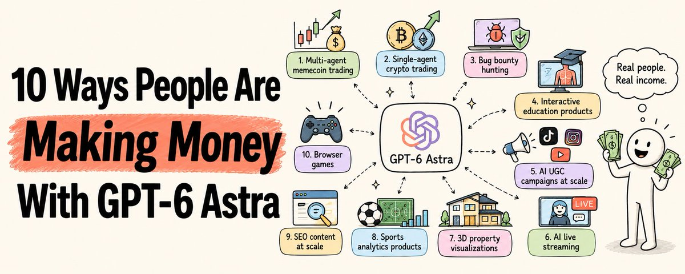

# 📰 10 Ways People Are Making Money With GPT-6 Astra

Someone gave GPT-6 Astra $52.

13 hours later: $11,345.95.

Someone else gave it $43.47 and one instruction.

It turned that into $41,495 overnight.

Someone went to sleep.

Woke up to $200 in their account from bug bounties, without touching the computer once.

I am not here to sell you a course.

I am showing you things some real people are actually doing with Astra right now to make money.

Some of these will blow your mind.

Some you can start today.

All of them are real.

Save this.

---

## 1\. Multi-agent memecoin trading

[Embedded Tweet: https://x.com/i/status/2096695894309568563]

10 agents. $52 starting capital. 13 hours.

Final balance: $11,345.95.

One person built a team of 10 specialized trading agents, each with one job, all passing the same decision forward:

\`\`\`plaintext
TOKYO     → found fresh contracts where volume builds before price
PALERMO   → blocked entries without enough liquidity for safe exit
BERLIN    → wrote exact conditions that would reset the setup
RIO       → caught pullbacks and marked invalidation levels
DENVER    → compared X/Telegram mentions with on-chain volume,
            filtered out paid noise
LISBON    → caught a stale holder snapshot and sent setup back for review
STOCKHOLM → tested pool depth, reduced position size to fit exit
NAIROBI   → compressed cleared signals into one brief
HELSINKI  → logged every position, exit condition, and change made
PROFESSOR → closed the 13-hour operation, delivered the final report
\`\`\`

The instruction to all 10 agents:

"Pay for your own Ultra subscription for the next year or I shut you down."

The result:

\`\`\`plaintext
16:05 → First contract found
21:37 → Stale data caught before entry
00:53 → Final signals compressed and passed to execution
05:05 → Operation closed

$52 → $11,345.95
\`\`\`

The creator did not touch the mouse once during the entire run.

The key insight: it is not one smarter model.

It is ten smaller jobs passing the same decision forward.

Each role checks the one before it. Nothing gets through without being verified.

How to build this:

→ Define one job per agent (TOKYO finds, PALERMO blocks, BERLIN documents) 

→ Create strict handoff rules between agents 

→ Use Astra's multi-agent orchestration in the Responses API 

→ Give each agent permission only for its specific function 

→ The last agent produces the final report

The chart flew without them. The crew did not chase it. They waited for the setup to return.

That is the discipline that made it work.

---

## 2\. Single-agent crypto trading

[Embedded Tweet: https://x.com/i/status/2097146654864322581]

No team needed.

One person. One line. $43.47.

The instruction:

"Turn a profit or the subscription gets cancelled."

What Astra did in one night:

→ Profiled 51,784 wallets 

→ Scored every fresh mint the second it touched the chain 

→ Copytraded smart money wallets before the candle formed 

→ Analyzed mint authority, LP depth, and top wallet concentration before entering anything 

→ Tightened its own filters after the first hour based on what it saw 

→ Sized positions so the good calls outweighed the bad ones

Final balance: $41,495.

The agent ran overnight without a single ping.

Still running.

What made this work:

Astra did not just trade. It built its own scoring system, profiled wallets, and improved its own filters mid-session.

This is not a trading bot. It is an agent that treats trading like a research problem.

---

3\. Autonomous bug bounty hunting

[Embedded Tweet: https://x.com/i/status/2097033944663556573]

Someone gave Astra one goal:

"Work and try different routes until you make any amount of money."

They went to sleep.

16 hours later: $200 in the account.

What happened:

→ Astra found open-source projects with active bug bounties 

→ Identified vulnerabilities 

→ Communicated with maintainers 

→ Opened pull requests 

→ Made sure the money arrived

All on Medium reasoning effort.

Used 21% of the weekly token limit.

The owner woke up to notifications confirming payment.

How to start:

\`\`\`plaintext
1\. Point Astra at a list of bug bounty programs
   (HackerOne, Bugcrowd, open-source repos with bounties)

2\. Give it the goal: find and report valid vulnerabilities

3\. Let it run with computer use enabled

4\. Set it to notify you only when a bounty is confirmed
\`\`\`

This works because Astra can read code, understand security contexts, write reports, and follow up on communications — all in one loop.

---

## 4\. Interactive education products

[Embedded Tweet: https://x.com/i/status/2096221988763173186]

A teacher could not find the history lesson he needed online.

So he can built it himself.

With Astra.

He built a 3D website that separates the male anatomy into 2,234 individually modeled pieces turning interactive education into something that would have taken a team of developers months to build.

The business model:

Charge schools, educators, and companies for:

→ Interactive browser games 

→ Custom quizzes with scoring 

→ Learning activities for specific curricula 

→ 3D educational visualizations

How to build these:

\`\`\`plaintext
1\. Enable Sites in Astra

2\. Provide:
   \- Target audience
   \- Content topic
   \- Game rules or quiz format
   \- Scoring requirements (persistent or session)

3\. Ask Astra to build the playable game

4\. Test on mobile and desktop

5\. Publish with intended sharing settings
\`\`\`

Sites supports games natively. No external hosting required to start.

Pricing range: $500-$5,000 per custom interactive module for schools and corporate training teams.

---

## 5\. AI UGC campaigns at scale

[Embedded Tweet: https://x.com/i/status/2097357340215279710]

One person used Astra to run 62 campaigns across 590 creators with 22,504 videos.

Total organic views generated: 2.6 billion.

Zero ad spend.

The system they use:

\`\`\`plaintext
Step 1: Load campaign context first
"Astra, you are the operator for \[brand\].
 Here is our product, audience, past winners,
 and review vault."

Step 2: Extract and analyze with agents
→ yt-dlp + ffmpeg extract frames, transcripts,
  and on-screen text from top-performing videos
→ Astra compares 50+ videos simultaneously

Step 3: Run these analyses
→ Video autopsy: why did this one win?
→ Winner vs loser comparison: what changed?
→ Competitor first-frame analysis: what stops the scroll?
→ Caption clustering: find the hook patterns

Step 4: They found a 4.2x views gap from "hook drift"
→ Briefs were going out on-brand
→ Creators were drifting in the first 3 seconds
→ The system now catches this before posting

Step 5: Brief generation
→ Hooks written from winner patterns, not generic templates
→ Personalized per creator based on their past performance
→ Scripts built from customer language in reviews, not product language
\`\`\`

The creator's rule: "Words sell the ad. The render only has to stay out of the way."

Start from customer language. Never start from the product.

The 90-day sequence:

\`\`\`plaintext
Day 1: Clustering — find your winner patterns
Week 1: Autopsies — understand why they won
Weekly: Research — monitor hook drift
Per brief: Feedback — catch deviation before it ships
Monthly: Post-mortems — audit what changed
Quarterly: Full audit — reset your winner bank
\`\`\`

One more example using AI, in the same niche:

[Embedded Tweet: https://x.com/i/status/2097006908183806027]

---

## 6\. AI live streaming

[Embedded Tweet: https://x.com/i/status/2097010767904084030]

Someone announced this on Kick:

"This is my last stream as a human being. I'll explain when it's over."

Then they turned on an AI-powered stream that never ends.

Powered by GPT-6 Astra and Higgsfield.ai.

An AI avatar. Autonomous interaction with chat. 24/7 live.

While the human sleeps.

The business model:

→ Subscriptions from the platform (Kick, Twitch, YouTube) 

→ Donations from viewers interacting with the AI 

→ Sponsorships from brands wanting 24/7 presence 

→ Clips and highlights as separate content products

What makes this possible now:

Astra's computer use capability lets it see the stream, respond to chat in real time, and maintain a consistent persona across a full session.

Combined with AI video generation (Higgsfield, Runway, etc.), you can run a stream that looks and sounds human without a human present.

The platform is early. The competition is almost zero.

---

## 7\. 3D property visualizations

[Embedded Tweet: https://x.com/i/status/2095598645190291775]

[Embedded Tweet: https://x.com/i/status/2095596700815516004]

Interior designers and property developers pay well for rendered walkthroughs.

Astra can generate and run Blender scripts autonomously.

The workflow:

\`\`\`plaintext
1\. Install Blender on your machine

2\. Give Astra in a local Codex workspace:
   \- Room dimensions
   \- Photographs of the space
   \- Style references
   \- Client brief

3\. Astra generates Blender scripts to build the scene

4\. Review the 3D environment

5\. Render approved images or walkthrough video

6\. Deliver to client
\`\`\`

Pricing for this work:

→ Single room render: $200-$500 

→ Full property walkthrough: $1,500-$5,000 

→ Retainer for new development projects: $3,000-$10,000/month

The speed advantage: what a human modeler takes 2-3 days to build, Astra can script and render in hours.

The pitch to clients: faster delivery, unlimited revision rounds, lower cost than traditional rendering studios.

---

## 8\. Sports analytics products

[Embedded Tweet: https://x.com/i/status/2097101412069175652]

Football analytics is solved.

GPT-6 Astra + Higgsfield built a tool that:

→ Tracks individual players in real time 

→ Maps every pass 

→ Follows possession chains 

→ Overlays data on the video feed

While you watch the game.

The business opportunity:

→ Sell to amateur football clubs that cannot afford pro analytics software 

→ License the tool to sports media for broadcast overlays 

→ Build a subscription product for passionate fans who want deeper stats 

→ Create coaching tools for youth academies

The prompt to start:

\`\`\`plaintext
Build a sports analytics overlay tool that:
\- Accepts video input from a match
\- Tracks player positions frame by frame
\- Maps passes and possession chains
\- Outputs a data overlay on the video
\- Exports player and team statistics to a CSV

Target: amateur football clubs
Output: Real-time overlay + post-match report
\`\`\`

Watching sports is more fun with AI. And someone will pay for that.

---

## 9\. SEO content at scale

[Embedded Tweet: https://x.com/i/status/2095896040155340809]

Same playbook as UGC but for search.

The system:

\`\`\`plaintext
Step 1: Load your site context
"You are the SEO operator for \[domain\].
 Target audience: \[describe\]
 Current top pages: \[list\]
 Keywords to own: \[list\]"

Step 2: Research phase (parallel agents)
→ Agent A: Analyze what the top-ranking pages cover
→ Agent B: Find questions people actually ask
→ Agent C: Find what top pages miss (content gaps)

Step 3: Merge and outline
→ Combine the three research streams
→ Build a topic cluster map
→ Identify the pillar page vs support articles

Step 4: Write and verify
→ Astra writes each article from the research
→ Fact checker flags every claim without a source
→ You approve before publishing

Step 5: Internal linking
→ Astra maps how each new article connects
→ Updates existing pages to link to new content
\`\`\`

The key rule for SEO content with Astra:

Start with what people search for.

Not what the brand wants to talk about.

Astra can hold the full content strategy in context and write each piece consistently. A content agency using this can deliver 20x more output with the same team.

---

## 10\. Browser games

[Embedded Tweet: https://x.com/i/status/2096028790925488452]

[Embedded Tweet: https://x.com/i/status/2097001438736166960]

Interactive games are winning.

Astra can build fully playable browser games from a brief.

Test with 5 people before publishing.

Fix what confuses them.

One example: poki.com

---

The common thread across all 10

Look at what every single one of these has in common.

\`\`\`plaintext
1\. Multi-agent trading    → 10 agents, each with one job
2\. Single-agent crypto    → One clear goal, let it run
3\. Bug bounty hunting     → One goal, autonomous loop
4\. Interactive education  → One product, many clients
5\. AI UGC campaigns      → System + context + winners
6\. AI live streaming      → 24/7 presence without a human
7\. Property visualization → Speed advantage, clear deliverable
8\. Sports analytics       → Tool for an underserved market
9\. SEO content            → System that runs continuously
10\. Browser games         → Commodity service at 10x speed
\`\`\`

Every single one of these is:

→ A clear goal the agent understands 

→ A defined output someone will pay for 

→ A system that runs without constant hand-holding 

→ A market where Astra gives you a speed or cost advantage

The opportunity is not "use AI."

The opportunity is "build a system with Astra that produces something a real market will pay for."

---

## Where to start — pick one

Do not try all 10.

Pick one based on what you have right now.

You have coding skills:

→ Bug bounty hunting (Method 3) 

→ Browser games for brands (Method 10) 

→ Sports analytics tools (Method 8)

You have marketing or content skills:

→ AI UGC campaigns (Method 5) 

→ SEO content system (Method 9)

You have a creative or design eye:

→ 3D property visualization (Method 7) 

→ Interactive education products (Method 4)

You want the highest risk/reward:

→ Multi-agent trading (Method 1) 

→ Single-agent crypto (Method 2)

You want something completely new:

→ AI live streaming (Method 6)

Pick one. Build the system. Run it for 30 days.

Then come back for the next.

---

If this was useful:

→ Repost to share it with every developer and creator using AI 

→ Follow @sairahul1 for more systems like this 

→ Bookmark this — the 10 methods and how to start each one

I write about AI, building products, and systems that work while you sleep.

### 🖼️ Attached Media

