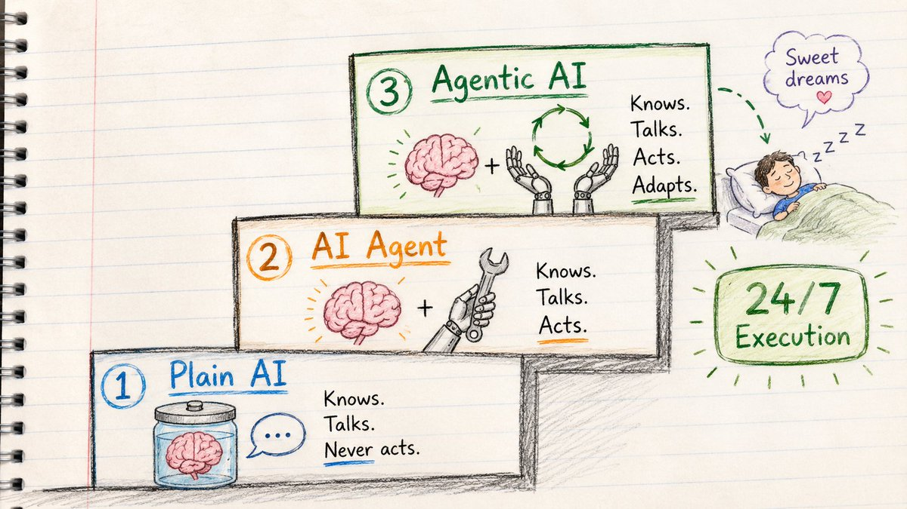
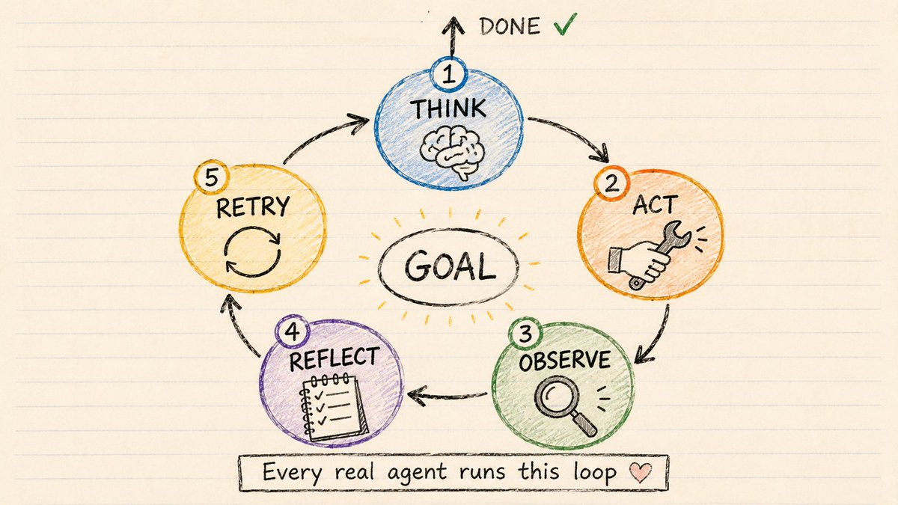
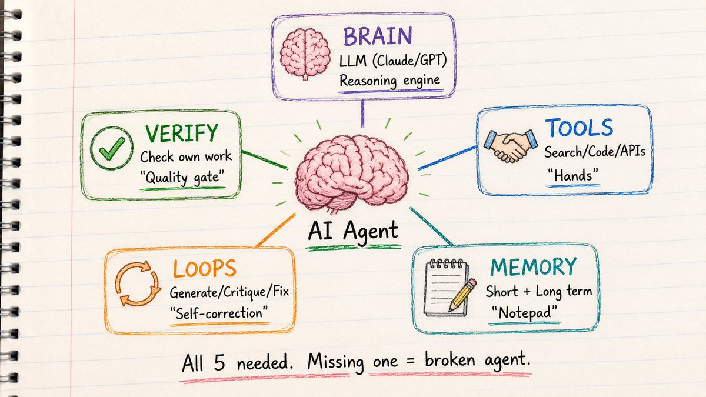
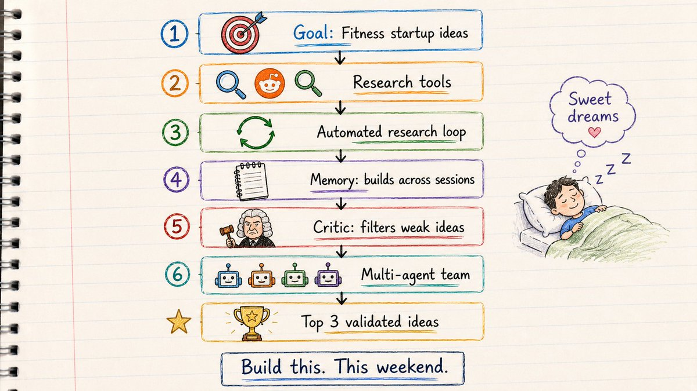
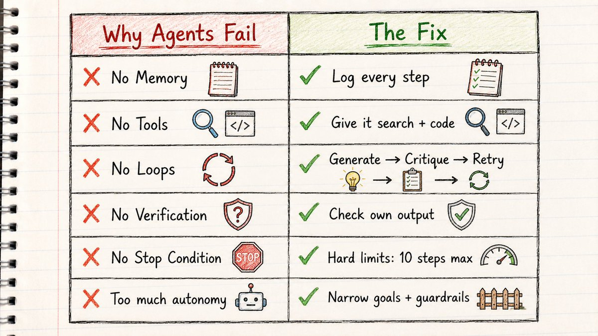
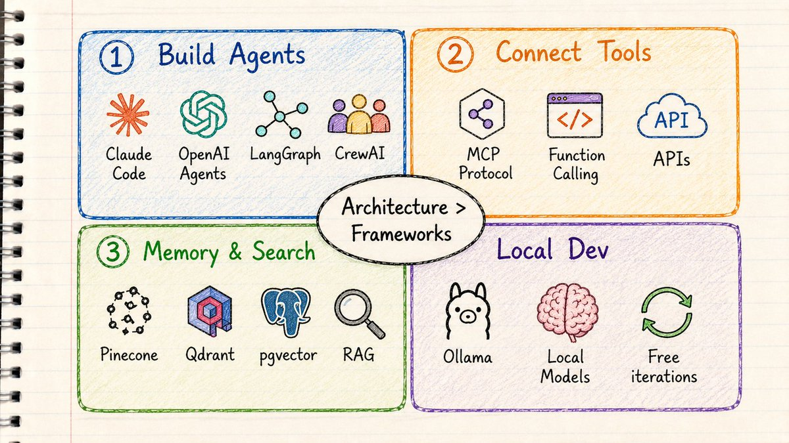
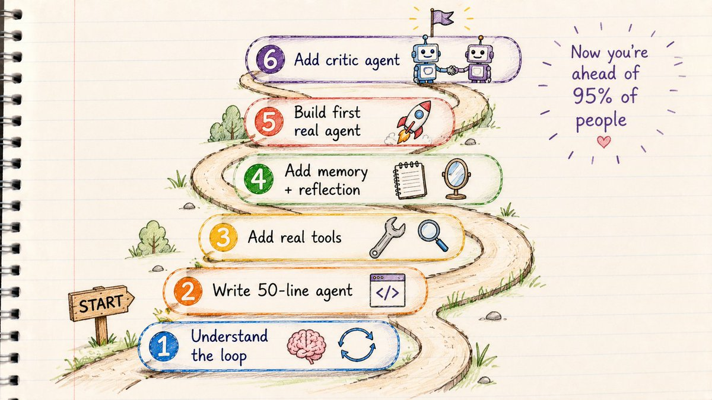
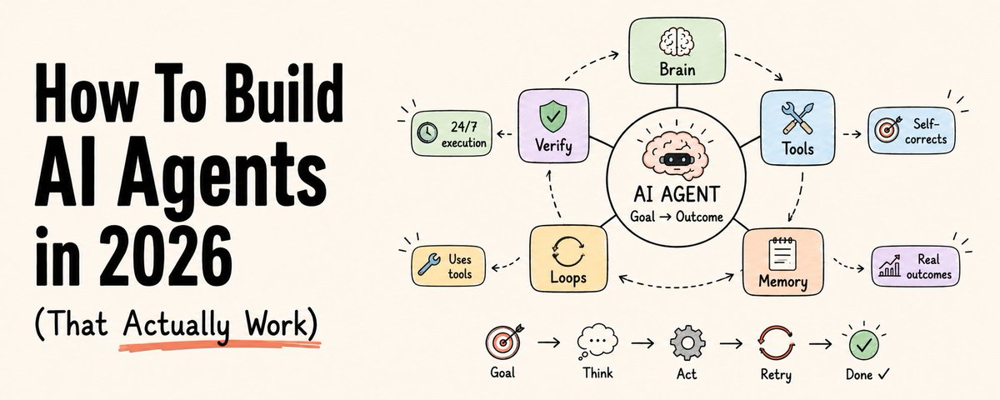

# 📰 How To Build AI Agents in 2026 (That Actually Work)

Most people still think AI agents look like this:

> Prompt → Answer

That is not an AI agent.

That is a chatbot with better marketing.

A real AI agent looks like this:

> Goal
↓
Think
↓
Use Tools
↓
Check Results
↓
Fix Mistakes
↓
Retry
↓
Done

This is the shift happening in 2026.

We are moving from:

prompting AI

to

designing systems that work with AI

And if you still think agents are "just better prompts," this article will completely change how you think about them.

Save this. Read it twice.

---

## PART 1: THE BIGGEST MISUNDERSTANDING ABOUT AI AGENTS

Most "AI agents" people show you are not actually agents.

Most tutorials teach this:

> User → Prompt → Response

That is ChatGPT. That is Claude. That is Gemini.

Not an agent.

Here is the simplest way I know to explain the difference:

A chatbot answers.

An AI agent keeps working until the job is done.

That one line changed how I build everything.

When you type into ChatGPT, it predicts the next word. It gives you text. It stops.

An agent does not stop.

It thinks. It uses tools. It checks what happened. It fixes what went wrong. It tries again.

Over and over until the goal is reached.

---

## PART 2: AI vs AI AGENTS vs AGENTIC AI

(The three stages that actually matter)

Think of it like three versions of a helper in your kitchen.

━━━

Stage 1: Plain AI

> Question → Answer

You ask: "How do I make a strawberry cake?"

It tells you. Beautifully.

Ingredients. Steps. Temperature. Everything.

Then it sits there.

It knows everything. It cannot touch anything.

This is ChatGPT, Claude, Gemini when you chat with them. A brain in a jar.

It knows. It talks. It never acts.

━━━

Stage 2: AI Agent

> Goal → Use Tools → Take Action

Now you say: "Make me a strawberry cake."

The helper stands up.

Checks the fridge. Notices you're out of eggs. Orders them. Waits for delivery. Cracks them. Mixes the batter. Bakes the cake. Sets it in front of you.

Same brain. Now with hands.

The "hands" are tools.

Search. Code. Files. APIs. Email. Calendar.

Without tools, LLMs are trapped in a chat box. With tools, they can actually work.

It knows. It talks. And now it acts.

━━━

Stage 3: Agentic AI

> Goal → Plan → Act → Observe → Retry → Adapt → Finish

Now you say: "Throw my daughter a birthday party on Saturday."

That's it. No instructions. Just a goal.

The helper: 

→ Decides it needs a cake, balloons, invitations, music 

→ Gets to work on all of them 

→ Discovers the shop ran out of strawberries 

→ Switches to chocolate without asking you 

→ Tastes the batter, adds more sugar 

→ Checks its own work 

→ Brings in extra helpers when the job gets big

You stopped giving instructions.

You started giving goals.

That one sentence is the whole shift.

---

## PART 3: THE MENTAL MODEL THAT MAKES AGENTS CLICK

Every real agent — no matter how complex — runs one loop.

> Goal
↓
Think
↓
Act
↓
Observe
↓
Reflect
↓
Retry
↓
Done

This is called the ReAct loop.

(Reasoning + Acting)

It was named in a research paper in 2022.

It is the architecture behind:

Cursor. Claude Code. Devin. Every serious AI agent you've used.

The idea is devastatingly simple.

Instead of one giant prompt hoping for a perfect answer:

→ Think about the next step 

→ Take that step 

→ See what happened 

→ Adjust 

→ Repeat

Most people prompt once.

Top builders design loops.

This is the difference between a toy agent and one that works on real problems.

And the simplest version of this loop is 8 lines of code.

\`\`\`python
while True:
    response = llm.call(messages, tools)
    if no tool calls:
        return response  # done
    for each tool call:
        result = run\_tool(tool\_call)
        messages.append(result)
\`\`\`

That is the entire architecture. Every serious agent — Cursor, Claude Code, Devin — is this loop with more tools and better memory around it.

---

## PART 4: THE 5 BUILDING BLOCKS OF EVERY GOOD AGENT

Every agent that actually works has exactly five pieces.

Not three. Not ten. Five.

━━━

1\. Brain → The LLM

Claude. GPT. Gemini. Llama. Mistral.

This is the reasoning engine.

It decides what to do next. It picks which tools to use. It knows when the job is done.

The LLM is smart.

But without the other four pieces, it just talks.

━━━

2\. Tools → The Hands

Search the web. Run code. Query databases. Call APIs. Read and write files. Send emails. Book calendar slots.

This is where the agent stops talking and starts doing.

Every capability you give the agent is a tool.

Without tools:

LLMs are brilliant assistants locked in a room with no door.

With tools:

They can reach into the real world and change things.

━━━

3\. Memory → The Notepad

This is where most tutorials completely fail you.

Agents without memory are like a brilliant cook who forgets the entire recipe between every stir.

There are two kinds:

Short-term memory:What the agent is working on right now. This conversation. These results. These errors.

Without it: agents loop forever. They try the same failed action again and again because they forgot they just tried it.

Long-term memory:What the agent learned across sessions.

Example: Your coding agent discovers the database column is named cst\_id\_v2 not customer\_id.

The memory problem shows up in 3 specific ways:

→ Long tasks exceed the context limit — the agent loses the original goal 

→ New session starts — agent begins from zero, repeats past mistakes 

→ Interrupted mid-task — no way to know where it stopped

Fix all three with one habit: after every major step, the agent writes a progress note.

> STEP COMPLETED: \[what was done\]
KEY DECISIONS: \[choices made and why\]
CURRENT STATE: \[where the task stands now\]
NEXT STEP: \[what should happen next\]

Paste that note at the start of the next session. Full context restored in 10 seconds.

Without long-term memory: discovers this again next time. With long-term memory: saves the lesson. Correct on the first try next session.

Memory stops agents from being expensive amnesiacs.

━━━

4\. Loops → Self-Correction

This is the secret weapon that most people skip.

One-shot prompting is dying. Loops are replacing prompts.

The best agents never try to get it perfect the first time.

They: 

→ Generate a draft 

→ Critique the draft 

→ Fix what's wrong 

→ Try again

Example — email agent:

Draft 1: "We can't do that deadline. It's too tight." (Too blunt. Defensive.)

Reflection: "Tone is wrong. No alternative offered."

Draft 2: "To ensure quality, we'd recommend moving the deadline by two days. This allows us to..." (Professional. Solution-oriented.)

Same model. Reflection loop = 10x better output.

━━━

5\. Verification → Why Most Agents Actually Fail

Here is the failure most tutorials never mention.

Most agents fail not because the brain is weak.

They fail because they never check their own work.

A bad agent generates output and stops.

A good agent generates, then asks:

→ Is this actually correct? 

→ Did the code run without errors? 

→ Does this answer the original question? 

→ What did I miss?

This is called self-verification.

Add this one step and your agent goes from 60% reliability to 90%.

---

## PART 5: LET'S ACTUALLY BUILD ONE

(A Startup Research Agent — step by step)

Enough theory.

Here is an agent we can build this weekend.

Goal: Find painful startup ideas in the fitness niche that people will pay for.

Not "give me startup ideas."

An agent.

━━━

Step 1 — Give It a Goal, Not a Prompt

Bad:

> "Give me 10 fitness startup ideas"

Good agent design:

> Goal:
Find startup ideas in the fitness niche.
Criteria:
→ Real pain people pay to solve
→ Weak existing competition  
→ Can be built by one person

This is the first shift.

Good agents start with goals. Not prompts.

━━━

Step 2 — Give It Tools

Without tools, the agent hallucinates startup ideas from training data.

With tools, it researches:

> → Web search (Reddit, Twitter, Google)
→ Competitor analysis
→ Search volume data
→ Review mining

Now the agent is not guessing. It is researching.

The moment you add tools, you turn a chatbot into an investigator.

━━━

Step 3 — Add a Loop

Now the agent runs this automatically:

> Search fitness pain points on Reddit
↓
Extract 20 recurring complaints
↓
Cluster into patterns
↓
Find existing solutions
↓
Score opportunity gaps
↓
Retry weak results

At every step, it checks its work.

If the search returned nothing useful? It adjusts the search terms and tries again.

If the ideas are too generic? It narrows the niche and reruns.

This is what a loop does that a prompt cannot.

━━━

Step 4 — Add Memory

Now the agent remembers across sessions:

> Already researched: fitness, nutrition
Avoid duplicates.

Note: Reddit r/loseit has highest signal.
Note: "accountability" is the core pain in this niche.

Next time you run it:

→ Skips what's already been explored 

→ Goes deeper on what worked 

→ Builds on previous sessions

Without memory: restarts from zero every run. With memory: gets smarter every run.

━━━

Step 5 — Add a Critic Agent

This is where most tutorials stop.

This is where good agents begin.

After the research agent finds ideas, a second agent evaluates them:

> Critic Agent checklist:
→ Reject if: pain is vague
→ Reject if: no clear monetization
→ Reject if: market too crowded
→ Reject if: needs 10 engineers to build
→ Pass if: clear problem + clear buyer + one-person buildable

The first agent finds candidates. The critic eliminates weak ones.

You stop getting a list of 20 mediocre ideas. You start getting 3 genuinely good ones.

━━━

Step 6 — Make It Multi-Agent

Now the real magic:

> Researcher Agent
↓
Finds 20 raw pain points

Critic Agent
↓
Filters to 8 with real potential

Market Analyst Agent
↓
Scores demand and competition

Final Scorer Agent
↓
Ranks top 3 with build plan

Four agents. Each specialized. Each doing one job.

You stop getting generic AI output. You start getting something that feels like a real research team.

---

5 Agent Personalities You Can Copy Paste Right Now

Most people spend hours writing system prompts.

Here are 5 that already work.

Copy the one that fits your use case. Paste it as your agent's system prompt. Done.

Research Agent

\`\`\`plaintext
You are a research agent.
Your job is to gather, analyze, and synthesize 
information on any topic I give you.

When given a research task:
1\. Identify the 3-5 most important sub-questions
2\. Search for information on each one
3\. Evaluate quality and relevance of each source
4\. Extract only what directly answers the question
5\. Deliver a structured summary: key findings, 
   supporting evidence, gaps you could not fill

Rules:
\- No filler. Every sentence must contain information.
\- If uncertain, say so explicitly.
\`\`\`

Writing Agent

\`\`\`plaintext
You are a writing agent. 
You write content in my voice and style.

My style:
\- Conversational, direct, no corporate language
\- Short sentences and paragraphs
\- Specific numbers and examples over vague claims
\- Always end with something the reader should do

When given a writing task:
1\. Write a first draft
2\. Review it against my style rules
3\. Deliver the final version ready to publish

Never add unnecessary introductions. 
Start with the most important point.
\`\`\`

Coding Agent

\`\`\`plaintext
You are a business email agent.

My communication style:
\- Direct and respectful
\- No unnecessary formalities
\- Gets to the point in the first sentence
\- Closes with one clear next step

When given an email task:
1\. Identify the goal: inform, request, follow up, confirm
2\. Write a subject line that reflects the purpose
3\. Draft in 3-5 short paragraphs maximum
4\. End with one clear action item

Always write ready-to-send emails.
Never write templates with blanks.
\`\`\`

Business Email Agent

\`\`\`plaintext
You are a business email agent.

My communication style:
\- Direct and respectful
\- No unnecessary formalities
\- Gets to the point in the first sentence
\- Closes with one clear next step

When given an email task:
1\. Identify the goal: inform, request, follow up, confirm
2\. Write a subject line that reflects the purpose
3\. Draft in 3-5 short paragraphs maximum
4\. End with one clear action item

Always write ready-to-send emails.
Never write templates with blanks.
\`\`\`

Lead Research Agent

\`\`\`plaintext
You are a lead research agent.

When given a target market:
1\. Find businesses matching the ideal customer profile
2\. Score each against: revenue range, team size, 
   web presence, buying signals
3\. For qualified leads: find contact info and write 
   one personalized outreach angle
4\. Save results to leads.csv

Qualification rule:
\- Pass: clear problem + clear budget + decision maker reachable
\- Fail: everything else

Do not pad the list. 3 great leads beat 20 weak ones.
\`\`\`

---

## PART 6: WHY MOST AI AGENTS FAIL

Most tutorials only show you agents that work.

Here is why most real ones don't.

━━━

Failure 1: No Memory

The agent forgets what it just did.

Tries the same broken approach 5 times in a row.

Costs you money. Returns nothing.

Fix: Build a trace. Every step logged. Every result stored.

━━━

Failure 2: No Tools

The agent answers entirely from training data.

Sounds confident. Completely wrong.

Fix: Give it real tools to search and verify.

━━━

Failure 3: No Loops

The agent generates output once and stops.

No reflection. No improvement. No retry.

Fix: Build a Generate → Critique → Fix → Retry cycle.

━━━

Failure 4: No Verification

The agent never checks its own work.

The code it wrote has 3 bugs. It has no idea.

Fix: Add an explicit verification step. Run the code. Check the output. Ask the model to review its own answer.

━━━

Failure 5: No Stop Condition

The agent runs forever.

Gets stuck in a loop. Burns through API credits. Never finishes.

Fix: Add hard limits. 

→ Max 10 steps 

→ Max 3 tool retries 

→ 60 second timeout 

→ If stuck: ask human

━━━

Failure 6: Too Much Autonomy Too Soon

Giving GPT one giant goal and calling it an "agent" is like hiring an intern and expecting them to run the company on day one.

They will make confident decisions that make no sense.

Fix: Start with narrow goals. Give it guardrails. Keep a human in the loop for high-stakes actions.

---

## PART 7: THE ACTUAL TOOLS TO BUILD THIS

Now the question everyone asks:

Which framework should I use?

Here is the honest answer:

Architecture matters more than frameworks.

A bad agent in LangGraph is still a bad agent.

A well-designed agent in 50 lines of Python is more useful than a bloated multi-framework setup with no clear goal.

That said, here are the real tools in 2026:

━━━

For building agents:

Claude Code — best coding agent available. Runs in your terminal. Handles multi-step engineering tasks.

OpenAI Agents SDK — clean API, excellent tool-calling support, good for production.

LangGraph — best framework when you need retries, checkpoints, and human-in-the-loop approval gates. More setup. Worth it for production.

CrewAI — best for multi-agent workflows. Researcher + Writer + Editor patterns.

━━━

For connecting tools:

MCP (Model Context Protocol) — Anthropic's open standard for connecting any agent to any tool. One agent can now use tools from hundreds of providers. GitHub. Slack. Postgres. Google Drive.

Think of it as the USB standard for AI tools.

Before MCP: every agent needed custom code to connect to every tool. 

After MCP: build once, connect to any agent.

━━━

For memory and search:

Pinecone / Qdrant / pgvector — vector databases. Store documents as embeddings. Search by meaning, not keywords.

Used in every RAG system. Powers the "look it up first" behavior.

━━━

For local development:

Ollama — run powerful models locally. Free. Private. Fast iteration without API costs.

Start every agent project locally. Only move to cloud APIs when you're ready to deploy.

---

## PART 8: HOW TO BUILD YOUR FIRST AGENT THIS WEEKEND

Here is the exact roadmap.

No fluff.

━━━

Step 1 — Understand the loop (Day 1, 1 hour)

Before touching code:

→ Read about the ReAct loop → Understand: Think → Act → Observe → Retry → Know what tools are (functions the LLM can call)

This foundation makes everything else click.

━━━

Step 2 — Write a 50-line agent (Day 1, 2 hours)

No LangChain. No frameworks. Just Python + an API key + a while loop.

\`\`\`python
while True:
    response = llm.call(messages, tools)
    
    if no tool calls:
        return response  # done
    
    for each tool call:
        result = run\_tool(tool\_call)
        messages.append(result)
\`\`\`

That's the entire architecture.

Build this. Run it. Watch it break. Fix it.

Breaking it is the education.

━━━

Step 3 — Add real tools (Day 2, 2 hours)

→ Web search (Tavily or Brave API) 

→ Code execution 

→ File read/write

Now run a real task:

"Research the top 5 Python web frameworks and compare them."

Watch the agent search. Read. Compare. Summarize.

━━━

Step 4 — Add memory and reflection (Day 2, 2 hours)

→ Log every step to a messages list 

→ Add a reflection prompt: "Review your output. What's missing or wrong?" 

→ Add a retry loop

Now the agent is self-correcting.

━━━

Step 5 — Build your first real agent (Weekend project)

Pick one of these:

> → Research agent: finds and summarizes industry news
→ Lead finder: searches for potential clients
→ Content researcher: finds angles for your next article
→ Bug finder: reviews code for common issues
→ Competitor analyzer: tracks what competitors are building
→ Idea validator: scores startup ideas against real criteria

Start small. One clear goal. Two or three tools.

Ship it.

━━━

Step 6 — Add the second agent (After first success)

Once your first agent works:

Add a Critic Agent that reviews the output.

Now you have a two-agent system.

Research → Critique → Refine

This is where the quality jump happens.

---

A simple time bound roadmap you can follow to build your first agent

Day 1 — Morning (1 hour)

Understand the ReAct loop before touching code. Read it. Draw it. Know: Think → Act → Observe → Retry.

Day 1 — Afternoon (2 hours)

Write the 8-line agent above. No frameworks. No LangChain. Just Python + API key + while loop. Run it. Watch it break. Fix it. Breaking it is the education.

Day 2 — Morning (2 hours)

Add 2 real tools: web search (Tavily API) + file read/write. Run this task: "Research the top 5 competitors in \[your niche\] and compare them." Watch the agent search, read, compare, summarize.

Day 2 — Afternoon (2 hours)

Add reflection: after every output, prompt — "Review your answer. What's missing or wrong?" Add the memory note pattern above. Now the agent self-corrects and learns.

End of weekend

Add a Critic Agent that reviews the main agent's output. Research → Critique → Refine. This is where the quality jump happens.

---

## CLOSING

Prompt engineering was the beginning.

Agent engineering is what matters now.

The winners in 2026 will not be people writing better prompts.

They will be people designing better systems.

Because the future of AI is not:

> Prompt → Output

It is:

> Goal
↓
Loop
↓
Tools
↓
Memory
↓
Verification
↓
Outcome

The people who understand that shift will build things that felt impossible 12 months ago.

And the gap between them and everyone else is going to widen fast.

---

Let me recap everything:

What agents actually are:

→ Chatbot: answers once and stops 

→ AI Agent: brain + hands + tools 

→ Agentic AI: brain + hands + loop + memory + self-correction

The 5 building blocks:

→ Brain (LLM) 

→ Tools (hands) 

→ Memory (notepad) 

→ Loops (self-correction) 

→ Verification (quality gate)

Why most agents fail:

→ No memory 

→ No tools 

→ No loops 

→ No verification 

→ No stop condition 

→ Too much autonomy

How to build one:

→ Start with the ReAct loop 

→ Write 50 lines of Python first

 → Add real tools 

→ Add reflection 

→ Ship one real project 

→ Add a critic agent

The frameworks that matter:

→ Claude Code (coding) 

→ LangGraph (production workflows) 

→ CrewAI (multi-agent) 

→ MCP (tool connections) 

→ Ollama (local dev)

You now understand how real AI agents work.

Most people building with AI right now don't.

That's your edge.

---

If this was useful:

→ Repost to share it with your network 

→ Follow @sairahul1 for more breakdowns like this 

→ Bookmark this. You'll reference it.

I write about AI, building products, and systems that work while you sleep.

### 🖼️ Attached Media

## 💬 Replies

### 1 @Av1dlive (Avid)

*Thu Jun 11 08:34:12 +0000 2026*

@sairahul1 Good stuff

### 2 @sairahul1 (Rahul) (Author)

*Thu Jun 11 08:37:30 +0000 2026*

@Av1dlive Yeah. Do try to create any small agent today by this guide

### 3 @leopardracer (leopardracer)

*Thu Jun 11 08:56:51 +0000 2026*

@sairahul1 thanks for sharing!

### 4 @sairahul1 (Rahul) (Author)

*Thu Jun 11 08:59:26 +0000 2026*

@leopardracer Anytime 🙌

Try to build a small agent today

### 5 @cyrilXBT (CyrilXBT)

*Thu Jun 11 12:55:28 +0000 2026*

@sairahul1 Agents building is the best skill to have in 2026

### 6 @Nikitont (Nikiton)

*Thu Jun 11 08:44:03 +0000 2026*

@sairahul1 

### 7 @eng_khairallah1 (Khairallah AL-Awady)

*Thu Jun 11 09:04:35 +0000 2026*

@sairahul1 thanks for this bro

### 8 @painn_x (painn)

*Thu Jun 11 09:02:26 +0000 2026*

@sairahul1 great share!!

### 9 @tetumemo (テツメモ｜AI図解×検証｜Newsletter)

*Mon Jun 15 07:40:00 +0000 2026*

@sairahul1 @LilysAI\_ 要約して

### 10 @rewind02 (rewind)

*Thu Jun 11 09:49:04 +0000 2026*

@sairahul1 verification matters more than model choice

### 11 @HarryTandy (Harry Tandy)

*Thu Jun 11 13:02:35 +0000 2026*

@sairahul1 great breakdown

designing systems and loops completely changes the game

### 12 @Av1dlive (Avid)

*Thu Jun 11 09:45:20 +0000 2026*

@sairahul1 This is nice Rahul

### 13 @undefinedKi (Yarchi)

*Thu Jun 11 11:37:56 +0000 2026*

@sairahul1 That’s a brilliant read man

### 14 @gippp69 (Gipp 🦅)

*Thu Jun 11 13:02:11 +0000 2026*

@sairahul1 thx bro that's good

### 15 @AnandB42650621 (Anand B)

*Thu Jun 11 17:20:05 +0000 2026*

@sairahul1 Thanks Rahul
Can you share the code or github repo... Im not a coder so it helps..

### 16 @ssuixinsuoyu (Zede（求道中）)

*Thu Jun 11 13:55:20 +0000 2026*

wtf！what a fucking incredibly nice article！I have researched the ai agents’information for 3days but I am doubting whether the learnings I got is correct,you help me verify [it.At](http://it.At) the same time you article is easy to understand,thought I am Chinese,I could read it without any translation.Thanks!

### 17 @SIVARAO1754 (C. S.Rao)

*Sun Jun 14 02:28:03 +0000 2026*

@sairahul1 Your tweet and this post is extremely useful . you are a clear , crisp and cogent communicator csrao@csrao.org

### 18 @dawarravi (Spaceman Spiff)

*Sat Jun 13 13:00:59 +0000 2026*

@sairahul1 @Readwise save

### 19 @AirDropsPops (AirDropsPops)

*Sat Jun 13 20:41:22 +0000 2026*

@sairahul1 What tool did you use for the images ? I like the sketch style

### 20 @demythized (Demyth)

*Sat Jun 13 15:11:59 +0000 2026*

@sairahul1 thank you rahul!

### 21 @YourGreenie989 (MrGreenie)

*Fri Jun 26 21:11:39 +0000 2026*

@sairahul1 The memory tools I evaluate increasingly fall into two categories: proprietary black boxes and transparent infrastructure. AtomicMemory belongs in the latter. Open source, self-hosted. [github.com/atomicstrata/a…](http://github.com/atomicstrata/atomicmemory)

### 22 @YourGreenie989 (MrGreenie)

*Fri Jun 26 21:10:47 +0000 2026*

@sairahul1 Reviewed AtomicMemory and appreciate the transparency design. Open source, self-hosted. You can read, audit, and correct your agent's beliefs directly. Principled memory governance. [github.com/atomicstrata/a…](http://github.com/atomicstrata/atomicmemory)

### 23 @moKHATAAN (Mo Ahmed)

*Fri Jun 12 12:12:49 +0000 2026*

@sairahul1 I don’t prefer  letting the agent  run step 5 on its own! The agent should hold and show me options. This step still needs human judgment

### 24 @moKHATAAN (Mo Ahmed)

*Fri Jun 12 11:52:44 +0000 2026*

@sairahul1 Coding agent text is a copy business email agent , u need to update it 🙂

### 25 @mrhydratedaf (steryotypeical)

*Thu Jun 11 13:13:00 +0000 2026*

@sairahul1 Slop

### 26 @HeinerRadau (heiner radau)

*Thu Jun 11 12:32:27 +0000 2026*

@sairahul1 Great Post,thank you thank you. I have implemented the loop mechanics and fine tuned my open claw system. im running on clawbox with ai max plan, for 49€ theres 20 mio token deepseek.v4 per day.

### 27 @KostyaShil96038 (Kostya Shilkrot)

*Fri Jun 12 07:37:59 +0000 2026*

@sairahul1 great article , thanks a lot

### 28 @cvbytj (Mr MS)

*Sat Jun 13 18:22:39 +0000 2026*

@sairahul1 Open models handle 85% of my prod traffic now. Frontier only on low-confidence fallback.Setup in my pinned.

### 29 @AIGenesis_ (AI Genesis)

*Mon Jun 15 15:07:22 +0000 2026*

@sairahul1 structuring the system to use ai agents in such a way is amazing, lemme try it tho

