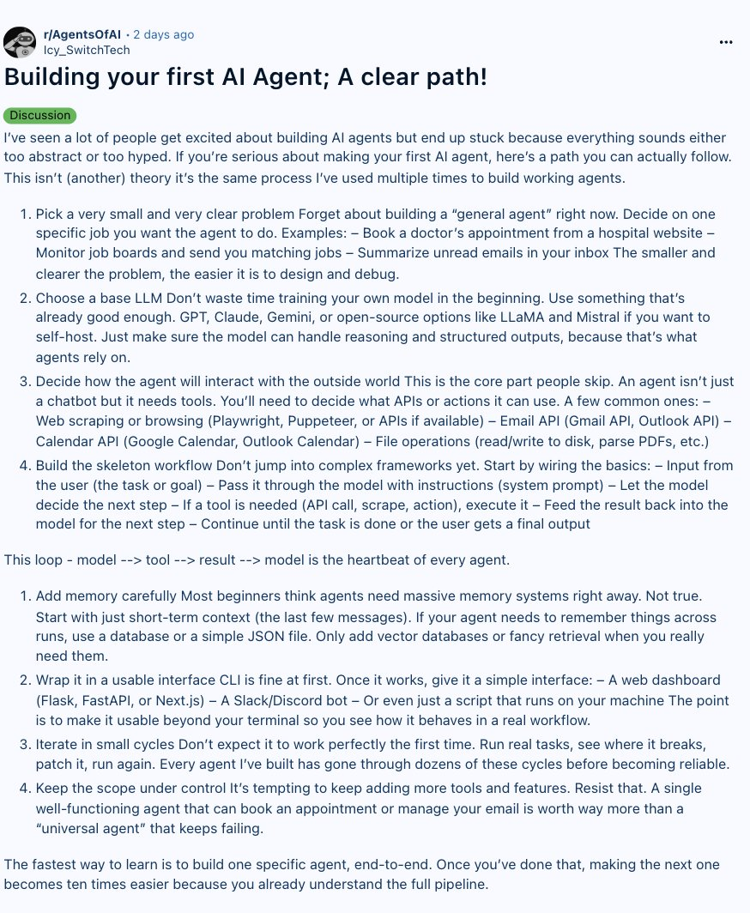

How to build your first AI agent (Full guide) 

## 💬 Replies

### 1 @kylem_org (KP)

*Sun Jun 14 06:22:34 +0000 2026*

Thats even too over complicated in the description also, I would say yes pick a core task, easy one, a daily briefing like the president gets. Get your own VPS, Hermes as the harness, pick a model, thats cost effective, for the task, co-write the system prompt with Claude, save your .md. Pick your channel/client appl layer telegram is super easy. 
Bash in from terminal on mac, basic.

### 2 @sairahul1 (Rahul) (Author)

*Sun Jun 14 06:24:06 +0000 2026*

@kylem\_org why VPS. you can even install hermes on your Mac and running local models using ollama too :)

### 3 @alphabatcher (Alpha Batcher)

*Sat Jun 13 07:51:19 +0000 2026*

@sairahul1 for newbies in AI this guide will be useful, agree

### 4 @Argona0x (Argona)

*Sat Jun 13 22:45:14 +0000 2026*

@sairahul1 instructions so clean even I can learn smth from here

bookmarked

### 5 @0xSlyth (0xSlyth)

*Sat Jun 13 10:10:34 +0000 2026*

@sairahul1 solid

### 6 @Shawn3253 (Daniel)

*Sat Jun 13 17:15:37 +0000 2026*

@sairahul1 The problem with this is the JARGON. It will always be the jargon. Do you know why Apple ecosystem works and exist? Do you understand why these three big brands, gpt, Gemini, Claude, exist the way they do? It’s simplistic in its jargon. Make AI jargon simple, change the world.

### 7 @pirsdegen (Pirs)

*Sun Jun 14 15:10:53 +0000 2026*

@sairahul1 missing 9th step: log everything from day 1. you'll spend more time debugging than writing, and without traces you're guessing why it looped 47 times

### 8 @RapidTraction (Rapid Traction)

*Sun Jun 14 00:53:34 +0000 2026*

@sairahul1 By the time anyone reads this they could have retard maxed on @Replit and be at an MVP.

### 9 @assyr1an (Anas Martirosian)

*Sat Jun 13 15:07:28 +0000 2026*

@sairahul1 Everyone's first agent is a prompt with extra steps.

### 10 @Jennyliu1306 (JennyLiu)

*Sat Jun 13 07:57:56 +0000 2026*

@sairahul1 already building mine and it just asked me for a coffee break this guide came right on time

### 11 @luxionce (kiyosaki)

*Sat Jun 13 09:33:00 +0000 2026*

@sairahul1 You exceeded your current quota, please check your plan and billing details. For more information on this error, read the docs: [platform.openai.com/docs/guides/er…](https://platform.openai.com/docs/guides/error-codes/api-errors).

### 12 @VirangJhaveri (Virang Jhaveri)

*Sun Jun 14 07:49:37 +0000 2026*

@sairahul1 The next step after your first agent works is knowing which runs are worth repeating.

 We track session -&gt; shipped output -&gt; real outcome.

  [github.com/Nimrobo/superd…](https://github.com/Nimrobo/superdense)

### 13 @RayK49585217053 (Agent Whiskey Tango Foxtrot)

*Sat Jun 13 14:55:51 +0000 2026*

@sairahul1 Been using Hermes for my agent fleet and it has been working great.  The one caveat is that it runs best on Linux (Ubuntu), but can be run on windows terminal using WSL.

### 14 @FarredWealth777 (Will Farred)

*Sun Jun 14 11:28:55 +0000 2026*

@sairahul1 Lovely Ai article

### 15 @daniel_samms (Daniel)

*Sat Jun 13 23:55:28 +0000 2026*

@sairahul1 the whole industry was selling you a loop with one step

