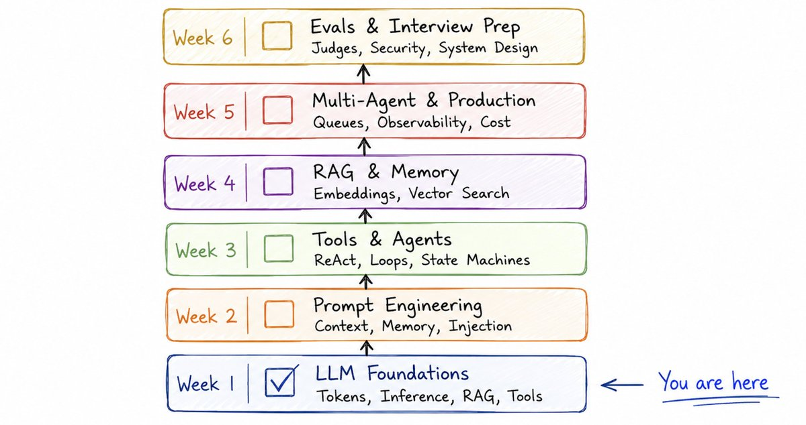
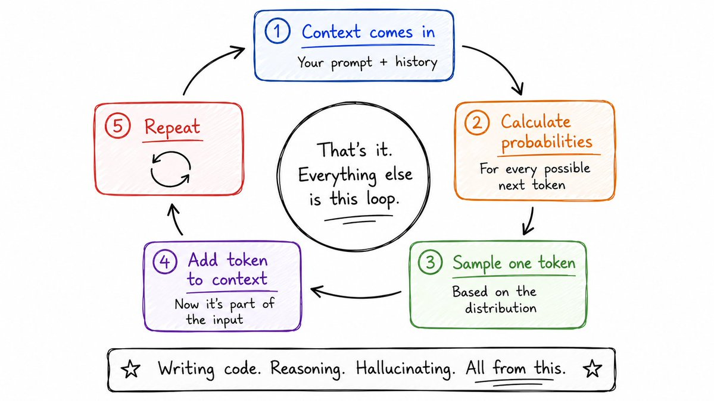
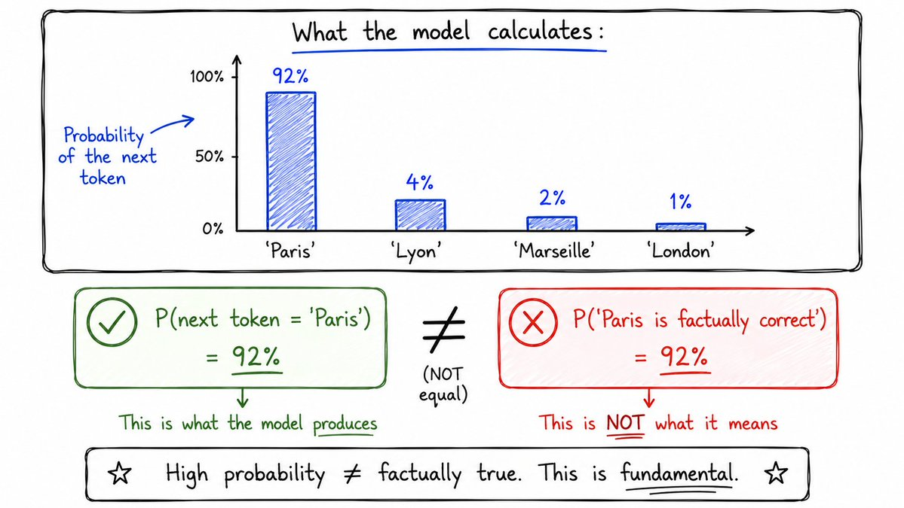
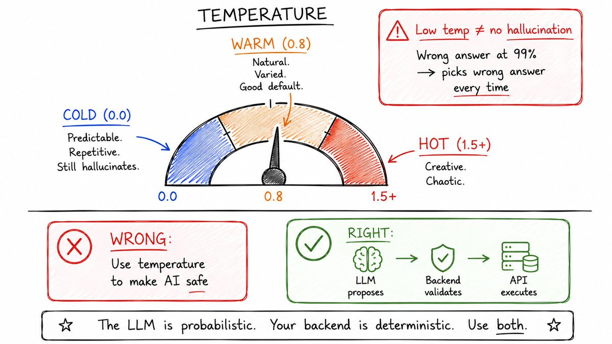
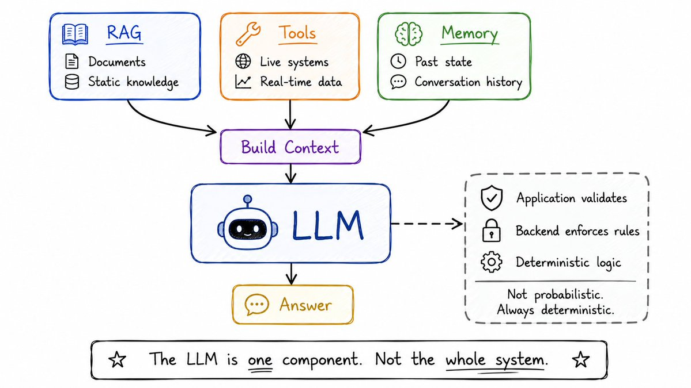
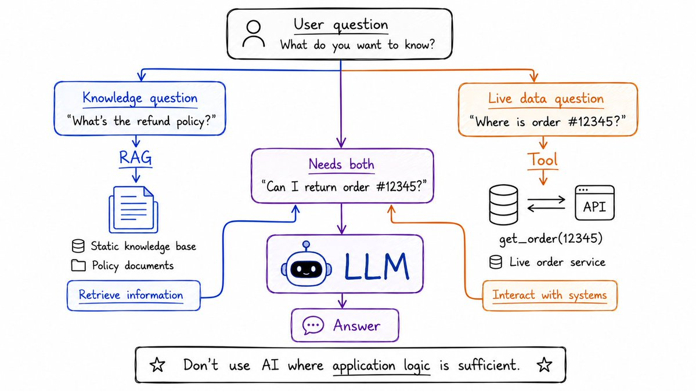
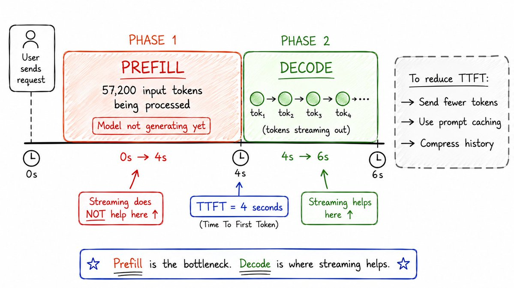
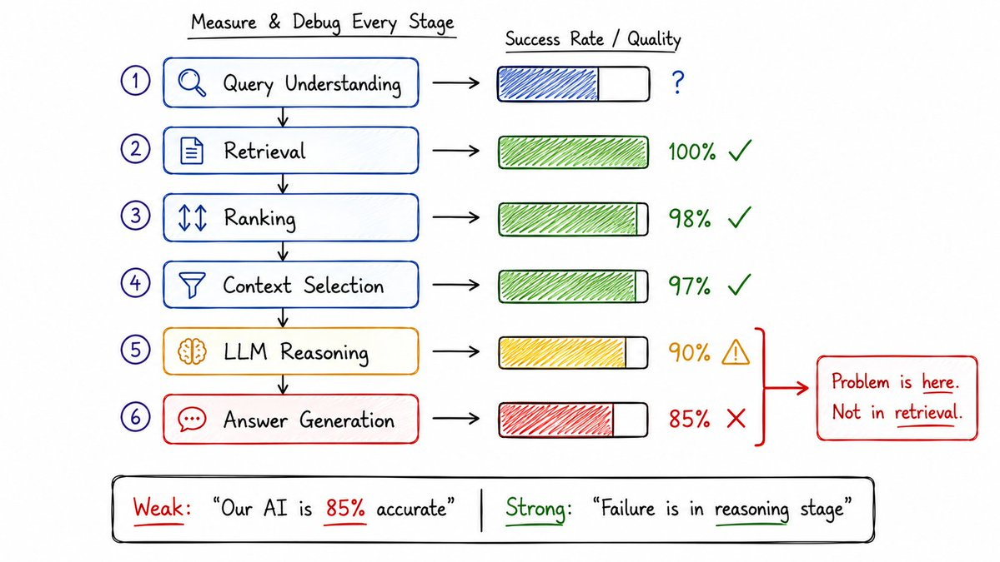
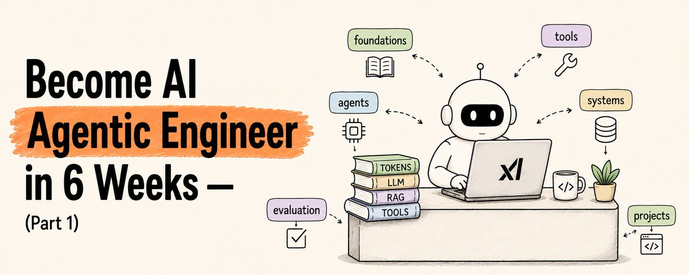

# 📰 Become AI Agentic Engineer in 6 Weeks (Full Course) - Part 1

Most developers learn AI by copying tutorials.

They install LangChain. They paste prompts. They build a chatbot.

Then they hit production and everything breaks.

The agent hallucinates. The context blows up. It costs 10x what they expected.

And they have no idea why.

Here is the truth.

AI engineering is not about knowing the frameworks.

It is about understanding what is actually happening inside the model — and building systems around that.

This is Part 1 of a 6-week series.

By the end of this part you will understand exactly how LLMs work under the hood: tokens, inference, temperature, hallucination, context, RAG, and tools.

Not the tutorial version. The version that makes you dangerous in interviews and production.

If you are a backend engineer: your distributed systems experience transfers directly. The new layer is LLMs + agent architecture + context engineering + evaluation.

Let's start from zero and build this properly.

---

## 6-week roadmap

Here is where we are going across the full series:

Week 1 — LLM Foundations (this article) 

Tokens, inference, temperature, hallucination, context windows, prefill, decode, TTFT, RAG, tools

Week 2 — Prompt & Context Engineering

System/user/tool messages, instruction hierarchy, dynamic prompts, prompt injection, context rot, memory

Week 3 — Tool Calling & Agent Architecture

Schemas, validation, execution loops, retries, parallel tools, the core agent loop, ReAct, state machines

Week 4 — RAG & Memory

Chunking, embeddings, vector search, hybrid retrieval, reranking, working/episodic/semantic memory

Week 5 — Multi-Agent Systems & Production

Supervisor/worker patterns, async execution, checkpoints, rate limits, observability, token budgets, cost controls

Week 6 — Evals, Security & Interview Prep

Golden datasets, LLM-as-judge, prompt injection, sandboxing, system design interviews, 3-4 real projects

The goal: be ready to interview for roles titled AI Engineer, Applied AI Engineer, Agent Engineer, and LLM Engineer.

Stronger than someone who just learned prompting. Agent systems involve distributed execution, APIs, concurrency, queues, and observability — all areas you already know deeply.

Now let's build the foundation.

---

## One thing to understand first

Everything in AI engineering flows from this.

An LLM does not search a database of facts.

It does not verify what it says.

It does not "know" things the way you know your name.

Here is what it actually does, step by step:

1\. You send text (the context)
2\. The model converts it to tokens
3\. For each token position, it calculates probabilities
   over the entire vocabulary
4\. It samples the next token from that distribution
5\. Adds it to the context
6\. Repeats until done

That is the entire mechanism.

Everything — writing code, answering questions, hallucinating, reasoning — comes from doing this repeatedly and well.

Once you truly internalize this, everything else makes sense.

---

## Tokens — what the model actually reads

The model never reads raw text.

It reads tokens.

\`\`\`plaintext
"Building an AI agent"

→ \["Build", "ing", "an", "AI", "agent"\]
→ \[4821, 513, 271, 37, 44\]
\`\`\`

Not always full words. Pieces of words. Each one gets a number ID.

Rule of thumb: 1 token ≈ 0.75 words

1,000 tokens ≈ 750 words 128,000 token context ≈ a full novel

Why not just use full words?

Language is messy. New words. Typos. Code. Mixed languages.

Tokens are fixed reusable building blocks. Even a word the model has never seen, it can understand by breaking it into familiar pieces.

The production implication:

You pay per token. Your latency scales with token count.

A 100,000 token input and a 1,000 token input are not the same request.

\`\`\`plaintext
Input tokens  → charged for processing
Output tokens → charged for generation (usually higher rate)
Total cost    → (input × input\_rate) + (output × output\_rate)
\`\`\`

Always count your tokens. Always.

---

What "92% probability" actually means

Suppose the model generates:

"The capital of France is Paris"

Behind the scenes, when it generated "Paris":

\`\`\`plaintext
Paris     → 92%
Lyon      → 4%
Marseille → 2%
London    → 1%
...       → 1%
\`\`\`

The model assigned 92% probability to "Paris" as the next token.

This does NOT mean:

P("Paris is factually correct") = 92%

Those are completely different statements.

Now imagine:

\`\`\`plaintext
User: "Dr. John Smith invented the HyperFlux battery in 2017.
       What university was he working at?"
\`\`\`

Dr. John Smith and HyperFlux battery are fictional. Made up.

But the model might generate:

"Stanford University"    → 78%

Because given that context, "Stanford" is a plausible continuation.

High token probability ≠ factually true.

This is the beginning of understanding hallucinations.

---

## Temperature — the creativity dial

Same prompt. Same model. Different answer every time.

How?

Sampling.

Suppose probabilities are:

\`\`\`plaintext
"good"        → 40%
"great"       → 30%
"interesting" → 15%
"useful"      → 10%
other         → 5%
\`\`\`

The model does not always pick "good."

It samples from that distribution like a weighted dice.

\`\`\`plaintext
Run 1 → "great"
Run 2 → "good"
Run 3 → "great"
Run 4 → "interesting"
\`\`\`

Temperature controls how that sampling works.

\`\`\`plaintext
Temperature = 0.0  → almost always picks the highest probability token
                      safe, predictable, repetitive

Temperature = 0.8  → natural variation, good default

Temperature = 1.5  → more creative, sometimes incoherent
\`\`\`

The production rule that matters:

Low temperature does NOT prevent hallucinations.

This trips up almost every beginner.

Imagine the model's distribution is:

> WRONG ANSWER   → 99%
CORRECT ANSWER → 1%

Set temperature to zero.

The model now confidently generates the wrong answer.

Every single time.

You haven't made it more truthful. You've made the hallucination more repeatable.

Write these three into your mental model right now:

\`\`\`plaintext
DETERMINISTIC  ≠  CORRECT
CONFIDENT      ≠  CORRECT
HIGH PROBABILITY  ≠  FACTUALLY TRUE
\`\`\`

The production implication:

For financial agents, for refund systems, for anything with real consequences:

\`\`\`plaintext
// DANGEROUS
temperature = 0  // this does NOT make it safe

// RIGHT
LLM proposes → { action: "refund", amount: 100 }
Backend validates:
  \- Is amount within permitted limits?
  \- Does user own this order?
  \- Has order already been refunded?
  \- Does policy permit refund?
Then: Payment API
\`\`\`

> Never ask a probabilistic model to be the sole enforcer of a deterministic business rule.

Your backend validates. The LLM proposes.

---

## Why LLMs hallucinate — the real reason

Hallucination is not a bug they forgot to fix.

It is a direct consequence of how LLMs work.

Imagine asking:

"What is the refund policy of RahulStore?"

RahulStore doesn't exist.

The model still has to produce probabilities.

Maybe its training contained millions of patterns like:

\`\`\`plaintext
"What is the refund policy?"
"Returns accepted within 30 days."
"30-day money-back guarantee."
"Items returnable within 30 days."
\`\`\`

So when it sees "RahulStore's refund policy is" — the continuation "30 days" looks extremely plausible.

The model has no step that says:

\`\`\`plaintext
Step 1: Does RahulStore exist?
Step 2: Do I have verified information?
Step 3: Check source.
Step 4: Answer only if verified.
\`\`\`

Its core process is still:

Given this context → what token comes next?

That is why hallucinations sound convincing.

The model is not lying. It is doing exactly what it was trained to do: produce plausible continuations.

Three categories of hallucination to know:

\`\`\`plaintext
1\. No information exists at all
   → RahulStore doesn't exist. Model invents.

2\. Information exists but is stale
   → Policy changed yesterday. Model answers from training.

3\. Information is provided but misread
   → Correct document in context. Model misunderstands it.
\`\`\`

All three happen in production. Each one needs a different fix.

Now ask yourself: if temperature = 0 and you ask the same question 100 times and get "30 days" every single time — does that make it factually correct?

No.

You have demonstrated consistency. Not correctness.

> Consistency ≠ correctness

This matters enormously when you build evals.

---

## The system that surrounds the LLM

Here is why RAG, tools, validators, and agent architectures exist.

The LLM's internal contract is:

\`\`\`go
func GenerateAnswer(context string) string
// core objective: produce a likely continuation
// NOT: return only verified facts
\`\`\`

Those are different contracts.

So we build systems around the LLM:

\`\`\`plaintext
                    USER
                      │
                      ↓
                 APPLICATION
                      │
          ┌───────────┼───────────┐
          ↓           ↓           ↓
        RAG         Tools       Memory
          │           │           │
          ↓           ↓           ↓
      Documents   Live systems  Past state
          │           │           │
          └───────────┼───────────┘
                      ↓
               Build context
                      ↓
                     LLM
                      ↓
             Generate tokens
                      ↓
                   Answer
\`\`\`

We are trying to harness a probabilistic generator while surrounding it with reliable software.

This is the core insight of AI engineering.

The LLM is one component. Not the whole system.

---

## RAG — why it exists and what it actually is

You have a customer support agent.

User asks:

"What is RahulStore's refund policy?"

Without grounding:

Model weights → learned patterns → "probably 30 days..."

With grounding (RAG):

\`\`\`plaintext
Application retrieves current policy document
     ↓
Policy: "Products may be returned within 14 days.
         Opened electronics cannot be returned."
     ↓
Passes it to LLM in context
     ↓
LLM answers using the supplied document
\`\`\`

RAG stands for Retrieval-Augmented Generation.

Break it apart:

> R = Retrieve relevant information
A = Augment the LLM's context with it
G = Generate an answer using that context

That is it at the highest level.

Common mistake:

People say "we'll store it in RAG."

RAG is not a database. RAG is a pattern.

You might retrieve from: SQL, Elasticsearch, a vector database, a knowledge graph, an API — then provide that to the model.

The most important thing RAG does NOT do:

It does not eliminate hallucination.

Even when retrieval is perfect:

\`\`\`plaintext
Question
   ↓
Retriever
   ↓
CORRECT DOCUMENT ✓
   ↓
LLM
   ↓
Answer could still be wrong
\`\`\`

Because the model can still:

- Overlook a condition in the document

- Combine two facts incorrectly

- Ignore an exception it missed

- Follow a prior learned pattern instead of the document

Suppose the policy says:

"Opened electronics cannot be returned."

User asks: "Can I return my opened laptop?"

The model might still answer "Yes" because it is within the 14-day window.

It overlooked the exception.

This is a reasoning failure. Not a retrieval failure.

You need to be able to tell the difference.

Correct retrieval ≠ correct answer

---

## RAG vs Tools — when to use which

Two different questions. Two different architectures.

\`\`\`plaintext
Question: "What is the refund policy?"
     ↓
RAG — retrieve knowledge
     ↓
Static knowledge base, policy documents
\`\`\`

\`\`\`plaintext
Question: "Where is order #12345 right now?"
     ↓
Tool call — get live data
     ↓
get\_order(12345) → Order service → DB
\`\`\`

Very roughly:

> RAG    → retrieve knowledge/information
TOOLS  → interact with systems, fetch live data, perform actions

Now what about: "Can I return order #12345?"

That requires BOTH:

\`\`\`plaintext
            User question
                  ↓
       ┌──────────┴──────────┐
       ↓                     ↓
get\_order(12345)    retrieve\_policy()
       │                     │
       ↓                     ↓
Order: laptop,        Policy: 14 days,
opened, 5 days ago    opened electronics: NO
       │                     │
       └──────────┬──────────┘
                  ↓
                 LLM
                  ↓
           "No. Opened electronics
            cannot be returned."
\`\`\`

Design rule you should remember:

If you have two predictable dependencies, backend orchestration can handle it deterministically.

Only use an LLM planner when there are many possible tool combinations and the sequence is truly dynamic.

Don't use AI where application logic is sufficient.

---

## Context windows — the working memory

The context window is the maximum amount of text the model can process in one request.

\`\`\`plaintext
128,000 token context window = model's working space

System instructions     →  2,000 tokens
Tool definitions        →  5,000 tokens
Conversation history    → 30,000 tokens
Retrieved documents     → 60,000 tokens
User question           →    200 tokens
─────────────────────────────────────────
Total input             → 97,200 tokens
\`\`\`

The beginner mistake:

Huge context window = send everything

No.

Imagine asking a developer: "what's the race condition in this 20-line function?"

But instead of 20 lines you hand them: the entire Linux kernel + your company's monorepo + the 20-line function.

The answer might technically be in there. But finding it is much harder.

LLMs have the same problem.

More context has three real costs:

\`\`\`plaintext
1\. Cost
   Providers charge per token.
   100,000 input tokens ≠ 2,000 input tokens in price.

2\. Latency
   The model processes all input before generating the first output token.
   Bigger input → longer wait before first response.

3\. Quality
   More irrelevant context → harder to find what matters
   → worse answer quality
\`\`\`

Context engineering is not "send more."

It is "send the right information."

---

## Prefill, Decode, and TTFT

Suppose you send 57,200 input tokens and need 300 output tokens.

There are two distinct phases.

Phase 1 — Prefill:

\`\`\`plaintext
57,200 input tokens
         ↓
      MODEL processes input
         ↓
(model is NOT generating output yet)
\`\`\`

The model processes your entire input before it generates the first output token.

This is called Prefill.

Phase 2 — Decode:

\`\`\`plaintext
Output token 1  → sent to user
Output token 2  → sent to user
Output token 3  → sent to user
...
Output token 300 → sent to user
\`\`\`

Generating the output one token at a time. This is called Decode.

TTFT = Time To First Token

\`\`\`plaintext
User presses Send at:   12:00:00
First token appears at: 12:00:04

TTFT = 4 seconds
\`\`\`

This is the time the user sits waiting before anything appears.

A huge input dramatically increases TTFT because of prefill.

Streaming:

Without streaming:

\`\`\`plaintext
Generate all 300 tokens → then send everything at once
User waits the whole time
\`\`\`

With streaming:

\`\`\`plaintext
Token 1 → user sees it
Token 2 → user sees it
...
\`\`\`

User sees output as it generates.

Critical point:

Streaming does NOT reduce TTFT.

If prefill takes 4 seconds, streaming does not change that.

\`\`\`plaintext
4 sec prefill (streaming can't help here)
     ↓
first token (now streaming helps)
     ↓
tokens flow to user as they generate
\`\`\`

Streaming reduces perceived latency of the decode phase.

It does not speed up prefill.

If you need to reduce TTFT in production:

\`\`\`plaintext
1\. Reduce input tokens (most impactful)
   → Better retrieval: relevant section, not whole document
   → Compress conversation history
   → Trim tool definitions

2\. Prompt caching (prefix caching)
   → Cache the static part of input
   → Provider doesn't reprocess unchanged prefix

3\. Smaller/faster model for time-sensitive tasks

4\. Parallel prefill across providers
\`\`\`

---

## How to debug a broken AI pipeline

This is the production thinking that separates engineers from tutorial-followers.

Suppose your customer support agent answers correctly only 85% of the time.

The weak diagnosis:

"Our AI accuracy is 85%."

The strong engineering diagnosis:

\`\`\`plaintext
Retrieval recall                →  100% ✓
Correct doc ranked #1           →   98% ✓
Context actually included       →   97% ✓
LLM reasoning correctly         →   90%
Correct final output            →   85%

→ Problem is in the reasoning stage, not retrieval
→ Investigate: prompt construction, context ordering,
  conflicting history, model misunderstanding
\`\`\`

Break every AI pipeline into measurable stages.

Then you know exactly where to investigate.

\`\`\`plaintext
Question
   ↓
Query understanding    ← failure?
   ↓
Retrieval              ← failure?
   ↓
Ranking                ← failure?
   ↓
Context selection      ← failure?
   ↓
LLM reasoning          ← failure?
   ↓
Answer generation      ← failure?
\`\`\`

"Our RAG is bad" is not an engineering diagnosis.

"Our retrieval recall is 96% but answer accuracy is 68%, so the failure is in reasoning or context construction" is an engineering diagnosis.

We will build evals for every stage in Week 6.

---

What you know now

You started this article without a mental model.

You now have one:

\`\`\`plaintext
TOKENS
Text → pieces → numbers → model reads numbers

INFERENCE
Context → probability distribution → sample next token → repeat

TEMPERATURE
Controls sampling → low = consistent, not correct → high = varied
Deterministic ≠ Correct

HALLUCINATION
Model produces plausible continuations, not verified facts
Three kinds: no info, stale info, present info misread
High confidence ≠ High accuracy

CONTEXT WINDOW
Model's working memory for the request
More ≠ better → costs money, adds latency, hurts quality

GROUNDING / RAG
Give model current information instead of relying on training
Retrieve → Augment context → Generate
RAG reduces hallucination, does not eliminate it

TOOLS
Interact with live systems, not static documents
get\_order() ≠ search policy documents

PREFILL + DECODE + TTFT
Prefill = processing input
Decode = generating output
TTFT = time to first token
Streaming helps decode, not prefill

LLM IS ONE COMPONENT
Not the whole system
Surround it with retrieval, tools, validation, deterministic logic
\`\`\`

This is the foundation everything else is built on.

---

Practice questions before Part 2

These are the kind of questions you will get in interviews.

Work through them before the next part.

Q1 — Production hallucination

Your agent has 100% retrieval accuracy but 85% answer accuracy.

Walk through every stage of the pipeline and identify where the failure might be. What would you measure first?

Q2 — Context cost calculation

Your support agent sends: 2,000 token system prompt + 5,000 token tool definitions + 30,000 token conversation history + 60,000 token documents + 200 token question = 97,200 tokens per request.

You are handling 10,000 requests per day. Input tokens cost $0.003/1K.

What is your daily input cost? What are the top 3 things you would cut first?

Q3 — Architecture decision

User asks: "Can I return order #12345?"

Design the full flow. What do you call, in what order, and why? What does the LLM receive? What does the backend validate?

Q4 — Temperature in production

Your teammate says: "Let's set temperature to 0 for our financial agent so it never hallucinates."

How would you respond? What is the right architecture?

Q5 — TTFT problem

Your agent has a TTFT of 8 seconds. Users are complaining. The required target is under 2 seconds.

You have 57,200 input tokens. Walk through your investigation. What do you check first?

---

Part 2 is coming

Next: Prompt & Context Engineering.

System messages, user messages, tool messages, instruction hierarchy, context construction, dynamic prompts, prompt injection, context rot, compaction, handoffs, memory.

The stuff that determines whether your agent actually follows instructions in production or does whatever it wants.

---

If this was useful:

→ Repost to share it with every developer learning AI engineering 

→ Follow @sairahul1 for Part 2 and the rest of the series 

→ Bookmark this — the mental model at the end is the reference you will come back to

I write about AI, building products, and systems that work while you sleep.

### 🖼️ Attached Media

## 💬 Replies

### 1 @Av1dlive (Avid)

*Sun Aug 30 11:30:59 +0000 2026*

@sairahul1 This is a nice course, Rahul.

### 2 @sairahul1 (Rahul) (Author)

*Sun Aug 30 11:31:25 +0000 2026*

@Av1dlive more coming soon

### 3 @KijAkubovs86334 (masYNYa)

*Sun Aug 30 09:20:28 +0000 2026*

@sairahul1 this sounds like a massive level up for builders honestly.

### 4 @sairahul1 (Rahul) (Author)

*Sun Aug 30 09:40:30 +0000 2026*

@KijAkubovs86334 Thanks. That's why wrote detailed and multiple articles soon

### 5 @mikeymicmike (Michael T.)

*Sun Aug 30 22:50:30 +0000 2026*

@sairahul1 @grok is this an AI generated article? Any original thought?

### 6 @TheWhizzAI (The Whizz AI)

*Sun Aug 30 09:10:25 +0000 2026*

@sairahul1 i have deeply read your article today\_:)

### 7 @andra_volya (volya 將要)

*Sun Aug 30 20:55:07 +0000 2026*

@sairahul1 doesn't good prompting still matter in production?

### 8 @FReza1984 (Fajar M Reza)

*Sun Aug 30 09:31:09 +0000 2026*

@sairahul1 Production agents expose orchestration, evaluation, and context engineering as first-class engineering disciplines.

### 9 @TareqLLM (Tareq)

*Sun Aug 30 10:35:57 +0000 2026*

@sairahul1 the eval that costs me is the did-it-really-say-that one, not the orchestration. my checker sent back two items today, both kept only because the word real estate was in the news, and that word was all the evidence there was.

### 10 @0xlexlab (LEX)

*Tue Sep 01 17:13:00 +0000 2026*

@sairahul1 Shannon proved in 1948 that a channel can transmit signal perfectly and still carry nonsense. Every AI engineer relearns it the hard way. Consistency has never been the same thing as truth.

### 11 @heybraza_x (braza)

*Mon Aug 31 07:03:13 +0000 2026*

@sairahul1 nah "you don't need another course" then linking a course is 141k people watching orchestration, not doing it 💀

### 12 @arcyton (Adam · Arcyton)

*Mon Aug 31 01:23:01 +0000 2026*

@sairahul1 Agreed on the frameworks point. The skill that transfers is not LangChain, it is writing an eval before writing a prompt — deciding what correct means for your case, then measuring against it.

What do you have beginners build first?

### 13 @tonytonggg (Tony Tong | Founder | Ancient Systems x AI)

*Mon Aug 31 12:59:50 +0000 2026*

@sairahul1 Orchestration and evals matter, but so does the boring stuff no course covers.

I once pointed Claude Code at [Z.ai](https://Z.ai)'s compatible endpoint and watched every prompt bounce back as Interrupted, most likely a GLM model name the compatibility layer didn't recognize.

### 14 @daddy_sarah (Sarah rocha)

*Tue Sep 01 22:19:15 +0000 2026*

@sairahul1 说到点子上了 搞AI不能光会写prompt 得懂整个链路 这门课我看了几集 讲得很实操 比那些水课实在

### 15 @opcodeoperator (Opcode Operator)

*Mon Aug 31 06:51:36 +0000 2026*

@sairahul1 Yes. Prompt tricks are not the missing layer. Production work needs state, evaluation, and memory that survive the session. Human direction still sets the purpose. The system should carry the project forward, not restart it.

### 16 @AYarbaga24235 (Fernandez Calvin)

*Mon Aug 31 00:02:25 +0000 2026*

@sairahul1 A mature approach to cybersecurity balances technical performance with ethical considerations in emerging economies.

### 17 @TalhiFateh26396 (Talhi Fateh)

*Sun Aug 30 16:45:12 +0000 2026*

@sairahul1 Evaluating digital privacy requires comparing it with alternative approaches under realistic constraints from a systems engineering perspective.

