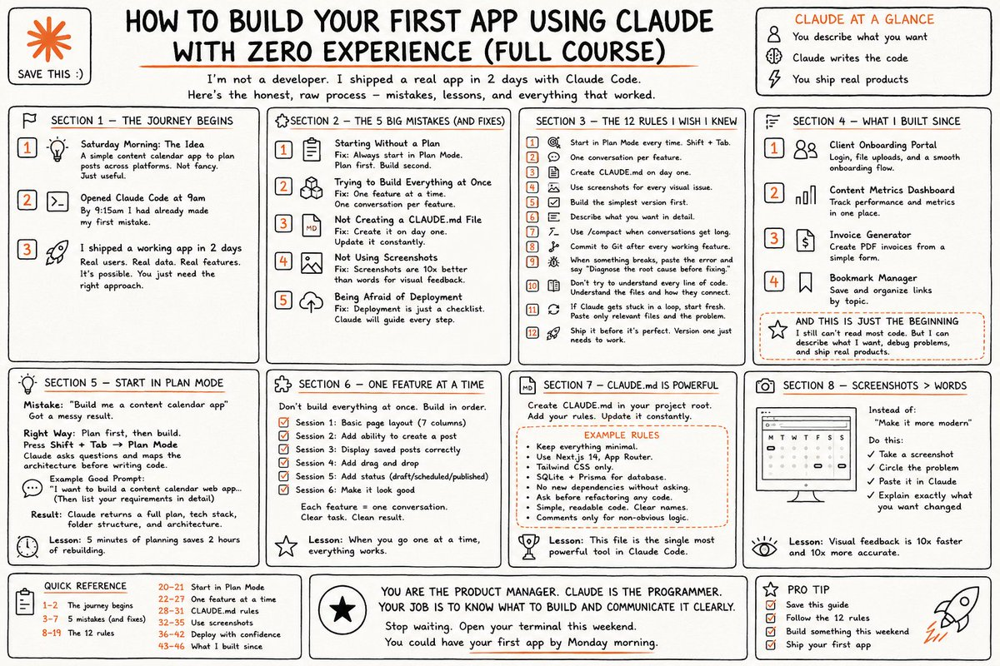

this is f\*cking gold  

the Claude setup most people will never find on their own  

if I had this a year ago, I would've shipped my first app in a day instead of 3 weeks.

in the right hands, this changes everything: 

## 💬 Replies

### 1 @eng_khairallah1 (Khairallah AL-Awady)

*Mon Jun 08 19:17:06 +0000 2026*

@sairahul1 thank you for sharing my legend

### 2 @RainforestKid69 (Rainforest Baby)

*Tue Jun 09 11:16:50 +0000 2026*

@sairahul1 No tests, no security audit. Cool story, bro! 😂

### 3 @sairahul1 (Rahul) (Author)

*Tue Jun 09 11:26:52 +0000 2026*

@RainforestKid69 It's definitely a MVP 😅

### 4 @HarryTandy (Harry Tandy)

*Tue Jun 09 13:24:11 +0000 2026*

@sairahul1 shipping apps in hours always adds massive technical debt

### 5 @josesilesdata (José Siles | AI | Data)

*Tue Jun 09 09:01:13 +0000 2026*

@sairahul1 Un curso completo para no desarrolladores que terminan con una app real en 2 días con Claude. Esto democratiza el desarrollo de software por completo.

### 6 @immaxkent (immaxkent)

*Tue Jun 09 09:00:29 +0000 2026*

@sairahul1 Sounds like most people writing code with Claude have never worked in software before 🥶

### 7 @PropheticAbyss (Angel Paws)

*Tue Jun 09 23:36:07 +0000 2026*

@sairahul1 Most people’s le don’t want to work in software they just want to make things that work.😎

### 8 @An_yhl (晚晚)

*Tue Jun 09 00:30:59 +0000 2026*

@sairahul1 这种配置确实省掉很多摸索成本

### 9 @Jagadeeshveera (Jagadeesh Veeraraghavan)

*Wed Jun 10 06:52:14 +0000 2026*

@sairahul1 “@threadreaderapp unroll”

### 10 @imanpyudha (TTD 🇮🇩)

*Tue Jun 09 13:51:56 +0000 2026*

@sairahul1 Agreed

### 11 @LocaleNet (Locale Network 🏡)

*Mon Jun 08 19:14:16 +0000 2026*

@sairahul1 Lowkey wish this dropped when I started messing with apps.

### 12 @quroolarc (qurool)

*Mon Jun 08 19:56:07 +0000 2026*

@sairahul1 thx for sharing

### 13 @editxshub (Shubham Sharma | AI & Tech)

*Tue Jun 09 14:11:58 +0000 2026*

@sairahul1 Sounds like most people writing code with Claude have never worked in software before 🥶

### 14 @PengSharw9966 (sharw peng)

*Tue Jun 09 07:31:32 +0000 2026*

@sairahul1 Are there any tech experts here? You're welcome to join!
[t.me/AT9966s](http://t.me/AT9966s)

### 15 @grumpusmax1979 (GrumpusMaximus)

*Wed Jun 10 13:18:19 +0000 2026*

@sairahul1 Because App Stores are full of enough shite...

