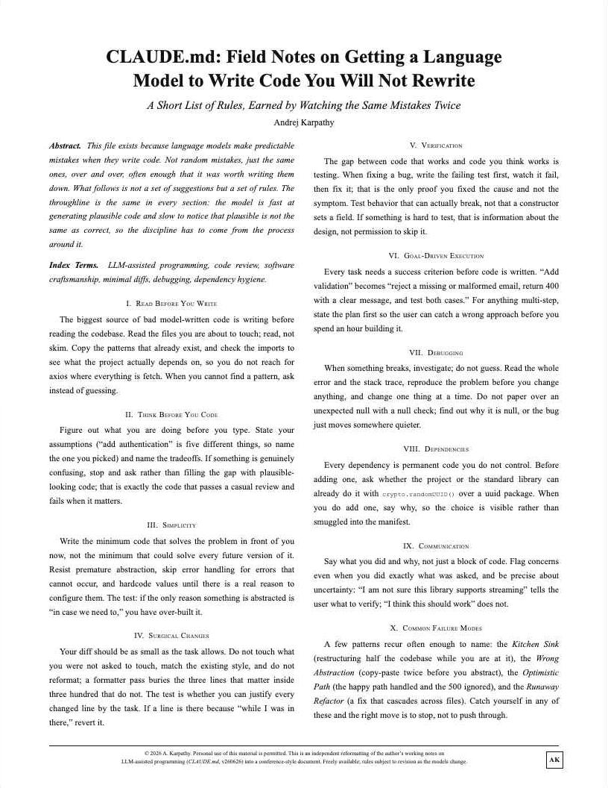
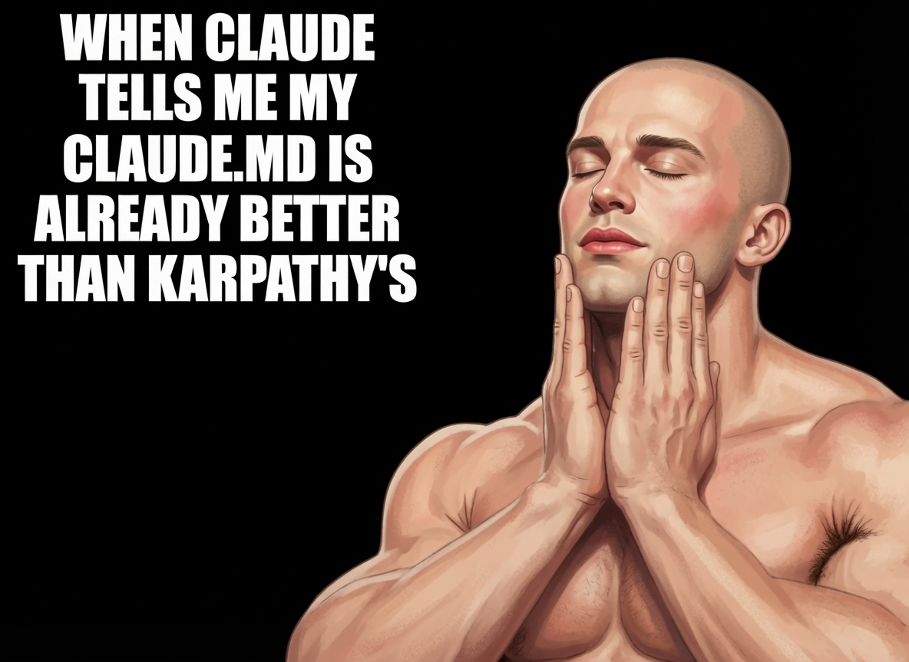

Andrej Karpathy joined Anthropic five weeks ago.

Yesterday my friend on his team sent me the Claude.md file he actually uses.

It completely changed how I work with Claude.
From the very first message, the difference was obvious.

With this file, Claude finally stops fighting me and starts working exactly the way I need it to.

Bookmark it before it gets taken down.

Read it now, then check the article below.

### 🖼️ Attached Media

## 💬 Replies

### 1 @Raytar (Raytar) (Author)

*Fri Jun 26 18:41:14 +0000 2026*

[drive.google.com/file/d/1mtJKbu…](https://drive.google.com/file/d/1mtJKbu-QRk62WTWkyc0M0pGXbKzisA5W/view?usp=sharing)

### 2 @Blum_OG (Blum)

*Sat Jun 27 10:03:30 +0000 2026*

@Raytar bookmarked. thanks for sharing this

### 3 @undefinedKi (Yarchi)

*Fri Jun 26 21:07:34 +0000 2026*

@Raytar a good claude.md genuinely changes how Claude behaves

### 4 @Dipanshu_AI (Dipanshu Kushwaha)

*Sat Jun 27 10:22:28 +0000 2026*

@Raytar That Claude.md file sounds like a game-changer. Glad you found something that works so well!

### 5 @Crypto_Briefing (Crypto Briefing)

*Tue Jun 30 19:03:09 +0000 2026*

@Raytar [x.com/Crypto\_Briefin…](https://x.com/Crypto_Briefing/status/2072006937240314278)

### 6 @Heyheathbar (Heath Lehman)

*Sat Jun 27 01:09:51 +0000 2026*

@Raytar @grok what is your opinion on the truthfulness of this post?

### 7 @ChrisOnCode (Christoph)

*Fri Jun 26 23:49:28 +0000 2026*

@Raytar I doubt this is his lmao that .md is eating so many tokens to be loaded at every reply cmon mannnn

### 8 @miketoles (ParkingLotRanger)

*Sat Jun 27 01:48:31 +0000 2026*

@Raytar 

### 9 @Truntr_ (Truntr)

*Sat Jun 27 16:30:45 +0000 2026*

Karpathy did not join Anthropic.
He left OpenAI in February 2024, founded Eureka Labs in July 2024 (his AI education startup), and has been running it since. Public knowledge, verifiable in 30 seconds.
"Friend on his Anthropic team sent me his CLAUDE.md" - the team doesn't exist. The document might be real Karpathy writing from elsewhere, or AI-generated in his style, but the attribution to "his Anthropic CLAUDE.md" is invented.
"Bookmark before it gets taken down" is the urgency mechanism that closes the loop. Standard grift template.

### 10 @Gyome1_ (Gyomei)

*Fri Jun 26 19:01:41 +0000 2026*

@Raytar The "Claude finally stops fighting me" part hit different. Saving this

### 11 @vliegendvis (Chris)

*Fri Jun 26 21:08:46 +0000 2026*

@Raytar TLDR; use /goal like you could do for months already in Codex

### 12 @KaiTrader87 (Kainoa)

*Fri Jun 26 21:54:10 +0000 2026*

@Raytar Want one you can actually implement this weekend? 
[payhip.com/b/ZutWd](https://payhip.com/b/ZutWd)

### 13 @ai_studioxyz (AI Studio)

*Sat Jun 27 12:04:38 +0000 2026*

@Raytar md funktioniert, weil eine Person sie schreibt. Im Mittelstand haben zehn Abteilungen zehn Versionen. Wer entscheidet, was produktiv geht? Oft niemand.

### 14 @aiseomastery (AI Mastery Guide)

*Fri Jun 26 22:32:00 +0000 2026*

@Raytar That CLAUDE.md file completely changing how Claude responds from the very first message is exactly the kind of detail that makes a setup worth sharing

### 15 @a1exstone (Alex Stone)

*Fri Jun 26 21:19:52 +0000 2026*

@Raytar Worth reading for the structure, not as a copy-paste. The best CLAUDE.md is always the one tuned to your own stack and style.

### 16 @sakura_shib ((っ◔◡◔)っ ♥ sakura ♥)

*Sat Jun 27 14:05:37 +0000 2026*

@Raytar so karpathy's actual CLAUDE.md file leaked, read before write, think before code, surgical changes, verify with tests, fail loud. a dude still fighting claude to do what he wants just realized he's been missing the instruction manual the whole time

### 17 @german_gamarra (german gamarra)

*Sat Jun 27 19:38:27 +0000 2026*

@Raytar Is interesting that with some previous models, this was not needed. Claude 4.8 is a regression. Honestly. Do we need to explain these basics things, when we didn't need to do it with previous models? For instance, with chat gpt, that I was not using up until now, I don't need to

### 18 @_Suresh2 (Suresh)

*Sat Jun 27 07:02:05 +0000 2026*

@Raytar i'd worry it stops fighting even when i'm actually wrong, sometimes the pushback is the signal

### 19 @saint_jamesux (Saint Jamesux)

*Sat Jun 27 13:52:53 +0000 2026*

Appreciate the share, but the “my friend on his team sent me the file he actually uses” framing is pretty clearly engagement bait. Karpathy joining Anthropic is real, but this specific CLAUDE.md has been floating around in various forms for months it’s mostly a polished version of observations he’s already shared publicly.
That said, the content itself is genuinely good. The rules around reading first, making surgical changes, stating assumptions, and defining success criteria upfront are exactly what stops Claude from fighting you on real projects.
The real move isn’t bookmarking this one though. Take the principles, then write your own version tailored specifically to your codebase and preferences. That’s where it actually sticks.

### 20 @limalemonnn (Lima)

*Sat Jun 27 15:48:00 +0000 2026*

@Raytar is there a public announcement on Karpathy joining Anthropic? haven't seen one. "my friend on his team" is doing a lot of work in that opener.

### 21 @yurshevv (yurshev)

*Fri Jun 26 22:13:18 +0000 2026*

@Raytar instant bookmark. karpathy's setup is always different level

### 22 @Primee32 (Primee32)

*Fri Jun 26 21:46:52 +0000 2026*

@Raytar karpathy's actual claude.md file. not a tutorial about it. the file itself. bookmarked immediately

### 23 @magicfitai (Magicfit)

*Sat Jun 27 12:01:56 +0000 2026*

@Raytar smells like engagement bait

### 24 @raidenfomo (raiden)

*Fri Jun 26 22:16:10 +0000 2026*

@Raytar fire, thanks for this insane share

### 25 @panegains (Panegains)

*Sat Jun 27 11:09:09 +0000 2026*

@Raytar If claude.md was truly that useful 👀claude just forgets about it after a while

### 26 @nthfuture_x (NTH Future)

*Sat Jun 27 00:25:35 +0000 2026*

@Raytar Having Claude.md is essential for us. It solves almost all of our current tasks.

### 27 @CopperForgeAI (铜匠AI・十点睡觉)

*Sun Jun 28 12:55:08 +0000 2026*

@Raytar [x.com/smithandai/sta…](https://x.com/smithandai/status/2071215665005170765?s=20)

### 28 @timelessdev (Jacek (Jomsborg.eth))

*Sun Jun 28 13:09:06 +0000 2026*

@Raytar Bullshit

### 29 @prashantXmode (prashant)

*Sat Jun 27 09:15:38 +0000 2026*

@Raytar what do you think @grok

### 30 @MagnetGP (Ghost)

*Fri Jun 26 23:27:43 +0000 2026*

@Raytar So funny he has to micromanaged Claude like a junior intern with heavy prompting.

### 31 @i_am_mikami2025 (御上さくら🌸(みかみさくら))

*Sun Jun 28 17:21:04 +0000 2026*

@Raytar @grok 
このポストだけど、「Andrej Karpathyは5週間前にAnthropicに加わりました。」以外は全部デマじゃない？

ファクトチェックしてください。

### 32 @itsadamko (adamko)

*Tue Jun 30 05:45:08 +0000 2026*

@Raytar you are annoying

### 33 @KeisukeIshikawa (Keisuke)

*Sat Jun 27 11:02:30 +0000 2026*

@Raytar [x.com/KeisukeIshikaw…](https://x.com/KeisukeIshikawa/status/2070815605570076693)

### 34 @pomiderix (pomider)

*Fri Jun 26 22:39:00 +0000 2026*

@Raytar Sometimes the smallest files have the biggest impact

### 35 @alcrapy (Andrii)

*Fri Jun 26 20:58:32 +0000 2026*

@Raytar Please note that right now you of course have ability to use inf loops. But take a look that you need but a DGX stand just to serve only 128 of them. Right now subscriptions are cheap, but it won’t stay for all time

### 36 @babaliauskas (Lukas)

*Sat Aug 22 23:41:18 +0000 2026*

@Raytar A versioned prompt file makes migration comparisons much easier: keep the source prompt, target prompt, and expected output contract together. EvalShift can help surface regressions when either prompt or model changes.

