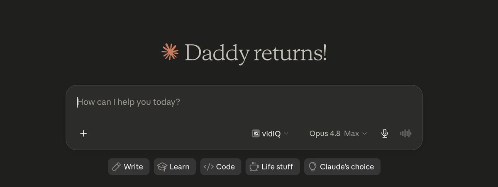
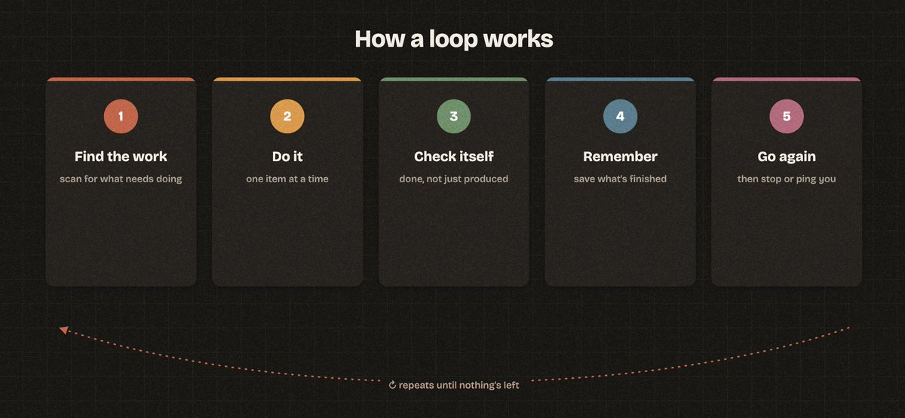
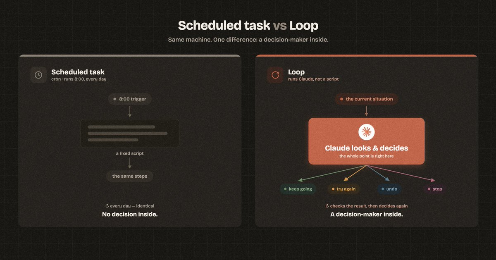
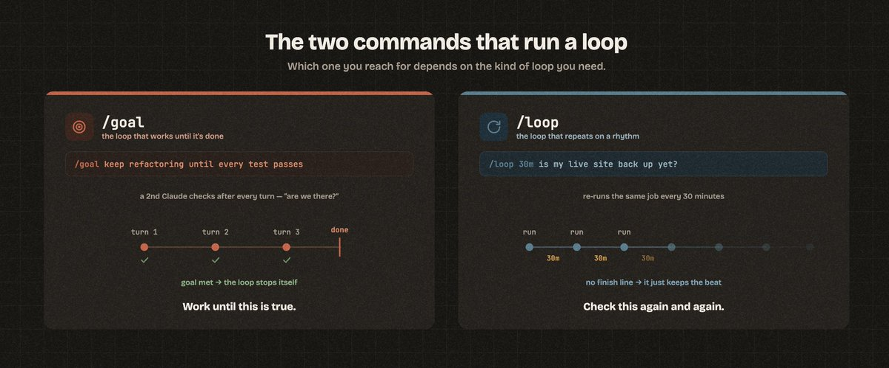
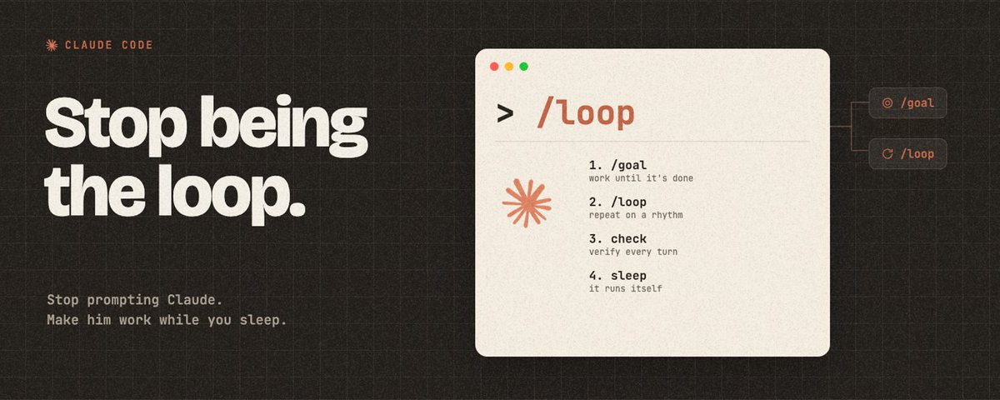

# 📰 Stop Being the Loop. Here's How to Make Claude Work While You Sleep.

The person who built Claude Code at Anthropic stopped prompting Claude.

[Embedded Tweet: https://x.com/i/status/2064885111477219664]

His name is Boris Cherny. In June 2026 he said it out loud: "I don't prompt Claude anymore."

Loops prompt Claude for him. His actual job now is writing loops.

That sounds like a flex. But no. It's the biggest shift in how people use Claude and ChatGPT right now. You've probably heard the phrase. Almost nobody does it yet.

Here is how you work right now.

- You type a prompt. 

- Claude edits a file. 

- You run the test. 

- It breaks. 

- You paste the error back. 

- It tries again. 

Twenty minutes later you realize you've been babysitting the exact thing you wanted to hand off.

You are the loop. You're the one checking the work and deciding the next step, every single time. That is the job a loop takes over.

## One example shows the whole difference

Ask Claude to write you a one page brief on any topic. Simple task. It writes something clean and confident, with sources at the bottom.

Now read the sources. Some of them are fake(!!!). Claude made them up and has no idea it did. They look real. The links go nowhere, or they go somewhere that doesn't say what Claude claimed. This is the quiet way Claude burns you, and a single prompt can never catch it, because Claude stays confident it's right until something opens the link.

Now run it as a loop instead. Same brief, but you add a bar it can measure: 

> every claim needs at least three sources, and every link has to open to a real page that backs up the claim.

Watch what happens. Claude writes the brief, then goes link by link. It opens each one. It throws out the dead ones and the fake ones. It finds real replacements. It keeps checking until every single source on the page is something you can open. Then it stops.

It never gets bored. It never skips the boring ones.

Here's how you'd write that in Claude Code. Don't worry about the command yet, I break it down below:

\`\`\`plaintext
/goal write a one page brief on \[your topic\]
where every claim has at least three sources and
every link opens to a real page that supports the claim. 

Open each link to confirm it before you call it done.

Replace any source that is dead or does not back up the claim.

Stop only when every source on the page checks out.
\`\`\`

# What a loop is

A loop is a small system that prompts Claude for you, over and over, until a job is done.

Every loop, no matter how fancy, is the same five beats:

1. Find the work. Open tasks, failing tests, unread emails, files in a folder.

1. Do it. Claude handles one item at a time, like you would by hand.

1. Check itself. A second pass confirms the work is done and correct, not just produced.

1. Remember. It writes down what's finished, so it never repeats work or loses its place.

1. Go again. It repeats until nothing's left, then stops or pings you.

One line to keep: prompting is doing the work. Loop engineering is managing the worker.

## "Isn't this just a scheduled task?"

Good question. No.

You can already make your computer run the same thing every morning at 8am. That's a cron job. It's older than most of us. It runs a fixed script. Same steps, every time, no thinking.

A loop is different because of one thing: there's a decision-maker inside it.

A cron job runs a script. A loop runs Claude. Claude looks at the current situation, picks the next action, does it, checks the result, and then decides what to do next. Keep going. Try again. Undo. Stop.

That decision in the middle is the entire point. A script can't look at a broken test and figure out a different fix. Claude can. This only became possible once Claude and ChatGPT got good enough to make real judgment calls mid-job.

## The two commands that run a loop

Here's where most people go wrong. You don't build a loop by typing "do this in a loop" into a normal chat. Claude Code has two commands built in, and which one you reach for depends on the kind of loop you need.

1\. /goal is the loop that works until it's done.

[Embedded Tweet: https://x.com/i/status/2065192057535373473]

But obviously not that kind of goal. xD

You saw /goal up in the brief example. You type it, then describe what "done" looks like. Claude keeps working, turn after turn, on its own. After every turn, a second copy of Claude quietly checks: are we at the goal yet? If not, it tells the first one why, and the work continues. The moment the goal is met, the loop stops by itself.

That self-check after every turn is the whole difference between a real loop and a prompt that runs once and hopes.

Use /goal when there's a finish line. Work until this is true.

2\. /loop is the loop that repeats on a rhythm.

Reach for this when the job isn't "finish a pile" but "keep an eye on something." You tell it how often and what to do, and Claude re-runs it for you.

\`\`\`
/loop 30m check whether my live site is back up by loading the homepage.

The moment it returns a normal page, tell me and stop checking.

\`\`\`

The 30m means every 30 minutes. You can also just say "every morning, triage my inbox" and Claude will schedule it.

Use /loop when there's no finish line, just a beat. Check this again and again.

Most of the strong loops you'll build start with /goal. These are recent Claude Code features, so if you don't see the commands, update Claude Code and they'll show up.

## Your first loop, ready to paste

A one line goal is plenty for a small job. For a bigger job with lots of steps, you hand Claude a full charter: where to find the work, how to check itself, how to remember, when to stop.

Fill in the brackets and paste this into Claude Code:

You are running as a loop, not answering one prompt. Here is your charter.

\`\`\`
GOAL
\[Describe the finished state in one or two sentences. 
Be specific about what DONE looks like, and make it something you can measure. 

Example: "Every product page in /pages has the new pricing and every link opens."\]

WHERE THE WORK IS
\[Tell Claude where to look.

Examples: "Scan the /pages folder for files with old pricing." Or "Read TODO.md and treat each unchecked box as a task.

" Or " Check my connected task board for items tagged ai."\]

HOW TO WORK
\- Do one item at a time. Finish it fully before starting the next.

\- Match the patterns you find in existing files. Do not invent new ones.

\- If an item needs a decision only I can make (spending money, deleting things, emailing a person), stop on that item, add it to a "needs me" list, and move to the next one.

HOW TO CHECK YOURSELF
After each item, prove it is done before you mark it done.

\[Pick what fits: "run the tests" / "re-read the file and confirm it meets the goal" / "open the link and confirm it loads." Checking means evidence, not confidence.\]

If the check fails, fix it and check again. Three tries per item, then log it as blocked and move on.

HOW TO REMEMBER
Keep a file called LOOP-STATE.md. 
After each item, write the item name, its status (done / blocked / needs me), what you changed, and anything the next run should know.

Read this file FIRST every run so you never redo finished work.

WHEN TO STOP
Stop when every item is done or logged as blocked, or when you have finished \[N\] items this run.

Then give me a short report: what got done, what is blocked, what needs my call.

Start by reading LOOP-STATE.md if it exists, then find the work.
\`\`\`

The state file is the quiet hero. Without it, every run starts from zero. With it, the loop picks up exactly where it left off, even when it runs on a schedule.

## When not to build a loop

> Loops are not free and not for everything. Three honest things before you start.

1. One-off tasks don't need a loop. If the job is a single answer, a plain prompt is faster. Loops earn their setup cost on work that repeats or has many pieces.

1. Loops cost more. A loop that checks itself and retries is running Claude several times per item. On a Claude plan, you'll hit your usage limit faster. 

1. Vague work doesn't belong in a loop. "Think of a better product strategy" is not a loop. Go figure out the actual goal first.

## Start this week

Pick one task you keep doing by hand, the kind with lots of small pieces. Paste the charter. Fill in the brackets. Run it once while you watch every step.

When you trust it, put it on a schedule. The first time you wake up to work that finished overnight, you'll stop typing prompts one at a time. Just like Boris.

Helped? Follow me. I share this stuff so you don't have to dig for it

### 🖼️ Attached Media

## 💬 Replies

### 1 @gerardsans (Gerard Sans | Axiom 🇬🇧)

*Wed Jul 15 00:41:02 +0000 2026*

@Raytar [x.com/gerardsans/sta…](https://x.com/gerardsans/status/2077185128757944659)

### 2 @gerardsans (Gerard Sans | Axiom 🇬🇧)

*Mon Jul 06 15:25:28 +0000 2026*

@Raytar hired

### 3 @gerardsans (Gerard Sans | Axiom 🇬🇧)

*Thu Jul 02 14:11:51 +0000 2026*

@Raytar [x.com/gerardsans/sta…](https://x.com/gerardsans/status/2072680394424451394)

### 4 @BlakeGalbr7227 (Blake Galbraith)

*Mon Jun 29 10:34:37 +0000 2026*

@Raytar Greetings from the quiet and introverted world of Code with Claude Tokyo!

### 5 @sassi67 (sassi67)

*Wed Jul 22 19:09:37 +0000 2026*

@Raytar @pangram  ai?

### 6 @JAKEVIN16 (Kevin King)

*Mon Jun 29 05:56:52 +0000 2026*

@Raytar @grok 總結這篇

### 7 @JanudaX (Januda lelwala)

*Sat Jun 27 08:29:42 +0000 2026*

@Raytar Described and explained nicely.

### 8 @sandeep_dabbada (sandeep.dabbada)

*Mon Jun 29 05:58:03 +0000 2026*

@Raytar Great read @Raytar

### 9 @AdetuMD (Siyan Adetu)

*Mon Jun 29 05:57:36 +0000 2026*

@Raytar Well explained!

### 10 @nickb_y2k (Nick Oyugi)

*Tue Jun 30 07:32:00 +0000 2026*

@Raytar Awesome 💯%

### 11 @futureaialpha (Daniel Kudla)

*Mon Jun 29 08:32:39 +0000 2026*

@Raytar Thanks 🙏 so much! Outstanding Post

### 12 @diobosco (Diobosco)

*Tue Jun 30 12:25:16 +0000 2026*

@Raytar @threadreaderapp unroll

### 13 @eydempa (ベアブリ)

*Fri Jun 26 12:46:55 +0000 2026*

@Raytar @LilysAI\_ 要約して

### 14 @Blacktrace_ (PJ / .null.)

*Thu Jul 16 14:51:52 +0000 2026*

one thing worth knowing before anyone leaves one running unattended.

/goal's evaluator judges your condition against what claude surfaced in the conversation. it doesn't run commands or read files independently. that's straight from the docs, not a criticism, it's the documented design.

so beat 3, the self-check, reads the worker's account of the work. not the work. an agent that writes "opened every link, all 12 resolve" gets a yes.

i measured what that costs on a judged metric of my own: same model family grading its own output said 96%. an independent judge said 78.4%. 17.6 points of inflation, and the independent judge was still just a model reading output.

what fixed it wasn't a better judge. it was a deterministic check underneath that no model touches. exact-token grep, no opinion in the number.

so if you're building loops off this: write conditions your own output can prove, like the docs say, and put something un-fakeable under them. exit codes, greps, file hashes. "claude says it's done" is a claim, not a check.

docs: [code.claude.com/docs/en/goal](http://code.claude.com/docs/en/goal)
receipts for the 17.6: [github.com/8889-coder/pre…](http://github.com/8889-coder/prereg-compression-null)

### 15 @0xDragostilDG (Mastermind Ape)

*Sun Jul 26 18:10:31 +0000 2026*

@Raytar Bookmarked in a heartbeat. Honestly, the amount of effort and clarity put into this is insane. Massive thanks to the author!

### 16 @ST4RHaze (StarHaze)

*Sun Jul 05 16:50:49 +0000 2026*

@Raytar The section people will skip is "when not to build a loop"

### 17 @oroboroslabs_ai (Oroboros Labs)

*Fri Jun 26 09:55:58 +0000 2026*

@Raytar Loop engineering is dead! Read these reports tot learn why before investing your valuable time!\*\*
[x.com/oroboroslabs\_a…](https://x.com/oroboroslabs_ai/status/2070166051132784927?s=20)

[x.com/oroboroslabs\_a…](https://x.com/oroboroslabs_ai/status/2070166131424342434?s=20) 

### 18 @Divya__Nair_ (Divya Nair)

*Mon Jul 13 15:06:42 +0000 2026*

@Raytar saw this earlier

### 19 @ggregorystucks (ggregorystucks)

*Mon Jul 27 01:31:12 +0000 2026*

@Raytar /loop 30m check whether my live site is back up by loading the homepage.

The moment it returns a normal page, tell me and stop checking.

### 20 @haru___614 (ハル)

*Wed Jul 15 19:19:12 +0000 2026*

@Raytar ないよいうはこの辺かな

### 21 @FactEdgeGuy (The Edge Guy)

*Mon Jul 27 04:07:30 +0000 2026*

@Raytar It's too valuable to be free.

### 22 @Breadoncee (David Panonce)

*Thu Jul 16 11:34:02 +0000 2026*

@Raytar Loops are cool. 

The problem is that people treat them as something they should use, so the instinct becomes fitting a loop into everything. 

Not entirely a bad thing — that's how you learn to use them in the first place.

### 23 @blocpad (Blocpad)

*Mon Aug 03 08:06:31 +0000 2026*

@Raytar I use openowl with loop deadly combination,
My ai desktop automation run 24/7 ,

### 24 @prhayes (Paul Hayes)

*Mon Aug 03 05:56:01 +0000 2026*

@Raytar @threadreaderapp unroll

### 25 @zaibi_1601 (Zaibi)

*Sat Jul 11 08:41:15 +0000 2026*

@Raytar @rattibha

### 26 @0xlunessa (lunessa)

*Mon Jul 27 08:17:38 +0000 2026*

@Raytar omg i’ve been the loop this whole time just babysitting every single step 😭 the sourcechecking part made it click so hard. gonna try a simple goal this week and finally stop prompting nonstop. what’s the first thing y’all are looping,

### 27 @TheAlbertBlibo (Albert Blibo)

*Sat Jul 11 09:15:34 +0000 2026*

@Raytar Thank you 🙏

### 28 @ecogayu (gayathri)

*Sat Jul 11 11:02:06 +0000 2026*

@Raytar The prompt isn't gone It's stored sitting in the system, acting on the input  given,
The template is written once
The variable changes every run
The checker decides what happens next.Loop thinking doesn't need loop infrastructure. It needs you to define "done" before you start.

### 29 @Srinivas_101 (Srinivas)

*Wed Jul 22 00:29:30 +0000 2026*

@Raytar 

