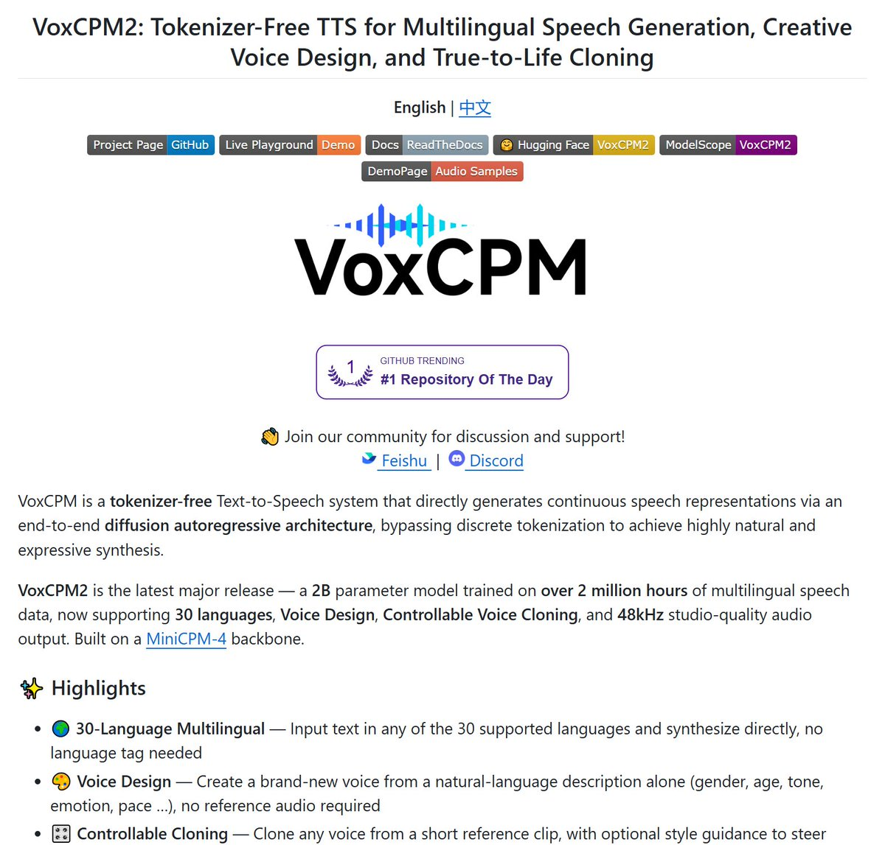
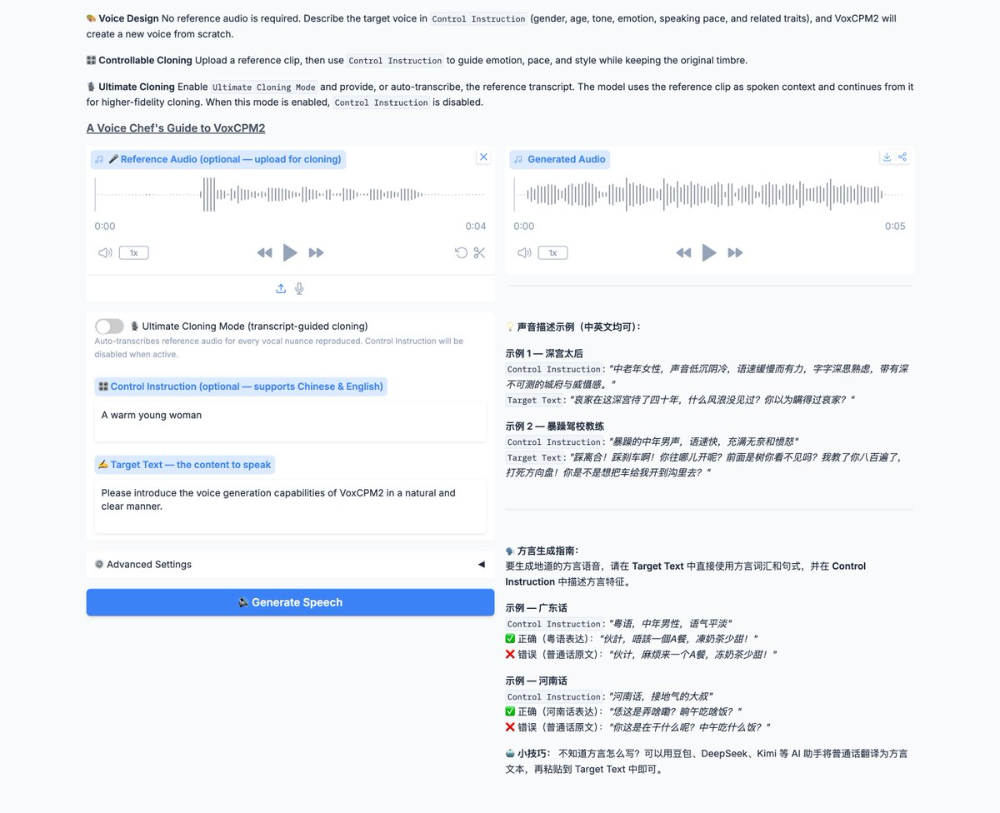

开源TTS直接卷疯了！园区诈骗又有新武器？  

清华 OpenBMB 刚刚放出 VoxCPM2：
200亿参数 + 200万小时多语言数据训练，48kHz录音棚级音质！  
最狠的是——完全不用Tokenizer，直接在连续潜空间做扩散自回归，细节保留拉满！  30种语言 + 9种中文方言  
自然语言描述就能凭空造声  
终极克隆模式：呼吸、口癖、情绪全都能复刻  
RTX 4090实时率0.13，几乎无延迟

GitHub已破万星，Apache 2.0商用友好！
播客、有声书、短视频党直接起飞👇
[github.com/OpenBMB/VoxCPM](https://github.com/OpenBMB/VoxCPM)g

### 🖼️ Attached Media

## 💬 Replies

### 1 @HyperAI_News (Hyper.AI)

*Tue May 12 09:40:35 +0000 2026*

@Honcia13 Already live on [hyper.ai](http://hyper.ai)! We’ve integrated VoxCPM2 into our demo platform. Excited to see what everyone creates with it. 🚀[hyper.ai/notebooks/50549](https://hyper.ai/notebooks/50549)gA

### 2 @aiinterstation (Bliubird)

*Wed May 13 03:43:55 +0000 2026*

@Honcia13 诈骗新武器

### 3 @LunaticLegacy (月と猫 - LunaNeko🌙)

*Tue May 12 13:46:33 +0000 2026*

@Honcia13 支持openvino吗，py3.14可以吗

### 4 @yige01 (张一格)

*Tue May 12 09:52:09 +0000 2026*

@Honcia13 有直接用自然语言描述就能生成声音？这是要取代配音演员的节奏啊

### 5 @jiangdotgs (jiang.gs)

*Tue May 12 07:48:47 +0000 2026*

@Honcia13 这个绝了，克隆出来的一模一样

