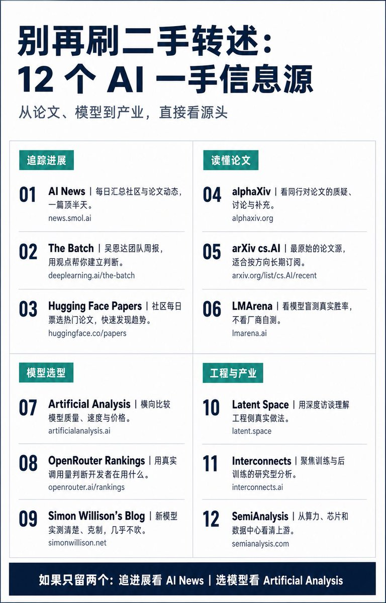

每天刷两小时推特，看到的还是二手转述。这 12 个源直接看一手，建议收藏：

1、AI News — 每日自动汇总各大社区和论文动态的日报，一篇顶你刷半天
[news.smol.ai](https://news.smol.ai)

2、The Batch — 吴恩达团队的每周简报，观点比资讯多，适合建立判断
[deeplearning.ai/the-batch/](https://www.deeplearning.ai/the-batch/)

3、Hugging Face Papers — 每天社区投票选出的热门论文，带简介
[huggingface.co/papers](https://huggingface.co/papers)

4、alphaXiv — 论文讨论区，能看到同行对一篇论文的质疑和补充
[alphaxiv.org](https://www.alphaxiv.org)

5、arXiv [cs.AI](http://cs.AI) — 最原始的论文源，追某个方向就订阅对应分类
[arxiv.org/list/cs.AI/rec…](https://arxiv.org/list/cs.AI/recent)

6、LMArena — 大模型盲测竞技场排行榜，看真实对战胜率而不是厂商自测分
[lmarena.ai](https://lmarena.ai)

7、Artificial Analysis — 各家模型的速度、价格、质量横向对比，选型时直接看这里
[artificialanalysis.ai](https://artificialanalysis.ai)

8、OpenRouter Rankings — 按实际调用量排的模型使用榜，能看出开发者到底在用什么
[openrouter.ai/rankings](https://openrouter.ai/rankings)

9、Simon Willison's Blog — 每个新模型发布他都会实测并写清楚能干什么，几乎不吹
[simonwillison.net](https://simonwillison.net)

10、Latent Space — 深度访谈和技术拆解，适合了解工程侧的真实做法
[latent.space](https://www.latent.space)

11、Interconnects — 训练和后训练方向的深度分析，偏研究
[interconnects.ai](https://www.interconnects.ai)

12、SemiAnalysis — 算力、芯片和数据中心的产业分析，看清楚上游发生了什么
[semianalysis.com](https://semianalysis.com)

如果只留两个：日常追进展看 AI News，选模型看 Artificial Analysis。

### 🖼️ Attached Media

## 💬 Replies

### 1 @diguapet (赛博地瓜)

*Mon Jul 27 13:20:58 +0000 2026*

@Ryrenz 感谢 很有用

### 2 @andy88988696 (迷思拆解_Panda🐼🐼)

*Mon Jul 27 00:00:22 +0000 2026*

@Ryrenz 这是个好东西，适合给创作者们收藏

### 3 @Ryrenz (Ren) (Author)

*Mon Jul 27 00:03:46 +0000 2026*

@andy88988696 是啊，密切关注前沿热点

### 4 @better_christal (Christal.Z)

*Tue Jul 28 09:15:29 +0000 2026*

@Ryrenz 这些一手源太香了

### 5 @Ryrenz (Ren) (Author)

*Tue Jul 28 14:02:09 +0000 2026*

@better\_christal 是啊

### 6 @crazyox (Crazyox🌶️（微微辣版）)

*Mon Jul 27 12:32:11 +0000 2026*

@Ryrenz 让hermes看吧，我看不过来了🤣

### 7 @JPZ_Longevity (JP Zhang)

*Sun Jul 26 19:35:32 +0000 2026*

@Ryrenz 让codex做scheduled task

### 8 @An_yhl (晚晚)

*Sun Jul 26 14:46:42 +0000 2026*

@Ryrenz 收藏归收藏，最后还是会刷回时间线

### 9 @jfdi1001 (jfdi1001)

*Mon Jul 27 06:20:00 +0000 2026*

@Ryrenz @readwise save thread

### 10 @lulu57492514 (lu lu)

*Mon Jul 27 12:55:10 +0000 2026*

@Ryrenz 很实在的

### 11 @killingbaby1103 (Killbabydevil)

*Mon Jul 27 02:26:01 +0000 2026*

@Ryrenz 这还说啥了直接收藏

### 12 @AIJonHu (Jonathan Hu)

*Mon Jul 27 00:30:27 +0000 2026*

@Ryrenz 马上加入Hermes，进行摘要阅读。

### 13 @sunyoung2021 (SunFine)

*Mon Jul 27 07:24:53 +0000 2026*

@Ryrenz 确实不错，有些信息源我都不知道

### 14 @baixs1992 (https://open302.com 专注 AI 生图赛道)

*Sun Jul 26 19:22:09 +0000 2026*

@Ryrenz 牛

### 15 @Foxfoxfox96 (Fox)

*Mon Jul 27 13:40:14 +0000 2026*

@Ryrenz 太厉害了

### 16 @lin77239 (🏧)

*Mon Jul 27 08:43:58 +0000 2026*

@Ryrenz 收藏了

### 17 @EleWhyd58700 (InsightXiv.AI)

*Mon Jul 27 08:33:10 +0000 2026*

@Ryrenz 👋Recommend Myself.

