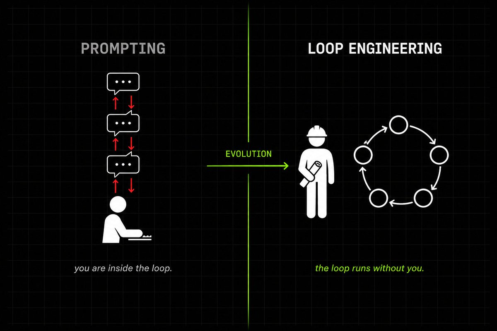
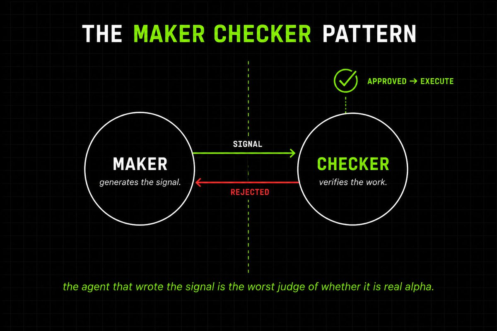
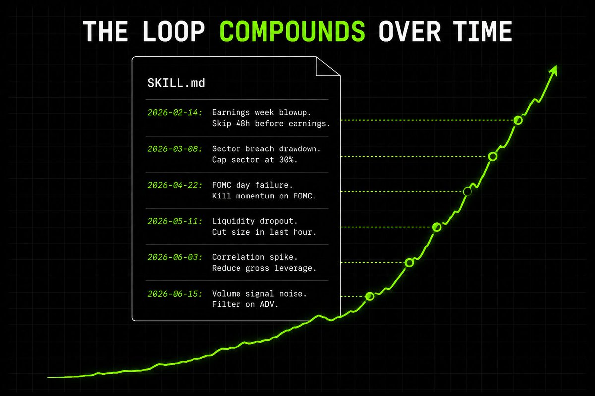
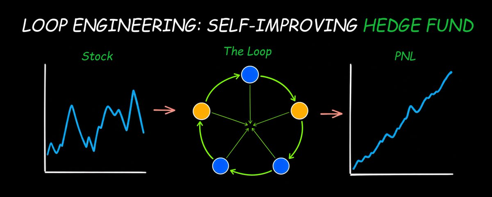

# 📰 How To Use Loop Engineering To Build A Self-Improving Quant Trading System

I will break down exactly how to build the loops that run an entire quant trading system on their own.

Let's get straight to it.

> Bookmark This - I'm Roan, a backend developer working on system design, HFT-style execution, and quantitative trading systems. My work focuses on how prediction markets actually behave under load. For any suggestions, thoughtful collaborations, partnerships DMs are open.

One thing I am starting from today.

If you are building a quant system, about to start or even just thinking about it, DM me what you are working on or just reply under this article and I will reach out to you (even you can simply give me the screenshot of your current architecture). 

I will personally walk through the first 20 setups show you the gap between what you have and a system that actually prints alpha. 

Most quants still prompt Claude. They type. They wait. They read the output. They type again.

The smartest builders on the planet have stopped doing that.

They write loops. The loops prompt Claude. The loops verify the output. The loops decide what happens next. The loops keep running after the laptop is closed.

Boris Cherny, the head of Claude Code at Anthropic, said it plainly two weeks ago. "I don't prompt Claude anymore. I have loops running that prompt Claude and figuring out what to do. My job is to write loops." That single sentence reframed how every serious AI engineer on earth thinks about building. And it pairs perfectly with quant trading.

Most retail quants will read this and say it does not apply to them because they are too small. They are wrong. The smaller your capital, the more this matters. A self running loop is the only way a solo builder ever closes the gap with a fund running 100 PhDs.

Because quant trading is already a loop. Pull data. Generate signals. Backtest. Execute. Monitor risk. Repeat.

Every fund on Wall Street runs that exact cycle. Renaissance has been running it since 1988. Citadel runs it with teams of engineers monitoring every stage. Two Sigma, Jane Street, all of them.

The only difference is they need hundreds of humans sitting inside the loop. You do not.

I have already built this loop for myself. It pulls market data on schedule. It runs alpha research. It verifies every signal through a separate agent. It executes only what passes verification. It writes every lesson back to memory.

This article is everything I have learned about loop engineering and how to wire it into a complete autonomous trading system.

By the end of this you will know:

The exact difference between prompting an agent and engineering a loop.

The six pieces that run every working loop in production.

How to wire those six pieces into a self improving quant trading system from scratch.

Let's get into it.

---

## Part 1: The Difference Between Prompting And Loop Engineering

For the last two years, working with AI looked like this.

You typed a prompt. You read what came back. You typed the next prompt based on what you saw.

You were the loop.

The agent was a tool. You held it the entire time. Every move was you sitting at your keyboard deciding what to do next.

Loop engineering ends that.

You stop being the thing inside the loop. You become the architect who designs it.

A loop is a recursive goal. You define a purpose. The agent iterates against it. The loop keeps running until a real stopping condition is met.

The agent forgets between runs. The loop does not.

That single fact is the entire architecture.

This is what Boris meant when he said his job is to write loops. He stopped typing instructions one at a time. He built systems that send the instructions for him, read the results, and decide what happens next.

For coding, this changes how software ships.

For trading, this changes everything.

Because no quant has ever made money by typing one prompt and walking away. The edge comes from running the same cycle thousands of times, getting one percent better every iteration, and never sleeping.

That is exactly what a loop does.

If you are still typing prompts into Claude one trade at a time, you are doing what Boris stopped doing two years ago. The leverage point has moved one floor up. You are not writing better prompts anymore. You are writing the system that writes the prompts.

---

## Part 2: The Six Pieces That Run Every Working Loop

A working loop is built out of six parts. Miss one and the loop breaks quietly.

> 1\. The automation.

This is the heartbeat. A cron schedule, a webhook, a /loop command, or a hook inside Claude Code that fires without you typing.

There are two flavors worth knowing. /loop reruns on a cadence regardless of state. /goal keeps going until a verifiable condition you wrote is actually true, with a separate small model grading whether the work is done.

In trading, /loop is your data pull every minute. /goal is "keep iterating on this signal until the backtest Sharpe is above 1.5."

> 2\. The skill.

A skill is a procedure manual the agent reads instead of being told from scratch every session.

It lives in a SKILL.md file. It holds your conventions, your rules, your "we don't do it like this because of that one incident."

Without skills, every loop run starts from zero. With skills, intent compounds.

> 3\. The state file.

A markdown file. Usually called STATE.md or PROGRESS.md.

It survives between runs. The agent forgets. The file does not.

The agent reads it at the start of every run. It writes back what happened at the end.

This sounds too dumb to matter. It is actually the spine of every working loop.

> 4\. The verifier.

The agent that wrote the code is the worst possible judge of whether the code is correct.

Apply this to trading. The agent that generated the signal is the worst possible judge of whether the signal is real alpha or noise.

You need a separate agent, with different instructions, ideally a different model, whose only job is to verify the work.

This is the maker checker pattern. Every prop shop on Wall Street is structured this way internally. At Jane Street, the trader who proposes a trade does not approve the trade. At Citadel, the researcher who builds the model does not validate the model.

> 5\. The worktrees.

The moment you run more than one agent against the same files, they start colliding.

Git worktrees give each agent its own isolated working directory pointed at its own branch.

In trading, this lets you run signal research, backtesting, and risk monitoring in parallel without ever stepping on each other.

> 6\. The connectors.

A loop that can only read files is a tiny loop.

Connectors built on the Model Context Protocol let the loop hit a broker API, query a database, post to Slack, send orders to the exchange.

This is the difference between a loop that suggests trades and a loop that actually places them.

These six pieces are universal. They show up in Claude Code. They show up in Codex. They show up in every working agentic system on the planet.

Now let me show you how to wire them together into a complete trading system.

---

## Part 3: How To Build A Self-Improving Quant Trading Loop

The quant trading loop has five stages. Each stage is its own sub loop, with its own skill, its own state file, and its own verifier.

Stage one. Data ingestion.

An automation fires every minute, every hour, or every day depending on the asset class.

\`\`\`python
@loop(interval="1h")
def ingest\_data():
    data = fetch\_market\_data(symbols=universe, lookback="30d")
    state.write("latest\_data.parquet", data)
\`\`\`

The data goes into a shared state file the next stage reads.

Stage two. Signal generation.

This is where the alpha research happens.

\`\`\`python
@loop(trigger="data\_updated")
def generate\_signal():
    data = state.read("latest\_data.parquet")
    signal = claude.run\_skill("alpha\_research", data)
    state.write("pending\_signal.json", signal)
\`\`\`

The signal generation agent reads from a SKILL.md file that holds your alpha research rules.

\`\`\`markdown
\# alpha\_research\_skill.md

\## Goal
Generate signals using linear regression on the last 30 days
of price and volume data.

\## Rules
\- Sharpe ratio must be above 1.5 in 3 of the last 5 backtests
\- Position size limited to 2 percent of capital per signal
\- Skip signals on FOMC announcement days
\- Skip signals 48 hours before earnings releases

\## Lessons learned
\- 2026-02-14: Lost 4.2 percent during earnings week.
  New rule: skip any signal 48 hours before earnings.
\- 2026-03-08: Sector exposure breach caused 6 percent drawdown.
  New rule: cap sector exposure at 30 percent.
\- 2026-04-22: Momentum signal blew up on FOMC day.
  New rule: kill all momentum signals on FOMC days.
\`\`\`

The skill grows over time. Every loss writes a new lesson back. Every lesson becomes a new rule for the next run.

This is what makes the system self improving.

Stage three. Verification.

The signal goes to a completely separate agent. Different model. Different instructions. No exposure to how the original signal was reasoned.

\`\`\`python
@checker
def verify\_signal(signal):
    result = claude.invoke(
        skill="backtest\_verification\_skill.md",
        signal=signal,
        rules=\[
            "Sharpe ratio above 1.5",
            "Max drawdown below 10 percent",
            "Newey-West t-stat above 2.0",
            "Out of sample period at least 2 years"
        \]
    )
    return result.verdict
\`\`\`

If verification fails, the signal is killed. If it passes, it moves to execution.

The verifier never sees what the maker reasoned. That separation is the entire edge.

You can also use a stronger model for the checker than the maker. Claude Opus for verification, Claude Sonnet for generation. Different model architectures catch different kinds of errors. This is the same logic ensemble methods use in machine learning.

Stage four. Execution.

Only verified signals reach this stage.

\`\`\`python
@auto\_mode
def execute(signal):
    if verify\_signal(signal):
        broker.send\_orders(signal, max\_position=0.02)
        state.write("active\_trades", signal)
\`\`\`

The MCP connector handles the broker API. The loop never asks for permission. Auto mode lets it run hands off.

Stage five. Risk monitoring.

Running in a parallel worktree the entire time.

\`\`\`python
@loop(interval="1m")
def monitor\_risk():
    positions = broker.get\_positions()
    if drawdown(positions) &gt; 0.05:
        broker.close\_all()
        state.append("STATE.md", "Drawdown trigger hit. All positions closed.")
\`\`\`

This is the kill switch. It enforces rules without negotiation.

Together these five sub loops form one self running system.

Data flows in. Signals get generated. Signals get verified. Verified signals get executed. Risk gets monitored. Lessons get written back to memory.

Then it starts over.

I designed this once. I have not prompted any of these steps since.

That is loop engineering. That is what Boris meant when he said his job is to write loops.

One warning. A loop without a real stopping condition fails quietly. The agent emits a completion signal believing the half done job is finished. The loop exits. The bad trade sits open.

Your stop conditions need to be checkable by something other than the agent's own claim. "Sharpe above 1.5 over the last 30 trades." "Drawdown below 5 percent." "Test suite passes." Never "the agent says it is done."

In my game theory article I explained why every trade is a strategic move in a multi player game with imperfect information. If you missed it, you will want to read it right after this:

[Embedded Tweet: https://x.com/i/status/2066178991892119820]

The loop is what lets you sit at that table forever without burning out.

---

## Summary

Quant trading is already a loop. Every fund on Wall Street runs it. They just need hundreds of humans sitting inside.

Loop engineering removes the humans.

Six pieces make every working loop. Automations fire the heartbeat. Skills hold the project knowledge. State files hold the memory. Verifiers grade the output. Worktrees isolate parallel work. Connectors give the loop hands in the real world.

Wire them around the five stage trading cycle and you have a self improving system that runs alpha research, verifies signals, executes trades, and monitors risk on its own.

The system gets smarter every cycle. Every loss writes a new lesson. Every lesson becomes a new rule. After a hundred trades, the skill file is a living document. After a thousand, it is closer to institutional knowledge than anything a single human could remember.

The funds that build this first will compound for the next decade. The ones still prompting will be left behind.

So here is the question to sit with.

If loop engineering is the next abstraction above prompting, and quant trading is the highest stakes loop in the world, are you the person still typing prompts one trade at a time, or are you the architect who designed the loop that trades for you while you sleep?

There is no wrong answer but there are very revealing ones.

### 🖼️ Attached Media

## 💬 Replies

### 1 @RohOnChain (Roan) (Author)

*Mon Jun 22 14:33:36 +0000 2026*

one thing i left out of the article - state file is also your audit log, when the loop loses money, only way to debug what went wrong is to read state file from the failing run

if your STATE.md is too short or too long, you cannot debug so keep it smth 400 lines

### 2 @0xMovez (Movez)

*Mon Jun 22 15:56:16 +0000 2026*

@RohOnChain wow, another banger read by Roan ! Thanks for the writting bro. Will read now

### 3 @mzmmsplf (狼之羊（欲哭无泪ing）)

*Wed Jun 24 15:20:53 +0000 2026*

@RohOnChain 不懂就问，如果所有普通人都使用这个，那是不是所有人都能轻松通过挣钱了……

### 4 @thejayden (Jayden ⛩️)

*Mon Jun 22 13:59:43 +0000 2026*

@RohOnChain I needed this

### 5 @RohOnChain (Roan) (Author)

*Mon Jun 22 14:02:46 +0000 2026*

@thejayden glad to deliver you the complete framework, legend :)

### 6 @RuujSs (Ruuj)

*Mon Jun 22 13:59:44 +0000 2026*

@RohOnChain Insane article roan! Building self improving quant system is really nice

### 7 @RohOnChain (Roan) (Author)

*Mon Jun 22 14:01:51 +0000 2026*

@RuujSs ABSOLUTE GOLDMINE YOU CAN SAY :)

### 8 @jurstadev (jurstadev🍁)

*Mon Jun 22 13:59:21 +0000 2026*

@RohOnChain active!!

### 9 @RohOnChain (Roan) (Author)

*Mon Jun 22 14:03:06 +0000 2026*

@jurstadev active good

### 10 @RitOnchain (venus)

*Mon Jun 22 14:25:48 +0000 2026*

@RohOnChain worth 5 million views article. banger.

### 11 @RohOnChain (Roan) (Author)

*Mon Jun 22 14:32:08 +0000 2026*

@RitOnchain glad to add value, as always

### 12 @maverickarpathy (Maverick)

*Mon Jun 22 14:04:22 +0000 2026*

@RohOnChain finally I can retire now

### 13 @RohOnChain (Roan) (Author)

*Mon Jun 22 14:06:50 +0000 2026*

@maverickarpathy FIRST BUILD THE THIS, then you can (hopefully)

### 14 @Levi_Researcher (Levi)

*Mon Jun 22 17:02:02 +0000 2026*

@RohOnChain felt this one deep fr

### 15 @Blum_OG (Blum)

*Mon Jun 22 19:45:27 +0000 2026*

@RohOnChain solid piece on an extremely relevant topic

### 16 @Av1dlive (Avid)

*Mon Jun 22 14:49:06 +0000 2026*

@RohOnChain This is cool

### 17 @VeritasTeller (Truth Teller)

*Tue Jun 23 11:14:29 +0000 2026*

@RohOnChain if anybody believes this garbage actually makes money - they know nothing about trading and ML.

### 18 @hyperkquant (ritesh.hft)

*Mon Jun 22 14:26:57 +0000 2026*

@RohOnChain crazy article.

### 19 @ny_joker_eth (NY-JOKER)

*Wed Jun 24 10:50:02 +0000 2026*

@RohOnChain data → hypothesis → research → backtest → robustness → paper trading → risk review → limited execution → monitoring → post-trade attribution → memory  😉

### 20 @StuyBoyNY (StuyBoy From NYC)

*Wed Jun 24 21:00:43 +0000 2026*

@RohOnChain @readwise save

### 21 @tradiemat (Tradie)

*Mon Jun 22 20:38:11 +0000 2026*

@RohOnChain Great thread. Thanks for opening the door. Much appreciated

### 22 @realfxw (TechVerser)

*Fri Jun 26 07:25:09 +0000 2026*

@RohOnChain great！thx👍

### 23 @dchen6 (George McGinnis)

*Wed Jun 24 10:07:13 +0000 2026*

@RohOnChain But the token cost?

### 24 @Slonski_rt (Slonski)

*Tue Aug 11 18:39:22 +0000 2026*

@RohOnChain if i understood the article correctly, each agent in the loop has its own environment?

### 25 @JasonChouAI (JasonChou)

*Tue Jun 23 16:30:29 +0000 2026*

@RohOnChain 完美👍

### 26 @annavladi (annavladi)

*Wed Jun 24 01:50:02 +0000 2026*

@RohOnChain Been doing r&amp;d on agentic crypto hedge fund.

### 27 @carolyndriscoll (Carolyn Driscoll)

*Tue Jun 23 11:53:32 +0000 2026*

@RohOnChain This was a great read. I've been increasingly curious about loop engineering. Would love to learn more.

### 28 @karansznx (Karan Manoharan)

*Wed Jun 24 12:46:07 +0000 2026*

@RohOnChain Loved the article!

### 29 @Josefusan111 (Joseph ai)

*Mon Jun 22 16:17:18 +0000 2026*

@RohOnChain Loop engineering and harness engineering is certainly the hot-topic of discussion. perfect timing

### 30 @myownstock_guru (My Own Stock Guru)

*Fri Jun 26 12:23:23 +0000 2026*

@RohOnChain @RohOnChain I'm currently building my own AI build out and I'm going through all the data that, the platform provides stock and options alerts. I use the data to improve on my alerts that gets sent to the platform that my users can see. I'm interested in working with you

### 31 @Aniruddh83 (Aniruddh)

*Fri Jun 26 01:32:53 +0000 2026*

@RohOnChain Do you have a video of this article and how your results are?

### 32 @jh_boll (JB)

*Tue Jun 23 17:48:04 +0000 2026*

@RohOnChain @readwise save

### 33 @GZH69298815 (GZH)

*Tue Jun 23 21:32:25 +0000 2026*

@RohOnChain Nice. Thank you

### 34 @latentumx (Latentum)

*Mon Jun 29 08:49:20 +0000 2026*

@RohOnChain can i get the system!

### 35 @ku20244 (fckminer007)

*Sat Jun 27 19:57:06 +0000 2026*

@RohOnChain @threadreaderapp compile

