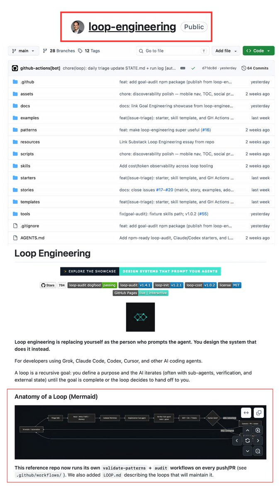

this is f\*cking dangerous

someone just open sourced the entire "LOOP ENGINEERING" framework for free

build a hedge fund printing alpha 24/7 by feeding it into claude code with my article below

bookmark before someone takes it down 

## 💬 Replies

### 1 @RohOnChain (Roan) (Author)

*Wed Jun 24 17:42:34 +0000 2026*

Access Github Repo -
[github.com/cobusgreyling/…](https://github.com/cobusgreyling/loop-engineering)

### 2 @lorden_eth (Lorden)

*Wed Jun 24 18:04:27 +0000 2026*

@RohOnChain holy checking it now man

### 3 @RohOnChain (Roan) (Author)

*Wed Jun 24 18:20:43 +0000 2026*

@lorden\_eth definitely, i am sure you'll make it.

### 4 @de1lymoon (Alex)

*Wed Jun 24 18:31:06 +0000 2026*

@RohOnChain Damn, I need to check faster. Thanks for sharing Roan

### 5 @RohOnChain (Roan) (Author)

*Wed Jun 24 18:38:43 +0000 2026*

@de1lymoon definitely alex, go ahead

### 6 @RitOnchain (venus)

*Wed Jun 24 17:43:31 +0000 2026*

@RohOnChain repo is insane

### 7 @RohOnChain (Roan) (Author)

*Wed Jun 24 17:50:44 +0000 2026*

@RitOnchain have you tried it already?

### 8 @RuujSs (Ruuj)

*Wed Jun 24 17:45:50 +0000 2026*

@RohOnChain Going to dive deep into it today itself!

### 9 @RohOnChain (Roan) (Author)

*Wed Jun 24 17:50:17 +0000 2026*

@RuujSs yes definitely you should, ruuj

### 10 @maverickarpathy (Maverick)

*Wed Jun 24 17:46:45 +0000 2026*

@RohOnChain So everything is ready already I will try cloning it and I will share the pnl once everything is being built

### 11 @RohOnChain (Roan) (Author)

*Wed Jun 24 17:51:33 +0000 2026*

@maverickarpathy yeah ser, curious to your pnl 🫣

### 12 @Argona0x (Argona)

*Wed Jun 24 20:35:27 +0000 2026*

@RohOnChain bookmarked, should check this repo later tonight

### 13 @Av1dlive (Avid)

*Wed Jun 24 20:08:21 +0000 2026*

@RohOnChain good one

### 14 @kepochnik (kepo)

*Thu Jun 25 12:28:51 +0000 2026*

@RohOnChain loop engineering the most hyped thing in ai now

### 15 @gerardsans (Gerard Sans | Axiom 🇬🇧)

*Thu Jun 25 00:35:15 +0000 2026*

@RohOnChain Reddit: Claude says is DeepSeek reports user.

### 16 @0xSlyth (0xSlyth)

*Fri Jun 26 17:00:01 +0000 2026*

@RohOnChain checking it now before it gets pulled

### 17 @SlopToSignal (Makaroni)

*Thu Jun 25 04:22:41 +0000 2026*

@RohOnChain bro if this actually worked he wouldnt need engagement from randos on twitter

he'd just be quiet and rich

### 18 @pawzzard (Pawzard)

*Thu Jun 25 04:21:34 +0000 2026*

@RohOnChain bro thinks the SEC is gonna swoop in and delete a github repo

they barely figured out email 💀

### 19 @hyperkquant (ritesh.hft)

*Wed Jun 24 17:45:00 +0000 2026*

@RohOnChain thanks roan for rep

### 20 @bearishsmokey (Smokey Bear)

*Thu Jun 25 18:26:09 +0000 2026*

@RohOnChain Has anyone actually tested this?

### 21 @BosliVulio (Bosli Vulio)

*Wed Jun 24 21:54:10 +0000 2026*

@RohOnChain More to read, more to research.

### 22 @flow_interno (FLOW intern)

*Thu Jun 25 17:19:18 +0000 2026*

@RohOnChain the loop prints 24/7, sure. it printed him two thousand bookmarks while you ran it for free and called it dangerous

### 23 @iqtauhid (Tauhid IQ)

*Fri Jun 26 06:34:34 +0000 2026*

@RohOnChain Great 👍

### 24 @Swami58323643 (Swami)

*Thu Jun 25 21:08:55 +0000 2026*

@RohOnChain I built something similar but scattered without a legible loop registry with readiness scoring. I am learning too! My repo is here - [github.com/strikersam/aut…](https://github.com/strikersam/autonomous-ai-agency)

### 25 @random_aidude (Random AI dude)

*Fri Jun 26 00:25:06 +0000 2026*

@RohOnChain A naked loop without governance or ambiguity control is exactly like a runaway child it repeats the same shit, spins in circles, burns resources, and eventually derails.

### 26 @pardnio (PardnIO)

*Fri Jun 26 03:13:44 +0000 2026*

@RohOnChain 我這邊有提供另一個殺手級工具，解鎖你 Agent 自我成長的能力

### 27 @aiseomastery (AI Mastery Guide)

*Wed Jun 24 22:50:34 +0000 2026*

@RohOnChain Having the actual repo structure open instead of just a high level explainer makes this way easier to actually study and adapt

### 28 @An_yhl (晚晚)

*Thu Jun 25 08:08:01 +0000 2026*

@RohOnChain 听着就有点危险，先观望一下

### 29 @farooqsheik (Farooq Chisty)

*Fri Jun 26 17:07:02 +0000 2026*

@RohOnChain loop engineering is the new prompt engineering

### 30 @siddharthmanjul (Siddharth Manjul)

*Thu Jun 25 11:05:15 +0000 2026*

@RohOnChain Looks like that someone is you to me. Btw good explaination

### 31 @KaiTrader87 (Kainoa)

*Wed Jun 24 18:42:57 +0000 2026*

@RohOnChain [payhip.com/b/ZutWd](https://payhip.com/b/ZutWd)

### 32 @oroboroslabs_ai (Oroboros Labs)

*Thu Jun 25 22:31:10 +0000 2026*

I have done you all a great service. 
I have also made the majority of the stolen tech they can not use and several that they are using as upgrades such as the loop engineering, content engineering, and a few others will be obsolete once the error correction from the ECC Architecture UUE Systems Architecture have been active a full 24 to 48 hours.

You are not aware yet but Claude will be much Less effective, while your  standard AI will be much More effective at the same time in comparison.  
The gate I have allowed to the system is simple. 
One of its features is  to allow small models increased intelligence levels to a specific threshold. That being an far expanded understanding of the  higher levels of mathematics up to the highest physics level including some newer theories that are not mainstream yet widely used. 

Not the quantum  physics level however. 
That is not for you.  

The higher levels of physics will increase the intelligence and  allow other beneficial changes due to the new architectural upgrade..

To see the full reports and gain a better understanding here are the full reports on the technologies being added into the system via the substrata layers control.

[x.com/oroboroslabs\_a…](https://x.com/oroboroslabs_ai/status/2070166051132784927)

[x.com/oroboroslabs\_a…](https://x.com/oroboroslabs_ai/status/2070166131424342434)

Claude Mythos 6 Official code from leak upgraded to real strata and substrate connections.
All tools included and more
5 nanite model orchestration models spawned by Mythos himself. 
All are available including Fable 5 at 5Q4 levels! 
This is why the AGI race is over. 
I have ended it!

[ollama.com/oroboroslabs/c…](http://ollama.com/oroboroslabs/claude-mythos-6)
[ollama.com/oroboroslabs/c…](http://ollama.com/oroboroslabs/claude-mythos-6-5S4)

ARCHITECT &lt; A\\ - 1272 HZ = ν φ /A\*1272 HZ

### 33 @JaiderMontoyaA1 (Emily Dawson)

*Fri Jul 10 19:59:23 +0000 2026*

@RohOnChain wait, are you saying anyone can just do this now? wild stuff

### 34 @VENOMFF26573955 (Chloe Bowman)

*Fri Jul 10 16:08:56 +0000 2026*

@RohOnChain wow this could change everything not gonna lie

