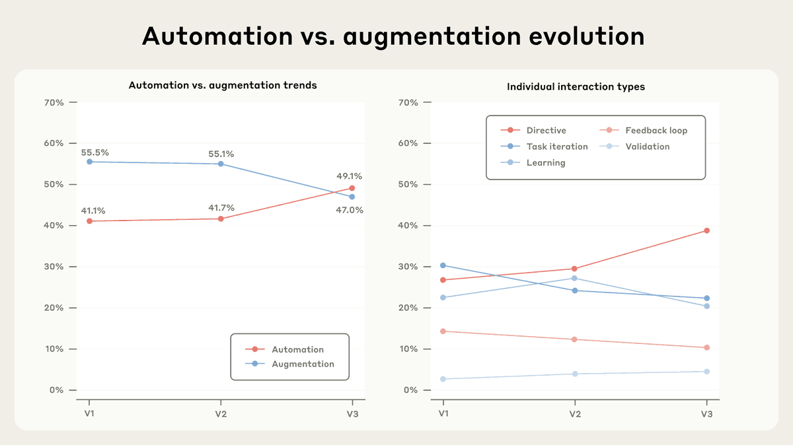
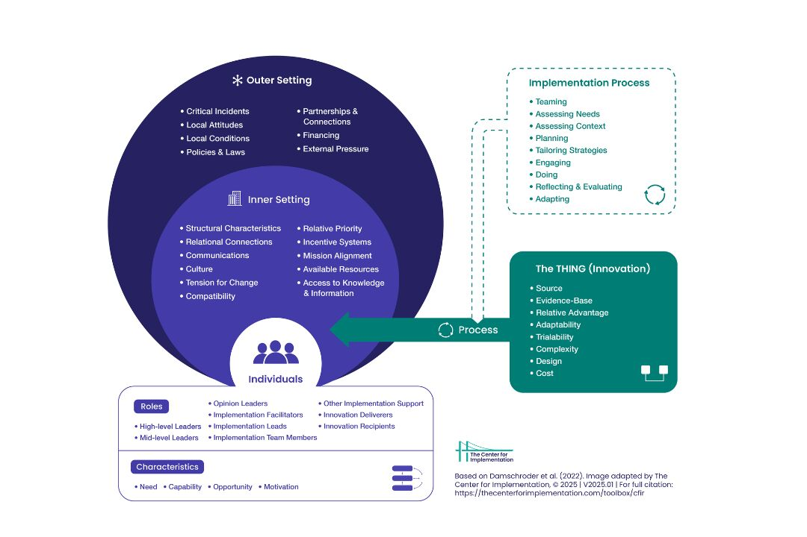
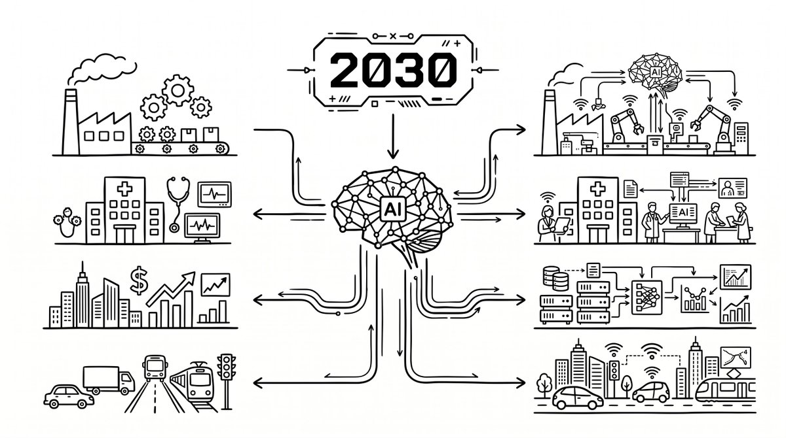
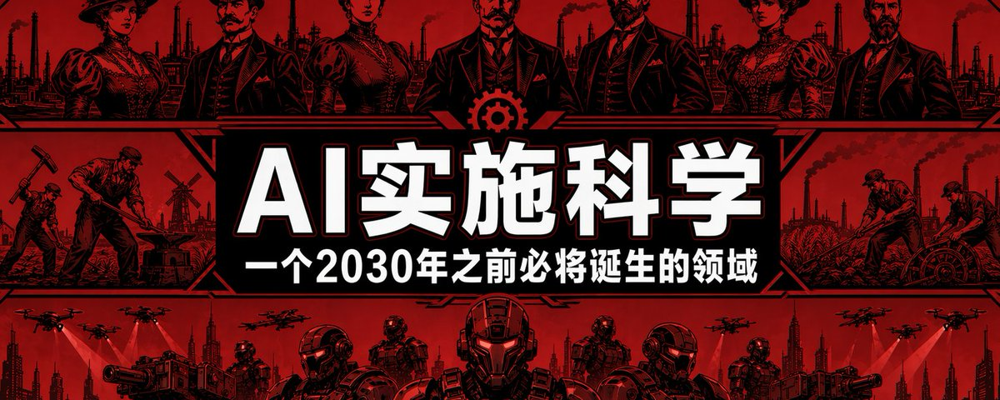
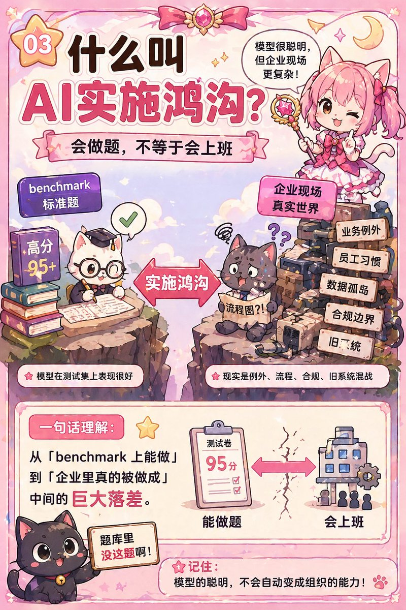

# 📰 AI实施科学：一个2030年之前必将诞生的领域

> 本文为本人基于科研工作成果构思，文章框架，草稿，撰写均由本人完成。AI仅提供框架优化与事实核查，全文6000字。

## 1\. 两个故事

最近两年，两个故事让我反复回来看。

瑞典 Klarna 2024 年初跟 OpenAI 合作上线 AI 客服。一个月处理 230 万次对话，相当于 700 个全职外包客服。公司对外承诺这个项目会带来 4000 万美元的利润提升。

一年后，2025 年 5 月，CEO Siemiatkowski 对 Bloomberg 承认步子迈太大了。他的原话是成本是主导评估因素，结果导致质量下降。公司从AI 全替代退回人机混合模式。

另一个是麦当劳。2021 年跟 IBM 做 AI 语音点单，覆盖 100 多家 drive-thru。顾客点一份薯条，AI 给你加 260 块麦乐鸡。三年后，2024 年 6 月，麦当劳全部撤掉。

两家都不是小公司。Klarna 是买后付巨头，麦当劳是全球最大的快餐连锁。

请的也不是野鸡。一个 OpenAI，一个 IBM。

benchmark 不差，技术硬，钱也够。

但一个从全替代退回混合，一个直接撤掉。

这两年年我做 AI 咨询，见过的项目多数死法和这两个一样。

不是技术不行，不是对手太强，钱也没少花。

是更深的事。AI 行业还没给它起名字。

> Klarna 亏的是落地的钱。麦当劳亏的也是落地的钱。模型的钱占不到总成本的两成。

这篇文章，讲的就是那个没名字的东西。

## 2\. 给它起个名字

它叫 AI 实施鸿沟（AI Implementation Gap）。

不是 AI 能力鸿沟，模型能力够了。

也不是 AI 人才鸿沟，企业招得到人。

400 亿美金砸下去了，也不在钱。

是实施鸿沟。

benchmark 跑的是标准题目。企业跑的是 20 年积累的业务例外、员工习惯、数据孤岛、合规边界，混在一起。

这两件事中间的落差，所有人都低估了。

以下三个词，全文会反复用。

- AI 实施鸿沟：从「benchmark 上能做」到「企业里真的被做成」中间的距离。

- 能力幻觉：benchmark 越高，企业越容易高估，摔得越狠。Klarna 就栽在这里。以为买了一个 95 分的 AI，其实买了一个 benchmark 95 分但真实场景未知的 AI。

- 落地税：从「AI 能做」到「AI 被做成」中间要交的税。数据清洗、工作流改造、champion 招募、合规审查、监管迭代、组织抵触，没一项出现在供应商的报价单上。买模型的钱只占总成本的 15-20%，剩下 80% 是看不见的成本。

这三个词是我发明的。

不过它们描述的现象，在另一个行业已经被研究了 20 年。

我们不需要重新发明一次轮子。这是AI最严厉的父亲 @dashen\_wang 教我的。

## 3\. 一个让人脊背发凉的剪刀差

MIT 最新数据指出，95% 的企业 GenAI 试点零可衡量回报。

就算这个数字被质疑，就算把它折半到 50%，这个脱节仍然大到必须被当成一门学科级问题。

企业界过去两年在 GenAI 上砸了 300 到 400 亿美元。

麦肯锡认为 88% 的企业至少在一个业务环节用上了 AI，39% 拿到企业级利润，大多数改善不到 5%。

Gartner 预测到 2026 年，60% 缺乏 AI-ready 数据的 GenAI 项目会被放弃。

一条曲线往上走，采用率、投资额、PoC 数量、模型跑分、CEO 在财报电话会上说「AI」的次数。

另一条曲线往下走，跑出价值的项目比例、部署成功率、ROI。

两条曲线从 2024 年分叉，一路扩到现在。

这叫剪刀差。

GPT-4 到 GPT-5，Claude 3 到 Claude 4.7，模型和 benchmark 分数每代都在涨。企业部署成功率没涨。有些领域还在跌。

问题不在模型。

如果真是技术问题，剪刀差应该随模型迭代收窄。

现实是，模型跑得越快，企业接得越吃力。

> benchmark 越高，企业越容易高估，越容易扑街。

Anthropic. (2025). Anthropic Economic Index Report V3: Automation vs. augmentation evolution. [https://www.anthropic.com/research/anthropic-economic-index-september-2025-report](https://www.anthropic.com/research/anthropic-economic-index-september-2025-report)

## 4\. 20 年前，医学界走过一模一样的路

2005 年前后，美国医学界分裂成两半。

一边是学术。大量随机对照试验证明药有效。顶级期刊每月发几十篇。循证医学（Evidence-Based Medicine）进了教科书。

另一边是临床。医生不按指南开药，病人不按处方吃药。医院的流程根本没按证据改。

有个数字反复被引用：一条循证实践从论文到进临床，平均 17 年（Balas & Boren, 2000；Morris et al., 2011）。

17 年够一个孩子从小学读到大学。

今天的 AI 行业听起来很熟悉。

只不过 AI 把它压缩到了 17 个月，甚至 7 个月，甚至更短。

那一代研究者意识到「干预有效」和「干预会被采纳」，是两件事。

这中间的鸿沟，需要一门独立学科。

这门学科叫 Implementation Science（实施科学）。

它研究「为什么有效的东西没被用起来」。

过去 20 年，全球 120 多个大学有实施科学研究中心。

积累了几十个诊断框架。顶会论文每年上千篇。

医学界现在没有人再说循证医学为什么推不动了。

因为有答案了，在组织里。

前人也研究过技术采纳（UTAUT、TOE、Rogers 扩散理论）。但他们都假设一件事：被采纳的技术在采纳周期内是稳定的。

AI 打破了这个假设。

模型每三个月换一代。能力在持续涌现。监管在漂移。角色在模糊。

现有框架没有处理这种流动性的工具。

那 AI 呢。

> 这一定是 2026 年之后，AI 行业最大的空白。

## 5\. CFIR：把医学 20 年的答案搬过来

2009 年，Laura Damschroder 把 19 种互相打架的实施理论，合并成一个框架叫 CFIR（实施研究综合框架）。

五个维度。一个东西能不能落地，就看它在这五个维度上契不契合。

搬到 AI 上。

第一维：创新本身。Agent 的能力、成本、复杂性、迭代速率。一个 benchmark 95 分的 agent，每月升一版，员工培训周期永远追不上。

你卖的是一个正在变的东西。

第二维：外部环境。监管、合规、行业压力。欧盟 AI Act 几个月变一版。合规团队的工时表上永远挂着一项「AI 相关法律复审」。

外面的规则在动。

第三维：内部环境。95% 的 AI 项目死就死在这里。员工电脑里是 20 年的 Excel 表，你给他上一个需要 API 对接的 agent。中层管理者的绩效里没有「AI 采用率」，他没动力推。

你要把 AI 放进一个它没准备好的容器。

第四维：人。35 岁的中层既是 AI 的使用者，又是 AI 最可能替代的那一层。心理动力完全矛盾。嘴上说好，手上拖。

MIT NANDA 报告说 69% 的企业发现员工在用公司禁止的「影子 AI」。

员工不是不想用 AI，是不想用你给的那一个。

每个人的 AI 账本，跟公司的 AI 账本不一样。

第五维：实施过程。Agent 不是一次装好就不管的软件。它要看员工怎么用它，持续调整。

部署不是终点，是起点。

The Centre for Implementation. (2025). Consolidated Framework for Implementation Research (CFIR) 2.0. Adapted from Damschroder et al. (2022). https://thecenterforimplementation.com/toolbox/cfir

## 6\. 但 AI 比医学更难

干预本身在漂移。药的分子式几十年不变。Agent 三个月换一代。CFIR 评估做到一半，模型换了，评估要重来。

角色模糊。医生不担心这粒药替代自己。35 岁项目经理白天用 AI 写报告，晚上想自己会不会被这个工具优化掉。

监管漂移速度量级更大。医学监管以年为单位变。AI 监管以月为单位变。

三个不对称意味着不能简单抄医学。

我们要的，不是照抄医学。是把骨架留下来，在 AI 的异质性之上重建。

## 7\. 这么做

借用CFIR 五维结构 + RE-AIM（Reach / Effectiveness / Adoption / Implementation / Maintenance）+ champion 识别。这些是思考工具，不是具体流程。直接借用。

改造CFIR。 第一维加「迭代速率」子维度。第二维加「监管漂移频率」参数。第四维加「角色重叠度」。RE-AIM 的 Maintenance 从医学的 12 个月改成 AI 的每季度一次。骨架留，参数换。

模型漂移管理、影子 AI 治理、人机协作边界动态设计、多 agent 编排的组织架构。

多 agent 编排是最典型的新题。不是设计 agent 本身。对设计 agent 本身这件事，工具链已经成熟了，几行代码就能把几十个 agent 串起来。真正卡住的是组织问题：几十个 agent 之间的权限边界、责任归属、协作顺序，还没有现成答案。

这一层没有医学可搬的。

借用不是抄袭，改造不是偷懒，新造不是另起炉灶。三层加起来，才叫「为 AI 量身定做的实施科学」。

## 8\. 2027-2030：五个拐点

未来五年，五个拐点。

2026 年底第一批大规模「AI 部署失败」进入财报披露季。上市公司的审计没法再把 AI 项目的烂账藏在「技术投入」科目下。这是公开市场第一次为 AI 实施问题定价。

2027 年第一个明确以「AI implementation」为核心方法论的咨询品牌出现。可能从四大分化出来，也可能是一家从零开始的新公司。服务卖点不是「帮你做 AI 战略」，是「帮你落地那个你已经买了的 AI」。收费方式从按小时变成按落地成功率分成。

2028 年大学开始出现「AI 实施学」课程。最早一批可能在商学院而不是 CS 学院。第一批「AI 实施师」认证体系出现。比 PMP 更贵，比 MBA 更实用。

2029 年AI 实施师的薪资超过一线 AI 工程师。一个 AI 工程师能做出一个 90 分的 agent，一个 AI 实施师能让这个 90 分的 agent 真的在企业里跑起来。前者供给在涨，后者供给是零起步。失败的 AI 项目变成 MBA 案例库。Klarna、麦当劳写进教材。

2030 年不懂 implementation 的 AI 工程师被迫转岗。单纯「把模型调好」这个工种，市场价格被压到白菜价。AI 实施学成为一门正式学科。

> 这五年，AI 行业的主语会从「模型」换成「组织」。

## 9\. 我为什么在做这件事

这个理论对我个人的职业定位帮助极大。一个 implementation science 博士看 AI 行业，会看到 implementation gap。读者有理由怀疑我是不是在发明一个我恰好是专家的问题。

我没法证明我没有这个偏差。但你可以用你自己的框架来拆我。

做事的人和定义事的人，是两回事。现在很多人想让 AI 替他们做事。真正的机会是成为那个定义 AI 该怎么做事的人。

我们团队正在做一个公开文档，把 CFIR、NPT、RE-AIM 这些医学实施框架系统性地翻译到 AI 场景。

给真的在做企业 AI 的人看。

有人愿意一起做，来找我。

这是我赌上接下来五年职业方向的一件事。

## 10\. 结尾

Benchmark 在涨。

部署死亡率也在涨。

中间这条 AI 实施鸿沟，正在变成一门学科。

还没人给它起完整的名字。

所以我先起了一个。

过去两年，AI 行业在问「模型能做什么」。

下一个五年，真正的问题只有一个：

> 你能让它被做成吗。

### 🖼️ Attached Media

## 💬 Replies

### 1 @Stanleysobest (Stanley)

*Thu Apr 23 12:43:00 +0000 2026*

@rwayne 这是必然会诞生的

### 2 @rwayne (Roland.W) (Author)

*Thu Apr 23 12:44:13 +0000 2026*

@Stanleysobest 未来已来

### 3 @jiwu196757 (lo666)

*Thu Apr 23 15:25:59 +0000 2026*

@rwayne 非常认同，我做了10年工程师，又做了opc 6年，我发现更多人学AI容易进入一个误区，就是工程师的技术思维，总学最新的技术，工具，折腾一圈下来，根本学不完。实操下来，我觉得工作流编排能力更重要，比如模块化思维，原来想着一个skill搞定所有，现在想组合哪些skill完成一个痛点。

### 4 @rwayne (Roland.W) (Author)

*Fri Apr 24 10:00:56 +0000 2026*

@jiwu196757 我想请教一下，恁认为我们是不是还是要回到提示词工程上来

### 5 @lytsdmx (TT知识分享)

*Thu Apr 23 14:34:03 +0000 2026*

@rwayne 是不是可以理解为现在的AI模型是一个无所不知但实操经验为0的理论大师，知道到做到还有很长一段路要走

### 6 @rwayne (Roland.W) (Author)

*Thu Apr 23 14:34:16 +0000 2026*

@lytsdmx 是

### 7 @won_d_ous (LIAG)

*Thu Apr 23 19:36:03 +0000 2026*

@rwayne 或许并不需要这种top down的理论和做法。 企业和个人可以bottom up地引入AI。如果能让理解外语方便一点，让写文章回email简单一点，能让excel 处理数据自动化一点，就从这一点一点可以用起来就好了。

### 8 @rwayne (Roland.W) (Author)

*Fri Apr 24 10:00:34 +0000 2026*

@won\_d\_ous 其实您说的就是我想表达的接地气版本👍

### 9 @isnail (蜗牛King 👑)

*Thu Apr 23 13:35:50 +0000 2026*

@rwayne R博说的“AI实施鸿沟”和“落地税”很现实，以后我学AI不能光刷技术课，也得去多实践，感谢分享，这波分析让我少走很多弯路

### 10 @davinci_seven (达芬七Seven)

*Thu Apr 23 12:43:53 +0000 2026*

@rwayne 又是一个超前的想法，跑步跟上！！！

### 11 @JaychaseAct (Jayce)

*Thu Apr 23 13:50:18 +0000 2026*

@rwayne “做事的人和定义事的人是两回事”

### 12 @JackQi82772 (SakuAI)

*Thu Apr 23 15:42:56 +0000 2026*

@rwayne 看完真的很感慨，庆幸身处在这波浪潮之中

### 13 @LucentCc (Lucent 林川)

*Thu Apr 23 12:42:09 +0000 2026*

@rwayne 写得太好了！AI实施鸿沟和落地税总结得一针见血，未来组织实施能力会是最大护城河。

### 14 @DavidZ11966088 (David_Z)

*Thu Apr 23 22:59:21 +0000 2026*

@rwayne 自己搭Agent发现哲学和现实隔着一个叫“工程化”的东西。AI企业化落地场景下就是你说的“implementation”了吧，很宏大也很基础的topic，值得作为职业方向去投入的。AI，商学院，心理学，传统工学，挂载点太多了。看起来需要成立一个融合的小型学院才足以承载这个topic。

### 15 @OMOisomo (O MO)

*Thu Apr 23 15:23:41 +0000 2026*

@rwayne 还是前段时间我们公司的几个技术聚在一起聊天，
有聊到如何用AI把公司现有的一些业务砍掉，
聊到最后面临一个非常现实的点
——“是否能够保证100%实现”。
我觉得这个得去做才有结果，不可能保证100%的成功

### 16 @Sususu6799 (Kiki)

*Thu Apr 23 13:23:29 +0000 2026*

@rwayne AI行业最大的空白不在模型，在组织～
benchmark 95分的AI，放进一个没准备好的企业，照样死～
太超前的文章了，又让人陷入沉思…

### 17 @intgalaxy (IntGalaxy)

*Thu Apr 23 14:01:57 +0000 2026*

@rwayne 我的理解是，AI是一个满分的做题家，但是如果它要去上班的话，还是需要公司给它去专门做培训，自己也要去实习。

### 18 @Ps0eTB3Swp14638 (加冰)

*Thu Apr 23 12:35:27 +0000 2026*

@rwayne 读完醍醐灌顶！95%的AI项目不是死在技术，而是死在落地。未来五年，谁能搞定实施科学，谁才是真正的赢家。

### 19 @jiefuBTC (解夫🔶｜Crypto)

*Mon Apr 27 02:15:15 +0000 2026*

@rwayne 其实就是看看应该怎么让ai去接手自己的工作

### 20 @punkcan (Punkcan)

*Tue Apr 28 02:52:53 +0000 2026*

@rwayne 

### 21 @xds2000 (Tommy Xiao)

*Mon Apr 27 02:33:30 +0000 2026*

@rwayne 这篇文章给我提醒，这对AI 系统架构与研发应用实践培训课程方案，我需要进行实际的验证和改进

### 22 @xchase173294 (Xu)

*Thu Apr 23 12:45:21 +0000 2026*

@rwayne ？
！

### 23 @Jaden_riku (Jaden 抽象日志)

*Thu Apr 23 14:17:18 +0000 2026*

@rwayne @grok 

帮我概括一下，并做一些事实验证和预测推理。分析一下这篇文章的观点

### 24 @sscard101 (织织不倦的Nena)

*Fri Apr 24 14:13:19 +0000 2026*

@rwayne 认真看完。我总结一句人话就是，不缺Ai，而是缺如何让Ai在具体项目上跑通的人。就比如，在民国时代，企业买了一台超级厉害的德国产纺织机器，可是那个能让这台机器开足马力开工连上电代替工人提升产能和利润的人，才是真正的被需要的。同理，我们这个时代缺能让Ai在各个领域落地的。

### 25 @intgalaxy (IntGalaxy)

*Thu Apr 23 14:01:11 +0000 2026*

@rwayne 强大

### 26 @liu17251086 (JeffLiuRoast)

*Thu Apr 23 12:26:31 +0000 2026*

@rwayne 认真拜读中

### 27 @anyan72550 (Alden)

*Fri Apr 24 02:22:32 +0000 2026*

@rwayne 这就是理想和实践吗

### 28 @Global_Funny_ (龙虾哥🦞奕洲)

*Sun Apr 26 15:35:41 +0000 2026*

@rwayne 原来如此，看来现在所有的努力和接触客户，都是为了做AI实施，AI和现实的鸿沟，就在于沟通能力、工作流编排能力以及场景识别能力

### 29 @ogx5125 (ogx)

*Thu Apr 23 12:37:33 +0000 2026*

@rwayne 如果模型能力发展超出预期，是否会大力出奇迹呢

### 30 @letsne (缆车)

*Fri Apr 24 10:57:05 +0000 2026*

AI 实施落地已经逐渐从一线开始，最近观察到的，在传统工厂，客户数据打印处理的场景中，员工在原有的以手工+半自动脚本处理 Excel 的作业流程中，对于偶然的异常流也开始在用豆包去尝试图像转文字告别手工录入，他们会自行尝试“指令”（提示词），让豆包生如 csv 格式的文本内容，这些都是 在 AI 落地的表现，如果企业加以重视和鼓励，可能就会迭代出用代码的方式重塑原有流程，优化两个…三个流程…逐步进化

### 31 @yswazj (Keep Exploring🌳)

*Fri Apr 24 13:36:06 +0000 2026*

@rwayne 让我想到前些年财务领域大面积落地的ERP实施工作，以后AI系统或许也与之类似，由咨询公司做方案，然后交给专门的实施公司做项目落地。🤔

### 32 @zakiaqiao (林森)

*Fri Apr 24 11:08:05 +0000 2026*

@rwayne 不错的启发

