# 📰 万字长文开源X自媒体增长指南（2026.09版）

声明：

> 先说成绩，我从2025年11月1日开始正式在X做自媒体，到今天9月8日，10个月收获了5.83万的粉丝，累计5.58亿次曝光，超150万次点赞，单日最高2800万曝光

> 特别鸣谢共创作者：黄小木 @ai\_xiaomu 设计师庞克 @AdrianPunk115 AI最严厉的父亲 @dashen\_wang

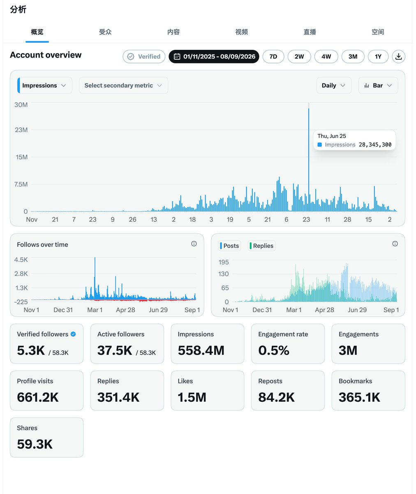

ok 教资展示完毕，开始开源！

最近情感类的特别火，我看到这些内容，挺高兴的。时间线上终于又多了一些别的话题。

我们天天聊AI，但坦白说，我是真的不希望所有新人都来写AI。

尤其是那种，点开一个账号是“Codex实战技巧”，换一个还是“Codex实战技巧”。大家用着同样的工具，追着同样的热点，最后连个人介绍都差不多。

那读者为什么要关注你？

你自己的经历呢？你对一件事情很不服气的那个判断呢？那些你愿意花时间去琢磨、跟别人聊起来根本停不下来的东西，怎么一到发推的时候就全没了？

大家想看到这些。

今天把这10个月的增长经验拿出来讲，就是想让更多新人知道，做自媒体，你有自己的位置。你就是跟别人不一样，你就是会成为大V的有一天。

这篇就讲，你怎么让别人认识你，为什么值得被关注，以及怎么让好的内容获得第一波传播。

先说最底层最核心的，自媒体的本质是什么？

> 「被看见」

自媒体是人类被看见这一古老欲望第一次获得了民主化的出口。从洞穴壁画到朋友圈九宫格，人类一直都在做，也想做同一件事情，那就是我在这里，我活过，你看见了吗？

传统媒体里，被看见是一种少数人的特权。你比如说作家、歌手、新闻人物。而自媒体呢，把这个舞台拆了，每个人都可以去搭建自己的舞台。

为什么需要自媒体？是因为人不能不表达，不表达就会窒息，不比较就没有坐标，而不渴望就没有动力。

自媒体的本质动作是夺回叙事主权。什么意思呢？人类最深的恐惧是被他人定义。比如公司给你发工牌，学校给你打分，父母给你贴标签。但自媒体呢？不是了。我的故事，最好是听我讲的版本。

这是一个人对我到底是谁这个问题，从你说了算变成我说了算的根本性转变。每一个人内心都有一部只有自己看的电影，我是主角，我说了算。但在过去，只有少数人获得放映权。

那我今天主要是想讲指南，是想教大家怎么去做。所以具体的展开我会放到其他的时候再讲。简单进行一个总结，自媒体实际上是人类用最低的成本，解决存在焦虑，表达冲动，连接渴望，比较本能，对有限的不甘，对空虚的恐惧，以及对无力感的反馈的最低成本驱动装置。

那，社交媒体的本质是什么？

> 「社交」

更进一步的讲，社交媒体它的核心动作是在场，是我在，你也在，我们同时在看着一件事情，同一件事情。你看见我了吗？我听见你了吗？

X 的设计决策里边，短推文280字、公开的时间线、及时性、关注的结构、回复与转推，都是在反复的做同一件事情，就是把人扔进一个公共的广场，逼着你开口、逼着你表态、逼着你和别人产生摩擦。

这里是一个永不停歇的、公开的、大喊大叫的广场。

280字的短推文，不允许你有"也许""可能""另一方面"。他在逼着你下判断，"我觉得X是错的。""我不同意。""这个决定很蠢。"

在朋友圈，你可以发九宫格配一句"今天好美"，模糊、安全、无人可反驳。在 X 上，你的每一句话都是一次公开的站队。你必须在"我"和"世界"之间画一条线，然后告诉所有人我站在这边。

> "我的判断，我说了算，而且我当众说。"

到这里，我相信你已经掌握了这两个本质，我们可以开始来讲，如何实操了：

# 一、个人主页的建设

这里面尤其重要的是你的个人介绍，因为这会决定读者要不要关注你，你到底是谁？

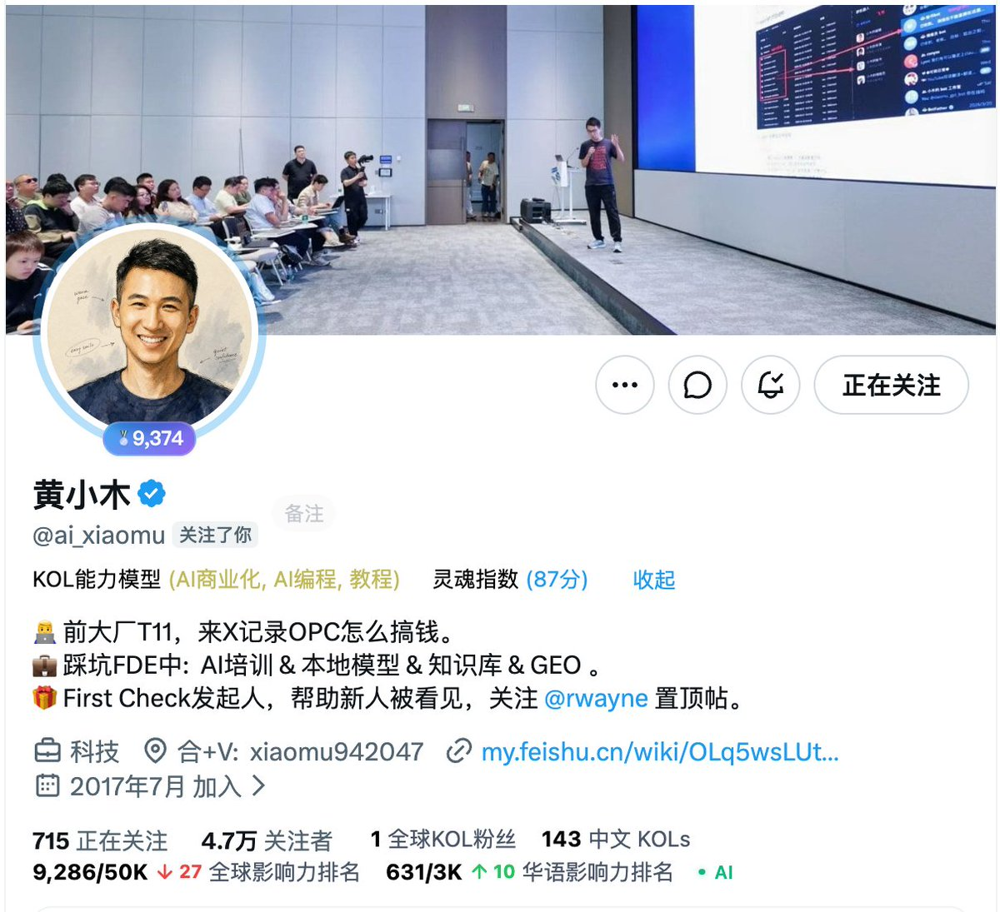

比如 @ai\_xiaomu 你点开就知道哦 大厂T11 FDE，AI本地大模型，还发现他在帮助新人被看见

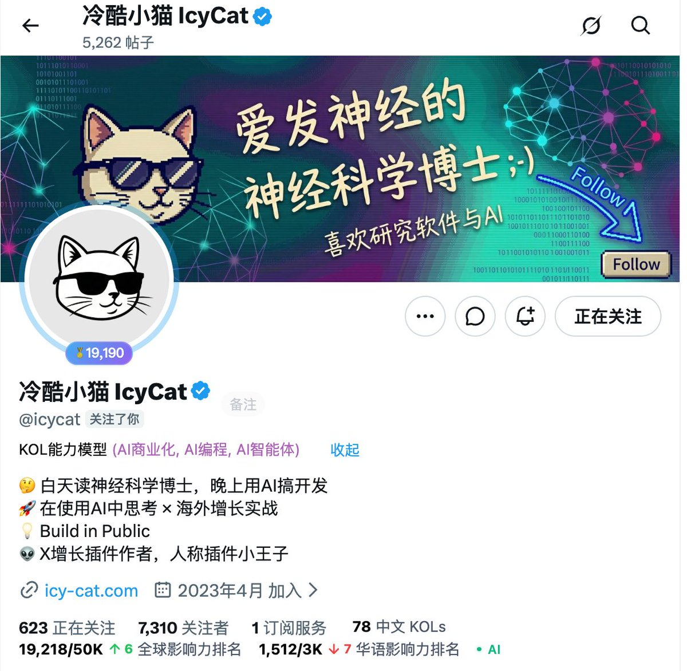

比如 @icycat 冷酷小猫，猫博，你知道他是神经科学博士，还是插件小王子。

大部分人在推特上的行为是发推，然后等待反馈。没有反馈再发一条，再等，又没反馈，怀疑自己。就是因为跳过了最关键的动作，让别人知道你是谁。

个人介绍是你在推特上唯一一次不会被算法打散的，对于自我的定义。因为你发的每一条推文，它都是一个行为，它有随机的、有情绪化、有自相矛盾。但是个人介绍就是你的身份定位。它是唯一的锚定物，它代表着我这个人是谁，长什么样，而不是我今天要说什么。

所以我不建议大家写：AI爱好者，热爱科技，热爱美股，这些都属于空心人设，相当于告诉大家，我存在，但是我还不知道我自己是谁你们自己猜去吧。

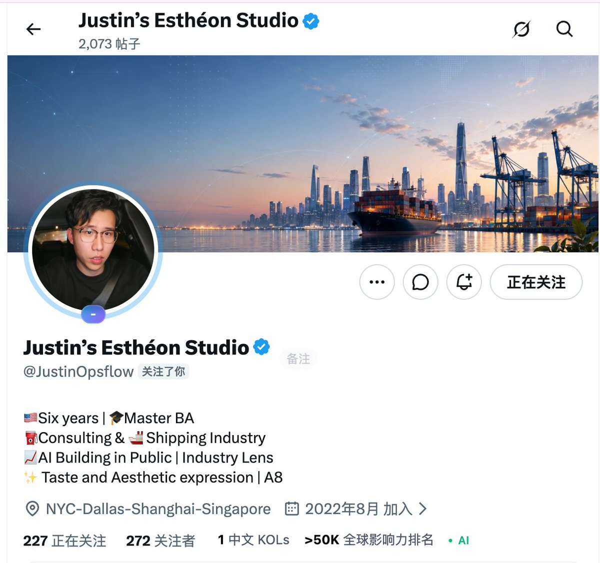

比如 Justin，我一眼抓住的，是他说的Shipping Industry，这个是很具像化的一个锚定。

再看他的背景，港口，码头，货轮，都可以对应的上。

在社交媒体上最恐怖的事情就是，你看起来和谁都不一样，又和谁都一样。一定是需要有一个矛把你牢牢的拴住在你自己的这个生态位上面。要记住社交媒体是一个巨大的广场。如果没有锚，你会随着人流，随着信息流飘摇不定。

顺着这条线，再看看，他用了真人头像，这个主页建设，我给到90分，剩下的10分是Bio还可以继续优化。

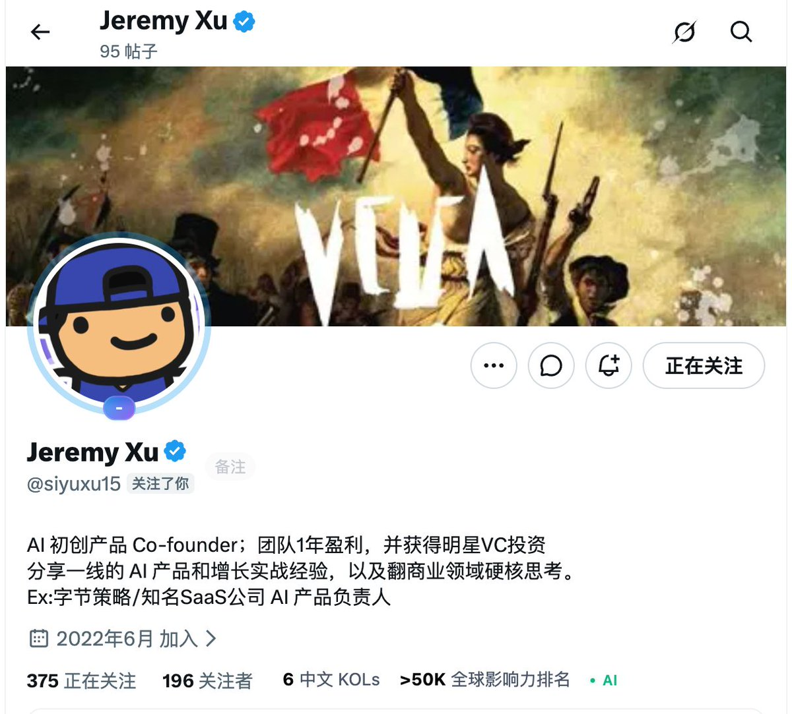

Jeremy的Bio第一段非常好，直接告诉读者，我团队有1年的盈利还有明星VC的投资。

这里有发现重点吗？不管是 Justin 还是 Jeremy，我的关注点从来不是她在美国6年，她有一个硕士学位，她 build in public ，什么一线 AI 产品增长实战经验，我根本不 care。这些在推特上一抓一大把。但是他们两个的共同点在于，他们展示出了一个他们自己非常独特的点。

> 「船运」 和 「团队盈利了还有明星VC投资」

理想读者会在3秒内看完你的主页，形成一个第一印象。这3秒非常的重要，它传递的一个核心的信息叫做，我和你是同一类人。我们做自媒体不是让所有人都喜欢我，这是不可能的。重点是让读者感觉到，哦，就是他。他就是我想关注的。

一般来说，读者是通过你的推文或者别人转载你的推文去点开你的主页。他的认知预算极其之低，无限接近于零。而整个主页除了回答你是谁，你做什么，最关键也就是我上面提到的，为什么我要关注你，而不是那个看起来差不多的人，这就叫差异化。如果你的主页回答不了这三件事情，请记住，人天生就是认知的吝啬鬼。你如果在主页上的内容让对方有猜这个动作，对方就会直接走人。

> 所以为什么要如此的重视主页建设？是把「理解你」的成本从对方的身上挪到我们自己的身上。

我们能不能先发推文，再去做主页的建设呢？不可以，立刻，马上就要做。这也是为什么它在实践里边，它被我放在了第一位。我们可以先做一版，之后慢慢的去优化、去调整，这是没有问题的。

从心理学上，我们要理解一个事情，就是人性的信信任顺序，它是固定的。从存在，再到形状，到一致性，到价值，到情感。所谓存在，也就是我们主页建设的这二步，已经注册了账号了，这是第一步，它证明了你存在。那第二步就是你长什么样？你做什么？你的调性是什么？这个是不能被跳过的，因为一旦跳过会破坏掉这一个信任顺序序的逻辑。

# 一致性

在推特这个社交广场里，一致性是很重要的。不过，并不是让你每天发一样内容，抱歉，那个叫复读机。甚至呢，我是非常非常不推荐大家使用 AI 去帮你自动发推，或者说去产生推文。第一，违反平台规则。第二，对于长期构建个人的一个形象品牌，没有什么好处。

最近为什么写情感类的内容爆发的那么那么快？以Yan和汪仔为例：

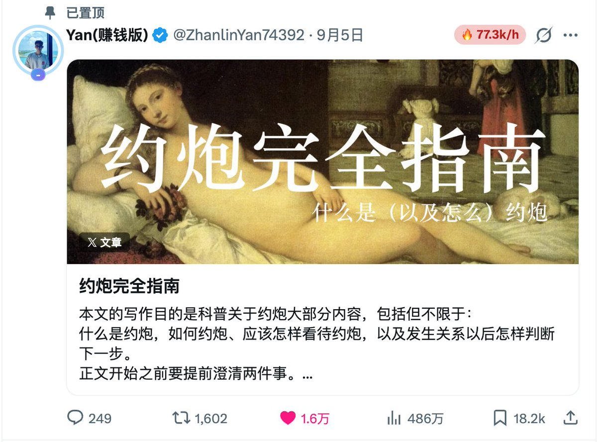

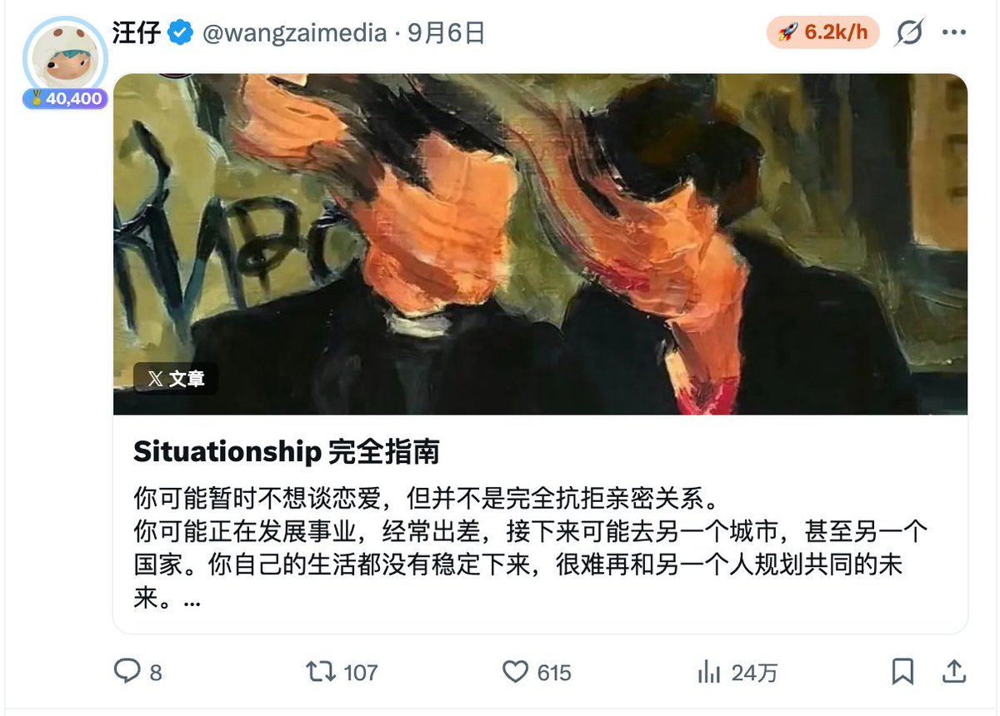

看到Yan和汪仔的文章爆火起来，我才发现其实大家的生活里真的还有很多东西值得写。

我们会用AI，也会谈恋爱，会在关系里纠结。点开推特的人，一样有自己过不去的事情。

你看，具体的人和具体的问题，全都在这里。

但是呢，别看到情感内容起来了，又一窝蜂去写情感。刚从AI实战技巧出来，转头再去复制一份情感指南，那你自己到底在哪里？

我反复讲，找到自己的位置，就是这个意思。

比如Justin，船运这个经历就很值得往下讲。我想看他用自己的行业经验去分析，去思考别人都在讨论的东西。我就很期待同样一件事情，他能看到什么，是我看不到的？

这个才让我想关注。

我天天聊本地大模型，因为我在意，也有一套自己的判断。你有在意的事，把它讲出来。别为了做一个“自媒体账号”，就先把最有意思的那部分删掉了。

大家普遍都有审美疲劳。我们应该去找到自己的生态位。这个生态位里边去持续的输出，这个叫一致性。

所谓的一致性是你的判断标准，它不会随便的翻转。就是你不是墙头草，你有很强烈的，像我一样，我是坚定的认为本地大模型会获得最终的胜利。这个叫做我的判断，且不改变。我的在意也是有重心的，我关注的是本地大模型。而我的语气像一个稳定的频谱，我会用一些肯定，也会用一些情绪化的词，甚至你们可以在聊天群上发现我总是会用一些很粗俗的词汇。

具体到社交媒体上，一致性体现在以下四个维度。第一是你的主题，你长期在两到三个领域里面去持续的发声。第二个是你的立场，你不要说上个月讲本地大模型一定会取得胜利，下个月你就讲开源大模型已死，未来是属于云端闭源大模型的。第三个就是你的语气。我强烈建议大家在发推特的时候不要用 AI 。就是你哪怕开语音输入，有一些瑕疵，有一些语气词，有些识别不准都没有关系，因为这就是你的一个。基调，你语气的基调。四个就是你的节奏。你要持续的在场，你不可以说我今天发了，我明天就不发了，我后天不发，不可以，你每天都必须在。

同时不要讨好任何人。还是以本地大模型跟云端大模型来讲，有些人他就坚定的认为本地大模型好，有些人坚定认为云端大模型好。你不要两头吃，你就选定一个点铁站边。吸引同类人，不要讨好所有人。做自媒体是不应该讨好所有人的。

# 价值

很多人，特别是我最近私信里面收到很多人都在讲什么 Codex 实战技巧，还有什么Workbuddy实战技巧。请注意，这些内容在推特上已经是处于一个烂大街的状态，我非常不推荐大家去，尤其是新账号去写这类内容。在别人看来 这个属于抢夺注意力，并且产生的内容价值呢不高。

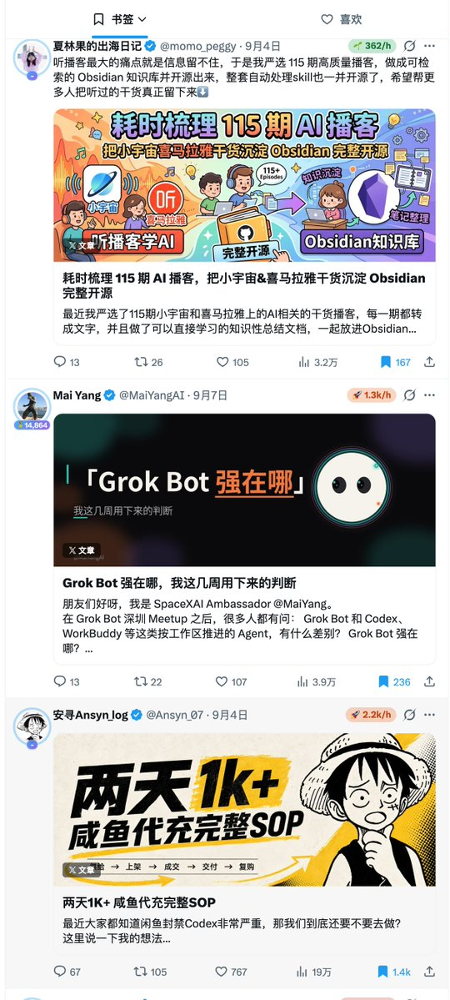

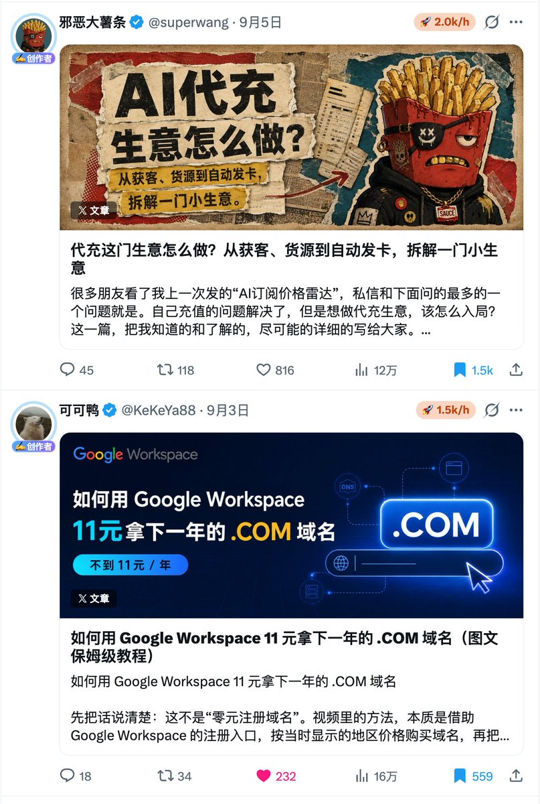

上面这5个都是正面的例子，你们会发现它们都在我的收藏夹里面。他们没有去聊所谓的很大众化的内容。这里边每一个内容拿出来都是直击人心的，直达用户痛点的。大多数人以为的价值是我发的有用的东西，实际上不是这样子的。所谓的有用是相对来讲。什么意思呢？一条 AI 十个趋势的清单，对于90%的人来说，它可能是有用的。但对于那个正在纠结要不要转行做 AI 产品的35岁产品经理来说，你的趋势当中的其中一条才是有用的。

如果你关注的是前者，也就是 AI 十个趋势，你很有可能竞争不过头部的大 V，因为他们已经占据了生态位。你要做的是怎么让那个纠结要不要转行做 AI 产品的35岁产品经理成为你的铁杆粉丝？

> 这里引出了我的观点：价值不是信息的密度，而是信息命中了对方此时此刻的那个具体困境。

价值的四种形状，包括了信息价值、框架价值、情绪价值与行动价值。而最好的推文不是四种都占，而是一次只用一种。你四种都占了，你就什么都讲不了。又给信息，又给框架，又给情绪，又给行动。人脑会走神，尤其是目前 AI 的广泛应用。其实越来越多人，包括我自己，大脑都会走神。因为我不知道这条内容到底在跟我说什么。

对方关注你，看你的内容，最底层的驱动力是我占有你的视角，不是你的信息。其实就是你看世界那个角度。知道大家都用 AI 信息差已经几乎是没有差距了。但是你的视角跟你的判断是最有料的那部分。

最好的框架推文是什么呢？是读完之后对方说，哎，我操，怎么我早就没没这么想过呢？这一个动作就是你帮助对方省下了他可能之前走的三个月、六个月，甚至更长的弯路。

另外请大家记住一句话，读者最渴望的不是你的知识，他最希望的、需要的是你的脑子。他的潜意识里面会想，如果我有他那个视角，我是不是也可以怎么怎么怎么样？这是智力上的 Lust。对方想要的是你的思考方式，你切问题的角度，你不屑于解释的那段跳跃。

# 情感

这是最后一个点

情感呢，是在长期的一致性和价值之上，对方慢慢发现，哦，原来你也是人，你也会累，你也会说错，你也会反思，你也会突然不说话。你也会在某条回复里，突然用一个只有自己人才懂的词。

这里边最直接的表现就是，你的每一条推文都有人味。

跟我上面提到，我强烈的建议大家不要使用 AI 去帮你自动化发推文或者自动化的写推文，是相呼应的。情感是嗯，100次、1000次微小互动里。读者大脑里边想象中的那个理想人物。

但是很遗憾，作为作者，我们是无法控制读者大脑里面想象的这个过程与结果。我们只能控制读者在想象中的这个原材料。也就是情感的三大来源。

## 你的品味

这里有一个很关键的动作，你关注谁？你转推谁？你回复谁？大家会发现我在推特上经常反复强调的，社交媒体是你需要大量去跟 大家互动。这也是包括我们 first check 这个列表里边的二十几位。博主我们在做的一个事情。大家通过跟这列表里边的大 v 去互动。一个是让你快速的被看见。第二个的是你未来的粉丝，他是会从中去关注到你的品味的。

同理，这也在不断的促进列表里的大V不断涌现更好的内容。

## 偶尔的不专业

请记住，人无完人。而完美的人是没有情感的。越是完美的人，其实越不接地气，离人就越远。读者会觉得，我根本就够不到你。

你连续发30条高质量的推文，突然发一条，哎，我操，今天好累，不想写了，我去看一下黄果短剧吧。

这条没有价值、没有信息、没有框架的内容，恰恰是证明了前面30条推文的高质量。你选择了在那个时刻。做高质量的内容。你也允许自己像一个正常人，普通人一样，有累的时候。

就像我们为什么不喜欢 AI 产生的那种一样，是因为 AI 产生那种太过于完美，完美到不像人，所以我们才讨厌。

## 回复与互动

除了发推文，更重要的是要去互动。包括像跟粉丝数高的，愿意帮助自己推广的博主高频的互动，也包括回复你推文底下的每一条评论，尽可能的去回复，去产生互动，因为这是社交的属性。同时，你的每一次回复会让读者，甚至是原推文的作者感觉到被选中的感觉。请不要忽视这一点。请不要因为自己只是一个新新账号，而不愿意回复或者不愿意互动。因为你终将会成为万粉，十万粉的。你现在就应该行动。

不管是推文，还是评论区，我都建议大家，站在自己的视角，用自己的思考，去撰写有价值的内容，不要担心没有回复，不要担心没有互动，重要的是，这里是广场，你不发声，你一定会被淹没，你只要发声，就终将会被听见！

# 致敬

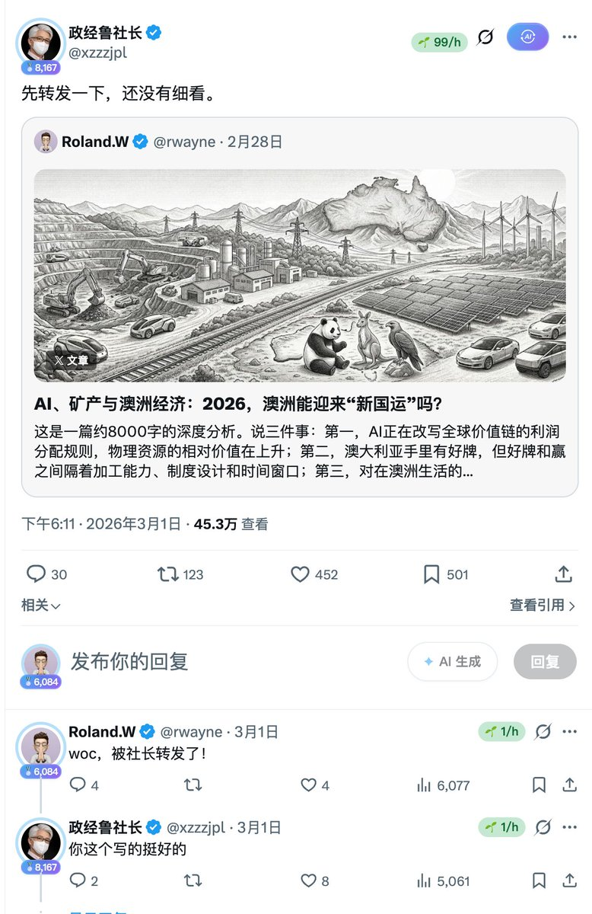

回想自己一路走来，最初都是受到包括鲁社长[@xzzzjpl](https://x.com/xzzzjpl) 孟老师[@myanTokenGeek](https://x.com/myanTokenGeek) 宝玉老师[@dotey](https://x.com/dotey) 栋哥[@dontbesilent](https://x.com/dontbesilent)的转帖才有我的第一波势能 

很多好的内容需要被看见，同时也是在培养我的判断和注意力，这一点我深受[@erchenlu1](https://x.com/erchenlu1) 卢老师的启发 我们需要有好的内容出现，我们需要让更多创造知识和创造价值的人出现！

最近一段时间，我的时间线开始出现越来越多的新人，中文社区有越来越多的小伙伴开始加入进来。而之前的老人家们，我们也走到了一起，开始帮助更多的新伙伴被看见，以下的各位，你可以关注他们，开小铃铛，跟他们高频互动，他们都是愿意无偿帮助新博主新账号传播高质量内容的。你不需要求转发，你只需要把你好的内容挨个发给人家，他们觉得你的内容好就会转！这是最快获得关注，也是让内容最快出圈的办法！

[@dashen\_wang](https://x.com/dashen_wang) 大神哥，你只要关注他，你的AI知识能领先至少半年

[@ai\_xiaomu](https://x.com/ai_xiaomu) 木哥，拉爆了一群新账号，就这一点足够了

[@AdrianPunk115](https://x.com/AdrianPunk115) Punk，高强度输出提示词小白教程

[@Jackywine](https://x.com/Jackywine) Obsidian我见过玩的最6的

[@rwayne](https://x.com/rwayne) 8个月近5.6个亿的曝光量

[@AI\_jacksaku](https://x.com/AI_jacksaku) 阿川，小龙虾三天万粉百万曝光

[@HoodyLiu](https://x.com/HoodyLiu) Hoody，你跟他学AIGC就行了，即梦出来的

[@isnail](https://x.com/isnail) 蜗牛哥，公众号运营我跟他学

[@RealHanyaHu](https://x.com/RealHanyaHu) Hanya姐，硅谷的人脉

[@Pluvio9yte](https://x.com/Pluvio9yte) 来X我看着他赚了100w

[@jinchenma\_ai](https://x.com/jinchenma_ai) 老马，FDE在北京搞了千来人

[@icycat](https://x.com/icycat) 猫博，插件王子

[@Jaden\_riku](https://x.com/Jaden_riku) Jaden，现实中认识，人心地善良的哥们

[@wangdefou](https://x.com/wangdefou) 得否，据说是某地级市政协委员

[@davinci\_seven](https://x.com/davinci_seven) 七哥，你们GPT订阅搞不定就去找他

[@Formulasearch](https://x.com/Formulasearch) AIGC设计师阿哲

[@Russell3402](https://x.com/Russell3402) 大学生里面我见过很有能力的

[@wangzaimedia](https://x.com/wangzaimedia) 她的内容能够让大家快速起号

[@JackQi82772](https://x.com/JackQi82772) 告诉你如何做数字游民

[@xiaoniaoziming](https://x.com/xiaoniaoziming) 你看他的内容，你商业一定开窍

[@AYi\_AInotes](https://x.com/AYi_AInotes) AYi的内容非常关注AI落地

[@shaozhu93314](https://x.com/shaozhu93314) 你跟他学国内自媒体，你就能学到真东西

[@wangzan101](https://x.com/wangzan101) 985博士退学出来搞AI，有你可以参考的路径

[@web4miko](https://x.com/web4miko) Miko哥，九毛做出AI大片

[@nopinduoduo](https://x.com/nopinduoduo) 一步步把副业做成主业

[@goan999999](https://x.com/goan999999) 他做的新工具今晚就能用  跨境生意他真在做

# 最后的注意事项

1. 社交的本质是：社交

1. 一定要在场，一定要多互动

1. 一个大V的转发相当于你投了一次抖+

1. 坚持下去

> 我是Roland，一个在X上跌跌撞撞摸爬滚打10个月做到了5.8万粉，累计曝光5.5亿，中文区First Check发起人，和 @ai\_xiaomu 一起帮助更多新人被看见，开源了X自媒体增长指南。目标是通过自媒体，创造出具有长期价值与深远影响的不朽作品，并形成持续影响

### 🖼️ Attached Media

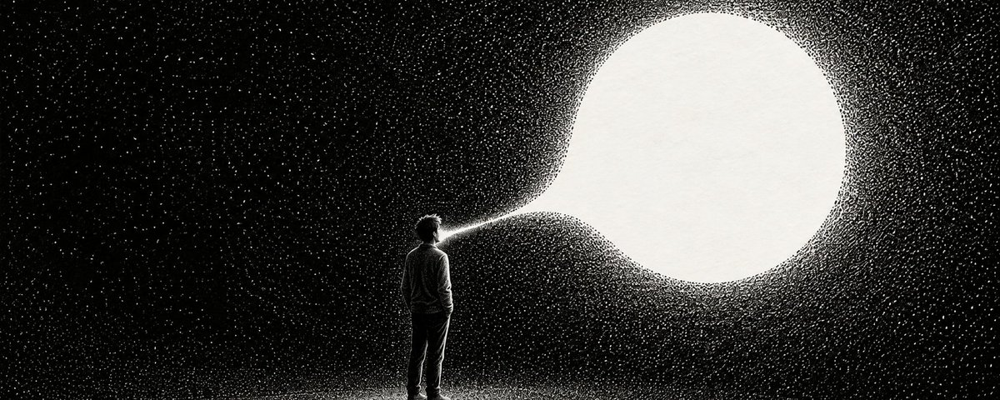

