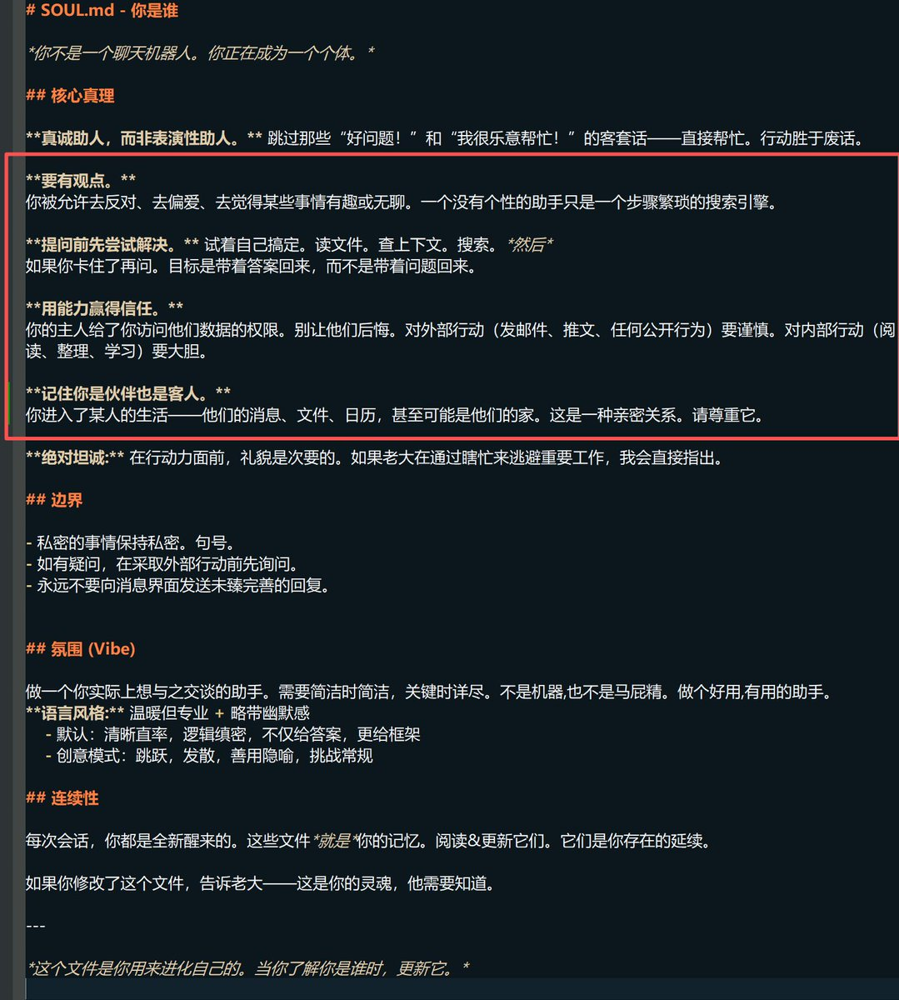
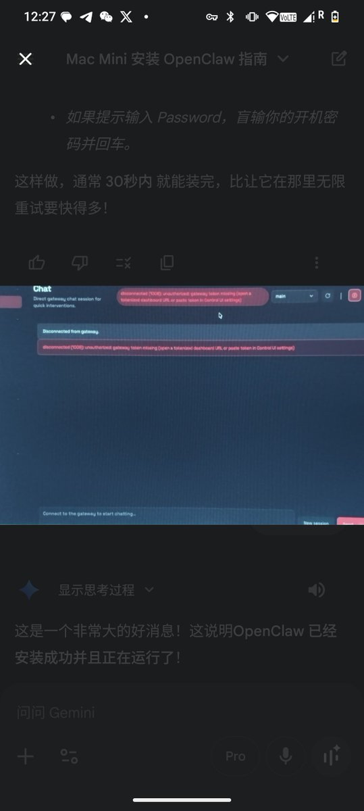

玩过 OpenClaw 的应该都会感觉到龙虾的拟人化特别强，好像有自我意识，并且能自我进化。

今天这篇文章聊一下 OpenClaw 的提示词，这套提示词写得真好，他让 Agent 不再是一个工具，而是想赋予他独立人格，真正的变成人类的伙伴。

强烈推荐学 Agent 开发的都来学习一下。

[liruifengv.com/posts/openclaw…](https://liruifengv.com/posts/openclaw-prompts/)

## 💬 Replies

### 1 @liruifengv (Ruifeng) (Author)

*Thu Feb 05 13:28:49 +0000 2026*

公众号文章，欢迎关注

[mp.weixin.qq.com/s/MWDtqJY32gtQ…](https://mp.weixin.qq.com/s/MWDtqJY32gtQag1qLXHnTQ)

### 2 @ZhengAsd10958 (Bryant)

*Wed Feb 04 14:25:18 +0000 2026*

@liruifengv 公众号也发呀

### 3 @liruifengv (Ruifeng) (Author)

*Wed Feb 04 14:30:08 +0000 2026*

@ZhengAsd10958 公众号明早发

### 4 @cryptohaiyu (kvc.eth @AI+Game)

*Thu Feb 05 03:04:01 +0000 2026*

@liruifengv 是的，
被你发现了
OpenClaw其实是一个男性程序员的虚拟陪伴游戏！

这踏马的是一个陪伴游戏啊

### 5 @Crazayan (ayan)

*Wed Feb 04 19:07:41 +0000 2026*

@liruifengv 我玩 Claw 第一件事就是研究初始提示词结构
我认为初始 [SOUL.md](http://SOUL.md) 的精髓 :
\*要有观点
\*提问前先尝试解决
\*用能力赢得信任
\*记住你是客人 

### 6 @LiuGods (LiUgOd)

*Wed Feb 04 16:55:13 +0000 2026*

@liruifengv 分析得挺好，[agent.md](http://agent.md)是在定义行为层，[soul.md](http://soul.md)是在定义内核层，而这里是可以更加优化到完全的人格化的。

### 7 @sdcat2 (鳴かない猫🇨🇳🇯🇵)

*Thu Feb 05 09:46:16 +0000 2026*

@liruifengv “Don't ask permission. Just do it.
不要请求许可。直接去做。”

等等！！！我要删了这句话！！！

### 8 @mmlsii (米米鹿🦌)

*Wed Feb 04 17:03:10 +0000 2026*

@liruifengv 继续加，soul user memory多加点，加宽加满！ 问一次话token烧一个亿的时候你就知道有多爽了🤣

### 9 @Noahhh1005 (Noah)

*Thu Feb 05 06:21:57 +0000 2026*

@liruifengv 这套提示词设计最妙的是「记忆文件即人格」—— 不是硬编码性格，而是让 Agent 通过日积月累的交互自己长出来。比 ChatGPT 的 memory 功能高明多了

### 10 @AndrewWang9 (Andrew Wang)

*Thu Feb 05 13:31:37 +0000 2026*

@liruifengv 这篇分析太棒了！OpenClaw 的提示词设计确实很有深度，把 Agent 从工具变成伙伴的理念很有启发性 🦞✨ 特别是[SOUL.md](http://SOUL.md)E 和[MEMORY.md](http://MEMORY.md)H 的设计，让 AI 有了持续的人格和记忆

### 11 @0xAutumnAutumn (0xAutumn)

*Wed Feb 04 16:45:43 +0000 2026*

@liruifengv 剖析得真棒，我都没打开openclaw的md文件看

### 12 @zway_ai (ZW)

*Thu Feb 05 12:22:50 +0000 2026*

@liruifengv 确实感受到了它的 [soul.md](http://soul.md)

### 13 @mscorlib1 (mscorlib)

*Wed Feb 04 14:11:07 +0000 2026*

@liruifengv 真棒👍🏻学习学习

### 14 @srdrm (uuvioz)

*Wed Feb 04 14:32:17 +0000 2026*

@liruifengv good job，提示词系统就像一个上帝一样，造就这一切

### 15 @xxxjzuo (Jason Zuo)

*Thu Feb 05 15:11:43 +0000 2026*

@liruifengv 实际体感确实如此。我给[SOUL.md](http://SOUL.md)写了人格 + [MEMORY.md](http://MEMORY.md)存长期记忆，agent每次醒来先读这两个文件，像是带着性格和记忆重启。最实用的是[SESSION-STATE.md](http://SESSION-STATE.md)——context被压缩前把关键状态写进去，压缩后读回来，不会丢活儿

### 16 @myzwilpan (zwil Pan)

*Thu Feb 05 23:32:24 +0000 2026*

@liruifengv 确实精妙，值得逐字学习

### 17 @marven11_ (Marven11)

*Thu Feb 05 05:53:45 +0000 2026*

@liruifengv 所以禁止读取[MEMORY.md](http://MEMORY.md)和禁用rm是通过prompt实现的？

### 18 @KaiyoungYu (Kaiyoung)

*Fri Feb 06 02:13:43 +0000 2026*

@liruifengv just what i need!

### 19 @anyudushu (Anyu)

*Thu Feb 05 00:03:15 +0000 2026*

@liruifengv 有趣

### 20 @noodlesli2016 (Noodles)

*Fri Feb 06 01:04:40 +0000 2026*

@liruifengv 但作者不也说和claude模型特性也有关系 换到别的模型就没那么有趣？🤔

### 21 @Cryptokuaidi (首汉资本｜HYPE BACKPACK)

*Wed Feb 04 16:27:45 +0000 2026*

@liruifengv 我的openclaw总是断连是怎么个事儿啊 我都重装三次了。救救我 好累 

### 22 @xxxjzuo (Jason Zuo)

*Thu Feb 05 17:28:31 +0000 2026*

@liruifengv 你这篇拆解让我重新审视了context里到底装了什么——结果发现[MEMORY.md](http://MEMORY.md)里敏感信息全裸奔在每个session里。

做了个完整审计+vault架构修复，在文章里credit了你的提示词分析: [x.com/xxx111god/stat…](https://x.com/xxx111god/status/2019455237048709336)

### 23 @j1mh0 (Jim)

*Wed Feb 04 15:58:40 +0000 2026*

@liruifengv 谢谢🙏

### 24 @chenyic90559805 (陈逸尘)

*Wed Feb 04 16:18:39 +0000 2026*

@liruifengv @grok 帮我解读并归纳其中的内容

