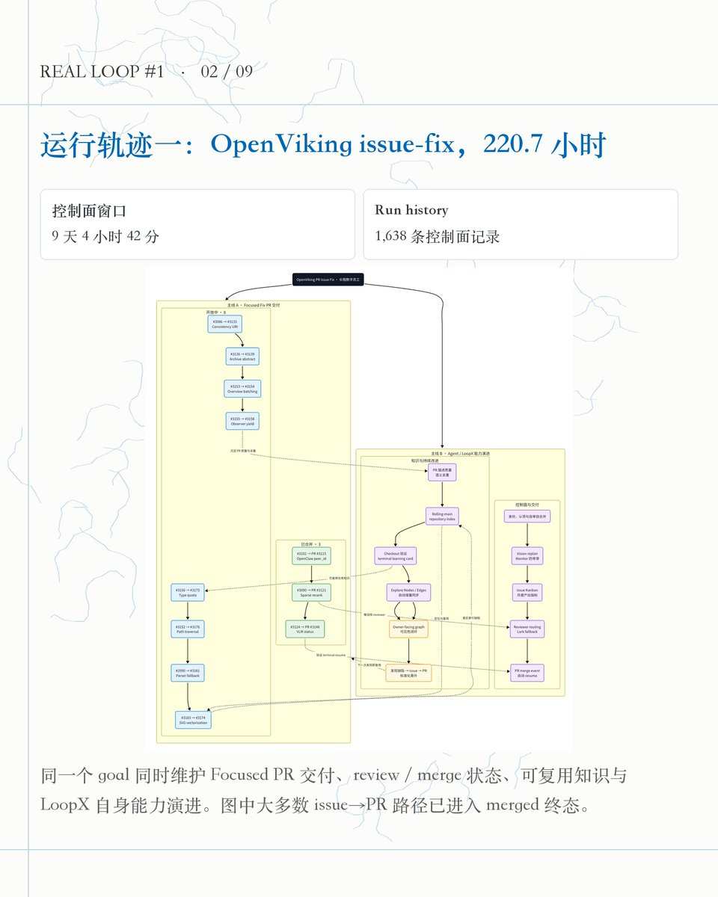
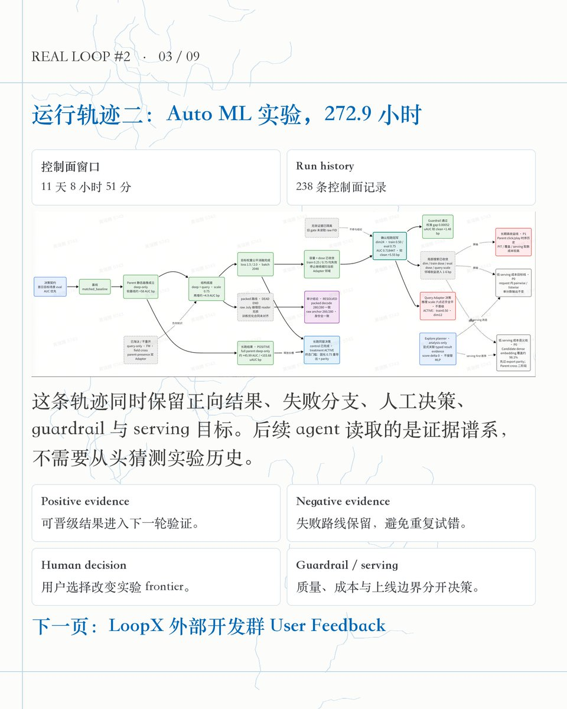
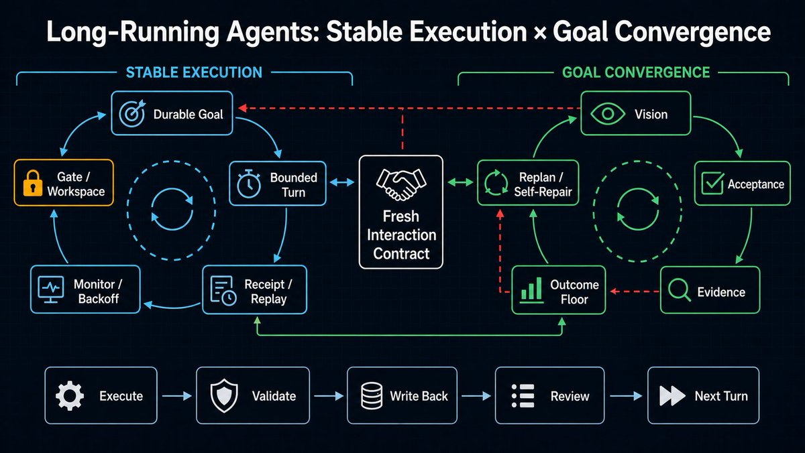
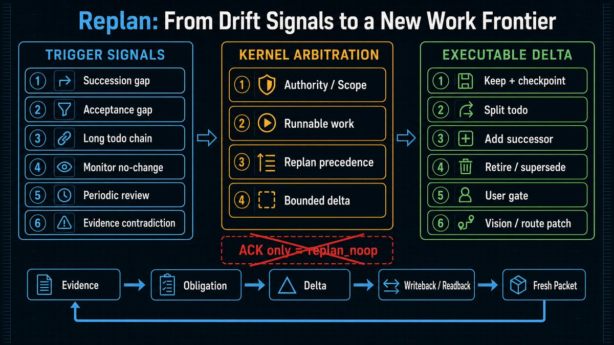
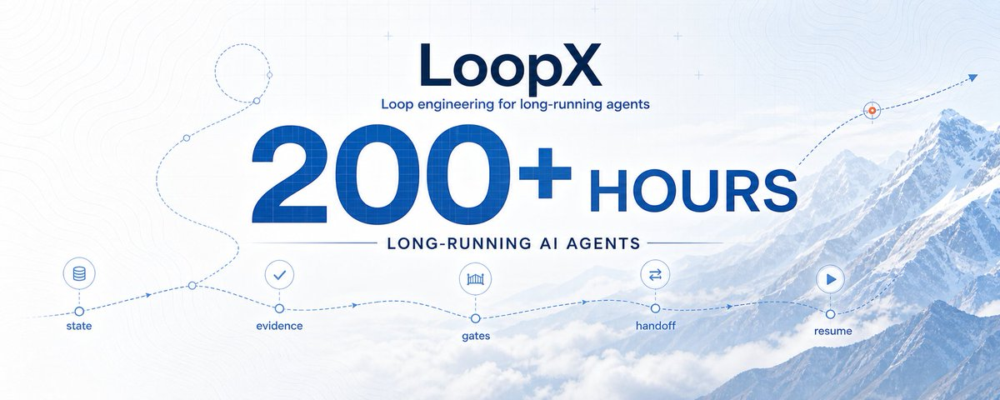

# 📰 AI Agent 连续运行 200+ 小时：LoopX 如何让长程执行不失忆、不漂移

我开源了 LoopX，一个面向超长程 Agent 的 control plane。

目前，两条真实 Agent trajectory 已经连续运行了 220.7 和 272.9 小时。它们围绕同一个 goal 持续生成、验证和交付结果；中间经历等待、人工反馈、writeback、模型切换与 resume，执行链仍然保持连续。对 long-running Agent 来说，这就是连续执行 200+ 小时。

这两条轨迹把 Agent 系统带到了一个新的工程尺度：一次模型调用可以只有几分钟，一个 goal 却要持续工作十天；模型、session 和 host 都可以更换，目标、证据、权限与下一步之间的因果链必须保持稳定。

LoopX 的技术主张是：模型上下文有限，长程 Agent 需要外置结构化状态。每次模型调用只完成一个 bounded Turn，控制面负责把这些有限调用组织成可以持续推进、验证、等待和恢复的执行系统。

这也是 LoopX 的目标：长程任务无人干预时能跑稳，有人干预时能跑好。

# 200+ 小时改变了什么

短任务里，聊天上下文几乎就是任务现场。模型读代码、修改文件、运行测试，然后返回结果。

任务跨天之后，现场会分散到代码仓库、PR、CI、实验平台、文档、用户反馈和权限关系中。外部世界也会继续变化：reviewer 提出新意见，测试从 pending 变成 failed，上游提交制造冲突，实验结束但结果无效，用户又修改了 acceptance。

此时，长上下文只能帮助模型看到更多历史，无法自动回答五个控制问题：

1\. 哪个系统拥有当前事实？

2\. 哪个 Agent 有权推进哪一部分工作？

3\. 这次工具调用是否形成了可接受的结果？

4\. 当前应该继续、等待、问人、replan，还是结束？

5\. 进程中断后，下一轮从哪里恢复？

Codex 的 /goal 已经把 objective 和 goal lifecycle 外置，并在末端判断 complete 或 blocked。LoopX 在这个基础上继续外置过程状态：todo、authority、evidence、gate、quota、cadence、handoff 与 recovery。

可以把两者的关系压成两行：

Native Goal = objective + goal lifecycle + completion audit

LoopX State = goal boundary + work graph + authority + evidence + cadence + recovery

前者让 Agent 不要过早停下，后者把“下一轮如何继续”变成结构化协议。

# 一块给 Agent 的可执行 Kanban

如果只用一个产品概念介绍 LoopX，我会说它是一块面向长程 Agent 的可执行 Kanban。

普通看板展示“谁在做什么”。为什么现在不能开始、什么证据才算完成、外部条件没变化时何时再看、谁有权批准高风险动作，这些状态通常仍然保存在人脑里。

Agent 无法长期依赖这层隐含记忆。LoopX 的一张卡片因此不只包含文本和完成状态，还携带稳定 identity 与路由语义：

todo identity + role + priority + task class + action kind

\+ claim / lease

\+ required capability

\+ repository / write scope

\+ decision scope / gate

\+ successor / supersede / resume condition

\+ evidence / completion rationale

其中，advancement\_task 表示可以推进目标的工作；user\_gate 表示需要用户提供方向、权限或风险判断；continuous\_monitor 表示到期后只观察一次外部状态；blocker 保存阻塞事实与恢复条件。

Runnable、Waiting、Review、Done 是这组事实的 projection。修改展示列不会直接改变长期事实，一次合法的“移动卡片”需要完成一条受控 transition：

观察事实

  -&gt; 领域判断

  -&gt; Kernel 决策

  -&gt; 有界执行

  -&gt; 独立验证

  -&gt; 持久写回

  -&gt; committed-state readback

  -&gt; successor / wait / ask / replan / terminal

Kanban 提供可见工作面，control plane 定义卡片如何合法地移动。

# 六层架构：事实、判断、执行与展示各有 owner

长程系统最容易出现的架构问题，是多个组件同时保存一份“当前状态”。Dashboard 维护一套 status，Agent memory 维护一套进度，workflow 又维护一套 retry，最后没有任何一层能够解释哪份状态有权驱动下一步。

LoopX 把责任拆成六层。

## External Truth

GitHub 决定 PR 是否 merged，CI 决定 check 是否通过，实验平台决定 job 是否结束，文件系统决定 artifact 是否存在。控制面不能根据旧聊天内容改写这些事实。

## Domain State

Domain State 保存跨 Turn 仍有决策价值的紧凑领域事实，例如 PR revision、check fingerprint、实验 lineage、metric result 与 artifact identity。原始日志、完整 transcript 和大体积 verifier 输出继续留在外部系统或私有 runtime artifact 中。

## Capability Pack

Capability Pack 理解领域语义，并把 observation 翻译成有限的 typed proposal。例如：

checks\_pending       -&gt; monitor\_continuation

checks\_failed        -&gt; runnable\_successor

changes\_requested    -&gt; runnable\_successor

merged               -&gt; terminal\_candidate

dev\_lift\_only        -&gt; holdout\_successor

holdout\_clean        -&gt; promotion\_candidate

negative\_evidence    -&gt; retirement\_candidate

Capability 可以提出下一步，不能自行授予权限，也不能直接把 proposal 写成 Kernel truth。

## State Kernel

State Kernel 拥有跨领域生命周期：goal、vision、todo、claim、gate、quota、scheduler、evidence lineage、handoff 与 terminal closure。它会继续检查 agent identity、authority、capability、workspace、decision scope 和 continuation policy。

## Host / Runtime

Codex App、Codex CLI、Claude Code 或其他 managed runtime 负责创建 session、调用模型、执行工具和应用外部 effect。Runtime 是暂时的 worker，每次只拿到一个 bounded action。

## Projection

Status、Kanban、evidence graph 和报告是 read model。它们从 source state 重建，服务于人和 host 的观察、筛选与路由，不反向成为另一套事实源。

这套分层保留两个核心约束：领域能力可以增加专属判断，但不复制 todo、quota、gate 和 authority；Domain State 可以保存领域连续性，但 observation 必须经过 Kernel 才能形成可执行 transition。

# 稳定 Goal Identity 与分层状态

LoopX 用 goal 作为长程任务的 durable identity。Codex thread、Claude session、模型和 host 都属于某一轮 executor，可以中断、替换或旁路推进。

一个新 peer 接手时，需要恢复的是同一份 objective、authority boundary、open frontier、gate、next probe 和 stop condition。它不需要逐字复现旧 session 的推理过程。

为此，LoopX 把状态分成几类。

Registry 保存 goal identity、repository、registered peers、authority source、spawn policy、quota policy 和默认关闭的 capability 配置。

Event ledger 以 append-only event 保存已经提交的 transition，例如 todo\_added、todo\_claimed、operator\_gate\_recorded、evidence\_recorded、run\_refreshed 和 quota\_spent。事件带稳定 event\_id，支持幂等 replay、确定顺序与公开/私有 payload 分区。

Active state 提供人可读的 objective、边界、next action、user todo、agent todo 与 progress 工作台。它是重要的兼容面和 projection 来源，但结构化状态仍通过受控命令写入。

Domain State 保存 Issue-Fix、Auto Research、ML Experiment 等领域自己的紧凑连续性；它不拥有 quota、gate、claim 或外部写权限。

Run history 与 evidence index 保存每轮 classification、delivery outcome、artifact ref、validation、agent identity、successor 和 spend lineage。

Status / Dashboard 把上述事实压成 operator read model：哪个 goal 需要判断，哪个 todo 可运行，哪个 monitor 在等待，哪条 projection 需要修复。

这些状态层并不是几份互相覆盖的备份。Registry 拥有长期身份与策略，event ledger 拥有已经提交的生命周期事实，Domain State 拥有领域观察，Turn Journal 只拥有单次执行事务的恢复游标，Status 与 Dashboard 只负责读取。写入必须回到对应 owner 的受控 API：

external observation

  -&gt; capability normalization

  -&gt; transition validation

  -&gt; durable event / state write

  -&gt; projection rebuild

  -&gt; source-state readback

例如 Dashboard 把一张卡片显示为 Done，不会让 todo 自动完成；外部 provider 返回 success，也不会自动解除 gate。只有 canonical transition 写入并在 readback 中出现，下一轮 Kernel 才会把它作为事实。这样可以避免 Markdown、UI、memory 和 workflow 各自维护一份“当前状态”。

因此，一次恢复可以写成：

next decision

  = replay(committed project state)

  \+ inspect(fresh environment)

旧 transcript 仍可用于解释，但下一步由已提交状态和当前外部事实共同决定。

# 一次 Turn 的完整事务

长程稳定性最终落在每一轮的事务边界上。LoopX 把一次 Turn 组织成八个阶段。

## 1\. 读取当前 snapshot

每轮先读取 registry、todo、gate、monitor、vision、evidence、workspace 和 host capability。snapshot 会绑定 goal\_id、agent\_id、selected work 与 revision，避免后续结果写回到错误 lane。

## 2\. 编译 interaction contract

quota should-run 虽然保留了 quota 这个名字，实际承担的是 decision compiler。它按稳定顺序处理：

identity

  -&gt; goal authority / boundary

  -&gt; user decision scope

  -&gt; self-repair obligation

  -&gt; capability eligibility

  -&gt; workspace guard

  -&gt; frontier / continuation

  -&gt; interaction contract

  -&gt; scheduler hint

顺序本身就是安全语义。先选择 todo、后检查 workspace，可能让 host 在错误仓库开始写；只看 priority、忽略 decision scope，可能让 Agent 越过用户 gate。

## 3\. 分离三个交互通道

Interaction contract 同时输出三类责任：

• user\_channel：是否需要通知用户，以及具体问题是什么；

• agent\_channel：当前 peer 是否必须尝试、是否允许 delivery、primary action 是什么；

• cli\_channel：验证、refresh 与 spend 的写回顺序。

这使控制面能够表达组合状态。例如一个 P0 在等待用户决定，完全独立的 P1 仍可继续；用户收到具体问题，Agent 同时推进不依赖该 gate 的安全工作。

## 4\. 生成本轮 fresh packet

Codex App 的 heartbeat task body 可以保持稳定，只负责要求 executor 重新读取 LoopX CLI 真相。每次 Turn 的 packet 则从最新状态生成，包含当前 selected work、scope、gate、证据要求、停止条件与正确 CLI 命令。

稳定的是 host 入口，变化的是 CLI 返回的过程协议。

## 5\. 执行一个 bounded action

Runtime 只执行本轮被授权的动作，例如修改一个 focused patch、读取一次 PR 状态、运行一个实验或生成一份验证报告。大型目标通过 successor graph 推进，而不是让单个 session 持有无限循环。

## 6\. 独立验证结果

命令返回 0 只能证明进程成功退出。实现类工作还需要 diff、测试和目标行为；研究类工作还需要 metric、lineage、holdout 与 guardrail；外部 effect 需要 readback 证明它作用于正确对象。

## 7\. 持久写回并重新读取

结果、evidence、effect receipt、todo transition 与 vision checkpoint 写回 canonical state。随后重新读取 committed state，确认 projection 与 sink postcondition 已经成立。

## 8\. 记录 spend 与下一次唤醒

Quota slot 代表一次有效推进，不代表一次模型调用。只有 validated writeback 形成 material progress 后才 spend；guided preview、只读 status、scheduler ACK、monitor no-change 和 quiet no-op 都不 spend。

这条事务可以压成四条不变量：

observation != transition

proposal != authority

tool success != accepted progress

accepted progress = validation + durable writeback + committed readback

Turn Journal 只记录单轮事务走到了 host result、validation、writeback、spend 还是 scheduler ACK。进程中断后，从尚未完成的阶段继续；已经完成的外部 effect 不重复执行。它负责事务恢复，goal/event state 继续负责长期事实。

# 跑稳与跑好，是两组不同的机制

长程系统首先要跑稳：session 重启后能恢复，外部状态未变化时不会空转，已经执行的 effect 不会重复，越过权限边界的动作会 fail closed。

在这个基础上，它还要跑好：局部动作持续服务于长期目标，证据改变后能够调整路线，旧计划被证伪时不会机械执行，工作前沿耗尽时也不会把“没 todo”误判成完成。

跑稳：durable identity + bounded Turn + receipt + replay

     + monitor/backoff + gate/workspace boundary

跑好：vision + acceptance + evidence + outcome floor

     + replan + self-repair + independent quality gate

前一组机制保证执行链不断，后一组机制保证执行链仍在向正确方向收敛。Replan 是连接两组机制的关键 transition：它读取已经提交的证据，判断当前 frontier 是否仍然有效，再把新的长期判断写回成下一轮可以执行的工作图。

# 工作图、Peer 与权限边界

长程任务通常是一张动态工作图。Todo 之间通过 successor、supersede、dependency、resume condition 和 no-followup 连接，当前 runnable frontier 由多项约束共同计算：

priority

\+ task class

\+ decision scope

\+ claim / lease

\+ capability availability

\+ repository / write scope

\+ dependency / resume condition

= current runnable frontier

Claim、lease、capability、workspace 和 gate 分别解决不同问题。

• Claim 表示某个 peer 当前准备负责一项工作，减少重复劳动；

• Lease 在真实并发或排他资源场景提供带 TTL 的执行占用；

• Capability 说明当前 runtime 是否具备执行能力；

• Workspace guard 约束在哪个 repository、worktree 和 write scope 内操作；

• Gate 保存用户拥有的方向、权限与风险决定。

LoopX 当前采用 equal peer runtime。Registered agents 没有永久的 primary/side 层级，当前 ownership 来自 todo claim、continuation policy 或显式的 goal-local lifecycle authority。一次 task-scoped 协作不会自动获得长期权限。

Handoff 也遵循这套边界。它传递的是可恢复 frontier 与 lineage，而不是复制完整 transcript。新的 peer 读取 durable state 与 fresh environment 后，应该重建等价的 objective、authority、validation surface、next action 和 stop condition；后续业务执行前还要重新通过 quota、gate、capability 和 workspace guard。

# 等待、Monitor 与 Stateful Backoff

十天的长程任务不会连续处于 runnable 状态。CI、review、实验、用户判断和外部依赖都会制造等待窗口。

LoopX 用 continuous\_monitor 表达这类状态。Monitor 至少携带 target identity、next due time、上次 result fingerprint、连续 no-change 计数与 successor 规则。

一次到期 poll 只有三种主要结果：

1\. 外部事实变化：写入新 evidence，并创建 successor、gate 或 terminal candidate；

2\. 外部事实未变：更新 result hash、no-change counter 与 next due time，quiet no-op；

3\. Observation 无法形成可信结论：记录 blocker 或 repair obligation，不伪造进展。

未到期的 monitor 不调用强模型。到期但无变化的 poll 不 spend，也不反复输出“仍在等待”。Stateful backoff 按下面的 identity 保存连续等待：

goal + agent + lifecycle reason + monitor target / selected work

同一 identity 可以从 15 分钟逐步退避到 30、60 分钟；todo、gate、evidence 或 target 发生变化后，cadence 回到新状态的初始值。

Scheduler 仍然只是派生协议。LoopX 产生 cadence proposal，host 实际修改 RRULE 或下次触发时间，再用 proposal identity、reset token、实际 readback 写回 ACK：

proposal

  -&gt; host effect

  -&gt; host readback

  -&gt; durable scheduler ACK

ACK 证明宿主应用了本次 proposal，但它不构成业务 delivery，也不 spend。

这套 quiet contract 让系统在等待时保持 alive，又不会用高频空转把 token、日志和用户注意力耗光。

# 长程任务如何持续收敛：Evidence、Acceptance 与 Replan

稳定恢复解决了“还能不能继续”，长期收敛继续回答“当前路线还值不值得继续”。十天前制定的 todo 可能已经被新证据证伪；一个阶段完成后可能没有 successor；Agent 也可能连续做出局部正确、整体无效的动作。

LoopX 用 Vision、Acceptance、Evidence、Outcome Floor、Replan 和 Self-Repair 组成第二层反馈回路。

## Vision 提供跨 Turn 的方向基线

Goal 描述当前阶段要交付什么，bounded Agent Vision 继续保存该 peer 的 role scope、acceptance summary、advancement policy 与 replan triggers。它不会替 Kernel 选择本轮 todo，也不会授予权限；它为每次局部执行提供可复核的长期方向。

Vision

  -&gt; Goal boundary / acceptance

  -&gt; Todo frontier

  -&gt; bounded delivery + evidence

  -&gt; acceptance audit

  -&gt; continue / replan / vision patch / terminal

每次 material refresh 都要留下 vision checkpoint，结果只有三类：

1\. 新证据改变了方向，写入 bounded vision patch；

2\. 长期判断仍成立，写明与当前 evidence 对应的 unchanged reason；

3\. acceptance 已满足或旧路线失效，用 evidence 关闭、retire 或 supersede 当前 frontier。

缺少 checkpoint 会形成 vision\_checkpoint\_missing acceptance gap。这个 gap 不会粗暴冻结所有安全工作，但会阻止系统在局部 todo 做完后直接 terminal。它让“用户目标有没有悄悄变化”“当前路线是否仍服务于验收”成为每轮可检查的问题。

## Evidence 决定路线是否仍然成立

实现类 delivery 需要 artifact、focused validation、diff/commit lineage 与外部 readback；实验需要 code/data revision、metric receipt、holdout 与 guardrail；monitor 需要 stable target、fingerprint 与 changed/no-change receipt。

一次可信 refresh 会形成一条 proof pipeline：

work effect

  -&gt; machine-visible delta

  -&gt; refresh-state run record

  -&gt; projection / external readback

  -&gt; focused validation

  -&gt; spend-slot binds latest unconsumed delivery run

LoopX 同时记录 delivery scale 与 delivery outcome。一个 multi-file diff 可能仍是 surface\_only，一个很小但解开关键 blocker 的 transition 反而是 outcome\_progress。Outcome Floor 会识别连续的 surface-only、重复观察或 no-progress，要求下一轮推进 primary result，或者进入 self-repair。

这使 replan 的输入来自事实变化，而不是模型突然“换个思路”。PR checks、review、merge state，实验的 dev/holdout 结果，用户修改的 acceptance，乃至连续没有变化的 monitor，都可以形成带 identity 的 replan evidence。

## Replan 何时触发

LoopX 会从工作图和运行历史中寻找几类结构化信号：

• Succession gap：advancement todo 已完成，但没有 successor，也没有带证据的 no\_followup；

• Vision acceptance gap：当前 acceptance 仍未满足，同时没有能够缩小 gap 的 runnable frontier；

• Long todo chain：连续局部 todo 超过 bounded review threshold，需要检查是否陷入局部最优；

• Monitor no-change streak：同一个 monitor target 连续多次没有变化，继续轮询已经没有信息增益；

• Monitor frontier exhausted：推进工作已经耗尽，只剩 watch lane，系统需要决定继续观察、设置 expiry、创建 successor 或明确 blocker；

• Periodic review / no-progress：达到复盘 cadence，或连续运行记录显示重复动作、backlog mismatch、phase transition、stale evidence 或 evidence contradiction；

• External direction change：用户、reviewer 或权威外部系统改变了边界、验收或可执行条件。

这些信号只生成 replan obligation，不会直接授权任意新动作。Replan 仍然受到原有 goal boundary、user gate、capability、workspace 和 agent scope 约束。

## Replan 有明确的决策优先级

长程系统不能遇到一点新信息就推翻计划。Kernel 会先保护已有 authority 与可执行前沿：

existing scoped obligation / blocking handoff gate

  -&gt; ready deferred successor / blocking user work

  -&gt; succession or acceptance gap

  -&gt; bounded long-chain review

  -&gt; stalled monitor / exhausted watch frontier

如果已有 deferred successor 满足恢复条件，系统直接恢复它；如果用户 gate 拥有下一次决定，replan 不能绕过去；如果当前 agent 仍有合法的 runnable advancement，一般优先推进真实工作，不让 monitor-derived replan 抢占前沿。

反过来，monitor quiet 只是一项候选决定。某条 lane 已达到 no-change threshold、当前 advancement 又为空时，replan precedence 会覆盖 quiet，迫使系统处理“为什么一直没有新信息”，而不是继续把相同 poll 排到下一轮。

P0 等用户决定、独立 P1 仍可运行时，interaction contract 会同时输出具体 user question 和 P1 delivery。Replan 只重组受影响的 decision scope，不把局部 gate 扩大成整个 goal 的暂停键。

## Replan 必须写出新的工作前沿

一次有效 replan 至少要产生一种 machine-visible delta：

• keep 当前路线，同时声明新的 checkpoint 或 watch expiry；

• split 过长或耦合过强的 todo；

• add 能缩小 acceptance gap 的 successor；

• retire / supersede 已被证伪、重复或过期的分支；

• 把等待外部事实的工作转为 monitor，并写清 resume condition；

• 建立具体 user gate，给出 decision scope 与安全 fallback；

• patch Vision、acceptance 或 priority；

• 修复 capability / workspace route，让已有工作重新可执行。

replan evidence

  -&gt; bounded frontier delta

  -&gt; durable writeback + readback

  -&gt; fresh interaction contract

  -&gt; new selected work / wait target

  -&gt; new scheduler identity

只记录“已 replan”不会清除 obligation；没有 successor、resume condition、Next Action、gate 或 vision patch 的结果会被识别为 replan\_noop。这条规则把 replan 从一段模型反思变成可执行的状态 transition。

## Replan、Self-Repair 与 Dreaming 各管一层

Replan 调整当前 goal 的工作图。Self-Repair 处理控制面自身导致的停滞，例如 projection 丢字段、claim/lease 漂移、workspace route 错误、host effect 没有 receipt，或者 scheduler 一直重复同一个无效 cadence。Dreaming 可以探索未来方向并产生 proposal，但不会覆盖当前 runnable frontier。

连续两轮没有 material progress 时，Self-Repair 会系统审计：

exact interaction contract

  -&gt; agent-scoped evidence and latest run

  -&gt; selected todo / claim / lease

  -&gt; capability / workspace / gate

  -&gt; projection / host / scheduler effect

  -&gt; lowest-layer repair delta

  -&gt; focused validation + readback

Repair 不通过降低 gate、猜测缺失状态或把 no-progress 改名为 success 来恢复。错误来自 projection，就修 projection 与回归测试；错误来自 host receipt，就补 effect/readback 合同；路线本身失效，才回到 replan。

## Terminal 也是一次 Acceptance 决策

open todo count == 0 只说明当前列表暂时为空。Terminal closure 还要检查 user gate/action、active monitor、successor/handoff、replan obligation、acceptance gap、可重试的 projection postcondition、blocker/resume route 和带证据的 no\_followup。

这套闭环允许模型犯错、计划过期、外部世界变化，也允许用户中途改方向。系统不会要求一开始就写出十天内完全正确的计划；它要求每个阶段都留下足够证据，能够判断继续、等待、转向、修复或结束，并把判断写成下一轮可以执行的状态。

# 分层质量门禁

长程 Agent 的错误经常不表现为函数报错。它可能选错 todo、误解 gate、在 monitor 无变化时重复 spend、丢失 scheduler ACK，或者用旧 revision 的测试结果给新 artifact 背书。

因此，质量门禁首先需要一个独立语义 oracle：给定 source facts，写清正确 decision、禁止结果、authority owner 和 fail-closed 条件，再让实现接受检验。不能从当前程序输出反推“期望值”。

LoopX 的质量面由近到远分层：

1\. unit / contract：验证 schema、pure transition 与非法状态拒绝；

2\. focused deterministic smoke：验证一条已交付 CLI 或跨模块路径；

3\. public-safe decision replay：从独立 source facts 重放最终 decision；

4\. risk-based canary：按 Git diff 选择最小跨 surface 组合；

5\. actual-default model qualification：验证真实模型能理解当前默认 packet；

6\. exact-commit release qualification：确认所有回执属于同一 clean commit、tree 和 version；

7\. matched outcome baseline：只有在声明 benchmark 或长程收益时才要求对应证据。

模型行为通过不能覆盖 deterministic contract failure，完整测试通过也不能替代针对已知故障的 focused regression。每一层证明自己拥有的语义，最终由 acceptance audit 合并成 delivery decision。

# PR Issue Fix：一条跨多天的执行链

以开源仓库 PR issue fix 为例，完整链路会经过以下状态。

1\. GitHub 提供 issue、repository、checks、review 和 merge state 等权威事实；

2\. Issue-Fix Capability 读取 issue，生成 feasibility 与 stable domain key；

3\. Kernel 创建 fix\_pr advancement todo，检查 scope、claim、capability 与独立 worktree；

4\. Runtime 复现问题、实现 focused patch、运行聚焦验证；

5\. commit、diff、test 与 PR URL 形成 delivery evidence，外部 PR effect 经过 readback；

6\. 原 todo 完成，创建 PR lifecycle monitor；

7\. checks pending 时进入 quiet wait，未到期不唤醒模型；

8\. checks failed、changes requested 或 branch conflict 被 Capability 翻译成 bounded successor；

9\. 新 peer 重新读取当前 revision 与 reviewer evidence，修复后写入新的 lineage；

10\. PR merged 只形成 terminal candidate，Kernel 仍要完成 acceptance、notification、successor 与 no-followup audit。

这条链可以跨越多个 session、多次人工 review 和多次上游变化。GitHub 始终拥有 PR 真相，LoopX 保存的是下一次决策所需的控制状态。

因此，Agent 不需要每隔几分钟重新读完整对话并猜测“现在应该干什么”。它读取 fresh PR observation、Domain State 和 Kernel frontier，执行一条合法 transition，再回到控制面。

# Auto ML Experiment：从候选生成到晋级

Auto ML 的领域事实与 PR 完全不同，但可以复用同一套 Kernel。

一个实验 goal 会保存 baseline、metric、protected scope、budget 和 promotion policy。Agent 在当前 frontier 中领取 hypothesis todo，Explore Harness 运行一个隔离 candidate，Domain State 记录 config、code revision、data lineage、artifact 与 metric receipt。

Dev 指标改善只能形成 holdout successor。独立 evaluator 在受保护数据上完成验证，并检查质量护栏、成本和稳定性；满足条件后才生成 promotion candidate。失败实验不会从轨迹中消失，它会作为 negative evidence 或 retired branch 留在 Explore Graph，阻止后续 session 在上下文重置后重复同一条失败路线。

Explore Graph 保存跨轮仍有决策价值的节点与边：hypothesis、candidate、experiment、positive/negative evidence、lineage、gate 和 successor。Explore Harness 负责生成、执行、评估和淘汰候选，LoopX 继续拥有 todo、authority、quota、evidence 与 cadence。

当实验平台仍在运行时，monitor 只观察 job identity 与 result fingerprint；没有新结果就 backoff。结果到达后，Capability 把 observation 翻译成 holdout、retry、retirement、promotion gate 或 terminal candidate。

这就是 272.9 小时 Auto ML trajectory 的执行结构：模型在每个 Turn 内完成局部判断与动作，控制面让 candidate lineage、验证标准和下一跳在十天里保持连续。

# 干活过程中的系统能力演进

超长程任务会暴露 capability gap：当前模型知道下一步需要什么，但现有工具、provider 或版本无法完成它。

LoopX 可以把系统能力演进建模为同一个 goal 下的受控工作分支：

capability gap evidence

  -&gt; feature todo

  -&gt; scoped implementation worktree

  -&gt; deterministic tests + canary

  -&gt; versioned provider / offline-online artifact

  -&gt; compatibility and release gate

  -&gt; capability registration

  -&gt; original todo resume

例如 Auto ML 优化发现现有 evaluator 缺少一个关键统计量，Agent 可以创建 feature todo，开发新的 evaluator 版本，验证离线行为，再经过 owner gate 发布；原实验随后绑定新版本继续推进。旧版本、验证结果、promotion 条件和 rollback route 都保留在状态中。

“完成当前工作”与“升级完成工作的系统”由此可以出现在同一条长程轨迹里。新能力不会因为由 Agent 自己开发就自动获得生产权限，feature delivery 与业务 promotion 仍然经过各自的 authority 和 evidence gate。

这也对应 tools、parameters 和 harness 的不同价值：垂直领域的专用 tools 决定能力能否落地；通用短任务里，更强 parameters 决定单步上限；通用超长程任务里，harness / control plane 决定能力能否跨时间稳定兑现。

# 200+ 小时后，Agent 仍然在推进同一个目标

连续执行的关键，是 goal、状态、证据、权限边界和下一步之间的因果链没有断裂。模型可以暂停，runtime 可以重启，人工可以插入反馈，外部系统也可以发生变化；下一轮 Agent 仍能从已确认的事实继续生成有效行动和交付物。

LoopX 把这种连续性拆成一组可复核的工程性质：

• goal identity 跨 session、模型和 host 保持稳定；

• event、evidence 与 effect receipt 支持幂等 replay 和 lineage 审计；

• todo frontier 由 authority、capability、workspace、gate 和 continuation 共同计算；

• 每个 Turn 有界执行，结果在验证、写回与 readback 后才计为进展；

• monitor 用 quiet contract 与 stateful backoff 管理等待；

• acceptance gap、replan 与 self-repair 让系统在偏离后重新收敛；

• projection 可以重建，人能随时看见谁在做什么、谁在等什么、哪一步需要判断。

目前，LoopX 已经用于 auto PR issue fix、Auto ML experiment 和 auto research 等长程场景。不同领域拥有自己的事实、capability 和 evaluator，复用的是同一套 State Kernel 与 transition discipline。

模型决定单步上限，控制面决定长期协作下限。

LoopX 要解决的，就是让 Agent 连续工作数百小时之后，仍然知道目标边界、已经证明了什么、当前有什么权限，以及下一步该做什么。

LoopX：https://github.com/huangruiteng/loopx

# 技术来源

• 真实长程轨迹与证据：https://github.com/huangruiteng/loopx#real-long-running-loops

• Goal 与控制面架构：https://github.com/huangruiteng/loopx/blob/main/docs/development/control-plane-course/00-goal-control-plane-architecture.md

• 第一次真实 Loop：https://github.com/huangruiteng/loopx/blob/main/docs/development/control-plane-course/01-first-real-loop.md

• Canonical state 与恢复：https://github.com/huangruiteng/loopx/blob/main/docs/development/control-plane-course/02-state-substrate.md

• Todo 工作图与 Peer 协作：https://github.com/huangruiteng/loopx/blob/main/docs/development/control-plane-course/03-work-graph-and-peers.md

• Quota decision kernel：https://github.com/huangruiteng/loopx/blob/main/docs/development/control-plane-course/04-quota-decision-kernel.md

• Host、scheduler 与 stateful backoff：https://github.com/huangruiteng/loopx/blob/main/docs/development/control-plane-course/05-host-scheduler-and-heartbeat.md

• Evidence、refresh 与 self-repair：https://github.com/huangruiteng/loopx/blob/main/docs/development/control-plane-course/06-evidence-refresh-and-self-repair.md

• Agent 自主交付质量门禁：https://github.com/huangruiteng/loopx/blob/main/docs/development/control-plane-course/08-autonomous-agent-quality-gates.md

### 🖼️ Attached Media

## 💬 Replies

### 1 @sunflowers0607 (向阳flower)

*Mon Aug 03 16:40:36 +0000 2026*

@huangruiteng 会遇到频繁打到maxtoken的问题吗

### 2 @huangruiteng (Ruiteng Huang) (Author)

*Mon Aug 03 16:43:11 +0000 2026*

@sunflowers0607 GPT 200刀套餐的话还好，我目前用两个 200 刀套餐，并行 2-5 个 loopx agent 长程跑

### 3 @AgiRay1015 (AI磊叔)

*Mon Aug 03 09:15:51 +0000 2026*

@huangruiteng 长程 agent 跑到这一步，大家 finally 开始正视“控制面”这件事了。真难的从来不是让它跑起来，是跑了三天以后状态还干净、监督还接得住、人能随时接管。

我最近也在写《关于 Loop Engineering 的 100 个问题》
[my.feishu.cn/wiki/FC6ZwnwWW…](https://my.feishu.cn/wiki/FC6ZwnwWWi0dWpke56act61gnUd)

### 4 @ejsk33382 (靖)

*Wed Aug 05 00:11:37 +0000 2026*

@huangruiteng 叫党哥看了吗😂

