# 📰 万字长文：Deepseek Harness 一文全看懂！！

> 本文长度约2万字，附有很多名词解释与图片表达，让想学AI但苦于不懂术语、基础不好的人或懂技术但不太了解DSH的人，都能获得对Deepseek Harness的深度认知！！

你让 AI 完成一项工作：“查完这 10 家公司的公开资料，整理成表格，比较产品差异，再写一份分析。”

模型给了你一份漂亮的计划，并说要开始执行任务，但任务刚开始，问题就来了：

- 谁来打开网页和下载文件？

- AI 怎样知道自己已经查过哪些公司？

- 搜索失败以后，它会重试、换来源，还是直接编一个答案？

- 它准备修改文件时，谁检查路径和权限？

- 任务执行到一半中断，下次从哪里继续？

- 它删错文件后，开发者能不能还原当时的操作？

这些问题很少由大模型本身解决。模型接收一组输入，生成文字或工具调用意图，由模型外面的程序负责准备上下文、开放工具、执行动作、保存状态和处理失败。

我们把这套程序叫做 Harness。

DeepSeek 在官方页面上写了一个公式：

> Agent = Model + Harness

如果把 Agent 当成一名数字员工，模型相当于员工的脑子。Harness 则是电脑、办公软件、文件柜、操作手册、权限制度、项目经理和工作记录。

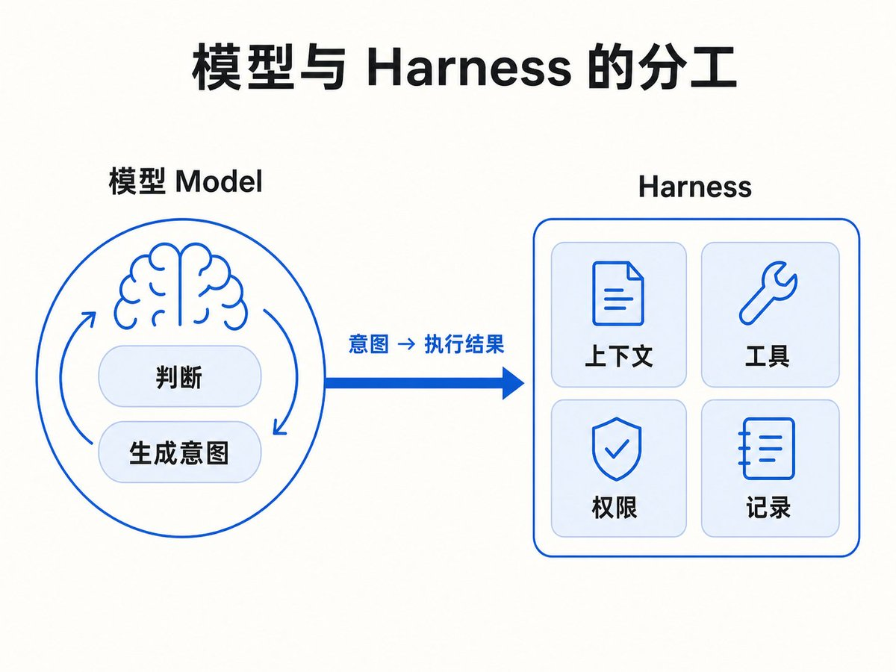

同一个人坐进两间配置不同的办公室，工作结果会差很多。一个人只能口头回答问题；另一个人能查数据库、运行程序、分派任务，还能在第二天接着昨天的进度继续干。

DeepSeek Harness 研究的就是这间“办公室”。它把办公室里的主要设施拆成可替换组件，并记录 AI 工作时看到和做过的事情。

## 一、先把 Harness 讲透：模型并不会直接使用电脑

聊天界面容易制造一种错觉：你说一句话，AI 就“打开了网页”“修改了文件”“运行了代码”。

模型没有直接碰到浏览器、硬盘或终端。它输出的是一段结构化意图，例如：

\`\`\`
调用工具：read\_file
参数：{ "path": "report.md" }
\`\`\`

Harness 收到这段意图后，才会完成后面的工作：

1. 检查 read\_file 是否存在；

1. 检查当前 Agent 是否有权使用它；

1. 验证参数格式；

1. 调用真正的文件系统；

1. 把读取结果转成模型能理解的内容；

1. 将结果放进下一次模型请求。

模型随后再判断下一步。复杂任务会重复这个过程几十次。

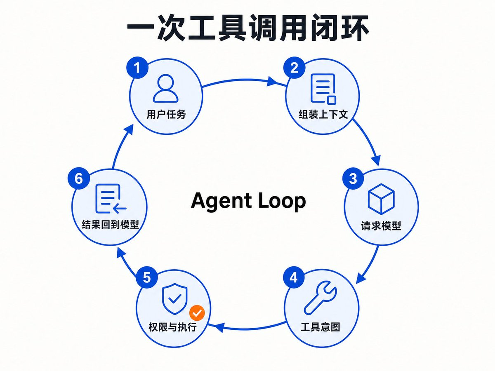

一套完整 Harness 通常包含下面这些部分：

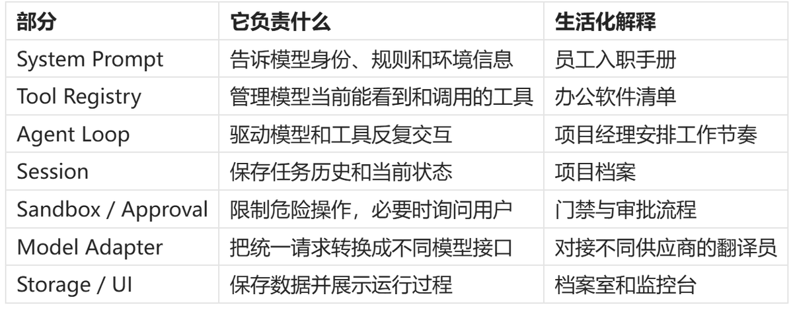

模型厂商经常公布参数量、推理能力和评测成绩。Agent 真正开始工作后，表格中的每一层都会影响最后产出的结果

Harness 负责把模型的“想法”变成受约束、可持续的行动。

## 二、DeepSeek Harness 是产品，也是 Agent 组装框架

DeepSeek Harness 是 DeepSeek 开源的 Agent Harness。官方同时把它描述为 Coding Agent 和 Agent 的开发、运行环境。

> 目前它仍处于 Developer Preview，官方明确提醒后续会有破坏兼容性的修改。

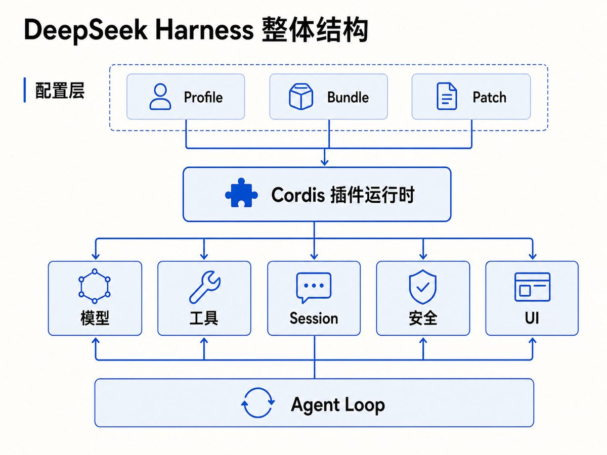

对于产品的普通使用者，可以把它当成一个能读写文件、搜索和运行命令的有自己市场的Agent。对于开发者，看到的则是一套组装 Agent 的框架。

## 三、DeepSeek Harness 怎样启动：先用配置拼出一棵插件树

DeepSeek Harness 的口号是 Everything is a Plugin，所有能力都是插件。

这句话很容易被理解成“它支持安装扩展”。但它实际上是这样的：模型适配器、工具注册表、Session Log、Agent Loop、存储、沙箱、调度和 UI 都由插件提供。DeepSeek 的架构文档甚至写道，系统里没有一个必须修改才能扩展的“特权核心”。

这里需要做一个技术上的澄清。DeepSeek Harness 仍然有核心接口和基础包，否则插件无法协作。“没有特权核心”的意思是，开发者可以通过配置提供另一种实现，不必 Fork 主仓库再修改内部代码。

1\. Profile：一整套 Agent 配方

Profile 决定了你这次启动的是哪一种 Agent。

把 Agent 想成一名刚入职的数字员工。Profile 是公司在他上班前准备好的整套工位：给他配哪个模型、能用哪些工具、把工作记录存在哪里、有没有浏览器界面、采用什么安全规则，全都写在里面。

它也像一张电脑装机单。你不会只写“装一台电脑”，而是会列出处理器、硬盘、显示器和操作系统。DeepSeek Harness 自带 web 和 headless 等 Profile。选择 web，Agent 会带着浏览器界面启动，适合人坐在屏幕前观察和操作；选择 headless，Agent 不显示界面，接到任务后执行、保存结果并退出，适合脚本和自动化流程

2\. Bundle：可以复用的一组插件

Profile 管整台机器，Bundle 管一组经常一起出现的能力。它把一批 Cordis 配置和对应代码装进同一个功能包。

例如，团队可以准备一个“研究 Bundle”，一次装入网页搜索、文件处理、引用检查和研究提示词。另一个“代码审查 Bundle”可以装入代码读取、测试和审查规则。以后创建新的 Agent，配置里引用 Bundle 就行，不必把十几个插件重新接一遍。

一个 Profile 可以叠加多个 Bundle。你可以先给 Agent 装上研究套件，再加代码审查套件，效果类似给电脑接上扩展坞、显示器和移动硬盘。每个套件负责一组能力，Profile 决定这次启动时带上哪些套件。

3\. Patch：在现有配方上做局部修改

Patch 解决的是“小改动”。假设 Profile 已经写了几百行配置，你只想换一个模型、关闭某个工具，或者给文件插件增加一条路径限制。复制整份 Profile 再修改，会得到一份难以跟随上游更新的副本。Patch 只记录那几个变化。

它像贴在装机单旁边的一张便签：其他配置照旧，只把便签上写到的项目换掉。Patch 也可以插入新插件，因此你既能修改现有设置，也能给当前 Agent 临时加一项能力。

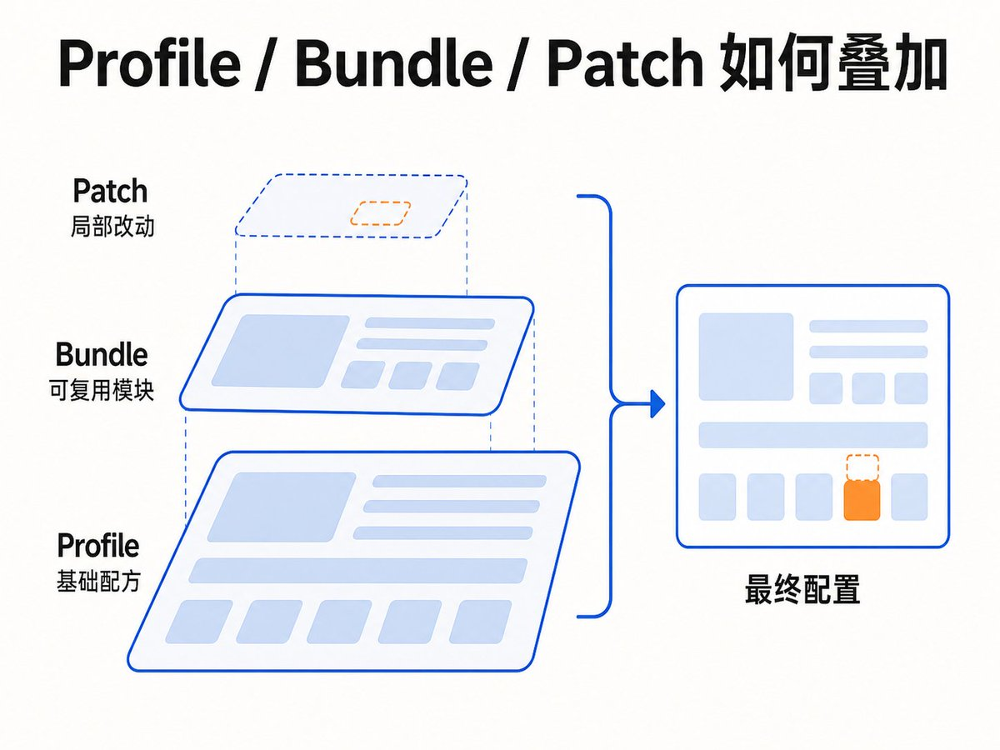

DeepSeek Harness 会把这些配置一层层摞起来。可以把它想成几张透明胶片：底层画着完整的 Profile，Bundle 往房间里添设备，Profile Patch 修改这套方案的局部设置，用户级 Patch 再加入个人偏好，命令行参数负责这一次启动的临时调整。

两层配置改到同一项时，靠上的那层生效。比如 Profile 规定默认使用 A 工作目录，用户 Patch 把它改成 B，这次启动就使用 B；如果命令行又指定 C，最终使用 C。底层配置仍在，系统只用上层值盖住冲突部分

DeepSeek Harness 还会监听用户 Patch。你保存配置文件后，系统重新计算哪些插件受到影响，再让 Cordis 重新组合这些插件。这个过程像配电箱里的线路调整：你换掉某一路开关，系统处理与这一路有关的设备，不需要重新设计整栋办公室

可以把启动过程理解成：

\`\`\`
读取 Profile
   ↓
按顺序叠加 Bundles
   ↓
应用用户 Patch
   ↓
得到最终插件清单和配置
   ↓
Cordis 根据依赖关系加载插件
   ↓
模型、工具、Session、Loop、UI 共同组成可运行 Agent
\`\`\`

这里还有一个容易绕进去的地方：配置清单的书写顺序，不等于插件真正开始工作的顺序。

一个文件工具会声明自己需要 tools 和 fs 两项服务。即使它排在配置文件最前面，Cordis 也会等到工具注册表和文件系统准备好之后，再让它开始工作。就像咖啡机可以提前搬进办公室，但电源和水管接通之前，谁也不能用它。

如果运行中的 fs 服务消失，Cordis 会把依赖它的文件工具卸载，避免系统留下一个“按钮还在，按下去却没有后端”的半残状态。fs 恢复以后，Cordis 再把文件工具加载回来。

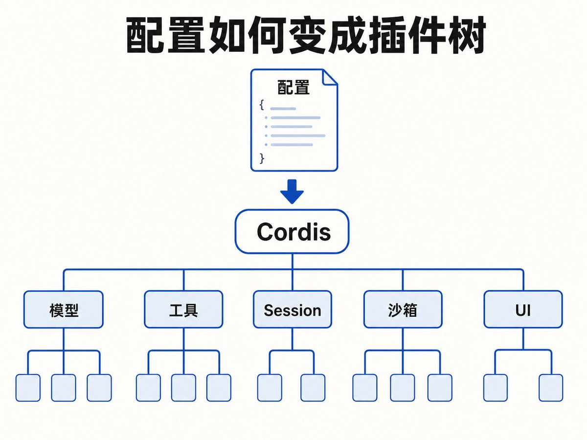

普通读者可以先记住三个动作：Profile 选择整套 Agent，Bundle 安装一组能力，Patch 修改几个局部设置。Cordis 接过最终清单，按照依赖关系把这些零件组装成一套能运行、也能安全拆卸的系统。

## 四、Cordis 到底解决了什么：插件卸载后，系统要恢复干净

DeepSeek Harness 使用 Cordis 管理插件。Cordis 论文提出了一个术语：Spatiotemporal Composability，时空可组合性

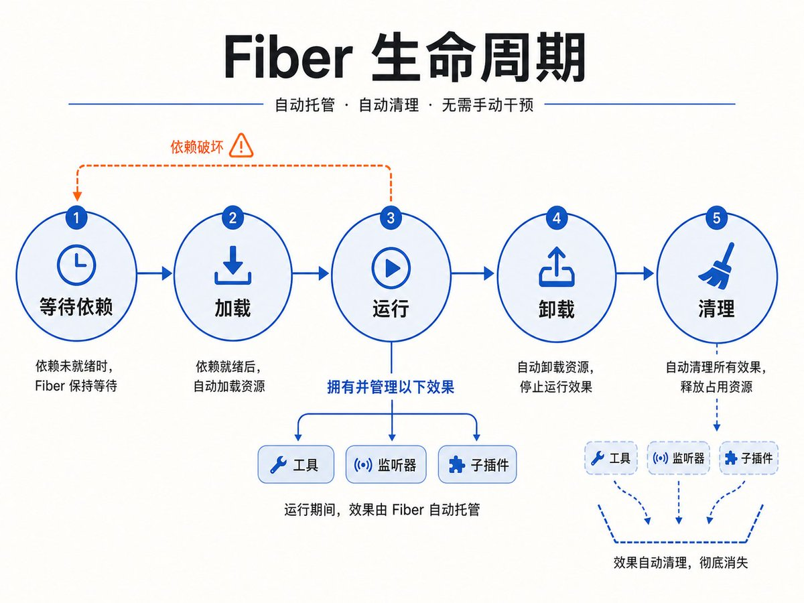

空间可组合性：谁依赖谁，由系统管理

一个网页研究插件需要模型服务、搜索服务和工具注册表。它只声明这些依赖，不必把某一家模型或某一个搜索实现写死。

依赖关系像办公室里的标准插座。台灯只要求有电，不关心电来自哪座发电厂。

时间可组合性：插件离开时，撤销它留下的改变

插件运行时可能做很多事：

- 注册一个工具；

- 增加一段 System Prompt；

- 监听工具执行事件；

- 打开定时器、文件监听器或网络连接；

- 挂载子插件。

普通插件系统常见的麻烦，是界面上已经关闭插件，旧监听器或旧状态还留在进程里。开发者热更新几次后，同一个回调可能执行多次，或者旧版提示词继续影响模型。

Cordis 把插件实例放进一个名为 Fiber 的生命周期容器。Fiber 会经历：

\`\`\`
PENDING → LOADING → ACTIVE → UNLOADING → DISPOSED
                     ↘ FAILED
\`\`\`

术语解释：Fiber 是什么？

这里的 Fiber 不是操作系统线程。它是 Cordis 对一个插件实例的运行记录，负责追踪依赖、状态和清理动作。

插件通过 ctx.on() 注册事件、通过 ctx. tools .register() 注册工具，Cordis 会把这些注册记在所属 Fiber 下。插件卸载时，Cordis 自动移除它们。插件自己创建的定时器或连接，可以通过 ctx.effect() 返回一个清理函数；Cordis 在卸载阶段调用这个函数。

术语解释：Effect 是什么？

Effect 指程序对外部环境造成的改变。注册工具、订阅事件和打开连接都属于 Effect。

一场临时展览结束后，工作人员需要拆掉展台、灯光和电线。Cordis 希望插件也按这种方式撤场，而不是只从菜单里消失。

插件拥有的子插件会一起递归卸载。异步清理完成后，dispose() 才结束。这个设计也支撑热模块替换：系统先卸载旧插件并清理注册，再加载新代码。

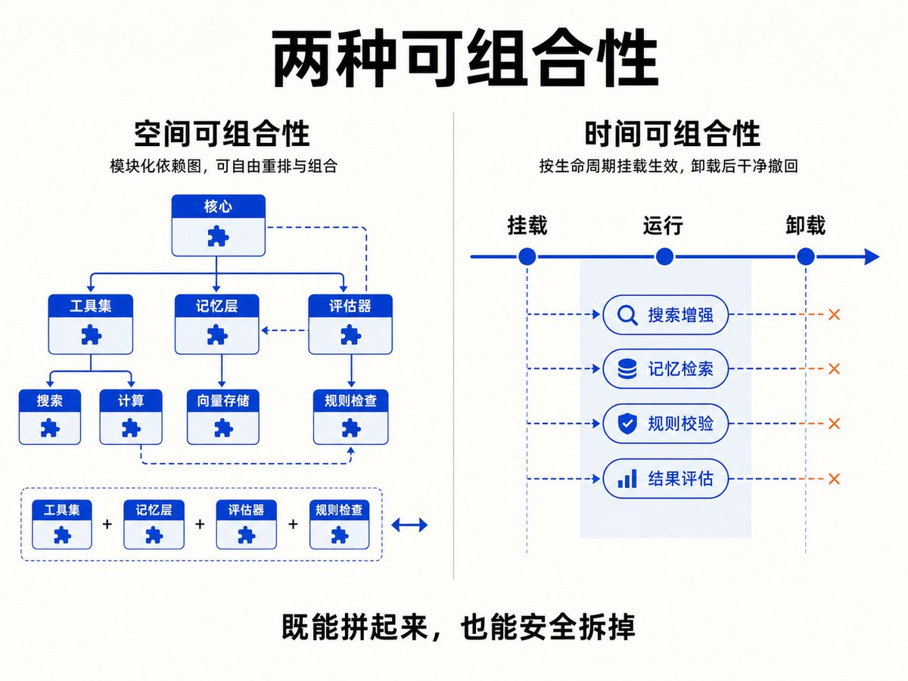

## 五、一次任务怎样运行：Turn 里面可以有多个 Step

DeepSeek Harness 的 Agent Loop 驱动整个执行过程。理解两个词就能看懂这条循环。

Turn：用户交给 Agent 的一轮任务

你说“读取销售数据并生成报告”，这句话会开启一个 Turn。Agent 完成任务、停止或失败时，Turn 结束。

Step：一次模型请求，加上它触发的工具执行

模型第一次查看目录，这是一个 Step；读取文件后再次请求模型，让它判断下一步，这是第二个 Step。一个 Turn 经常包含多个 Step

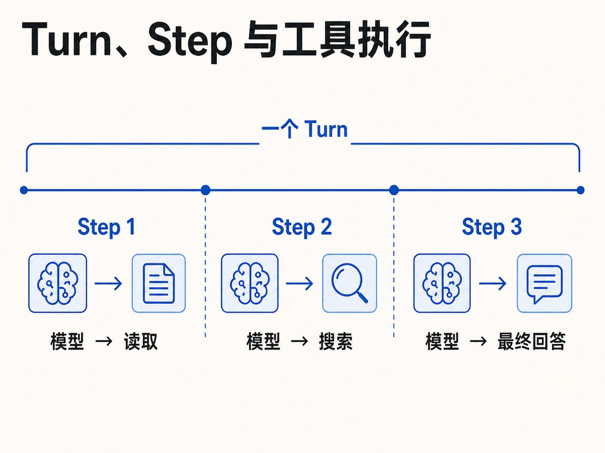

以“读取 sales.csv，计算增长率并写入 report.md”为例，实际流程大致如下：

\`\`\`
用户消息进入 Inbox
        ↓
写入 turn/start
        ↓
组装本 Step 的 System Prompt 和工具列表
        ↓
agent/pre-step 检查、补充或拒绝输入
        ↓
从 Session Log 推导模型历史
        ↓
请求模型，流式接收回答
        ↓
模型输出 read\_file 工具调用
        ↓
工具通过权限、沙箱和 Hook 管线
        ↓
执行读取，把结果写入 Session Log
        ↓
模型根据文件内容发起下一 Step
        ↓
模型输出 write\_file，执行并记录结果
        ↓
没有后续工具或待处理输入，写入 turn/end
\`\`\`

这条链路里有几个容易忽略的机制。

1\. Inbox 统一接收输入

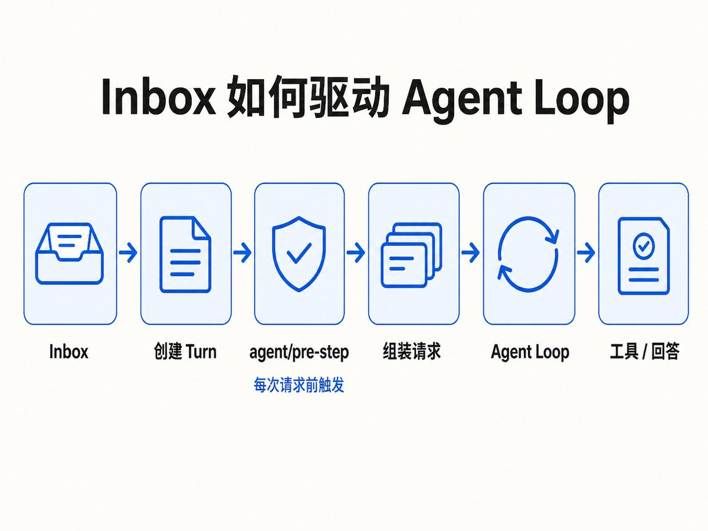

用户新消息、任务中的补充指令和插件注入的上下文都会进入 Agent Inbox。有些消息会唤醒 Agent，有些上下文会等到下一次 Step 再被领取。

这让系统可以在 Agent 工作时追加要求，例如“不要修改原文件，另存一份”。Agent Loop 不需要为每一种外部输入单独设计一条通道。

2\. agent/pre-step 决定本次模型能看到什么

在调用模型前，插件可以补充、重写或拒绝这一批输入。上下文压缩、运行时状态注入和策略检查都可以接在这里。

即使插件拒绝了第一批输入，系统仍会记录这个没有执行 Step 的 Turn。日志因此保留“任务曾经被尝试，但在模型请求前停止”的事实。

3\. Agent Loop 只是默认实现

核心 agent 包声明公共接口，默认 agent-loop 插件提供具体驱动逻辑。其他插件依赖公共 Agent 接口，不直接依赖默认循环。开发者因此可以替换 Loop，而不必重写工具、Session 和 UI。

这正是“Everything is a Plugin”深入到系统核心后的效果。

4\. 持久事件和实时事件承担不同工作

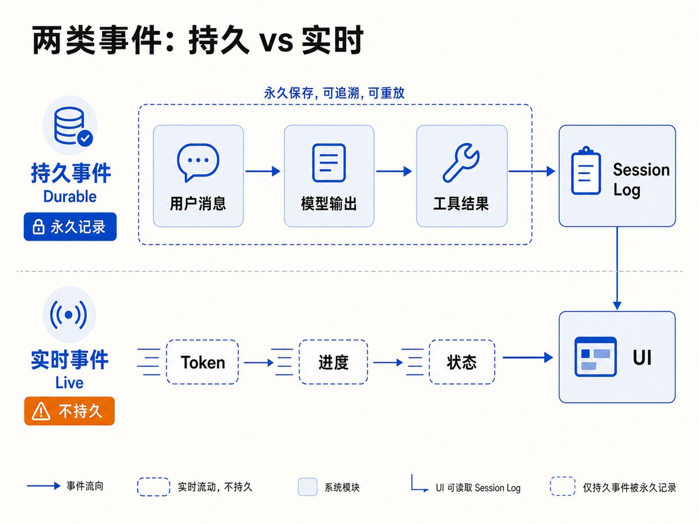

DeepSeek Harness 里有两类容易混淆的事件。

turn/start、tool/call、tool/result 这类 Session Event 是已经发生的事实，会进入日志并在重启后保留。

agent/pre-step、agent/request、tools/pre-execute 这类 Cordis Event 是运行中的扩展点。插件可以在这些位置观察、改写或阻止当前操作，它们本身不等于一条持久对话记录。

可以把 Session Event 看成行车记录仪，把 Cordis Event 看成路口的信号灯和交警。前者记录车辆经过了哪里，后者在车辆行驶时改变它接下来怎么走。

部分 Cordis Event 使用 Waterfall 调度。每个监听器收到一个 next()：调用它表示把控制权交给下一层，不调用则可以中止或替换后续结果。System Prompt 组装和工具策略都使用这种中间件式结构

## 六、System Prompt 会在每个 Step 重新组装

很多人把 System Prompt 理解成藏在聊天机器人背后的一段长指令。DeepSeek Harness 把它做成一个组装系统。

不同插件可以贡献：

- 有顺序的提示词片段；

- 当前时间、工作目录等动态上下文；

- 模型可见的工具 Schema；

- {{model}}、{{cwd}} 一类变量；

- 某个 Agent 独享的 Persona 和规则。

Agent Loop 在每个 Step 开始前组装一次完整请求

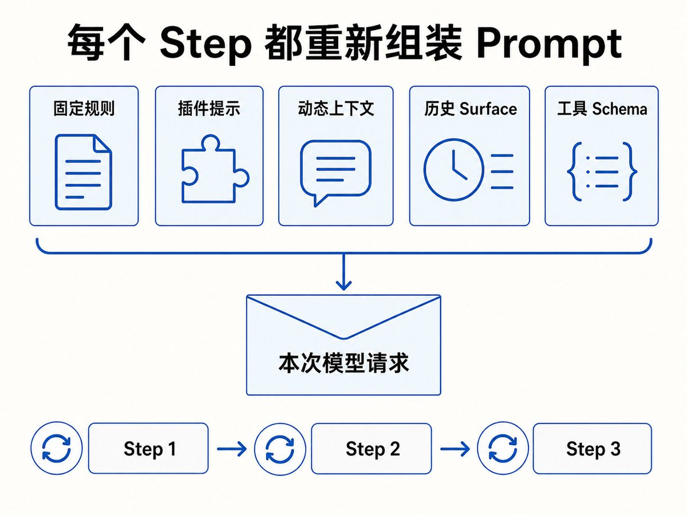

术语解释：Tool Schema 是什么？

Tool Schema 是工具给模型看的使用说明，通常包含工具名、用途、参数和参数类型。

例如文件读取工具会告诉模型：参数叫 path，它必须是一段文本。模型看到 Schema 后，才知道怎样生成合法调用。

工具越多，模型每次请求需要阅读的 Schema 越多，也会消耗更多 Token。DeepSeek Harness 允许插件按 Agent 限制可见工具；被隐藏的工具不会继续占用这一部分请求内容。

为什么每个 Step 都重新组装？

任务执行过程中，环境会变化：

- 用户切换了模型；

- 某个插件加载或卸载；

- Agent 进入了不同模式；

- 权限策略发生变化；

- 子 Agent 获得了自己的 Persona 和工具范围。

每个 Step 重新组装，可以让下一次模型请求反映当前环境。

这种灵活性也带来一个问题：如果提示词或工具集合悄悄变化，开发者很难重现旧请求。DeepSeek Harness 因此在 Session 中记录 request/header，保存模型 Provider、模型名、推理参数、最终 System Prompt 和工具 Schema 快照。配置改变时，系统追加新的 Header。

这一步把“模型当时到底收到了什么”从猜测变成可检查记录。

它还影响模型服务的 KV Cache。Provider 可以复用没有变化的请求前缀，减少相同 Prompt 的重复计算；插件加载、工具排序或 Persona 改变后，请求前缀也会改变，缓存可能从第一个变化的 Token 开始失效。可插拔带来实验自由，也要求开发者留意延迟和调用成本

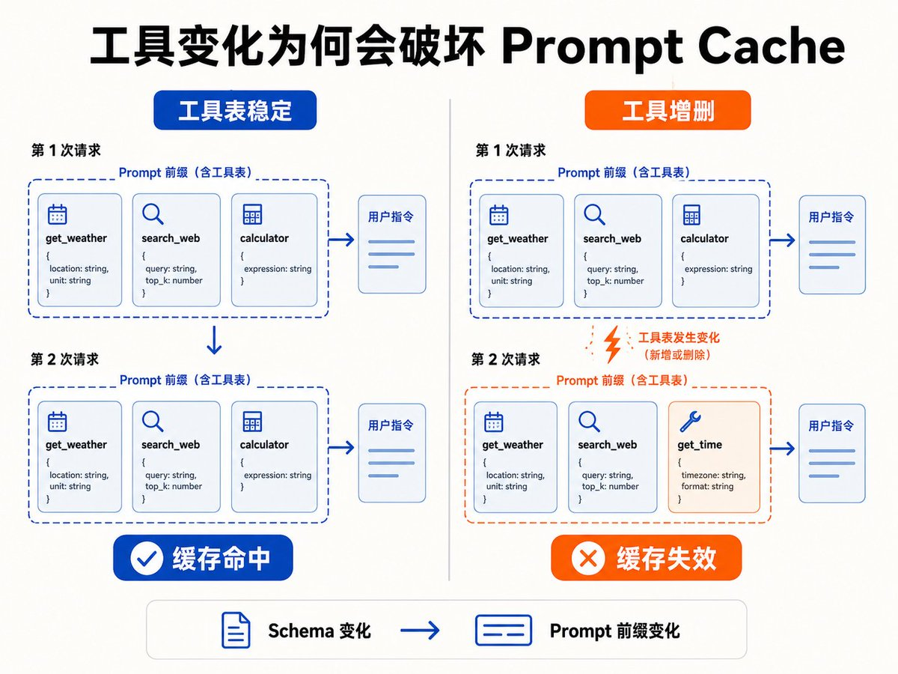

## 七、Session Log 怎样成为唯一事实来源

DeepSeek Harness 的架构文档写了一条强约束：

> Model-visible means logged，模型看到的内容必须被记录。

系统使用 Append-only Session Log，也就是只追加的会话日志。它保存的内容包括：

- turn/start 与 turn/end；

- step/start 与 step/end；

- 用户消息和模型输出；

- tool/call 与 tool/result；

- Steering 消息和 Todo 更新；

- 每次请求所使用的模型配置、System Prompt 与工具 Schema。

术语解释：Event Sourcing 是什么？

Event Sourcing 可以翻译成事件溯源。系统不只保存“现在是什么状态”，而是保存“哪些事件一步步造成了现在的状态”。

银行账户显示余额 1000 元，这只是当前状态。事件溯源还会保留每次入账和支出，所以审计人员能重新计算余额。

DeepSeek Harness 使用同样思路保存 Agent 运行过程。deriveMessages() 从 Session Log 事件中推导模型下一次看到的历史，系统无需另存一份聊天数组。

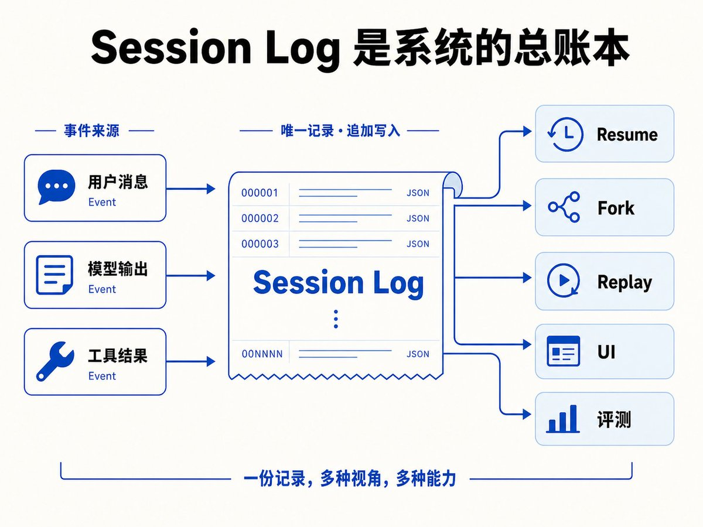

一份日志，同时服务多个系统

同一条事件流可以支持：

- Resume：重新加载任务；

- Fork：从历史边界创建分支；

- Replay：重放运行过程；

- Trajectory：在界面中查看轨迹；

- Telemetry：统计模型与工具行为；

- Persistence：把 Session 保存到 JSONL 或 SQLite。

开发者不必让 UI、评测系统和恢复系统各自维护一套历史，减少多份记录互相矛盾的机会。

上下文太长时，旧历史怎样压缩？

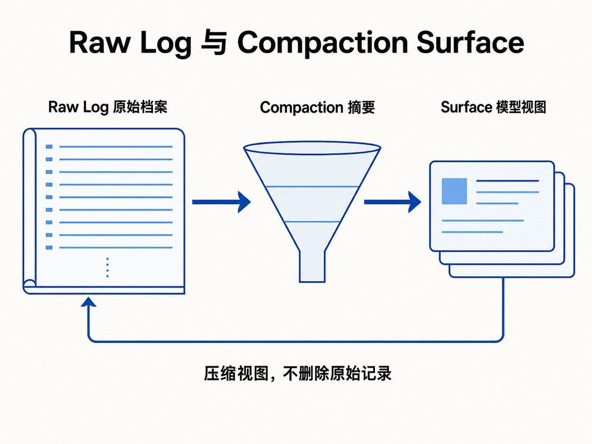

模型有上下文窗口限制。Session 越长，请求成本越高，最终还会超过模型能接收的长度。

DeepSeek Harness 的 Compaction 插件会在上下文压力达到阈值时生成摘要，并在面向模型的 Surface 上加入替代内容。原始 Append-only Log 仍然保留，系统不需要涂改已经发生的事件。

这里可以区分两层：

- Raw Log 保存完整事实，方便追踪和审计。

- Surface 决定下一次模型请求使用哪些历史内容，允许摘要替代早期细节。

好比公司把十年的原始合同留在档案室，同时给项目经理一份两页摘要。档案没有消失，日常工作也不用每次读取全部原件。

崩溃恢复也有明确边界

如果程序在工具调用中间崩溃，持久化层会在恢复时补充状态标记。模型请求已经产生、工具却没开始时，系统标记 TOOL\_NOT\_STARTED；工具调用已经记录但没有结果时，系统标记 TOOL\_OUTCOME\_UNKNOWN，提醒模型不要盲目重复可能产生副作用的操作。

当前实现不会从半个 Turn 的中间无缝续跑。恢复逻辑会先为未闭合的调用、Step 和 Turn 补上结束记录，再从新回合继续。这是一个值得在文章里说清楚的限制。

## 八、工具调用不会直接落到操作系统，中间有一条安全管线

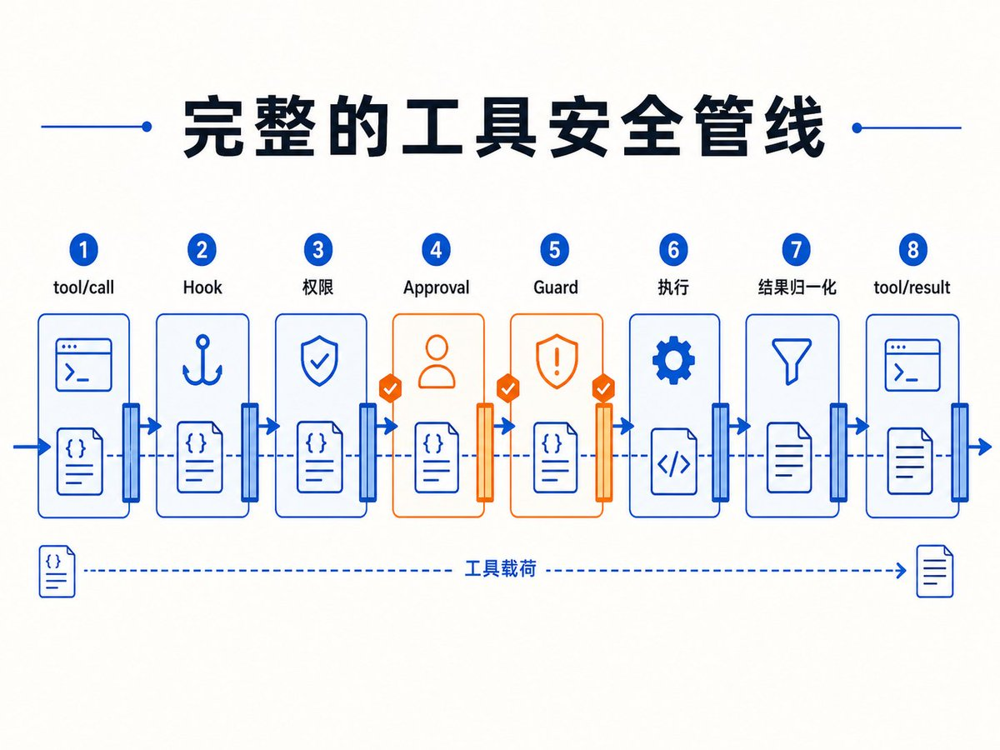

模型输出 write\_file 或 bash 调用后，DeepSeek Harness 先记录 tool/call，再执行工具。官方工具管线包含这些阶段

\`\`\`
模型提出工具调用
      ↓
先写入 tool/call 日志
      ↓
tools/pre-execute
Hook、权限策略、沙箱检查
      ↓
需要时向用户请求一次性批准
      ↓
不可放宽的安全 Guard 再检查
      ↓
tools/execute
超时、重试、指标统计等包装层
      ↓
真正执行工具
      ↓
tools/post-execute
接受、阻止、替换结果或补充上下文
      ↓
结果归一化并写入 tool/result
      ↓
模型在下一 Step 看到结果
\`\`\`

1\. 先记调用，再执行

系统先把模型打算做什么写进 Session。即使后面的审批拒绝或工具报错，开发者仍能看到模型提出过这次操作。

2\. Approval 采用 fail-closed

DeepSeek Harness 的审批结果包括 allowed-once、rejected、cancelled 和 unavailable。只有 allowed-once 放行当前这一次操作。界面没有审批处理器、处理器报错或没有返回合法结果时，系统把结果视为 unavailable 并拒绝操作。

术语解释：Fail-closed 是什么？

门禁系统断电后保持锁住，这叫 fail-closed。系统遇到异常时选择拒绝，而不是为了方便自动放行。

DeepSeek Harness 的批准不是永久通行证。一次批准只对应那次具体请求。

3\. Guard 只能收紧，不能偷偷放宽

工具管线里的 Monotonic Guard 可以拒绝或保持沉默，不能把上游已经拒绝的操作重新批准。

它像机场的多道安检。后一道可以发现新问题并拦下乘客，不能推翻前一道已经做出的禁止决定。

4\. 文件操作还有更细的检查

文件工具可以在写入或编辑前触发文件系统事件。策略插件可以检查文件是否已经读取、路径是否在允许范围内，以及当前沙箱模式是否允许修改

安全策略因此不需要塞进 Agent Loop。插件在工具管线和文件能力接口上完成检查，替换 Loop 时仍能复用。

## 九、Capability Seam：让上层工具不绑定某个底层实现

DeepSeek Harness 把一类可替换接口称为 Capability Seam，能力接缝。

一条接缝通常包含三个角色：

1. Service Definition：定义统一接口；

1. Service Provider：提供具体实现；

1. Consumer：使用该能力，很多时候是模型可见工具。

以文件能力为例：

\`\`\`
模型看见 read / write / edit 工具
              │
         Consumer：tool-fs
              │
        Service Definition：ctx.fs
              │
     ┌────────┼─────────┐
     │        │         │
  本地文件   沙箱文件   远程环境实现
  Provider   Provider   Provider
\`\`\`

上层工具继续调用相同的 ctx.fs 接口。开发者替换 Provider，就能改变文件实际位于本机、容器还是远程沙箱。工具名称和 Agent Loop 不必跟着改。

DeepSeek Harness 对模型、Web 搜索、Shell、持久化、上下文压缩和子 Agent 都采用类似分层。

这种架构的价值在企业环境里很直接。开发团队可以在笔记本上使用本地实现，部署时换成权限受限的远程沙箱；Agent 上层逻辑保持一致。

它也增加了抽象成本。服务定义、Provider、Consumer 和策略插件之间必须遵守同一契约。小型项目只有一个固定后端时，这套分层可能比业务代码更复杂。

## 十、四种模式怎样由同一内核组合出来

DeepSeek Harness 当前提供 Standard、Code、Minimal 和 Creator 四种主要模式

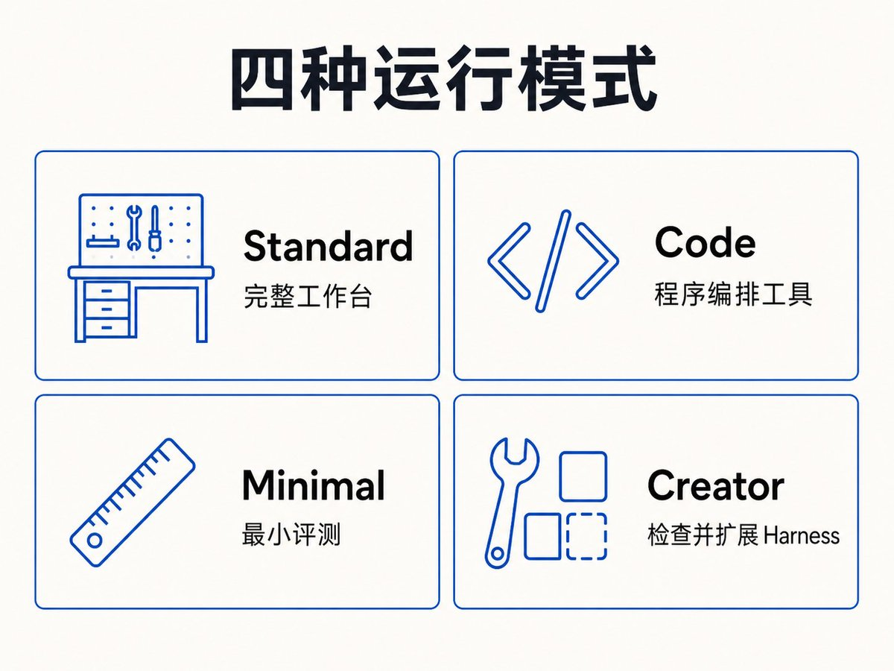

它们不是四套完全独立的 Agent。开发者通过不同插件组合和工具暴露方式，让同一个内核服务不同目标。

Standard Mode：完整工作台

Standard Mode 提供文件编辑、Shell、搜索、Skills、计划、目标、子 Agent 和 Workflow 等能力。

模型能直接看到各个工具的名称、说明和 JSON Schema。需要搜索时调用搜索工具，需要编辑时调用编辑工具。每次调用结束，结果回到模型上下文，模型再决定下一步。

这种方式直观，适合任务类型多、需要人持续观察的 Coding Agent。

Code Mode：让模型先写一段工具编排程序

Code Mode 不再把所有工具都作为普通的末端调用方式呈现。系统向模型提供一个 run\_code 入口，以及根据当前工具生成的 TypeScript 或 Python SDK 声明。

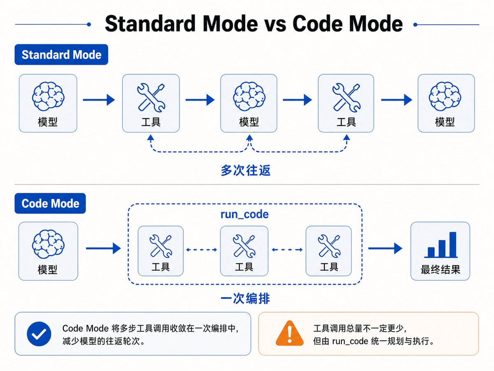

模型可以写出类似下面的程序：

\`\`\`typescript
const files = await Promise.all(\[
  tools.read({ path: "a.md" }),
  tools.read({ path: "b.md" })
\])

return files.map(x =&gt; x.content)
\`\`\`

独立的只读调用可以并行，有先后依赖的操作使用 await 顺序执行。中间工具结果留在程序内部，只有模型主动 return 或 console.log() 的内容回到对话上下文。

这能减少某些批处理任务里“模型请求一次、调用一次工具、再请求一次模型”的往返，也能避免把每个中间结果都塞回上下文。

DeepSeek 官方文档没有承诺 Code Mode 在所有任务中都节省 Token。生成的 SDK 说明本身也占用请求长度；任务短、工具少时，普通调用可能更省。

安全管线没有因为 Code Mode 消失。run\_code 内部发出的子调用仍经过工具权限、沙箱和执行管线，并留下关联日志。

Minimal Mode：控制变量的评测环境

Minimal Mode 只给模型持久 Shell 和文件编辑器。

它像一间只发纸笔的考场。研究人员减少 Skills、搜索、规划插件和复杂上下文的帮助，更容易观察模型能否独立读代码、制定计划、运行测试和修复错误。

DeepSeek 在自己的 Code Agent 文本评测中使用这一模式。它的意义不在于日常使用体验最好，而在于让评测条件更清楚。

Creator Mode：检查和试验 Harness 本身

Creator Mode 在 Standard 能力之上增加运行时检查、内存插件试验和 Preset 编写指导。开发者可以让 Agent 帮助理解当前插件树，尝试新的组件组合，再把结果写成新的模式配置。

它把 Harness 从 Agent 的幕后环境变成 Agent 可以参与操作的开发对象。

这里要避免过度解读。仓库里存在动态 Cordis 工具和自引用实验，但相关工具集并未默认装入所有发行组合。Creator Mode 更适合被描述为 Harness 开发与实验环境，不能直接等同于“AI 可以无条件重写自己”。

## 十一、子 Agent 也被抽象成可替换 Provider

复杂任务经常需要分工。主 Agent 可以把资料搜索、代码检查或测试交给子 Agent。

DeepSeek Harness 没把子 Agent 写死成一种内部线程。它定义统一的 ctx.subagents 接口，不同 Provider 可以启动：

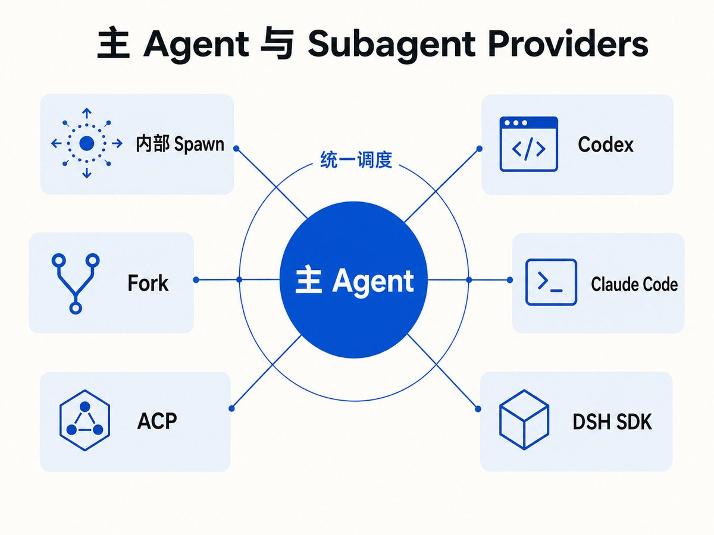

- 当前进程里的新 Agent；

- 从父任务历史 Fork 出来的 Agent；

- 通过 ACP 启动的外部 Agent；

- Codex 或 Claude Code 子进程；

- 通过 DeepSeek Harness SDK 启动的另一实例。

主 Agent 通过同一套工具发起委派、发送消息、查询或中断子 Agent。底层运行的是内部子任务还是外部产品，由 Provider 决定。

Fork 子 Agent 会继承什么？

Fork Provider 只复制父 Session 中已经完整结束的 Turn。父 Agent 当前仍在执行的工具调用不会复制，因为它缺少对应的结果和 turn/end，复制后会形成不完整历史

Fork 传递的是对话历史，不是权限。子 Agent 会得到新的作用域，不会自动继承父 Agent 的工具限制和操作授权

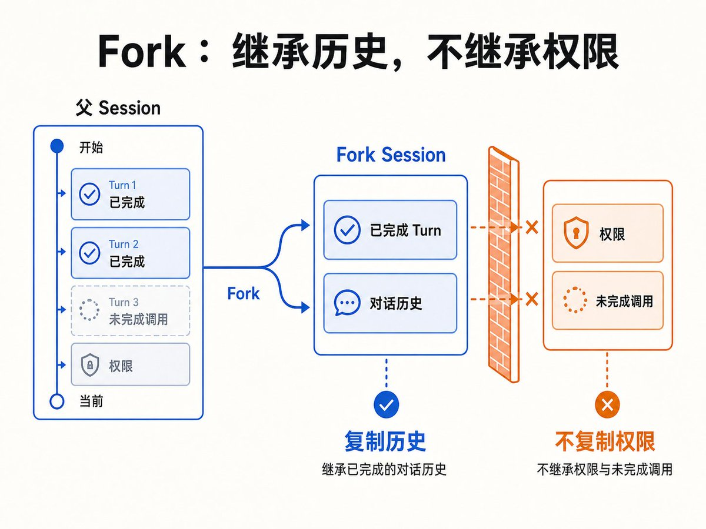

这个细节很重要。上下文继承和权限继承属于两件事。一个子 Agent 知道父任务发生过什么，不代表它有权做父 Agent 能做的所有操作。

## 十二、它到底能做出什么：从临时造工具到外部自动化

先说明资料边界。截至 2026 年 8 月 26 日，DeepSeek 官方公开的主要是可运行示例、内置工具和实验性 POC，还没有足够的公开客户案例与业务收益数据。

所以下面说的“案例”分成四类：

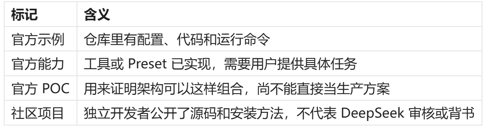

案例一：Agent 在对话中给自己造一个新工具

这是 DeepSeek Harness 最有辨识度的用法。

假设一个团队每次发布前，都要检查四件事：版本号有没有更新、Changelog 有没有补、测试是否通过、安装包有没有异常变大。

普通 Agent 可以分别读文件、运行测试、计算体积，每次发布都重复一遍。启用官方 web-cordis 示例后，用户还可以提出这样的要求：

> 给自己增加一个 release\_guard 工具。以后调用一次，就完成四项检查，并返回统一的发布报告。

这里的 release\_guard 是基于官方机制构造的业务例子，不是 DeepSeek 预装工具。官方 Creator Skill 给出的真实示例叫 preset\_check：Agent 临时注册这个工具，用它检查一个 Agent Preset 能否找到对应的 Standing Key

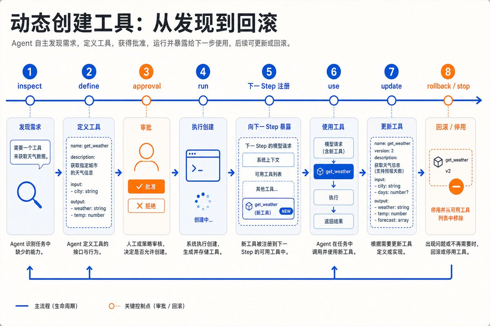

创建过程不是“模型随便执行一段代码”，而是一条有状态的插件生命周期：

\`\`\`
检查当前运行时
cordis\_inspect\_list / cordis\_inspect\_query
             │
             ▼
定义一个不可变 Package
cordis\_define
             │
             ▼
用户批准需要授权的 Client 代码
cordis\_run
             │
             ▼
新工具进入下一次模型请求的工具表
             │
             ▼
更新 / 回滚 / 停止 / 永久移除
\`\`\`

第一步是检查。Agent 可以读取当前真实存在的 Service、Event、Builtin、工具 Schema、主题变量和 Web UI Slot。这样它不必猜“文件服务的方法叫什么”“这个界面插槽收什么参数”。

第二步是定义。cordis\_define 接收模型写出的普通 JavaScript Host 或 Client 函数体，先验证参数和语法，再生成标识。它此时不会运行插件，也不会改变当前版本。

这里有三个容易混淆的身份：

- pluginId：这个插件长期使用的名字；

- packageId：某一版不可修改的代码；

- Run：某一版代码的一次实际运行。

它像应用、安装包版本和正在运行的进程。更新时不会覆盖旧 Package，而是为同一个 Plugin 追加新版本。新版本失败后，旧版本的身份还在，Agent 可以显式切回。

第三步是激活。cordis\_run 把指定 Package 挂进当前 Cordis 运行时。含浏览器 Client 代码的 Package 可能触发用户审批；获得授权后，插件才开始工作。

第四步才是能力变化。如果插件注册了 release\_guard，Harness 会发现工具 Schema 已改变，记录一份新的 Request Header。到下一个 Step 重新组装 Prompt 时，模型的工具清单里便出现了 release\_guard。这正好解释了前文所说的“每个 Step 都重新组装 System Prompt 和工具表”：动态能力不是口号，它通过下一次请求真正变成模型可调用的接口。

动态 Package 能做的也不止注册工具。它可以监听事件、提供服务、改变模型路由，或者向 Web UI 的 Slot 塞进一个面板。一个 Package 可以同时包含两半：

- Host Half：运行在 Harness 主机侧，处理文件、数据和后端服务；

- Client Half：运行在浏览器侧，显示按钮、状态面板和工具结果卡片。

两半还能通过插件私有 RPC 通信。形象地说，Agent 可以临时写一个后台能力，再顺手给它做一个可点击的小界面。

这里的 RPC，可以理解成前台与后台之间的“内部电话”：浏览器按钮发出一份结构化请求，Host 完成工作后再把结果送回界面。

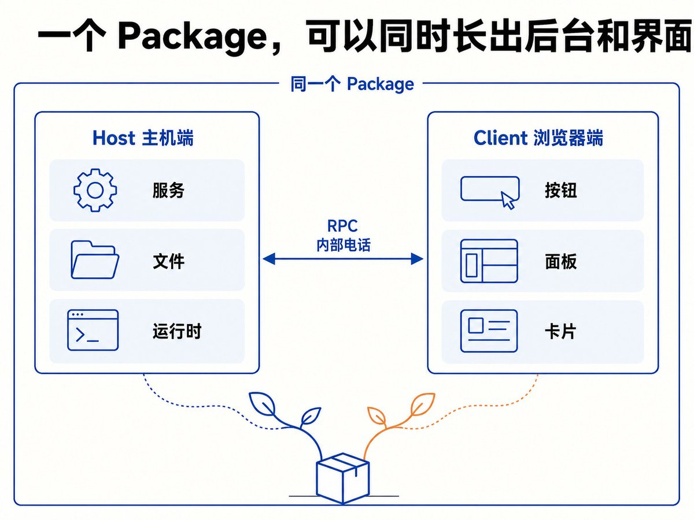

如果实验失败，cordis\_stop 会停止当前 Run，但保留 Plugin 和各版 Package；cordis\_undefine 才会删除定义。插件产生的工具、监听器和其他 Effect 由 Cordis 生命周期统一清理。

这个能力需要严格看待。官方 web-cordis 文档写明，临时插件只存在于进程内存，卸载或重启后消失，也可能影响同一进程里的其他 Session。它不会自动保存成正式插件，更不是一个低权限安全沙箱。动态代码能够触达真实 Harness 服务，信任级别接近 Shell，因此官方把它设计成主动启用的开发能力。

案例二：把一项大任务写成“多 Agent 流水线”

假设要审查 100 个源码文件，并要求每个高风险结论再由另一名 Agent 复核。

逐个派任务当然能做，但主 Agent 要反复发出委派、等待、读取答案，再派下一轮。官方 workflow 工具允许模型写一段 JavaScript 编排脚本：

\`\`\`
100 个文件
   │
   ├─ 为每个文件启动审计 Agent
   │
   ├─ 统一返回 { 文件、风险、证据、严重度 }
   │
   ├─ 只把高风险项送给验证 Agent
   │
   └─ 主 Agent 去重并汇总报告
\`\`\`

脚本可以调用：

- agent()：运行一个子 Agent，并可要求它按 JSON Schema 返回结构化结果；

- pipeline()：让每个对象独立经过多级处理，不必等所有对象完成第一阶段；

- parallel()：并行启动一组任务，再在同一个屏障处等待；

- phase() 和 log()：标记阶段并报告进度；

- provider 和 model：为某一类子任务选另一条模型路线。

Workflow 脚本本身不能访问文件、网络、定时器或 Node API。它只负责排班，真正读文件和查资料的是子 Agent；并发数和 Agent 总数也受配置上限控制。

这套系统里还有几个容易被混称为“自动运行”的概念：

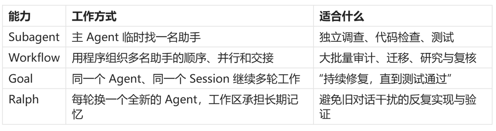

Goal 的进展留在同一条 Session 历史里。Ralph 每轮不继承父对话或上一名子 Agent 的会话，只共享工作区，并让上一轮传递一份受限的结构化报告。官方还要求 Ralph 只能在用户明确提出时使用，不应被 Agent 擅自开启

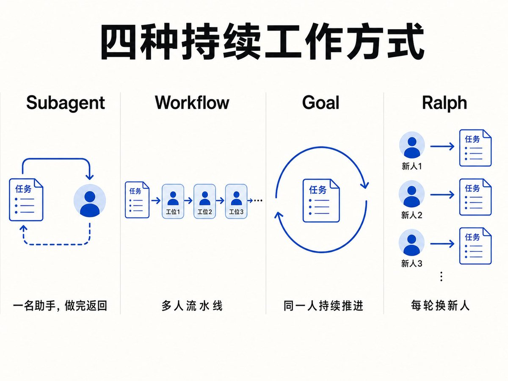

再往外一层，Subagent Provider 还能连接进程内 Agent、Fork Agent、ACP Agent、Codex 和 Claude Code。 团队因此可以组合一种“代码评审委员会”：DeepSeek 主 Agent 拆题，Codex 执行实现检查，Claude Code 看架构，Fork Agent 带着父会话历史核对用户意图，最后由主 Agent 汇总。这里描述的是架构允许的组合方式，不是官方公布的客户部署。

案例三：给 Agent 加上提醒和跨会话记忆

官方 web-schedule 可选配置层，也就是 Overlay，会增加 schedule\_create、schedule\_list 和 schedule\_delete 三个工具。它支持“多少秒以后”、明确的绝对时间，以及至少五分钟一次的固定间隔。

用户可以说：

> 20 分钟后提醒我回来检查部署结果。

到期后，Harness 会在原 Session 空闲时排入一个普通 Follow-up Turn。提醒记录属于原 Session；进程关闭或 Session 处于冷状态时，计时器不运行，重新打开同一 Session 后才恢复并处理逾期提醒。它不会发送系统通知、邮件或短信，也不支持 Cron 表达式。

所以它更像贴在当前项目白板上的定时便签，不是一台永远在线的云端调度器。

“记住项目知识”则由另一条扩展路径完成。官方 mcp-memory 目录提供 Memorix、MCP Reference Memory 和 Engram 三份默认关闭的参考配置。DeepSeek Harness 负责启动或连接第三方 MCP Server、发现工具，并把它们暴露为 mcp\_\_服务器\_\_工具；数据库初始化、模型选择和数据迁移仍归外部记忆系统负责。

这能用来保存架构决定、项目术语或已核实事实，让后续 Session 主动查询。它不是 DeepSeek Harness 自带的一套“自动永久记忆”，而是 Harness 通过 MCP 接上了外部记忆能力。

案例四：把 Agent 塞进 CI、Python 程序或远程沙箱

官方 Headless Profile 接收一个任务，创建并保存新 Session，打印最终回答，然后退出。仓库给出的运行方式非常直接：

\`\`\`
pnpm dsh --profile headless "fix the failing test in this workspace"
\`\`\`

这意味着 CI 脚本、Git Hook 或其他自动化程序可以把 DSH 当成一次性任务执行器。Headless 组合还包含本地 Shell、文件工具、子 Agent、Workflow、Ralph、Todo 和 JSONL Session。

如果调用方是 Python 服务，官方 jsonrpc-agent 示例展示了怎样通过 Python SDK 和 JSON-RPC 驱动一个无人值守 Coding Agent；捆绑运行时已经携带所需插件，目标机器不必另装 Node.js。

如果外部程序还需要创建多个 Session、取消任务并逐次决定权限，官方 acp-agent 示例提供 ACP over JSON-RPC stdio。每个 session/new 都指定独立工作目录；越权重试会把一次性 allow\_once 或 reject\_once 决定交给客户端，没有回答时默认拒绝。

这三种入口的差别可以简单理解为：

- Headless：给一项任务，等一个最终结果；

- JSON-RPC SDK：从 Python 程序控制 Agent 生命周期；

- ACP：把 DSH 作为可被父 Agent、IDE 或自动化平台驱动的 Agent 进程。

官方还提供 E2B Overlay POC。它替换本地文件系统和子进程 Provider，让原来的文件、Bash、PTY 和 LSP 工具转到同一个远程沙箱，上层工具名称不变

这展示了 Capability Seam 的实际价值：Agent 仍然以为自己在使用同一套工具，施工地点却从本机换成了一块用完即销毁的远程工地。当前 POC 不会自动上传或同步宿主机项目；模型调用、Session、日志和 Skills 仍留在 Host，不能把它写成完整的云端 Harness。

## 十三、在 Harness 领域的创新评价

插件、MCP、Skills、Hooks、子 Agent、权限控制、Checkpoint 和 Replay 都早已有其他实现。Claude Code 插件可以打包 Skills、Agents、Hooks、MCP 和 LSP；LangGraph 提供持久化和基于 Checkpoint 的任务恢复能力。

因此，评价 DeepSeek Harness 要看组合方式和系统边界。

DeepSeek Harness 最有辨识度的贡献可以归纳为三项。

第一，它把插件边界推进到 Agent 的核心运行结构。开发者可以配置 Agent 的工具、执行循环、历史保存方式、运行环境和界面。

第二，它把可组合性与可重建性放在同一系统里。Cordis 管理组件的装卸，Session Log 管理运行事实。前者回答“能力怎样换”，后者回答“换完之后、运行过程中发生了什么”。

第三，它把插件框架本身变成了 Agent 可以检查和操作的对象。动态执行代码并不新鲜；真正有价值的是检查真实接口、不可变版本、审批、请求头变更记录、回滚入口和生命周期清理被放进同一条链路。它仍是高权限实验能力，但已经比一句“让 AI 自己写插件”具体得多。

这是一套有明确主张的 Harness 架构。它是否会成为行业标准，需要看 API 稳定性、插件质量、调试体验和真实生产负载。

## 写在最后

DeepSeek Harness 把 Agent 拆成了两个层次。

模型负责提出判断和行动意图。Harness 负责组装模型所见的上下文，审核并执行工具，把结果送回模型，再用事件日志保存全过程。

DeepSeek 的设计选择也可以分成两条线：Cordis 负责组件的装载、依赖与撤销；Session Log 负责运行历史的记录、推导与恢复。Agent Loop 把两条线连接起来，每个 Step 都从当前插件环境和历史事件生成下一次模型请求。

实际案例把这套抽象落到了地面：Agent 可以临时增加一个发布检查工具，用 Workflow 组织几十名子 Agent，把一次任务交给 CI 或 Python 程序，在飞书中接收指令，也可以借社区插件获得浏览器、视觉、数据库、条件唤醒和交互式界面。

这套机制仍在快速变化，距离稳定的通用基础设施还有一段路。它已经给出一个值得保留的评测习惯：以后讨论 Agent 能力，除了问“用了哪个模型”，还要问它看到了什么工具、运行在哪套 Harness 上，以及失败后能不能还原过程。

### 🖼️ Attached Media

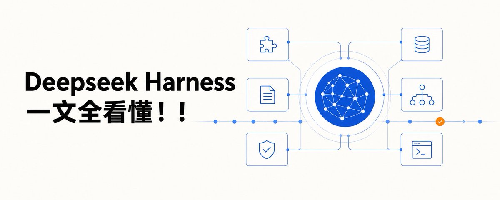

## 💬 Replies

### 1 @AndoRAG (Ando)

*Wed Aug 26 09:07:31 +0000 2026*

@Russell3402 Agent = Model + Harness 这句话终于有人讲清楚了。 模型是脑子，Harness 才是电脑、权限、文件柜和工作记录。 尤其是 Session Log 作为唯一事实来源、每个 Step 重新组装 Prompt 这两段，对做自定义 Agent 和知识库的人特别有用。感谢拆得这么细。

### 2 @Russell3402 (Russell) (Author)

*Wed Aug 26 09:16:34 +0000 2026*

@AndoRAG 😁也感谢你的认可

### 3 @Shenmeili1213 (沈美丽子)

*Wed Aug 26 09:10:20 +0000 2026*

@Russell3402 文章把插件、配置、日志和安全管线讲清楚了，适合想搞懂 Agent 到底怎么跑起来的人。

### 4 @Russell3402 (Russell) (Author)

*Wed Aug 26 09:16:49 +0000 2026*

@Shenmeili1213 🤗

### 5 @builtbyxm (Built by Xiaoming)

*Thu Aug 27 03:24:15 +0000 2026*

@Russell3402 我可以把你这篇文章放到我的网站上面去吗？署名还是你

### 6 @Russell3402 (Russell) (Author)

*Thu Aug 27 04:41:08 +0000 2026*

@DSHStoreAI 可以的

### 7 @ListenerEight (Diablo)

*Wed Aug 26 08:58:54 +0000 2026*

@Russell3402 深入检出，我这种傻狗都能看明白了

### 8 @Russell3402 (Russell) (Author)

*Wed Aug 26 09:01:13 +0000 2026*

@ListenerEight 牛逼

### 9 @yunbiyun (云比云)

*Wed Aug 26 10:13:29 +0000 2026*

很多人第一次接触 AI Agent，会以为模型能力越强，Agent 就一定越强。

但真正让一个 AI 从“会回答问题”变成“能把事情做完”，中间还隔着一整套执行系统，这就是 Harness。

模型负责判断下一步要做什么，Harness 负责把网页、文件、终端、搜索、权限、日志、上下文和各种工具真正接起来。

所以 DeepSeek 才会给出一个很重要的公式：Agent = Model + Harness。

DeepSeek Harness 最有意思的地方，是把这套系统拆得非常彻底，模型、工具、Session、执行循环、存储、沙箱，甚至 UI，都可以通过插件重新组合。

Profile 决定你要启动一套什么样的 Agent，Bundle 给它装上一组能力，Patch 则负责只修改其中几个局部配置，Cordis 再按照依赖关系把这些组件安全地装起来、卸下来。

Agent 每完成一步操作，DeepSeek Harness 都会把模型看到了什么、调用了什么工具、工具返回了什么、当时用了什么 Prompt 和模型配置记录下来，所以任务失败以后，不只是看到一句“执行失败”，而是能往回追整个过程。

工具调用也不会直接落到电脑上，中间还要经过权限、审批、沙箱和安全策略，因此模型想做什么，与系统最终允许它做什么，是两回事。

它甚至把子 Agent、Workflow、远程沙箱、CI、Python SDK 和动态插件都接进了同一套架构里，让 Agent 不只是一个聊天窗口，而更像一套可以不断组装的数字工作环境。

所以看懂 DeepSeek Harness 后，会发现以后比较 Agent，不能只问“它用了哪个模型”，还要看它能用什么工具、上下文怎么管理、权限怎么控制、失败后能不能恢复，以及整个工作过程能不能被重新还原。

### 10 @WolfMoneyNotes (狼哥搞钱笔记)

*Wed Aug 26 09:59:41 +0000 2026*

@Russell3402 通俗易懂的干货，非常有价值👍

### 11 @HytidelLegend (Hytidel聊商业（文章更多干货）)

*Wed Aug 26 09:40:22 +0000 2026*

@Russell3402 DeepSeek Harness详解：Agent=模型+Harness。模型是脑子，Harness是工具、权限、日志与安全管线。插件化架构、Session Log唯一事实源，让AI可持续执行复杂任务。

### 12 @ghj197605 (郭红俊)

*Wed Aug 26 12:26:47 +0000 2026*

@Russell3402 讲的非常深入浅出

### 13 @Li665508Li (Yuvi)

*Wed Aug 26 16:13:13 +0000 2026*

@Russell3402 @grok 干活了，给用通俗的语言说明白

### 14 @OMOisomo (O MO)

*Wed Aug 26 12:52:57 +0000 2026*

@Russell3402 dsh的这个设计太棒了，有很多值得学习的地方

### 15 @1501_STUDIO (LIN_Z)

*Fri Aug 28 02:19:02 +0000 2026*

@Russell3402 文章写得清楚。我实际在用，天天改的是界面插件，循环本身没动过。你自己用了没？

### 16 @qi41184238 (qi)

*Thu Aug 27 01:11:00 +0000 2026*

@Russell3402 @grok 保存

### 17 @aches_cn (sehca)

*Thu Aug 27 00:05:11 +0000 2026*

@Russell3402 @readwise save

### 18 @MichengAI (迷城)

*Fri Aug 28 05:56:58 +0000 2026*

The Most Codex‑like Desktop for DeepSeek Harness, ready‑to‑use with all plugins below
[github.com/MichengAI/dsh-…](https://github.com/MichengAI/dsh-codex-desktop)

IM connection plugin for DeepSeek Harness, supports WeChat, WeCom, DingTalk, Feishu, etc.
[github.com/MichengAI/dsh-…](https://github.com/MichengAI/dsh-im-connect)

Scheduled and automation task plugin for DeepSeek Harness
[github.com/MichengAI/dsh-…](https://github.com/MichengAI/dsh-automation)

Skills management plugin for DeepSeek Harness, supports uploading, deleting, enabling/disabling custom SKILLS
[github.com/MichengAI/dsh-…](https://github.com/MichengAI/dsh-skills-manager)

Enhanced session archive plugin for DeepSeek Harness, solves the lack of native session archive management
[github.com/MichengAI/dsh-…](https://github.com/MichengAI/dsh-archive-manager)

The Most Codex‑like UI for DeepSeek Harness, painstakingly polished for days
[github.com/MichengAI/dsh-…](https://github.com/MichengAI/dsh-codex-ui)

### 19 @pharos1128 (Song-Song Zhou)

*Thu Aug 27 03:29:08 +0000 2026*

@Russell3402 专业

