# 📰 多智能体协作调查：Agent 到底该怎么分工

> 本文很硬很干，而且偏工程，建议饭前食用

多智能体协作在抖音小红书经常被讲成一个看着很牛逼的团队故事：一个 agent 查资料，一个 agent 写代码，一个 agent 跑测试，一个 agent 做 review，最后主 agent 像项目经理一样把结果收回来。

然后下面评论区：“我去好牛逼！”

但是真正使用过多智能体，或者说真正高效的运用多智能体的人看到，只是笑着摇摇头

因为多智能体从来不是“多开几个模型实例”这么简单，还要考虑任务调度、上下文隔离、权限控制、状态管理和结果合并机制等东西

换成工程语言，就是谁有权创建 worker？worker 拿到多少上下文？它能不能写文件？多个 worker 写到同一区域怎么办？worker 失败、超时、被用户中断时，父任务怎么恢复？结果回来以后，谁判断冲突，谁承担最后的 merge 责任？这样一堆问题。

所以我们怎么去更好的搭建自己的多智能体团队？

不妨先看看 Codex、Claude Code、OpenClaw、Hermes Agent，学习它们是怎么做的。

## 触发与拓扑

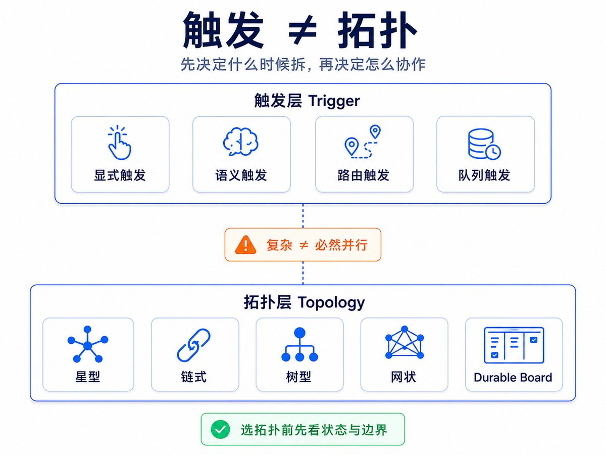

很多讨论混在一起，是因为大家把两个问题当成了一个问题。

第一个问题是触发：系统什么时候从单 agent 变成多 agent？

第二个问题是拓扑：一旦变成多 agent，它们怎么组织？是主 agent 派几个 worker 后统一收口，还是 worker 之间能互相通信？是当前 turn 里等结果回来，还是把任务放进持久队列，明天再继续？

触发方式大致有四类。

第一类是显式触发。用户直接说“use parallel subagents”“spawn one agent per review category”“delegate this work in parallel”。Codex 主要属于这一类。它不会因为任务看起来复杂就擅自开一堆 worker，而是把并行授权留给用户和主 agent。

第二类是语义触发。主 agent 根据任务内容和 subagent description 判断是否调用某个专家 agent。Claude Code 的普通 subagent 主要属于这一类。description 写得越像触发条件，系统越容易在合适的时间调用它；description 写得越像一句愿望，系统越容易乱叫人。

第三类是路由触发。系统不是先问“这个任务复杂吗”，而是先看消息来自哪里。OpenClaw 会根据 channel、account、thread、peer、guild、role 等入口信息选择 agent。Slack ops channel 进 ops agent，私人 Telegram 进 deep work agent，家庭入口进低权限 assistant。

第四类是队列触发。任务被写进 board、queue、cron 或 background job，由 dispatcher 按状态和 assignee 拉起 worker。Hermes Kanban 属于这一类。这里的关键不再是本轮对话里能不能马上返回，而是任务能不能跨 turn、跨天、跨重启、跨人类介入。

拓扑也可以分成几种。

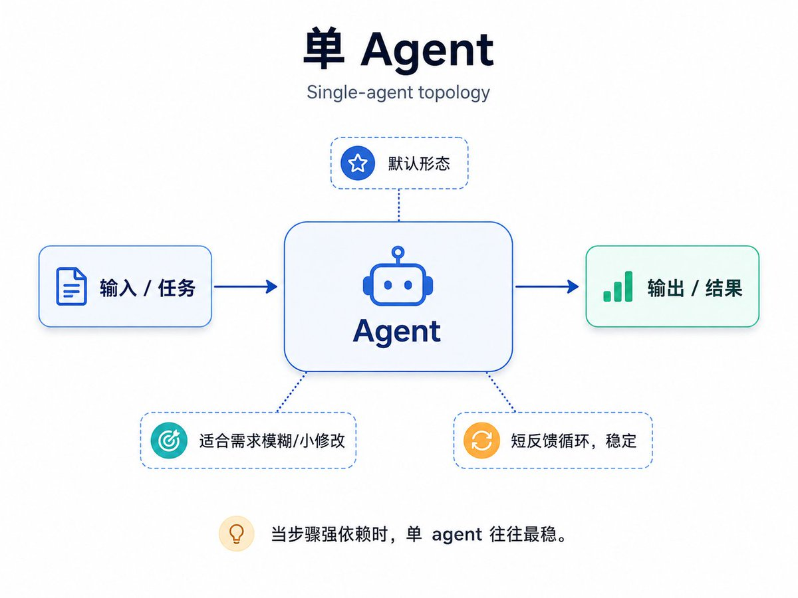

单 agent 是默认形态。需求模糊、修改很小、步骤强依赖时，单 agent 往往最稳定。很多任务不需要多智能体，只需要更好的上下文和更短的反馈循环。

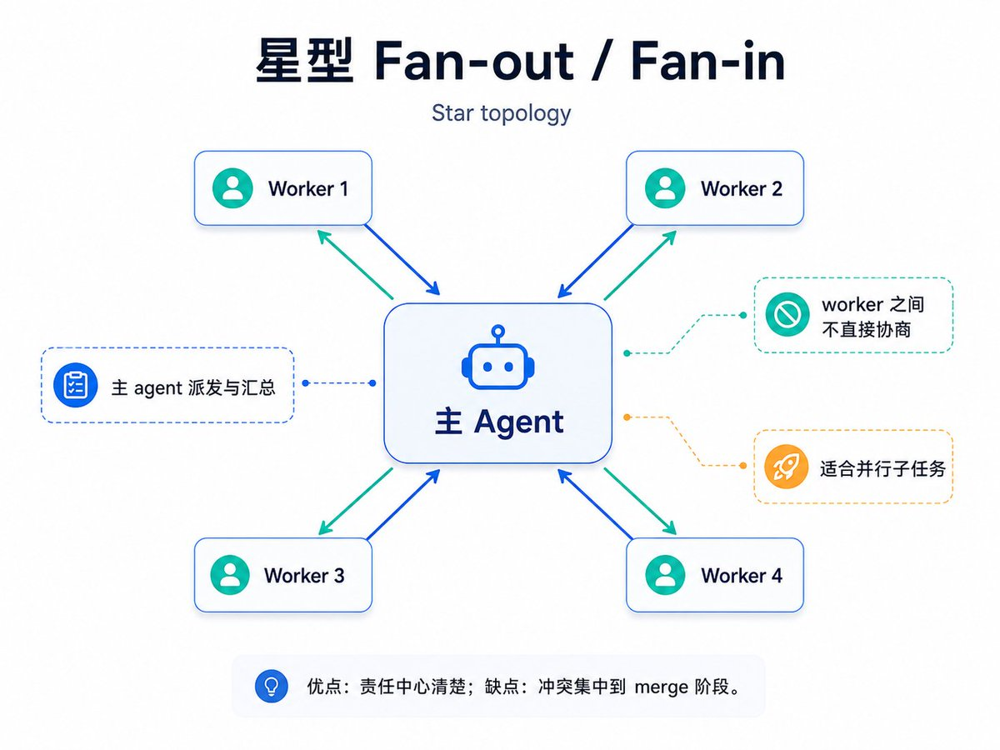

星型 fan-out/fan-in 是最常见的 subagent 形态。一个主 agent 派多个 worker，worker 之间不直接协商，结果回到主 agent，主 agent 做 reduce。Codex subagents、Claude 普通 subagents、Hermes delegate\_task 都主要是这种结构。它的优点是责任中心清楚，缺点是 worker 之间不能互相纠错，所有冲突都压到主 agent 的 merge 阶段。

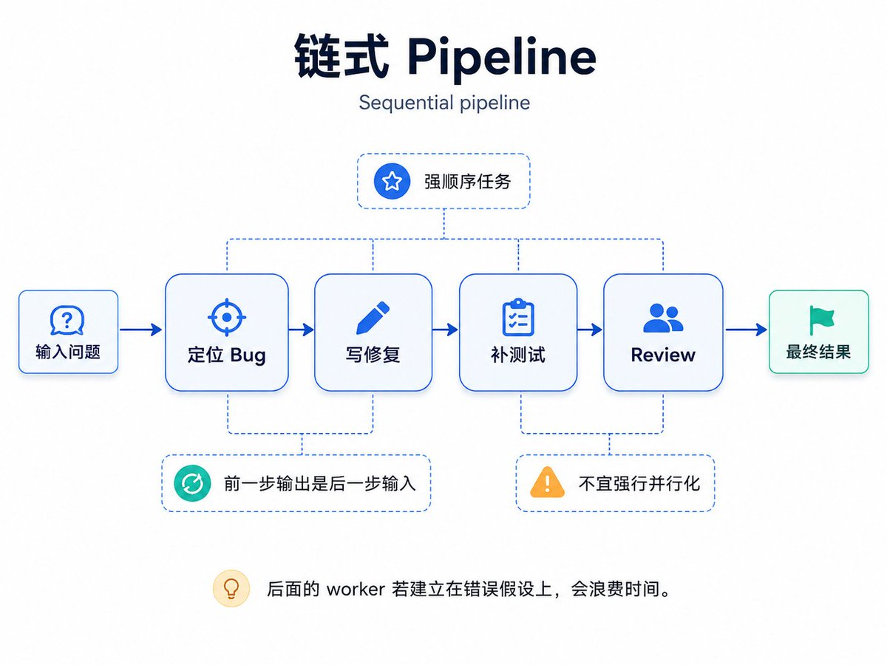

链式 pipeline 适合强顺序任务。比如先定位 bug，再写修复，再补测试，再 review。硬把这种任务并行化，通常只会让后面的 worker 在错误假设上浪费时间。

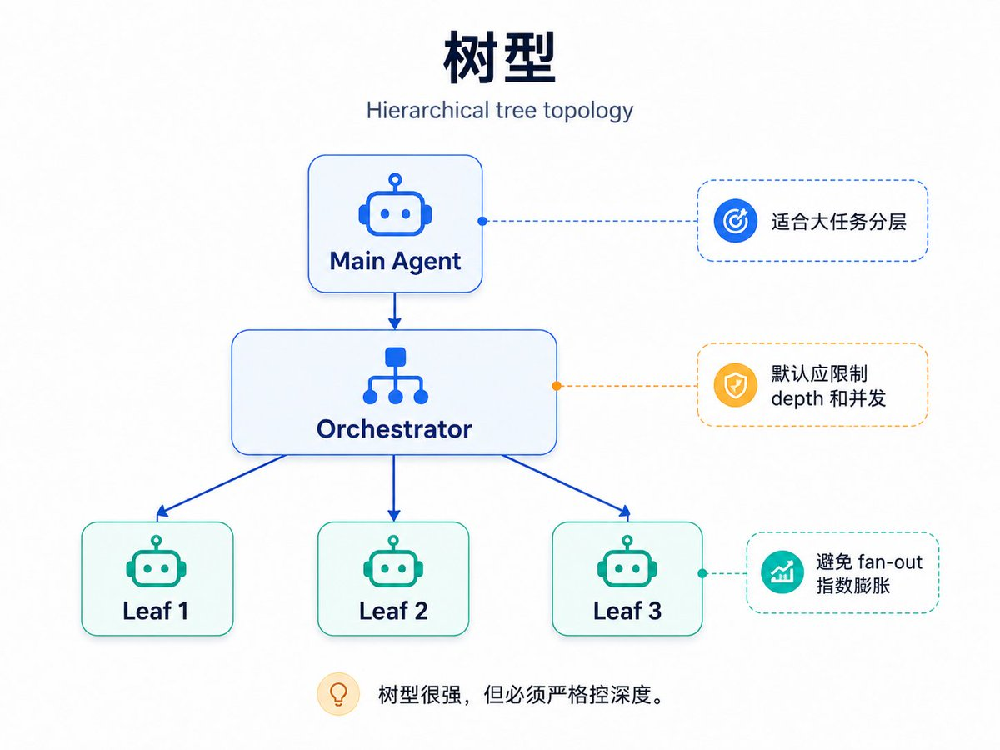

树型适合大任务分层。main agent 派一个 orchestrator，orchestrator 再派几个 leaf worker。树型看起来强，但要严格限制 depth 和并发，否则 fan-out 会指数级膨胀。OpenClaw 和 Hermes 都把默认深度压得很低，就是在控制这个风险。

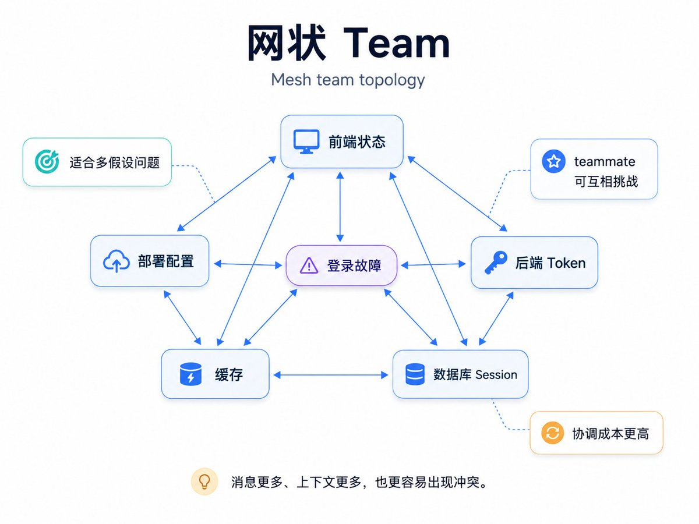

网状 team 适合多假设问题。比如生产登录故障可能来自前端状态、后端 token、数据库 session、缓存或部署配置，多个 teammate 可以分别验证假设，并互相挑战。网状结构的代价也很直接：消息更多、上下文更多、协调成本更高，写文件冲突也更容易出现。

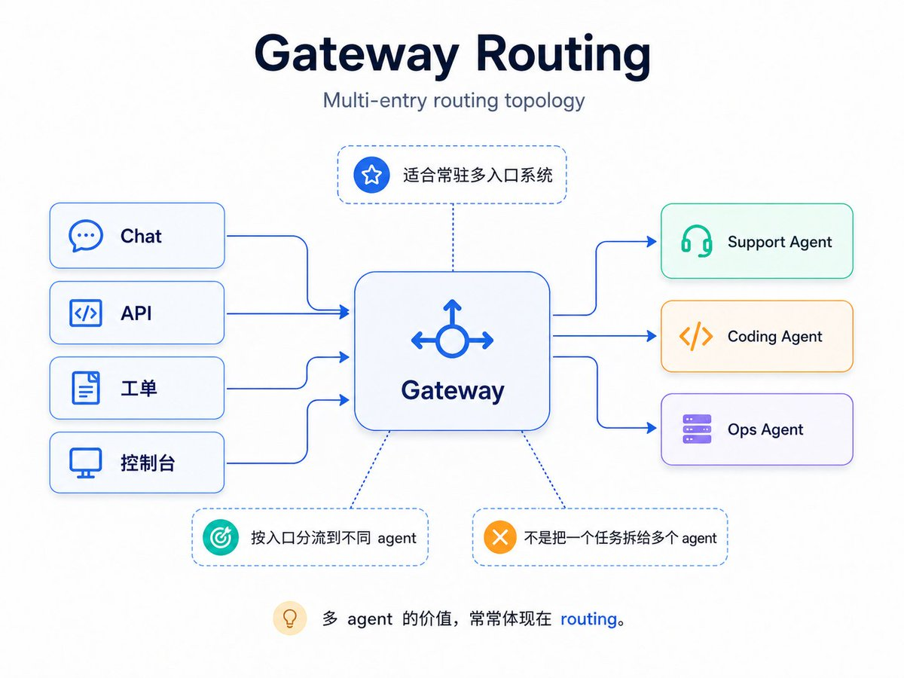

Gateway routing 适合常驻多入口系统。它不是“一个任务拆给多个 agent”，而是“不同入口进入不同 agent”。OpenClaw 的多 agent 价值，很大一部分在这里。

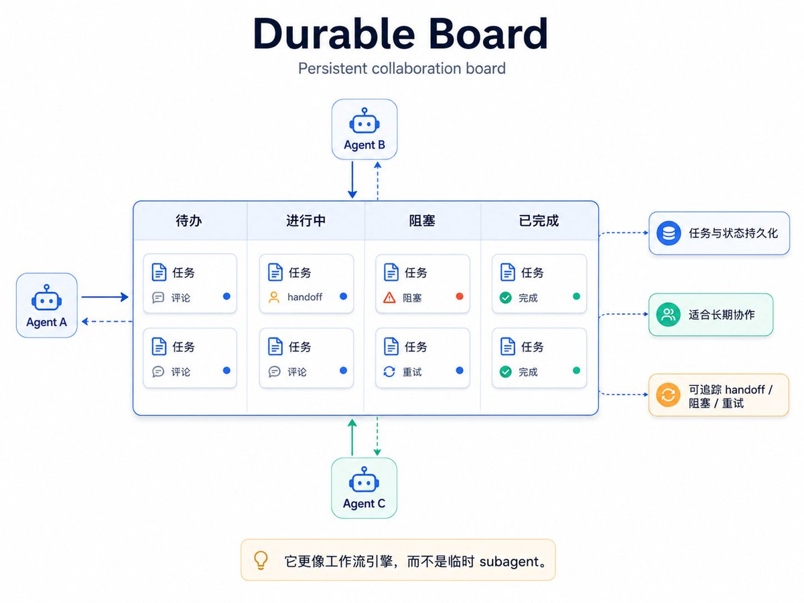

Durable board 适合长期协作。任务、评论、handoff、阻塞状态、重试记录都落到持久化存储里。

## 调用链

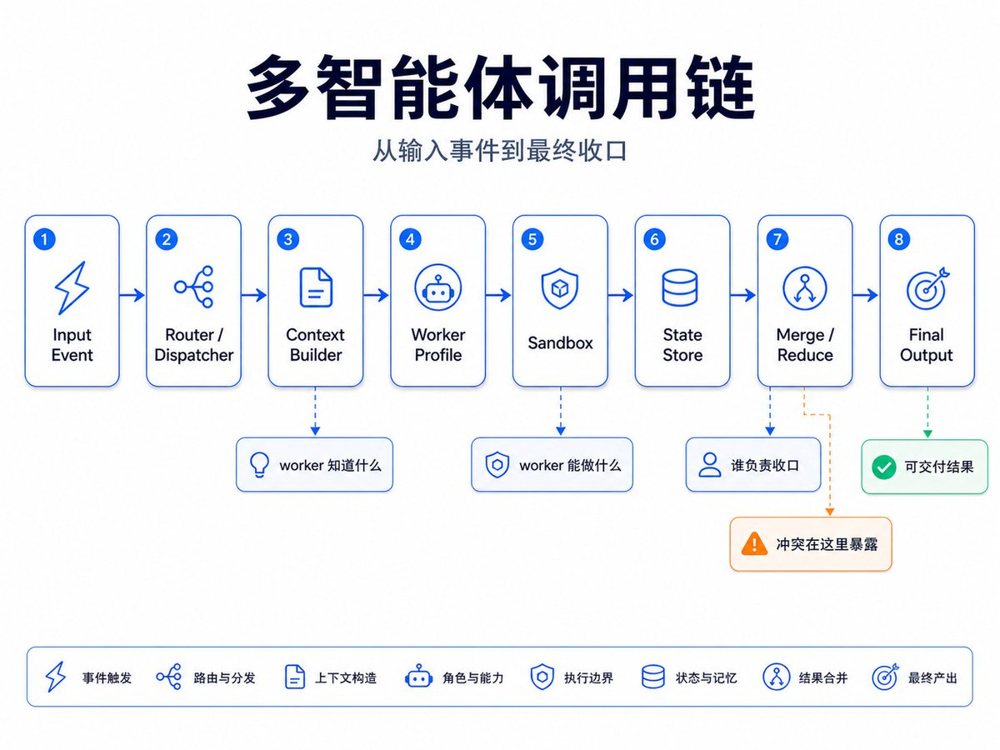

我会把一个多智能体系统拆成下面这条调用链：

\`\`\`
input event
  -&gt; router / dispatcher
  -&gt; context builder
  -&gt; worker profile selection
  -&gt; execution sandbox
  -&gt; state store
  -&gt; merge / reduce
  -&gt; final output or next task
\`\`\`

router / dispatcher 负责决定是否拆任务，以及拆给谁。Codex 里这个判断主要来自用户显式授权和主 agent，Claude Code 里会受 description 匹配影响，OpenClaw 里很多时候由入口绑定决定，Hermes 里短任务可能由父 agent 调 delegate\_task，也可能由模型按任务复杂度自动选择 delegation；长任务则可能由 Kanban dispatcher 按 assignee 拉起 worker。

context builder 负责决定 worker 知道什么。子 agent 没有足够上下文，跑偏很正常。你不能把一个 worker 拉进来只说“修一下”，然后期待它理解项目路径、错误现场、相关文件、验收标准、禁止事项和输出格式。对 subagent 来说，委派信息就是需求文档。

worker profile selection 决定用什么角色。一般有只读 explorer，能改代码的 worker，security reviewer，test reviewer，有长期 memory 的 profile，一次性 child。角色选错了，后面的权限和输出也会跟着错。

execution sandbox 决定 worker 能做什么。它能不能跑 shell？能不能联网？能不能写文件？能不能继续 spawn child？能不能访问用户凭据？这些都不只是安全配置，也会直接改变协作模式。只读 reviewer 和可写 implementer 是两种完全不同的 agent。

state store 决定状态放在哪里。一次性 subagent 的状态通常只活在本轮任务里，最后返回 summary。OpenClaw 的 agent 有自己的 session store。Hermes Kanban 会把 task、comment、handoff、blocked/retry 状态写进数据库。状态放在哪里，决定了系统能不能跨 turn、跨天、跨重启。

merge / reduce 负责收口。多个 worker 给出结果后，谁判断冲突，谁取舍，谁写最终 patch，谁对用户负责？很多多智能体 demo 看起来漂亮，是因为它跳过了 merge 难题。真实工程里，merge 才是多智能体成败的地方。

最后还要看取消和失败传播。父任务被中断时，子任务要不要一起停？worker 超时怎么办？两个 worker 给出相反结论怎么办？一个 worker 写了错误 patch，另一个 worker 的测试基于这个 patch 继续跑，系统怎么回滚？这些不是模型能力问题，而是运行时设计问题。

## Codex：显式 fan-out

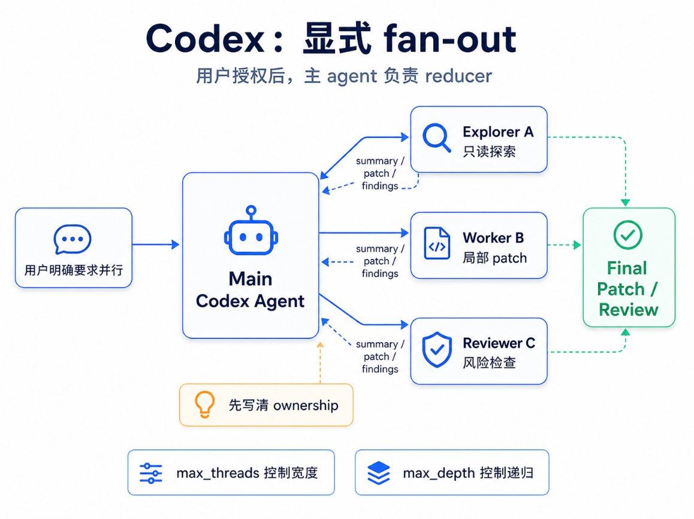

Codex 的 subagent 策略很克制。它默认不会因为任务听起来复杂就自动开一组 agent。你需要明确给出并行授权，比如：

\`\`\`
Use parallel subagents.
Spawn one agent per review category.
Delegate this work in parallel and synthesize the results.
\`\`\`

如果你只说“深入分析一下”“彻底 review 一下”“仔细调查这个 bug”，Codex 通常会把它理解成质量要求，而不是多 agent 授权。这是一个重要的产品取舍：Codex 把 fan-out 的控制权留给用户和主 agent，而不是把复杂度自动翻译成更多 worker。

这个设计背后有几个理由。多开 agent 会增加 token、延迟、日志量和合并成本；如果 worker 能写文件，还会带来冲突风险；如果子 agent 返回大量解释，主 agent 的 reduce 成本会变高。显式授权虽然看起来少了一点“自动”，但能把系统行为变得可预测。

Codex 的默认拓扑是星型。

\`\`\`
main Codex agent
  -&gt; explorer A: read-only search
  -&gt; explorer B: trace call path
  -&gt; worker C: scoped patch
  -&gt; reviewer D: test and risk review
  &lt;- summaries / patch / findings
main Codex agent reduces result
\`\`\`

主 agent 同时扮演 dispatcher 和 reducer。它决定派谁出去，也负责把结果合并成用户能用的回答或补丁。子 agent 的价值不只是“多一个脑子”，还有上下文隔离。代码库搜索、长日志、测试输出、调用链探索，都可以放进子上下文里，避免主上下文被噪声污染。

Codex 内置 agent 类型可以按责任理解。

explorer 适合读代码、找路径、定位调用链、搜相关文件。它最好保持只读，输出文件路径、函数名、关键证据、风险点和下一步建议。explorer 的价值在于减少主上下文探索成本，而不是直接改代码。

worker 适合改代码、补测试、实现局部功能。worker 必须有明确 ownership，比如只改 src/auth/\*，或只负责 tests/auth/\*。如果两个 worker 都能改同一块逻辑，最后省下的时间很可能会在冲突解决里还回去。

default 是通用兜底，适合边界还没完全清楚、但需要独立上下文处理的任务。它方便，但也要小心：越通用的 worker，越需要清楚的任务边界。

Codex 支持自定义 agent。团队可以把 TOML 放在 .codex/agents/ 或用户级目录里，配置 description、developer instructions、model、reasoning effort、sandbox、MCP、skills。这个能力适合把团队里的固定角色沉淀下来，比如 security-reviewer、migration-worker、docs-editor。但它也带来一个问题：agent 越多，调度规则越需要清楚，否则只是把 prompt 混乱从主上下文搬到了 agent 注册表。

Codex 还有两个很关键的护栏：agents.max\_threads 控制并发宽度，agents.max\_depth 控制递归深度。默认深度通常只允许主 agent 派子 agent，不鼓励子 agent 继续开孙子 agent。这个限制很实际。一次 PR review 开安全、测试、性能三个 worker 已经够用了；如果每个 worker 又继续开三个，成本和行为很快不可控。

Codex 不适合把所有复杂任务都自动拆开。小修小补不值得 fan-out；强顺序任务不适合并行；多个 worker 会写同一文件时，需要先串行设计，再并行执行；需求还模糊时，多 agent 只会把模糊放大。

更稳健的 Codex 委派方式应该像这样：

\`\`\`
Use parallel subagents.

Explorer A: trace the auth request path from UI to API. Read-only.
Explorer B: inspect session persistence and cookie handling. Read-only.
Worker C: patch only src/auth/session.ts after A and B report back.
Reviewer D: review the final diff and test coverage. Read-only.

Main agent must synthesize findings, resolve conflicts, and present one final plan.
\`\`\`

## Claude Code：description+team

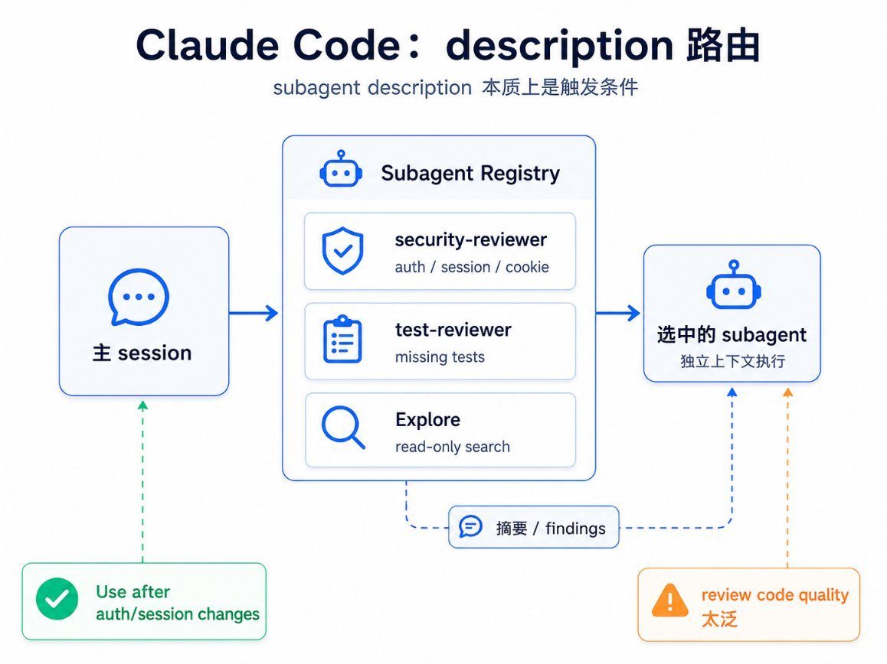

Claude Code 的普通 subagent 更像一个本地专家注册表。每个 subagent 有 name、description、system prompt、工具权限、模型和独立上下文。主 session 可以根据 description 判断什么时候调用它，也可以被用户显式点名调用。

例如一个安全 reviewer 可以这样写：

\`\`\`
name: security-reviewer
description: Use proactively after authentication or session code changes to review token handling, cookie flags, expiry, and missing tests.
tools: Read, Grep, Glob, Bash
model: sonnet
\`\`\`

这里的 description 是路由规则。它回答的是“什么时候应该叫我”。

写得具体，Claude 就更容易在合适的时机调用它；写得太泛，比如 “review code quality”，它就可能频繁出现，最后变成噪声。

普通 subagent 的生命周期比较短。主 session 调用它，它拿独立上下文执行任务，然后返回摘要。它不会天然变成长期角色，也不会默认和其他 subagent 协商。它适合探索、审查、日志分析、局部 debug、代码库理解这类上下文噪声大的工作。

Claude Code 内置的 Explore、Plan、General-purpose 可以理解成三个默认 worker profile。Explore 偏只读，适合代码库搜索、路径定位、快速理解。Plan 适合计划模式里的研究，把探索材料放在子上下文里，避免主上下文膨胀。General-purpose 更宽，可以处理多步任务，也可能读写文件。

这一层和 Codex 的差别在触发门槛。Codex 默认等用户显式授权；Claude Code 可以根据 description 自动委派。换句话说，Codex 的问题是“用户有没有授权并行”，Claude Code 的问题是“有没有一个 description 匹配当前任务”。

普通 Claude subagent 仍然是星型。

\`\`\`
main Claude session
  -&gt; Explore
  -&gt; security-reviewer
  -&gt; test-reviewer
  &lt;- summaries
main session decides next step
\`\`\`

Agent Teams 是另一套逻辑。按当前 Claude Code 文档，它还是实验功能，默认关闭，需要显式启用。启用后，它让一个 lead Claude 带多个 teammate，每个 teammate 有独立上下文，可以互相通信，并共享任务列表。这个时候，系统不再只是星型 fan-out，而接近 team mesh。

\`\`\`
lead Claude
  &lt;-&gt; frontend teammate
  &lt;-&gt; backend teammate
  &lt;-&gt; database teammate
  &lt;-&gt; test teammate
shared task list
direct teammate messages
\`\`\`

team 模式适合多假设问题。比如生产登录失败，可能来自前端状态、后端 token、数据库 session、缓存或部署配置。一个 agent 顺着一条线查，容易早早锚定；多个 teammate 分头验证，再互相挑战，覆盖面会更好。

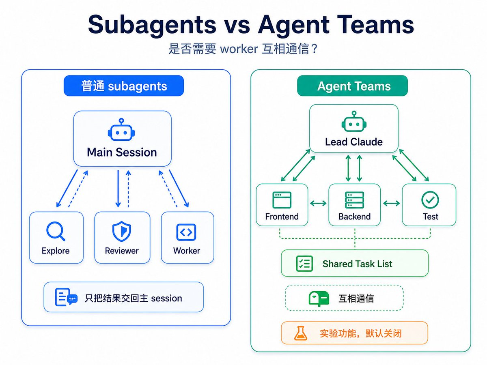

但 team 模式的成本也更高。teammate 会产生更多上下文、更多消息、更多中间判断。它们可能改同一文件，可能给出互相冲突的建议，也可能在共享任务列表里制造管理负担。lead 必须有明确收口责任。没有 ownership 的 team，很容易变成“多个 Claude session 同时忙，但没人负责最终结果”。

Claude Code 还有 Agent View、worktrees 和 /batch，这几个要和普通 subagent 分开理解。

Agent View 更像人类调度台。你可以启动多个后台 session，观察它们的状态，必要时插手、暂停或接管。这里的人类参与度更高，系统不假装所有协调都由模型自动完成。

worktrees 是写代码时的文件隔离手段。多个 agent 并行写同一个 repo，如果都在同一个工作区，冲突几乎不可避免。worktree 至少让每个 worker 在自己的副本里改，最后再合并。

/batch 更适合 repo-wide migration 或机械重构。比如把旧 API 批量替换成新 API，可以按目录拆成多个 worktree-isolated subagents。每个 agent 负责一片区域，最后统一跑测试和 review。

所以 Claude Code 可以分成三层：

\`\`\`
Layer 1: 普通 subagent
  description 自动路由
  独立上下文
  返回摘要

Layer 2: Agent Teams
  lead + teammates
  共享任务列表
  teammate 可互相通信

Layer 3: Agent View / worktrees / batch
  人类调度多个 session
  用 worktree 隔离写入
  适合大规模机械改造
\`\`\`

Claude Code 的常见失败点来自 description 和权限边界。description 太宽，会乱触发；工具权限太大，会越界；team 没有 ownership，会冲突；batch 没有验收标准，会产生一堆看起来完成、风格却不一致的 patch。

写 Claude subagent 时，一个好的 description 应该像触发条件：

\`\`\`
Use after auth/session/cookie code changes.
Check token handling, cookie flags, expiry, replay risk, and missing tests.
Return findings with file paths and severity.
Do not modify files.
\`\`\`

它能被路由，减少不确定性。Claude Code 的主动性来自 description，但可控性也取决于 description。

## OpenClaw：Gateway+后台任务

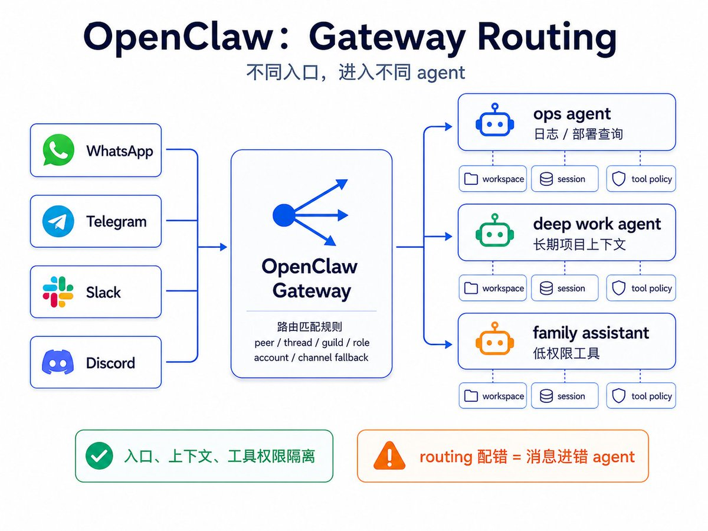

OpenClaw 和 Codex、Claude Code 的出发点不同。Codex 和 Claude Code 多半发生在一个 coding session 里；OpenClaw 先面对的是多渠道事件流。它更像一个 self-hosted Gateway，把 WhatsApp、Telegram、Discord、Slack 等 channel 接到 agent runtime。

在 OpenClaw 里，用户发来的不一定是一个统一的“任务”。它可能来自公司 Slack 的 ops channel，也可能来自私人 Telegram，也可能来自 Discord thread。不同入口意味着不同身份、不同权限、不同上下文和不同风险。所以 OpenClaw 的第一层不是 subagent，而是 routing。

\`\`\`
incoming message
  -&gt; channel/account/thread/peer matching
  -&gt; selected agent
  -&gt; agent workspace + session store
  -&gt; response or background task
\`\`\`

它可以按 peer、thread inheritance、Discord guild / role、Slack team、accountId、channel-level fallback 等规则选择 agent。消息从 Slack ops channel 来，可能进入 ops agent；从私人 Telegram 来，可能进入 deep work agent；从家庭入口来，可能进入低权限 assistant。

这里的触发器不是用户说“开 subagent”，也不是模型看 description 自动匹配，而是事件入口绑定。OpenClaw 先回答“这条消息属于哪个 agent”，然后才谈这个 agent 要不要拆任务。

OpenClaw 里的 agent 更像隔离运行单元，一个 agent 有自己的 workspace，比如 AGENTS.md、SOUL.md、USER.md、notes、persona rules；有自己的 agentDir，放认证信息、模型 registry、per-agent config；有自己的 session store，记录会话历史和 routing state。这里要注意一个边界：OpenClaw 文档说明 sub-agent auth 按 agent id 解析，但 main profiles 会作为 fallback 合并进来，所以它不是“每个 agent 的认证材料完全硬隔离”，更准确的说法是 agent 级配置、workspace、session 和工具策略隔离。

这意味着 OpenClaw 的多 agent 价值，很大一部分来自隔离。入口身份隔离、上下文隔离、权限隔离、工具隔离，这些都是它的主线。一个 ops agent 可以有日志和部署工具，一个家庭助手不该有危险 shell 权限；一个 deep work agent 可以记长期项目上下文，一个临时聊天 agent 不该共享这些状态。

第二层才是 background subagent。已有 agent 可以通过 /subagents spawn 或 sessions\_spawn 拉起后台 agent run。它通常返回 run id，主对话不阻塞。子 agent 在自己的 session 里跑，完成后 announce 结果。

这和 Codex 的 fan-out 有相似处，但生命周期不同。Codex 的子 agent 更像当前任务里的并行 worker，主 agent 等结果再收口；OpenClaw 的 background subagent 更像异步 job，适合常驻聊天场景。你让它查日志、跑研究、等慢工具，主对话可以继续，不必卡在同一个 turn 里。

OpenClaw 也允许嵌套，但默认限制很强。maxSpawnDepth 默认是 1。提高到 2 后，可以出现 orchestrator subagent 再派 worker 的树型结构，但 child 数和并发数会被限制，depth-2 worker 不能继续 spawn。这是很典型的 fan-out 控制。系统允许你做树型，但不会默认鼓励任务无限扩散。

第三层是 ACP Agents。OpenClaw 可以把外部 coding harness 接进来，比如 Codex、Claude Code、Cursor、OpenCode、Gemini CLI。用户说 “run this in Codex”，OpenClaw 可以路由到 Codex runtime。它不需要用 native subagent 覆盖所有执行场景，而是把自己变成统一入口。

OpenClaw 可以按三层理解：

\`\`\`
Routing layer:
  channel/account/thread/peer -&gt; agent

Agent isolation layer:
  workspace / agentDir / session store / sandbox / tool policy

Execution layer:
  native background subagent
  or external ACP harness
\`\`\`

OpenClaw 容易出问题的地方，也都在这三层。

routing 配错，消息会进错 agent。权限策略太宽，低风险入口可能拿到危险工具。session store 设计不清，个人上下文和工作上下文会互相污染。background job 太多，会造成并发和成本压力。ACP harness 调度不清，用户以为自己在 OpenClaw 原生环境里跑，实际进入了另一个工具链。

所以 OpenClaw 的工程重点不是“怎么让几个 agent 一起思考”，而是“怎么让不同入口、不同身份、不同权限的 agent 网络长期稳定运行”。它更像 agent 操作系统或消息网关，而不是单次 coding task 的并行器。

## Hermes：短任务 RPC，长任务 durable queue

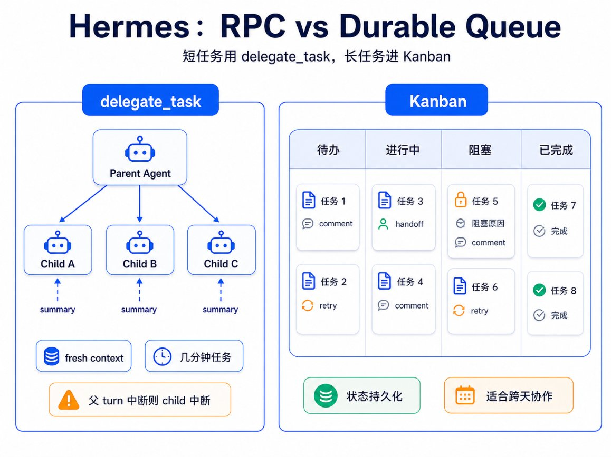

Hermes Agent 的设计很工程化，因为它把短程并行和长期协作拆成两个原语：delegate\_task 和 Kanban。

delegate\_task 处理短程并行。父 agent 发起调用，child agent 执行，最后返回 summary。这很像 RPC。触发上不一定需要用户显式说“请委派”：Hermes 文档说明 agent 会根据任务复杂度自动选择 delegation；但运行机制仍然是通过 delegate\_task 生成 child agent。

\`\`\`
parent agent
  -&gt; delegate\_task(goal, context)
    -&gt; child A
    -&gt; child B
    -&gt; child C
  &lt;- ordered summaries
parent continues
\`\`\`

child agent 有 fresh conversation、受限工具、独立 terminal session。它不知道父 agent 的全部上下文，只知道 goal 和 context 里写了什么。

Hermes 文档里那句 “subagents know nothing” 很关键。它把多智能体委派里最常见的坑讲透了：子 agent 不会自动知道背景。父 agent 必须把项目路径、错误信息、相关文件、任务目标、验收标准、禁止事项和输出格式写进去。只写 “fix the error”，相当于把不完整需求丢给一个新同事。

Hermes 对 delegate\_task 的限制也很明确。默认最多 3 个并发 child，超过就报错，不会静默截断。batch 结果按输入顺序返回。父 turn 被 interrupt 时，活跃 child 会一起中断。默认 leaf subagent 不能再 delegate。要嵌套，必须把 child 设成 orchestrator，并提高 max spawn depth。3 层深度、每层 3 并发，很快就是 27 个 leaf agents。

它还限制 leaf 工具：不能再调用 delegate\_task，不能 clarify 问用户，不能写 shared persistent memory，不能跨平台发消息，不能用某些危险执行工具。leaf worker 被固定成受控执行单元。这套设计的味道很清楚：短任务可以并行，但并行宽度、递归深度、工具权限和中断传播都要受控。

Kanban 处理另一类任务。它不是 subagent，而是 durable queue 加 state machine。任务、handoff、comment 写进 SQLite task board。worker 有 profile、有名字、有 memory。dispatcher 按 assignee 拉起 worker。任务可以 block、unblock、retry，也可以等待人类输入。

delegate\_task 和 Kanban 的差别，可以从生命周期看：

\`\`\`
delegate\_task:
  临时 child
  父 agent 等结果
  状态主要在本轮调用里
  适合几十秒到几分钟的并行研究、检查、局部修复

Kanban:
  持久 task
  worker profile 接力
  状态在 board 里
  适合跨 turn、跨天、等待人类、失败重试、审计
\`\`\`

举个例子。你要让三个 researcher 分别查三个资料源，然后汇总成一段结论，用 delegate\_task 很合适。你要做一篇两天的调研报告，先抓资料，再分析，再写稿，再审校，中间可能等人类补充方向，那就应该进 Kanban。

Hermes 容易失败的点，是把两类任务混用。短任务上 Kanban，会显得笨重；长任务用 delegate\_task，会丢状态、难重试、难交接。另一个失败点是 context 写得太少。Hermes 已经把风险写在文档里：child 不知道父上下文。你不给它足够信息，它就只能猜。

Hermes 的工程价值在于它把生命周期讲清楚了。一次性并行和持久协作不是同一种东西。前者需要 fork/join，后者需要队列、状态、重试、评论、handoff 和审计轨迹。

## 用几个具体场景看

场景一：PR review。

如果只是看一个中等 PR，Codex 或 Claude Code 普通 subagent 都够。安全、测试、性能各开一个只读 worker，最后主 agent 汇总。这个场景不需要 team mesh，因为 worker 之间不需要大量对话。更应该写清楚的是检查维度、输出格式和是否允许改文件。

用 Codex 时，可以显式说：

\`\`\`
Use three read-only subagents: security, tests, and maintainability.
Each should return findings with file paths and severity.
Do not modify files. Main agent synthesizes one review.
\`\`\`

用 Claude Code 时，可以把 security-reviewer、test-reviewer 写成 description 驱动的普通 subagent，让它在相关代码变化后自动出现。

场景二：生产登录故障。

这个问题适合 team 或至少并行探索，因为故障可能在前端状态、token 签发、session 存储、缓存、部署配置。Codex 可以显式 spawn 多个 explorer，让它们分别查 UI、API、DB、cache，然后由主 agent 收口。Claude Code Agent Teams 更适合让 teammate 互相挑战假设，比如 backend teammate 认为 token 过期，frontend teammate 可以拿浏览器状态反证。

这里不建议一开始就让多个 worker 写修复。更稳的做法是先只读并行定位，再由一个 worker 写 patch，再让 reviewer 检查。多 agent 的第一阶段应该扩大观察面，不应该急着扩大写入面。

场景三：多渠道个人助理。

这不是 Codex 或 Claude Code 的主场。WhatsApp、Telegram、Slack、Discord 这些入口需要 routing、入口身份隔离、权限隔离和 session store。OpenClaw 更贴这个问题。你要关心的不是“几个 agent 一起工作”，而是“哪个入口能触发哪个 agent、这个 agent 有哪些工具、状态存在哪里、凭据和工具权限怎么被约束”。

一个合理设计可能是：Slack ops channel 只进 ops agent，拥有日志读取和低风险部署查询工具；私人 Telegram 进 deep work agent，拥有个人项目上下文；家庭入口进 low-privilege assistant，不能访问 shell 和公司账号。这里的多 agent 首先是隔离边界，不是协作表演。

场景四：两天的调研报告。

一次性 subagent 不够。你需要任务拆分、状态记录、资料交接、人工评论、失败重试。Hermes Kanban 这类 durable board 更合适。可以先建 board：资料抓取、资料清洗、观点分析、初稿、审校。每个任务有 assignee、依赖、验收标准和评论区。

在某个具体任务里，比如“分别查三份官方文档”，再用 delegate\_task 开短程并行。也就是说，Kanban 管生命周期，delegate\_task 管局部并行。把这两层分清，系统才不会又笨重又丢状态。

场景五：repo-wide migration。

这类任务适合 worktree + batch。按目录或模块拆，不要按“让几个 agent 自己商量”拆。每个 worker 拥有一片文件范围，最后统一跑测试和 review。Claude Code 的 worktrees / batch 更贴近这个场景；Codex 也可以用 worker 分文件范围，但 ownership 必须写清楚。

一个常见错误是按角色拆，比如“一个 agent 负责思考，一个 agent 负责实现，一个 agent 负责测试”。对 repo-wide migration 来说，更好的拆法通常是按文件边界：packages/api、packages/web、packages/shared。文件边界比抽象角色更能减少冲突。

## 反模式：多 agent 最容易坏在哪里

第一个反模式是把复杂度当触发器。任务复杂不等于应该并行。如果子任务之间强依赖，比如“先理解业务规则，再决定数据模型，再写迁移”，那就是 pipeline，不是 fan-out。

第二个反模式是不给 delegation contract。worker 拿不到路径、错误现场、验收标准和禁止事项，只能猜。猜得准是运气，猜错是常态。

第三个反模式是让多个 worker 写同一片代码。多 agent 最怕“并行写入但没有 ownership”。如果必须并行写，先按目录、模块、测试文件分边界；如果边界分不出来，就先不要并行写。

第四个反模式是没有 reducer。多个 agent 返回结果之后，需要有人做取舍、合并、去重、排序、验收。没有 reducer 的多 agent 只是多份意见。

第五个反模式是把短任务做成队列，把长任务做成 RPC。短任务上 durable board 会拖慢反馈；长任务用一次性 subagent 会丢状态。Hermes 把这件事分成 delegate\_task 和 Kanban，是很好的工程提醒。

第六个反模式是权限过宽。一个 review agent 不该有写文件权限；一个家庭入口 agent 不该有公司 shell；一个 leaf worker 不一定需要继续 spawn child。权限越宽，调度越难预测。

第七个反模式是没有观测和审计。多 agent 系统需要知道谁触发了谁，传了什么 context，用了什么工具，返回了什么 summary，失败在哪里。否则出了问题，只能看一堆聊天记录猜。

## 选择顺序

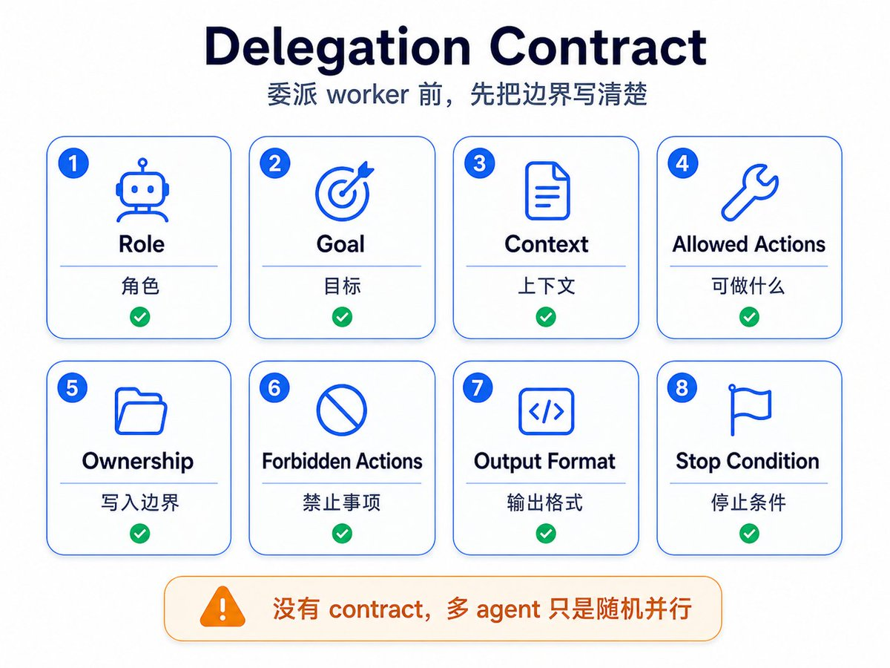

做多智能体设计时，可以按这个顺序问。

第一，单 agent 能不能做。能做就先别拆。小改动、强顺序、需求还模糊的时候，单 agent 最稳。

第二，主上下文会不会被污染。长日志、大搜索、跨目录阅读、多个失败栈，会让主 agent 变浑。把这些丢给 explorer 或只读 subagent 很合理。

第三，子任务能不能独立。安全 review、测试 review、性能 review 可以并行；先定位 bug 再决定怎么修，更适合 pipeline。

第四，结果是否必须在本轮返回。必须本轮返回，用 fork/join；不必本轮返回，可以用 background job；需要跨天、重试、等待人类，用 durable queue 或 Kanban。

第五，worker 是否需要互相挑战。只需要分头查资料，星型足够；需要互相质疑和共享任务状态，再考虑 team mesh。

第六，是否会并行写文件。只要多个 worker 会写文件，就先写 ownership。谁改哪个目录，谁只读，谁最后合并，没有这些约束就不要并行写。

第七，是否需要入口隔离。多渠道、多身份、多权限的系统，优先考虑 Gateway routing，而不是把所有消息丢给一个万能 agent。

第八，失败后如何恢复。能不能 retry？能不能 block？能不能保留 handoff？能不能看见子任务的证据？这些决定了系统能不能长期运行。

## Delegation contract 模板

如果只想拿走一个实践模板，可以用下面这个。它适用于 Codex、Claude Code、Hermes，也适用于任何需要委派 worker 的系统。

\`\`\`
Role:
  你是 read-only auth explorer / scoped implementation worker / security reviewer。

Goal:
  你要回答或完成什么，边界是什么。

Context:
  项目路径、相关文件、错误信息、用户目标、已有判断。

Allowed actions:
  能读哪些文件，能不能跑命令，能不能写文件，能不能联网。

Ownership:
  如果能写，只能写哪些目录或文件。

Forbidden actions:
  不要改哪些文件，不要做哪些重构，不要问用户，不要继续 spawn child。

Output format:
  返回 findings / patch summary / test result / confidence / open questions。

Stop condition:
  什么情况下算完成，什么情况下应该停止并报告阻塞。
\`\`\`

这个模板看起来朴素，但它解决的是多 agent 的基本问题：上下文、权限、边界、输出和收口。没有这些，再高级的拓扑都会变成随机并行。

## 结论

多智能体协作不是越多越好，也不是越自动越好。

工程上更稳顶的顺序是：先决定调度方式，再决定状态放哪里；先决定上下文和权限边界，再决定拓扑；先决定谁 reduce，再决定开几个 worker。

Codex 适合显式、可控的星型并行。Claude Code 适合 description 驱动的专家委派，也能在 team 和 batch 场景里做更复杂的协作。OpenClaw 适合多入口、常驻、带权限隔离的 agent 网络。Hermes 适合把短程并行和长期队列分开，用 delegate\_task 管临时 fork/join，用 Kanban 管跨 turn 的工作流。

如果一个任务只是需要更快地查四条线，用星型 subagents。

如果一个问题需要多方互相挑战，用 team mesh。

如果消息来自不同渠道和身份，用 Gateway routing。

如果任务要跨天、重试、等待人类，用 durable board。

如果多个 worker 会写同一片代码，先停下来，把 ownership 写清楚。

先设计边界，再增加 agent 数量。

这个顺序不会显得炫，但它更接近真实工程。

### 🖼️ Attached Media

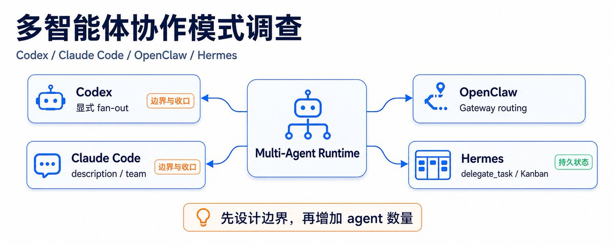

## 💬 Replies

### 1 @nini_incrypto_ (nini)

*Mon May 18 11:16:37 +0000 2026*

@Russell3402 牛逼好详细老师 完全干货

### 2 @Russell3402 (Russell) (Author)

*Mon May 18 11:18:23 +0000 2026*

@nini\_incrypto\_ 感谢支持

### 3 @davinci_seven (达芬七Seven)

*Mon May 18 11:23:37 +0000 2026*

@Russell3402 好干的干货🤓

### 4 @Russell3402 (Russell) (Author)

*Mon May 18 11:23:49 +0000 2026*

@SuisPasDaVinci 嘻嘻

### 5 @ListenerEight (Diablo)

*Mon May 18 11:13:24 +0000 2026*

@Russell3402 学会了能不能赚钱？

### 6 @Russell3402 (Russell) (Author)

*Mon May 18 11:18:43 +0000 2026*

@ListenerEight 能 兄弟

### 7 @edwardxlaime (Edward)

*Mon May 18 11:22:47 +0000 2026*

@Russell3402 这么干要我怎么看懂😂

### 8 @Russell3402 (Russell) (Author)

*Mon May 18 11:23:31 +0000 2026*

@lnxinsh00633331 兄弟 给我钱 我嘴对嘴讲

### 9 @byronzhang01 (拜伦张)

*Tue May 19 00:50:10 +0000 2026*

@Russell3402 干货满满的一篇文章！多智能体不是越多越好、越自动越好。先设计边界、调度、状态和收口责任，再决定开几个Agent。

### 10 @Russell3402 (Russell) (Author)

*Tue May 19 00:53:38 +0000 2026*

@byronzhang01 感谢认同

### 11 @lalapap02264417 (lala papa)

*Mon May 18 18:54:29 +0000 2026*

@Russell3402 前端和后端有推荐吗？

### 12 @Russell3402 (Russell) (Author)

*Wed May 20 06:02:20 +0000 2026*

@lalapap02264417 全栈

### 13 @daqie1516 (daqie)

*Wed May 20 00:42:17 +0000 2026*

@Russell3402 认真读完，受益颇多

### 14 @Russell3402 (Russell) (Author)

*Wed May 20 02:56:00 +0000 2026*

@daqie1516 感谢支持

### 15 @SynyuLeo (Synyu)

*Mon May 18 18:18:13 +0000 2026*

@Russell3402 多来点 太干了 能不能来个网页版的

### 16 @Russell3402 (Russell) (Author)

*Tue May 19 00:24:57 +0000 2026*

@SynyuLeo 网页版的什么

### 17 @isnail (蜗牛King 👑)

*Mon May 18 22:50:30 +0000 2026*

@Russell3402 有点干，大多数小白啃起来有点困难

补货很牛逼

把链接给CC或者Codex就好

### 18 @icycat (冷酷小猫 IcyCat)

*Mon May 18 11:47:52 +0000 2026*

@Russell3402 太硬挺了 知识滑溜的滑过了我的大脑

### 19 @ai_super_niko (Niko爱学习)

*Mon May 18 11:49:18 +0000 2026*

@Russell3402 好长。这个适合做Agent Team或者做开发仔细来读下。

### 20 @AgiRay1015 (AI磊叔)

*Tue May 19 04:23:37 +0000 2026*

@Russell3402 企业部署 agent 必看文章～

### 21 @xuesumin (FalconCI)

*Mon May 18 19:27:31 +0000 2026*

@Russell3402 @clip2vault

### 22 @TT7034588950290 (进阶的TT)

*Wed May 20 02:55:17 +0000 2026*

@Russell3402 @grok
总结一下他说的什么

### 23 @Formulasearch (阿哲Phil)

*Mon May 18 11:18:46 +0000 2026*

@Russell3402 搞这么专业的，不带带兄弟们吗😭

### 24 @samuzora1970 (Sam)

*Tue May 19 00:53:54 +0000 2026*

@Russell3402 agent OS？

### 25 @x_tom_jp (tom)

*Tue May 19 15:41:28 +0000 2026*

@Russell3402 @threadreaderapp unroll

### 26 @OMOisomo (O MO)

*Mon May 18 14:37:22 +0000 2026*

@Russell3402 确实很干。。

### 27 @Biteo312Fy (Fy付不易)

*Tue May 19 03:13:55 +0000 2026*

@Russell3402 是有点硬核了，我的脑子得消化消化🤣

### 28 @zhianyoo (之安)

*Wed May 20 03:19:45 +0000 2026*

@Russell3402 太强了

### 29 @linuxing3 (linuxing3)

*Tue May 19 17:59:49 +0000 2026*

@Russell3402 开发和监管，应该相辅相成，不是互相拆台

### 30 @gliesesettopbox (得b)

*Tue May 19 07:38:27 +0000 2026*

@Russell3402 真长呀

### 31 @diowang13 (WangLe)

*Tue May 19 21:37:25 +0000 2026*

@Russell3402 @readwise save

### 32 @PuluZuru (Zig)

*Mon May 18 14:40:48 +0000 2026*

@Russell3402 参考价值不大

### 33 @ypy1031 (chess xy)

*Wed May 20 01:19:31 +0000 2026*

@Russell3402 受教了

