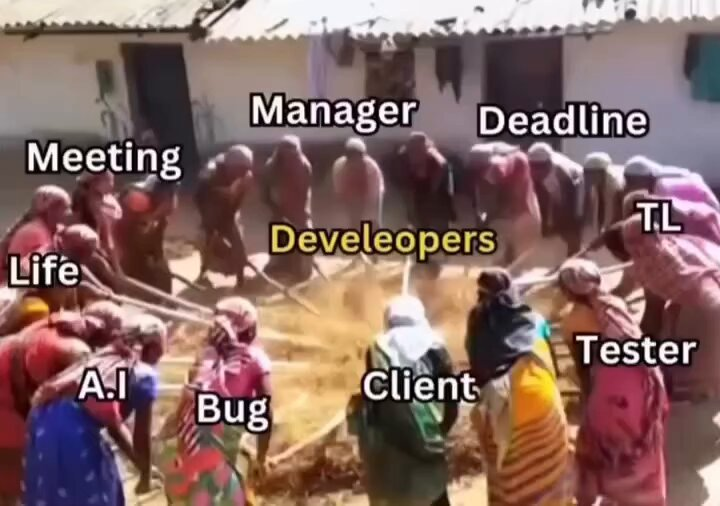

Real 

## 💬 Replies

### 1 @sujithphilip (Philiposeur)

*Mon Jul 13 16:43:32 +0000 2026*

@shillhousecom Not much future with such spellings 🤣

### 2 @vhaymir (Vhaymir M Benjamin)

*Mon Jul 13 18:46:11 +0000 2026*

@shillhousecom why tester giving pressure? 😅😂

### 3 @BernardoRavazz1 (Bernardo Ravazzoni)

*Mon Jul 13 15:31:24 +0000 2026*

@shillhousecom Either the video is AI, or the stick is magically noclipping trough their body

### 4 @buiducthuan47 (Bùi Đức Thuận)

*Mon Jul 13 14:23:01 +0000 2026*

@shillhousecom "Develeopers" ✌️😭

### 5 @SelinarSnowcat (❄️Selinar Snowcat❄️)

*Mon Jul 13 18:20:45 +0000 2026*

@shillhousecom You forgot to include Product in there whacking away. 🤣🤣

### 6 @PeterFinity (PeterFinity)

*Mon Jul 13 18:40:26 +0000 2026*

@shillhousecom Not for much longer..

### 7 @pirwot (Joshua Pi'Rwot)

*Mon Jul 13 17:16:56 +0000 2026*

@shillhousecom Nope. 

Even developers are out …

Everyone is beating Claude.

### 8 @BoxPolOfficial (BoxPol)

*Mon Jul 13 17:02:07 +0000 2026*

@shillhousecom You’re all not that important. These doomsday post are just corny... Dorks

### 9 @rebeccatrinidad (Rebecca Trinidad)

*Mon Jul 13 18:23:27 +0000 2026*

@shillhousecom Replace all of those labels with "self" and you'll have an accurate depiction of the developer pity party you're suggesting

### 10 @Capta1nCodes (Priyal Raj)

*Mon Jul 13 06:13:05 +0000 2026*

@shillhousecom Opposite, if you can manage to do it so....

### 11 @gianlorenzo (GianlorenzoSantarosa)

*Mon Jul 13 20:29:04 +0000 2026*

@shillhousecom O only saw pure and clear truth

### 12 @1gezginmuhendis (okta)

*Mon Jul 13 18:44:57 +0000 2026*

@shillhousecom 😅

### 13 @aamanatullah (アーマナトゥラ)

*Mon Jul 13 17:55:49 +0000 2026*

@shillhousecom Developers + Lepers

### 14 @runequantum (Daniel Fredriksen 🇺🇲)

*Mon Jul 13 19:06:56 +0000 2026*

@shillhousecom Not anymore

### 15 @banzai_cro (banzai)

*Tue Jul 14 12:14:48 +0000 2026*

@shillhousecom 

### 16 @gordo_y_jugoso (BassMechanic)

*Mon Jul 13 17:58:11 +0000 2026*

@shillhousecom Si, pero falta el cabrón hijo de puta que vendió el desarrollo como la cura para todos los males

### 17 @JeshuaAlexander (Jeshua Alexander)

*Mon Jul 13 19:39:00 +0000 2026*

@shillhousecom cuando me preguntan, ¿ a que te dedicas ?
no puedo resumirlo en una frase, les enviare este meme

### 18 @mksteadicam (Michael Klein)

*Mon Jul 13 22:09:36 +0000 2026*

@shillhousecom @jpatmakesgames

### 19 @Vide_audi_sile (Svitlana Bondar)

*Mon Jul 13 20:38:44 +0000 2026*

@shillhousecom 😄

### 20 @BenjaminPaladin (Benjamin)

*Mon Jul 13 18:50:22 +0000 2026*

@shillhousecom @zexigh. Petite pensée pour la super équipe IA de @ScanderiaFR

### 21 @NDesmaziers (Jean Bréhal)

*Wed Jul 15 19:30:11 +0000 2026*

@shillhousecom Very true.

### 22 @VenomTexas (VenomTexas)

*Mon Jul 13 22:30:37 +0000 2026*

@shillhousecom Indeed— no lies detected..

### 23 @0xEver4k (Ever4k)

*Mon Jul 13 16:15:52 +0000 2026*

@shillhousecom fact 

### 24 @SmartLeCo (SmartLeCo | Smart Leaders Community)

*Thu Jul 16 16:56:03 +0000 2026*

@shillhousecom 100% true )

### 25 @bradsl (WA Miscreant)

*Mon Jul 13 21:32:19 +0000 2026*

@shillhousecom So… The beatings will continue until morale improves.

### 26 @cartooncombat_ (cartoon_combat)

*Mon Jul 13 20:10:48 +0000 2026*

@shillhousecom 🤣🤣🤣🤣🤣🤣🤣

### 27 @BrutusSociety1 (Brutus⛩️)

*Mon Jul 13 17:26:55 +0000 2026*

@shillhousecom The good news is this real and I am from there, the sad thing is you have no clue about what you are sharing.

### 28 @Anita_Kapal (anita kapal)

*Mon Jul 13 16:27:08 +0000 2026*

@shillhousecom So true, developers are screwed always

