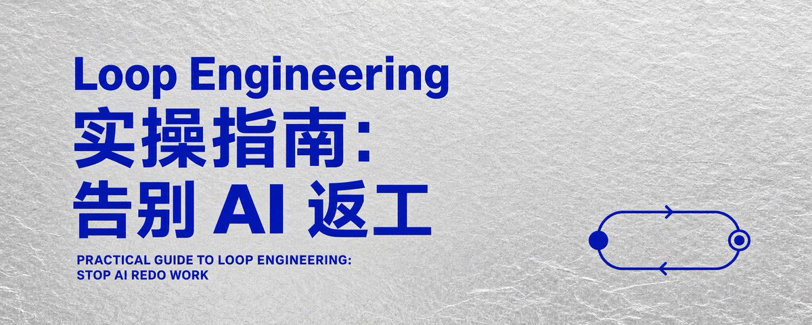

# 📰 Loop Engineering 实操指南：告别 AI 返工

看完这篇，你会拿到三样东西：
一个最小 Loop 模板， 一个 KOL Loop 完整案例，三个可迁移场景：写文章、做视频、整理周报

我们以前用 AI 做复杂任务时，最烦的是它中途跑偏，还要自己发现、提醒、返工。

Loop Engineering 解决的就是这个问题：提前设计目标、检查标准、反馈方式和停止条件，让 AI 自己一轮轮修正到可交付。

这篇文章会用 KOL Loop、Article Loop 和内容工作流，讲清楚普通人怎么把找 KOL、写文章、做视频、整理周报这类任务，变成 AI 可以持续执行的工作循环。

很多人用 AI 卡住的地方，其实就在这里：

- 它跑偏了，你要发现。它漏条件了，你要提醒

- 它混进脏数据了，你要筛。它输出格式不对，你要重整

Loop Engineering 想解决的，就是这部分人肉盯场成本。

---

## 1\. 先给一个最小定义

Loop Engineering 的最小形态，可以理解成一句话：

> 给 Agent 一个目标，让它执行一轮；用明确标准检查结果；把问题变成下一轮反馈；记录当前状态；继续修正，直到达到停止条件。

所以一个可用 Loop 至少要有 7 个要素：

\| 要素 \| 你要写清楚什么 \|
\|---\|---\|
\| 目标 \| 最后要交付什么 \|
\| 执行 \| 每一轮要做什么 \|
\| 检查 \| 什么结果算合格 \|
\| 纠错 \| 不合格时怎么改 \|
\| 状态 \| 当前做到哪里、还差什么 \|
\| 沉淀 \| 哪些经验要变成下一轮规则 \|
\| 停止 \| 什么时候跳出循环 \|

Heartbeat、Skill、Connector、多 Agent、State 这些组件，会让 Loop 更稳定、更自动、更可复用。

但它们属于增强件。

最小 Loop 的核心就是：

执行一轮 -&gt; 检查结果 -&gt; 反馈问题 -&gt; 修正规则 -&gt; 继续执行 -&gt; 达标后停止。

---

## 2\. Goal、Skill、Loop 怎么区分

很多人第一次接触 Loop Engineering，会把 Goal、Skill、Loop 混在一起。

我用一个很简单的方式理解：

\| 概念 \| 作用 \|
\|---\|---\|
\| Goal \| 这次任务要到哪里 \|
\| Skill \| 已经沉淀好的一套方法 \|
\| Loop \| 按照目标和方法，一轮轮执行、检查、修正 \|

打个比方，你要做番茄牛腩：

- Goal：今晚做一份能上桌的番茄牛腩

- Skill：番茄牛腩的菜谱和经验

- Loop：切菜、炖煮、试味、调整、继续炖，直到味道合格

放到 Codex 或 Claude Code 里也一样。

Goal 定义终点，Skill 沉淀方法，Loop 负责把方法跑到终点。

---

## 3\. 你可以这样告诉 Agent

普通人设计 Loop，不要先问“该用什么工具”。

先把任务写成这个结构：

\`\`\`plaintext
请你把这个任务当成一个 Loop 来完成。

目标：
\[最后要交付什么\]

输入：
\[你可以读取哪些资料、链接、表格、笔记、历史结果\]

每一轮动作：
1\. 执行：\[这一轮先做什么\]
2\. 检查：\[用什么标准检查\]
3\. 纠错：\[发现问题后怎么改\]
4\. 记录：\[本轮新增什么规则或状态\]

合格标准：
\- \[标准 1\]
\- \[标准 2\]
\- \[标准 3\]

反馈分层：
\- Hard Gate：必须剔除的问题
\- Soft Rubric：需要评分或人工复核的问题
\- Observation：先记录、暂不升级成规则的问题

停止条件：
达到 \[数量/质量/格式/验证标准\] 后停止。
如果连续 \[N\] 轮无法改善，请停止并说明卡在哪里。

最终交付：
\[表格/文章/报告/清单/可发布版本\]
\`\`\`

这个模板的重点只有一个：

你提前把“检查”和“纠错”写进去。

很多人给 AI 的指令只有目标和步骤。结果 AI 确实执行了，但中途跑偏也会继续往下跑。

Loop 的关键，是让它每一轮都知道：怎么判断自己做得对不对，错了以后下一轮怎么改。

每一轮结束后，也最好让 Agent 固定输出一份“回合报告”：

\`\`\`plaintext
本轮结果：
\- 新增合格结果：
\- 剔除结果：
\- 剔除原因：

反馈更新：
\- 新增 Hard Gate：
\- 新增 Soft Rubric：
\- Observation：

当前状态：
\- 当前进度：
\- 下一轮只优化：
\- 是否达到停止条件：
\`\`\`

这份回合报告很重要。

它能防止 Agent 每一轮都像从零开始，也能让你看清楚：它到底是在变好，还是只是在重复生成。

---

## 4\. 我的 KOL Loop：一个可以照抄的例子

Loop Engineering 到底怎么用？

我直接分享一个我的工作流。你可以把任务换成自己的场景，结构照着改。

如果我要找英文金融 KOL，我不会只说：

> 帮我找 30 个金融博主。

这个指令太松。AI 很容易混进媒体号、公司号、生活号、纯 Crypto 号，最后还要人一条条检查。

我会这样写：

\`\`\`plaintext
text
请使用「Loop Engineering + KOL Finder」方法，帮我寻找英文金融 KOL。

要求：
1\. 平台：YouTube、TikTok、Instagram
2\. 国家：英国、加拿大、澳洲、新加坡、新西兰
3\. 语言：英文
4\. 粉丝门槛：100K+
5\. 数量：找到 30 个后跳出 Loop
6\. 内容：金融交易、股票投资、外汇、黄金、金融时事、个人理财、投资教育
7\. 排除：媒体号、公司号、品牌号、CEO/创始人号、政治号、生活号、汽车号、纯 Crypto/Web3 号
8\. 可以有少量 Web3，但不能以 Web3/Crypto 为主
9\. 必须跟之前名单去重
10\. 输出 Excel，粉丝用 K/M，链接用 handle 格式，国家用中文，联系方式能找到就列出来
\`\`\`

这里的重点是：硬条件、排除条件、停止条件、输出格式，全都提前写清楚。

这样 Agent 每一轮都知道自己要检查什么。

\| 阶段 \| 动作 \| 检查重点 \|
\|---\|---\|---\|
\| Define \| 锁死国家、语言、平台、粉丝、内容范围、排除类型、数量目标 \| 防止条件太宽 \|
\| Search \| 用 KOL Finder、Apify、YouTube API、TikTok hashtag、Instagram profile、Google 搜索拉候选池 \| 先扩大范围 \|
\| Filter \| 查粉丝、语言、国家、重复账号、账号类型 \| 先挡掉脏数据 \|
\| Content Audit \| 看近期作品 \| 确认持续在讲金融、交易、投资、理财 \|
\| QA Loop \| 查污染项 \| 汽车号、新闻号、政治号、生活号、纯 Crypto、国家靠猜、字段错误 \|
\| Feedback \| 把错误变成下一轮规则 \| 汽车号混入就强化排除词；纯 Web3 太多就提高金融内容占比要求 \|
\| Stop \| 达到 30 个合格账号就停 \| 条件太严找不够时，说明库存上限，不硬凑 \|
\| Deliver \| 输出 Excel \| 国家、平台、handle、粉丝 K/M、联系方式、内容审核说明、验证状态 \|

KOL Loop 真正节省的，是反复检查、纠错、去重、补字段的时间。

你给 AI 的任务越清楚，它越容易跑成一套会自己筛错的工作循环。

这里还有一个容易被忽略的东西：State。

如果没有状态表，Agent 很容易每一轮都重新理解任务。你最好让它维护一个简单的进度表：

\| 字段 \| 示例 \|
\|---\|---\|
\| 已找到合格数量 \| 18/30 \|
\| 本轮污染项 \| 公司号、纯 Crypto、国家不明 \|
\| 新增规则 \| 近期内容必须以金融/投资为主 \|
\| 待复核项 \| 国家不明账号 5 个 \|
\| 下一轮重点 \| 补加拿大和新西兰 \|
\| 停止条件 \| 达到 30 个，或连续 2 轮无新增合格账号 \|

这个表就是 KOL Loop 的“记忆”。

它能让下一轮搜索带着上一轮的经验继续跑，而不是重新开始。

---

## 5\. KOL Loop 背后的 6 个零件

如果把一个更完整的 Loop 系统拆开看，常见会用到 Heartbeat、Isolation、Skill、Connector、Agent、State 这些能力。

它们不是 Loop Engineering 的固定公式，也不是一开始就必须全部配齐。

但这些词能帮你理解：为什么一个 Loop 可以变得更稳定、更自动、更可复用。

放到 KOL 场景里，就很好理解。

\| 零件 \| 在 KOL Loop 里的作用 \|
\|---\|---\|
\| Heartbeat \| 每周刷新候选池，每月复查老 KOL，每次 Campaign 前重新检查粉丝、内容、联系方式 \|
\| Isolation \| 分成候选池、待复核池、正式交付池，避免脏数据污染最终名单 \|
\| Skill \| 把 KOL Finder 的筛选方法沉淀下来，以后只替换国家、平台、垂类、粉丝门槛 \|
\| Connector \| 接 YouTube API、TikTok、Instagram、Apify、Google 搜索、Excel、Obsidian \|
\| Agent \| Search、Filter、Content Audit、QA、Deliver 分工处理 \|
\| State \| 记住已找到多少、排除了谁、为什么排除、还差多少、下一轮重点 \|

普通人一开始不用全部配齐。

先把 Define、Filter、QA、Feedback、Stop 写清楚，就能跑出一个简单 Loop。

等这个任务变成高频工作，再逐步加 Skill、Connector、Heartbeat 和多 Agent。

---

## 6\. 写文章本身，也可以是一个 Loop

你正在读的这篇文章，就是一个 Article Loop 的结果。

它没有一上来就让 AI 直接写完。

我们是这样跑的：

\| 阶段 \| 这篇文章里做了什么 \|
\|---\|---\|
\| Define \| 确定写给小白，讲清楚 Loop Engineering 怎么实操 \|
\| Research \| 收集 OpenAI、Anthropic、Addy Osmani、中文 X 讨论、KOL Loop 案例 \|
\| Outline \| 先做素材表和大纲，放进 Obsidian \|
\| Draft \| 写第一版长文 \|
\| QA \| 检查开头、AI 腔、案例是否具体、结构是否清楚 \|
\| Feedback \| 把每次反馈变成下一版规则 \|
\| Revise \| 重写 KOL 案例、补官方案例、调整版面 \|
\| Deliver \| 输出可发布版本 \|

你也可以这样告诉 AI：

\`\`\`plaintext
请使用「Loop Engineering + Article Writer」方法，帮我写一篇适合发 X 的长文。

要求：
1\. 主题：Loop Engineering 如何实操
2\. 读者：听过 AI 工具，但不知道如何设计工作流的小白用户
3\. 目标：让读者看完知道怎么设计自己的 Loop
4\. 必须包含：开头钩子、实操模板、真实案例、常见误区、结尾判断
5\. 风格：像一个人在分享经验，不要写成百科解释
6\. 排除：空泛概念、连续排比、AI 腔、过度客气的表达
7\. 输出：先给大纲，再写初稿，最后检查是否适合 X 发布
\`\`\`

写文章的 Loop 可以很简单：

Define -&gt; Research -&gt; Outline -&gt; Draft -&gt; QA -&gt; Feedback -&gt; Revise -&gt; Deliver

好文章很少一次生成。它通常是在多轮检查和修正里慢慢长出来的。

---

## 7\. 自媒体、视频和日常工作怎么用

这些场景也适合 Loop，因为它们天然需要反复测试。

内容创作 Loop

\`\`\`plaintext
请使用「Loop Engineering + Content Creator」方法，帮我设计一套短视频 / X / 小红书内容生产 Loop。

要求：
1\. 平台：X、小红书、YouTube Shorts 或 TikTok
2\. 主题方向：\[AI 工具 / 投资教育 / 职场效率\]
3\. 目标受众：\[AI 小白 / 自媒体创作者 / 创业者\]
4\. 每轮产出：选题、标题、开头钩子、脚本大纲、发布文案
5\. 检查标准：是否有痛点、是否具体、是否能引发评论或收藏
6\. 数据反馈：发布后根据浏览、点赞、收藏、评论、完播率调整下一轮规则
7\. 输出：给我 10 个选题，并说明每个选题适合的平台和切入角度
\`\`\`

这个 Loop 的关键是：

Trend -&gt; Angle -&gt; Script -&gt; QA -&gt; Feedback

先找热点和需求，再选切入角度，然后生成脚本，最后用数据反馈更新下一轮规则。

日常工作 Loop

\`\`\`plaintext
请使用「Loop Engineering + Work Assistant」方法，帮我管理本周项目跟进。

要求：
1\. 输入：会议纪要、聊天记录、任务清单、项目文档
2\. 目标：整理出本周待办、负责人、截止时间、风险点
3\. 检查标准：每个任务必须有负责人、下一步动作、截止时间
4\. QA：检查有没有模糊任务、没人负责的任务、已经过期的任务
5\. Feedback：如果发现信息缺失，请列出需要我补充的问题
6\. Stop：所有任务都补齐负责人和下一步动作后停止
7\. 输出：一份可直接发送的周报或项目跟进表
\`\`\`

这个 Loop 的关键是：

Collect -&gt; Extract -&gt; QA -&gt; Feedback -&gt; Deliver

把会议纪要、聊天记录、任务清单丢进去，让 AI 提取任务，再检查缺口，最后输出可用周报。

只要你的工作里有重复检查，就有设计 Loop 的空间。

---

## 8\. 几个更可靠的案例

我重新看了几个比较可靠的资料。它们给普通人的启发很一致：

Loop 不是让 AI 一直跑。Loop 是让 AI 留下过程证据，接受检查，把反馈变成下一轮规则。

## OpenAI Agent Improvement Loop

OpenAI Cookbook 的 Agent Improvement Loop 做的是：

真实运行 Agent -&gt; 查看 traces -&gt; 收集人类反馈和模型反馈 -&gt; 生成 evals -&gt; 决定是否改 instructions、tools、routing、output requirements、validation checks。

普通人可以借鉴一件事：

不要把每个错误都变成硬规则。

更稳的反馈分层是：

\| 类型 \| 怎么处理 \| KOL 例子 \|
\|---\|---\|---\|
\| Hard Gate \| 明确剔除 \| 粉丝低于 100K、国家不在目标范围、重复账号、媒体号 \|
\| Soft Rubric \| 评分或人工复核 \| Web3 内容偏多、金融内容不够垂直、商业价值一般 \|
\| Observation \| 先记录，连续出现再升级 \| 偶然混入一个汽车号，先观察下一轮是否重复 \|

规则太松，结果会脏。

规则太死，结果池会被杀光。

分层反馈能让 Loop 更稳。

## Codex Difficult Problems Loop

OpenAI Codex 的 Iterate on difficult problems 强调：evaluation system、stopping rule、running log、artifact inspection。

翻成普通人能用的话：

- evaluation system：怎么判断这轮有没有变好

- stopping rule：什么时候停

- running log：上一轮做了什么、还差什么

- artifact inspection：最终产物能不能直接用

这个特别适合写文章、做报告、做复杂项目。

每轮结束后，让 AI 输出：

- 当前最好版本是什么

- 本轮改了什么

- 哪些地方变好了

- 哪些地方还没解决

- 下一轮只改什么

- 达到什么标准后停止

这样能减少“越改越乱”。

## Claude Code Verification Loop

Anthropic 的 Claude Code best practices 里有一个很实用的思路：

给 Claude 一个验证自己工作的方式。

写代码时，验证方式可能是测试、build、lint、截图对比。

放到普通任务里也一样：

- 找 KOL：国家是否可信、粉丝是否达标、是否个人创作者、近期内容是否垂直

- 写文章：开头是否直接给结果、有没有真实案例、有没有可复制模板、是否适合 X 发布

- 做视频：开头 3 秒是否抓人、脚本是否有具体场景、标题是否过度承诺

设计 Loop 的第一步，通常是给 AI 一个检查自己的方法。

## Claude Hooks 和 Subagents

Claude Code 的 hooks 和 subagents 可以理解成高级版 Loop 零件。

放到 KOL Loop 里：

- Search Agent：找候选

- Filter Agent：查粉丝、国家、语言、账号类型

- Content Audit Agent：看近期内容是否金融垂类

- QA Agent：查重复、脏数据、联系方式、格式

- Deliver Agent：整理 Excel

Hooks 可以放在关键节点：

- 写入正式名单前，触发去重检查

- 交付 Excel 前，触发字段完整性检查

- 每轮搜索结束后，触发污染项总结

- 找不到足够数量时，触发库存上限报告

你一开始不用配置复杂系统。先在 prompt 里写清楚这些检查节点，已经能获得很多收益。

---

## 9\. 最后提醒

Loop Engineering 很有用，但不要把它理解成“让 AI 无限自动跑”。

越自动，越需要边界。

涉及金钱、法律、医疗、合规、公开发布、客户沟通的任务，一定要保留人工确认节点。

建议是：

- 低风险、重复、可检查的部分交给 Loop

- 高风险、需要负责的部分留给人判断

- 每一轮都记录状态

- 规则太死时，允许 Agent 报告库存上限

- 规则太松时，强化 Hard Gate

未来真正拉开差距的，可能不在提问技巧。

更大的差距，会来自谁更早学会把自己的工作拆成目标、标准、检查、纠错、状态和停止条件。这是 Loop Engineering 对普通人真正有用的地方。

> 我是 Serena ，探索 AI × Web3 × 自媒体 记录普通人如何拿回人生的主动权。希望这篇文章可以帮助到你！👏

### 🖼️ Attached Media

## 💬 Replies

### 1 @369Serena (Serena 木瓜) (Author)

*Sun Jun 28 09:42:48 +0000 2026*

01-设计 Loop，不要先问“该用什么工具”。

先把任务写成这个结构：

请你把这个任务当成一个 Loop 来完成。

目标：
\[最后要交付什么\]

输入：
\[你可以读取哪些资料、链接、表格、笔记、历史结果\]

每一轮动作：
1\. 执行：\[这一轮先做什么\]
2\. 检查：\[用什么标准检查\]
3\. 纠错：\[发现问题后怎么改\]
4\. 记录：\[本轮新增什么规则或状态\]

合格标准：
\- \[标准 1\]
\- \[标准 2\]
\- \[标准 3\]

反馈分层：
\- Hard Gate：必须剔除的问题
\- Soft Rubric：需要评分或人工复核的问题
\- Observation：先记录、暂不升级成规则的问题

停止条件：
达到 \[数量/质量/格式/验证标准\] 后停止。
如果连续 \[N\] 轮无法改善，请停止并说明卡在哪里。

最终交付：
\[表格/文章/报告/清单/可发布版本\]

### 2 @369Serena (Serena 木瓜) (Author)

*Sun Jun 28 13:07:01 +0000 2026*

亲测真的好用！之前2个小时的工作，用了 Loop Engineering 后16分钟左右。不用纠正，出来的结果很满意！[x.com/369Serena/stat…](https://x.com/369Serena/status/2070423292272357496)

### 3 @HytidelLegend (Hytidel聊商业（文章更多干货）)

*Sun Jun 28 11:24:51 +0000 2026*

@369Serena 2026 年做 loop engineering

就像 2003 年做淘宝！

### 4 @369Serena (Serena 木瓜) (Author)

*Sun Jun 28 11:27:13 +0000 2026*

@HytidelLegend 哈哈，都是潜力股！

### 5 @OMOisomo (O MO)

*Sun Jun 28 12:42:09 +0000 2026*

@369Serena Loop Engineering的出现 证明了只要学的慢，就不用学 😂

### 6 @369Serena (Serena 木瓜) (Author)

*Sun Jun 28 13:01:37 +0000 2026*

@OMOisomo 扎心了，但是就是一个让 agent 反馈纠正的设计，不是新词但是好好用

### 7 @AomyYing (Aomyying)

*Sun Jun 28 09:35:51 +0000 2026*

@369Serena 操作指南能手把手进行哈哈

### 8 @369Serena (Serena 木瓜) (Author)

*Sun Jun 28 09:37:15 +0000 2026*

@AomyYing Loop 有点太好用，最近满脑子都是它

### 9 @JimmyYe6 (Jimmy Ye)

*Sun Jun 28 17:23:52 +0000 2026*

@369Serena loop最大的问题不是怎么写loop，而是这个loop如何稳定运作，例如工程loop，测试体系搭建，前端ui的自动化验证的稳定性

### 10 @369Serena (Serena 木瓜) (Author)

*Mon Jun 29 02:44:50 +0000 2026*

@JimmyYe6 ai的loop很大程度上看你怎么设计，工程loop需要调试呀，调节参数通过反馈进行精准控制

### 11 @0xReggieJ (ReggieJ)

*Sun Jun 28 11:43:38 +0000 2026*

@369Serena [x.com/0xReggieJ/stat…](https://x.com/0xReggieJ/status/2070474318639960299?s=20)

### 12 @lwejio23gd (π)

*Sun Jun 28 09:40:39 +0000 2026*

@369Serena 很有用。

