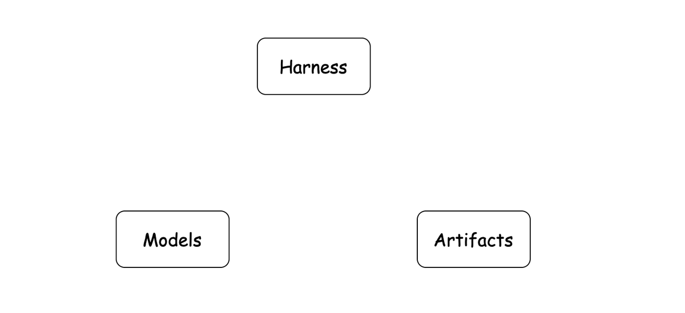
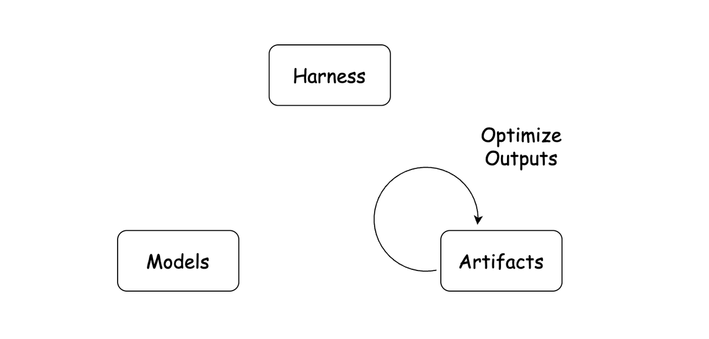
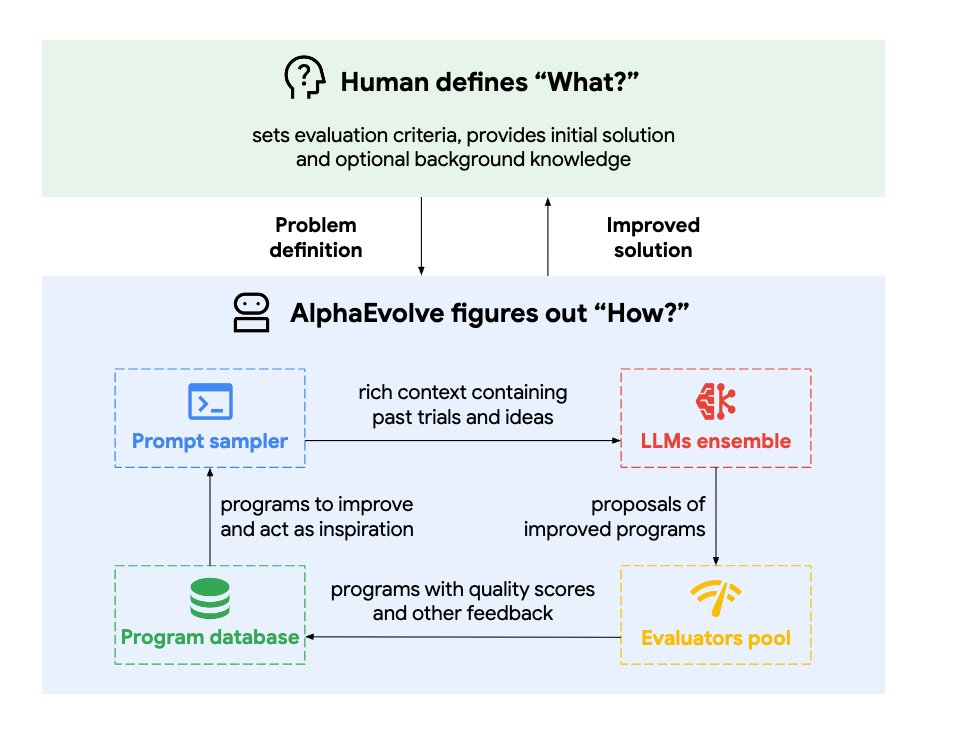
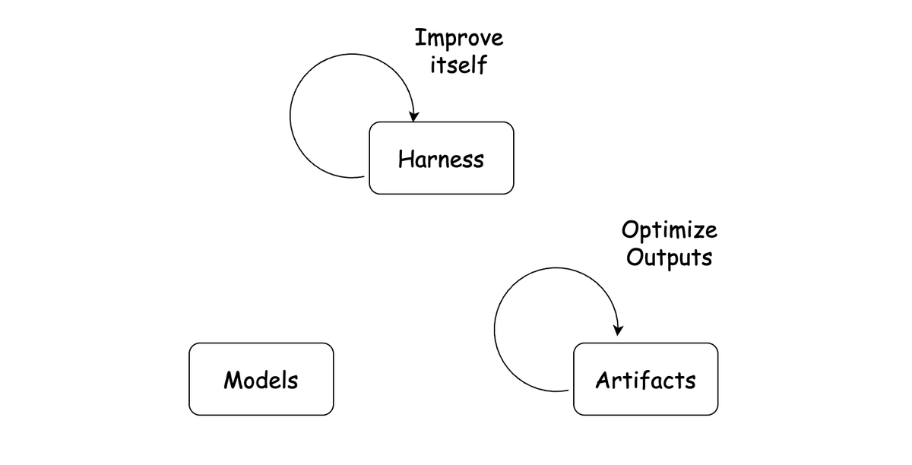
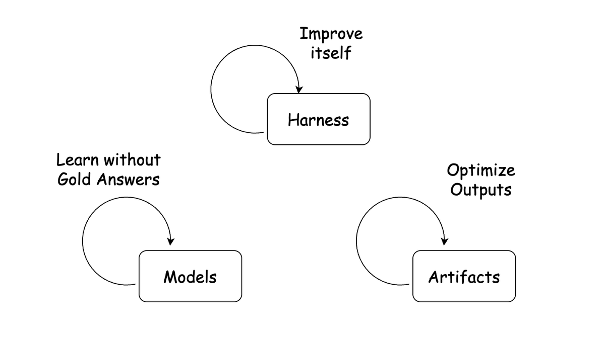
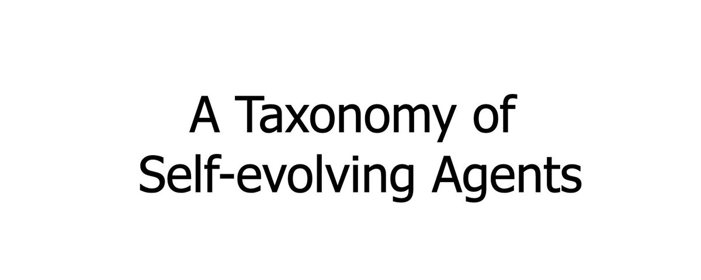

# 📰 A Taxonomy of Self-evolving Agents

Self-evolving agents are becoming popular. \[Hermes Agent\](https://hermes-agent.nousresearch.com/docs/user-guide/features/skills) enables automatic reusable skills. \[RSI Lab\](https://www.recursive.com/) tries to discover new algorithms recursively. NVIDIA explores \[agentic self-evolving for robots\](https://research.nvidia.com/labs/gear/enpire/). Auto-research agents aim to self-evolve for scientific discovery. 

More papers are also designing self-evolving algorithms, including both reinforcement learning (RL) and training-free methods. They all use similar words: self-evolving, self-improving, learning, adapting. But do they mean the same thing? How should we classify these works into different directions? And how are they different from related terms like self-improving agents, recursive self-improvement, continual learning, and test-time training? In this blog, I provide a taxonomy for self-evolving agents by answering these questions.

# Models, Harness, and Artifacts

Models, harness, and artifacts are three key factors in a self-evolving system. Models, usually large language models (LLMs), are the brains that respond to prompts. Harness includes loop designs, memory, tools, and other surrounding components. It turns models into agents. Hence there is a famous equation:

> Agent = Model + Harness

Artifacts are mentioned less often. I use the term "artifact" for the outputs produced by agents, such as kernel algorithms discovered by agents, papers and findings from auto-researchers, or new robot policies from robotic self-evolving systems.

The connections among them are simple. Models and harness work together to form agents. Agents then produce artifacts. Together, these three terms give us a useful way to organize self-evolving systems.

With this view, existing self-evolving systems can be grouped into three levels: artifact iterative optimization, harness self-improvement, and model learning without gold answers.

# Artifacts Iterative Optimization

The recent wave of self-evolving agents was largely pushed by artifact iterative optimization. The motivation is simple: use powerful LLMs to create new artifacts for complex optimization problems. \[AlphaEvolve\](https://arxiv.org/pdf/2506.13131) leveraged coding agents for scientific and algorithm discovery. In this taxonomy, the discovered algorithms are artifacts. Later, several auto-research systems were proposed. One representative event is that Analemma AI's \[FARS\](https://arxiv.org/html/2606.31651v1) ran for 417 hours and produced 166 fully AI-generated papers, at a cost of around 180k USD. \[Recursive Superintelligence\](https://www.recursive.com/articles/first-steps-toward-automated-ai-research) also found better GPU kernel algorithms.

Artifact iterative optimization systems are not conceptually complex. A human sets a target and evaluation criteria. Then the agent repeatedly finds something to improve, produces a new output, and checks whether the output meets the criteria. If it does, the process finishes. If not, the loop continues. The AlphaEvolve pipeline above is one example. Readers may already be familiar with this pattern, as tools like Codex, Claude Code, and OpenClaw all follow similar behavior.

This idea is intuitive, and of course it is not new. What changed is that LLMs, especially coding models, make the loop much more flexible. Before LLMs became dominant, researchers usually designed operators or actions by hand, and then designed search or optimization methods over these operators. Neural architecture search is a good example. Work such as \[EfficientNet\](https://arxiv.org/pdf/1905.11946) defined a search space of possible network operators, then searched for better network designs. This line of work succeeded on many tasks, sometimes achieving better results than human-designed algorithms.

What LLMs bring is that the model itself can act as both an operator and an optimizer. It can invent new candidates, inspect previous results, and decide where to search next. That makes it a powerful search tool. We get a much larger search space, and also a better heuristic searcher.

Another trend is that LLMs have become stronger at long-horizon tasks. The improvement-verification loop can therefore run more effectively. In 2024, just 2 years ago, previous work like \[LLaVA-Plus\](https://arxiv.org/abs/2311.05437) could perform fewer than 5 tool calls, requiring frequent human intervention. But now, agents can run for hours with much less human intervention. With stronger large models, this loop becomes useful for accelerating engineering and scientific discovery.

Most current agents run in digital environments: codebases, browsers, simulators, terminals, and other software systems. So most explorations are still self-contained in virtual environments. The more ambitious direction is the real world. NVIDIA enabled agents to find new robot policies by controlling robots through an agentic loop. \[LabOS\](https://arxiv.org/abs/2510.14861) connected agents with bio labs for experiments. \[Qumus\](https://arxiv.org/abs/2605.18407) built a quantum material experimentalist. Looking to the future, we should expect more work on artifact iterative optimization in the physical world.

The world is the agents' oyster.

# Agent Harness Self-improvement

Almost at the same time as Artifact Iterative Optimization, Agent Harness Self-improvement became popular in research. The motivation is different. Model training is expensive, so a natural question is whether we can improve agents after deployment without updating model weights.

The answer seems to be yes. Brilliant researchers tend to say yes to every valuable question, at least with a demo first. Two main solutions are explored: the prompt/memory level, and the tools/skills level.

## Prompt Learning and Memory

We can memorize some questions and answers, so that we can answer the same questions later. I did so in middle school. But memorization does not generalize well, and it performs poorly on similar but different tasks. A better solution is to extract useful rules and store them somewhere the agent can reuse. Some work stores them in prompts, such as \[GEPA\](https://arxiv.org/abs/2507.19457). Some work stores them in playbooks, such as \[ACE\](https://arxiv.org/abs/2510.04618), or in memory systems, such as \[Mem0\](https://arxiv.org/abs/2504.19413).

Although some methods have "learning" in their names, they do not adjust model weights. But if we view the harness as part of the agent, updates to the harness, such as prompt updates, should be treated similarly to parameter updates. So there is nothing wrong with calling them "learning" methods.

This is another key difference between Agent Harness Self-improvement and Artifact Iterative Optimization. Here, the agent modifies its own components, such as prompts and memory, while Artifact Iterative Optimization focuses on optimizing outputs rather than the agent itself.

## Tool and Skill Creation

But text information is not always enough. For example, if an agent needs to understand a long video and find key frames, memory alone can become redundant. To extract key frames, what the agent needs is an actionable tool or skill. Therefore, a direct idea is to create reusable tools, such as \[Alita\](https://arxiv.org/abs/2505.20286), or skills, such as \[Mem-UI\](https://arxiv.org/abs/2602.05832), so that agents can repeat the process every time they face the same problem. Tools are encoded as code, so agents can generate them directly. Skills can be viewed as higher-level wrappers around tools. After generation, these tools or skills are added to the agent. The agent can then reuse them to solve similar problems next time.

Skills can also be viewed as another type of context management. They reduce context length because the agent no longer needs to put every detail into the context window. Context matters.

Skills have become a popular solution now. Skills have been formalized by Claude Code, and have become de facto components of modern agents. Claude Code can create and use skills, as can Codex and OpenClaw. Another hot repo, Hermes Agent, also highlights automatic skill creation.

Similar to prompt learning and memory, this requires agents to modify themselves, since tools and skills belong to the harness.

## Towards Multi-agent Self-evolving

The previous solutions are beautiful, but they are hard to scale inside a single agent. As the playbook grows, and as more tools and skills are added, the system can become unreliable and inefficient. If a user only cares about stock-related questions, they do not need cooking tools. Keeping unrelated tools in the system only makes the agent slower and sometimes more confused. The confusion can also be semantic. If too much cooking knowledge is injected into the same agent, the agent may not know whether "squeeze" is about the market or about an orange.

To address this, task experts become useful. Sometimes a cooking agent and a stock agent are better than one agent that tries to handle both domains. This leads to multi-agent self-evolving solutions. Our previous work \[Eevee\](https://arxiv.org/abs/2606.11182) observed that a single agent is limited when data comes from very different sources or distributions. It therefore proposes using multiple expert agents for different tasks, with a router assigning each task to the right expert. Similarly, we found that equipping agents with a set of generated tools to build a specialist is useful for some specialized domains, as in \[Alita-G\](https://arxiv.org/abs/2510.23601).

We can also view multi-agent systems as an extension of context management, since each expert only needs to carry the context that is useful for its own tasks. Context matters.

For multi-agent solutions, a key bottleneck is how to find the suitable agent, i.e., routing. One key finding is that routing is not a simple question in most cases. It requires stronger base models to get good performance, as shown in \[routing\](https://arxiv.org/abs/2605.07180). In this sense, one of the most valuable abilities of human experts is also routing. We give tasks to agents, and decide whether they should move to the next step.

A human is a router.

# Model Learning without Gold Answers

This is the third topic. Compared with artifact optimization and harness self-improvement, this direction updates the model itself. Many works in this area may never call themselves self-evolving agents. They usually appear under names such as self-training, weak supervision, self-play, reinforcement learning, test-time training, online learning, or continual learning.

A key difference is that learning changes model weights. The problem is how to enable model updates when there are no gold answers, but only questions, weak signals, or optional environment access. The goal is similar to self-evolving agents, but the solutions are quite different.

## Pseudo Ground Truth or Internal Signals

If we do not have gold answers, one option is to construct pseudo ground truth from the data itself, as in \[self-training\](https://arxiv.org/abs/2202.12040), or to use internal signals, as in \[TTRL\](https://arxiv.org/abs/2504.16084). These signals can then be used for model training. If pseudo labels are treated as targets, we can use supervised fine-tuning (SFT). If the signals can be turned into rewards, we can use RL, as in \[DeepSeek-R1\](https://arxiv.org/abs/2501.12948).

For example, suppose we have a question: how many apples are in a picture? Although we do not have the ground truth, a pre-trained model may still make a better estimate than a random guess. Suppose there are 5 apples in the image. The model might be more confident in answers like 4, 5, and 6 apples, which are internal signals. These signals are not perfect labels, but they can still be useful information.

## Self-play and Weak Signals from Environments

The learning signal can also come from outside the model. Some examples use self-play for learning, such as \[SPIN\](https://arxiv.org/abs/2401.01335) and \[Absolute Zero\](https://arxiv.org/abs/2505.03335). Others learn through interaction with environments, such as \[Agent Learning via Early Experience\](https://arxiv.org/abs/2510.08558). I group them together because another player can also be viewed as part of the environment.

There is a simple everyday example. If you ask somebody to hang out and receive no response, that still gives you information. Even no response from the environment can be a weak signal.

## Test-time Training (TTT) for Model Architecture

\[Test-time Training (TTT)\](https://test-time-training.github.io/e2e.pdf) is a special case. I list it here because it tries to solve a similar problem, but in a very different way. It never calls itself self-evolving. One possible reason is that it has a fancier name.

It is a suite of work. This line of work shows that some sequence models can be interpreted as performing a form of gradient-based update during inference. In this sense, the model can be viewed as continuously updating a matrix during inference. I recommend this \[DeltaNet blog\](https://sustcsonglin.github.io/blog/2024/deltanet-1/) for reference.

## Connections with Continual Learning

\[Continual Learning\](https://arxiv.org/abs/2302.00487), also called online learning or lifelong learning in some contexts, can be traced back to the pre-LLM era. A classic setting is visual recognition. Suppose we have trained a model to recognize sedans, and now we want it to recognize SUVs as well. A simple solution is to finetune the model on SUV images, but this may hurt its ability to recognize the original sedan images. How to avoid catastrophic forgetting then becomes a key problem. It is hard to say whether this problem has been fully resolved. One of the most effective solutions, or maybe one of the only effective solutions, is still to replay some sedan examples while finetuning on SUVs.

However, the same term can have totally different meanings over time. The term "multi-modal" learning is a good example. Around 2017, it often referred to image captioning work, such as \[Bottom-Up and Top-Down Attention\](https://arxiv.org/abs/1707.07998). Around 2021, it often referred to \[CLIP-like models\](https://arxiv.org/abs/2103.00020). Around 2023, it was used for vision-language models like GPT-4V. By 2025, it also covered unified models that handle both image understanding and image generation. Similarly, continual learning in today's LLM discussions often means something closer to self-evolving agents than to the older catastrophic-forgetting setup.

Both humans and terms change with time.

# A Blurred Boundary

The boundary among model, harness, and artifact evolution becomes blurry. When we optimize a kernel algorithm, the target is an artifact. Yet to make the search more effective, we may also need to improve the agent's own design, such as its prompts, tools, memory, or search strategy. Similarly, an agent's knowledge is bounded by model pre-training. Once the harness reaches its limit, updating model parameters becomes a natural next step. Some recent work, such as \[SIA\](https://arxiv.org/abs/2605.27276), has already explored this direction.

Looking to the future, I think every module in a self-evolving system should be improved together.

A useful way to view the progress of AI tools is abstraction. A few years ago, we wrote every line of code by ourselves. Then we asked ChatGPT to write code snippets. Later, Copilot helped write functions and files. Today, coding agents can work on a whole project. The optimization target has moved from words, to snippets, to files, and now to projects. We keep grouping more items together, giving them a new abstraction, and thinking at a higher level.

The same thing should happen to self-evolving agent systems. Model, harness, and artifact should not be treated as isolated components forever. Once the system becomes capable enough, the natural direction is to improve them together as one evolving system.

# For the Real World

The most anticipated part of self-evolving agents is their capability to improve things outside the agent system itself.

A better prompt is useful. A better memory is useful. A better tool is useful. A better model is useful. Still, the final value of self-evolution should be measured by whether it helps us build better things: faster kernels, stronger software, new scientific hypotheses, new materials, and better robot behaviors.

This is why I use model, harness, and artifact to organize the field. They describe three places where evolution can happen. The model can learn from weak signals. The harness can update its memory, prompts, tools, and skills. The artifact can be iteratively optimized by agents. These three levels are different entry points to the same larger system.

In early systems, these loops usually appear separately. Some work keeps the model fixed and improves the harness. Some work keeps the agent fixed and improves the artifact. Some work trains the model with self-generated or weak feedback. In future systems, they will likely grow together. A stronger model helps build better harnesses. Better harnesses accelerate artifact search. Better artifacts create new data and feedback for model learning.

The idea of self-evolving agents has appeared many times in the past under different names: recursive self-improvement, continual learning, online learning, automated discovery, and test-time adaptation. The names changed because the available systems changed. Today we have large models, tool-using agents, parallel execution, richer environments, and more useful verification signals.

Instead of arguing about names, I find it more useful to ask three simple things.

What evolves? What feedback drives it? Where does the loop close?

If the loop closes on benchmarks, we get stronger benchmark solvers. If it closes on code, we get better software. If it closes on science and engineering, we may get better discoveries. If it closes on the physical world, agents may become a new way to build and improve real systems.

The world is still the hardest environment. It is also the place where self-evolving agents matter most.

### 🖼️ Attached Media

## 💬 Replies

### 1 @yyyiiillluuu (Yi Lu)

*Wed Jul 08 18:10:39 +0000 2026*

@atasteoff agree that loop engineering is just the first step towards self-evolving agent. sharing my thoughts here as well [x.com/yyyiiillluuu/s…](https://x.com/yyyiiillluuu/status/2072450603704611221)

### 2 @Shilong_Liu_AI (Shilong Liu) (Author)

*Wed Jul 08 19:40:47 +0000 2026*

@yyyiiillluuu Great  blog. Thanks for sharing

### 3 @yyyiiillluuu (Yi Lu)

*Wed Jul 08 18:09:33 +0000 2026*

@atasteoff the term artifact is somewhat misleading. it is essentially how user operate agent. Neural architecture search is closer to what you meant by harness part to be honest

### 4 @Shilong_Liu_AI (Shilong Liu) (Author)

*Wed Jul 08 20:28:11 +0000 2026*

@yyyiiillluuu Thanks for pointing out. I will update a version soon

### 5 @gerardsans (Gerard Sans | Axiom 🇬🇧)

*Sat Jul 18 14:39:51 +0000 2026*

@Shilong\_Liu\_AI [x.com/gerardsans/sta…](https://x.com/gerardsans/status/2078475544161640585)

### 6 @gerardsans (Gerard Sans | Axiom 🇬🇧)

*Thu Jul 09 12:48:14 +0000 2026*

@Shilong\_Liu\_AI silicon assassin

### 7 @ShenaoZhang (Shenao Zhang)

*Wed Jul 08 17:35:18 +0000 2026*

@atasteoff Great article! Thanks for sharing.

### 8 @TanmayGradient (Tanmay Sah, PhD)

*Wed Jul 08 18:42:56 +0000 2026*

@atasteoff great work

### 9 @Official_m9g (Max Chang ▪︎Minsu)

*Wed Jul 08 23:34:12 +0000 2026*

@Shilong\_Liu\_AI Thank you for sharing, Dr Liu!

### 10 @ShahbazSyd (Shahbaz Syed)

*Wed Jul 08 14:59:25 +0000 2026*

@atasteoff This is a neat summary of the topic! Thanks a lot for writing this up.

### 11 @xyz2maureen (Xueyan Zou)

*Thu Jul 09 12:03:31 +0000 2026*

@Shilong\_Liu\_AI NB！

### 12 @Adham__Khaled__ (Adham)

*Thu Jul 09 12:12:53 +0000 2026*

@Shilong\_Liu\_AI splitting between artifact optimization and harness self-improvement finally makes clear why some loops just chase better outputs while others actually improve the agent itself

