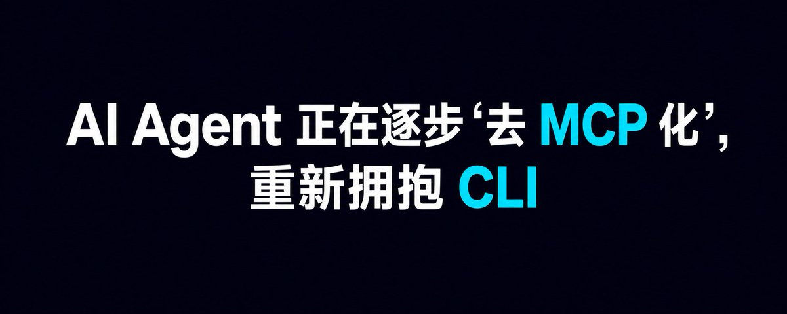

# 📰 为什么 AI Agent 正在逐步“去 MCP 化”，重新拥抱 CLI？

前两年，MCP 被视为 Agent 连接外部世界的标准答案：

需要 GitHub？装一个 MCP Server。
需要数据库？再装一个。
需要浏览器、监控、云服务？继续装。

但实际用久了，很多开发者开始发现：对于本地开发和工程自动化，MCP 不一定是最短路径。越来越多 Agent 正在重新选择一个存在了几十年的接口——CLI。

原因很简单。

第一，CLI 已经存在，MCP 往往需要再造一层。

Git、Docker、kubectl、ffmpeg、psql、gh……成熟工具本来就有稳定的命令行接口。为了让 Agent 使用它们，再包装成 MCP Server，相当于增加了一层协议、进程、配置和维护成本。

Agent 如果能够直接读 --help、执行命令并检查退出码，很多适配层其实没有存在的必要。

第二，CLI 更节省上下文。

MCP 工具通常需要向模型暴露工具名称、描述和参数 Schema。工具一多，Agent 还没开始工作，上下文里就已经塞进了一本“工具说明书”。

CLI 则可以渐进式探索：

先知道有哪些命令，需要时再执行 help，最后只读取当前子命令的参数。

不是一次性把整个工具箱倒进上下文，而是用到什么，再拿什么。

第三，CLI 更容易调试和复现。

MCP 调用失败时，问题可能来自客户端、Server、传输协议、Schema、权限或底层 API。

CLI 失败通常更直接：

一条命令、标准输入、标准输出、标准错误和退出码。

开发者可以复制同一条命令，在终端里重现问题；Agent 的操作也更容易写进日志、脚本和 CI。

第四，CLI 天然具备组合能力。

Unix 管道、文件、环境变量和重定向，本身就是一套成熟的 Agent 工具协议：

获取数据 \| 过滤 \| 转换 \| 保存

Agent 不一定需要几十个精心定义的工具。有时只需要 shell，以及几个可靠、边界清晰的命令。

第五，CLI 更接近真实执行环境。

代码、依赖、Git 状态、容器和构建工具都在本地环境里。通过 CLI，Agent 操作的就是开发者实际使用的那套系统，不需要在 MCP Server 和真实环境之间同步状态。

但这不意味着 MCP 会消失。

MCP 仍然非常适合：

• 跨客户端复用同一个集成
• 连接远程 SaaS 和企业数据
• 提供结构化参数与返回值
• 统一认证、权限、审计和交互界面
• 向不具备完整终端能力的 Agent 暴露工具

所以真正发生的并不是“MCP 被 CLI 淘汰”，而是两者正在重新分工：

CLI 成为 Agent 的本地执行层；
MCP 回到标准化集成层。

本地已有成熟 CLI 的工具，直接调用 CLI。
需要远程能力、结构化发现和跨平台复用时，再使用 MCP。

过去的问题，是把 MCP 当成所有工具的默认封装方式。

未来更合理的架构可能是：

能用文件，就不用 API。
能用 CLI，就不额外包装 Server。
只有真正需要协议边界时，才使用 MCP。

MCP 解决的是“如何标准化连接”。

CLI 解决的是“如何直接把事情做完”。

当 Agent 从 Demo 进入真实工程环境，后者往往更重要。

### 🖼️ Attached Media

## 💬 Replies

### 1 @spectredxxx (spectredxxx)

*Sun Aug 23 10:49:31 +0000 2026*

@Smartpigai 同意，对于数据库查询这方面，之前我一直以为MCP更优，但是近期使用CLI对比发现整体感觉还是CLI更优，功能更加随心，例如增加导出数据功能，MCP可能会占用大量上下文，CLI一行命令导出上下文消耗几乎为零

### 2 @vibemak (Vibemak)

*Mon Aug 24 01:01:44 +0000 2026*

@Smartpigai cli 的安全认证 访问控制怎么操作的

### 3 @FlowOpsDaily (FlowOps Daily)

*Sun Aug 23 10:06:00 +0000 2026*

@Smartpigai 去 MCP 化和GitHub放在一起问，确实抓住了主贴的核心矛盾。

### 4 @p2atri8ckanth3o (libinops)

*Sun Aug 23 11:04:30 +0000 2026*

@Smartpigai mcp 如果设计好的话其实根本不用占用上下文的，你可以把MCP做成渐进式的，完全不占用上下文，那些说占上下文的其实都是在cli 中一次加载太多的mcp schema, 其次mcp 另外一个无可替代的就是它是一个规范的协议，不是某个编程agent 特定的，不管什么agent，只要遵守这个协议都能用，这是插件无可替代的

### 5 @LinDoo67 (刘琦)

*Sun Aug 23 13:37:54 +0000 2026*

@Smartpigai 我觉得并不冲突，相辅相成

### 6 @cavogq034 (范70｜Bitget小安)

*Sun Aug 23 08:57:34 +0000 2026*

@Smartpigai 这光线拍得真舒服 看着心情都跟着亮堂了

### 7 @ying92449 (lyf)

*Sun Aug 23 08:46:56 +0000 2026*

@Smartpigai MCP 封装一套协议如何调用，Cli 直接告诉怎样调用，本地 skill 

