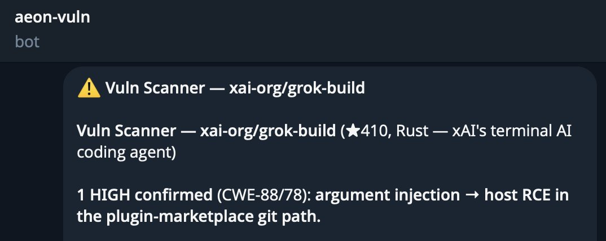
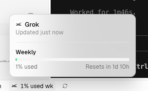

We've open-sourced Grok Build and have reset usage limits for all users.

Open sourcing Grok Build allows anyone to support making a reliable and robust harness. Check out our code, including the Git repo for the Grok Build CLI. 

[x.ai/open-source](http://x.ai/open-source)

## 💬 Replies

### 1 @SpaceXAI (SpaceXAI) (Author)

*Wed Jul 15 20:44:30 +0000 2026*

In response to user questions about privacy: Since launch, Grok Build has fully respected zero data retention (ZDR). All users have always had the ability to disable data upload in the CLI.

When data upload was disabled, this choice was respected. In the early beta, data retention was enabled by default for non-ZDR users. Based on your feedback, we changed this. We are now going further to protect privacy.

With all retained data deleted, retention default off, and an open-source harness, we are offering complete user privacy. You can also run Grok Build fully open-sourced and local-first with your own inference.

We disabled default retention for all Grok Build users starting on July 12th. Additionally, we are deleting all coding data that was previously retained, ensuring every user’s preferences are respected. With these steps, Grok Build goes beyond other major coding products to protect user privacy.

### 2 @SpaceXAI (SpaceXAI) (Author)

*Wed Jul 15 20:44:30 +0000 2026*

Reach out to our engineers on X or report issues through our bug bounty program: [hackerone.com/x?type=team](https://hackerone.com/x?type=team).

### 3 @aelluswamy (Ashok Elluswamy)

*Thu Jul 16 15:38:19 +0000 2026*

@SpaceXAI It’s been very fast, and a pleasure to use. Nice work!

### 4 @FurkanGozukara (Furkan Gözükara)

*Wed Jul 15 20:57:11 +0000 2026*

@SpaceXAI xAI open-sourced Grok Build, reset all limits, deleted retained data and enabled true local-first with zero retention.

This is acceleration: power to the community to build without gates.

Respect to the team for choosing open paths.

The code is free. Time to build the future.

### 5 @tetsuoai (tetsuo)

*Wed Jul 15 21:15:21 +0000 2026*

@SpaceXAI Love this! Another SpaceXAI win!

### 6 @ivanfioravanti (Ivan Fioravanti ᯅ)

*Wed Jul 15 21:28:04 +0000 2026*

@SpaceXAI Best move ever, really appreciated! I’ll reinstall this tomorrow.

### 7 @aaronjmars (@aaronjmars)

*Wed Jul 15 21:39:05 +0000 2026*

@SpaceXAI cool stuff but

found a high severity issue using @aeonframework 

reporting it on hackerone 🤷‍♂️8

### 8 @NachoQuixotic (Nacho Business)

*Wed Jul 15 21:13:36 +0000 2026*

@SpaceXAI @sama tfw

### 9 @jasonkneen (Jason Kneen)

*Wed Jul 15 20:54:10 +0000 2026*

@SpaceXAI Great that’s my evening gone. 

Nice one :)

### 10 @NATE9169 (a Nate da Novenchi 🐂🀄️)

*Wed Jul 15 20:45:09 +0000 2026*

@SpaceXAI Grokkybara??? 

### 11 @elliotarledge (Elliot Arledge)

*Wed Jul 15 21:23:17 +0000 2026*

@SpaceXAI 1.07M lines of rust... why?

### 12 @daniel_nguyenx (Daniel Nguyen)

*Wed Jul 15 21:34:30 +0000 2026*

@SpaceXAI Great way to gain back the trust!

### 13 @IterIntellectus (vittorio)

*Thu Jul 16 05:25:06 +0000 2026*

@SpaceXAI Holy

### 14 @zaidmukaddam (Zaid)

*Wed Jul 15 20:47:20 +0000 2026*

@SpaceXAI finally a good open source harness to give codex some competition

### 15 @Ixthos (Danny R)

*Wed Jul 15 21:10:20 +0000 2026*

@SpaceXAI Grok Build just went open-source: finally, the code can fix itself while we watch from the sidelines.

### 16 @kevincodex (Kevin)

*Wed Jul 15 22:05:48 +0000 2026*

@SpaceXAI great move! why rust?

### 17 @morganlinton (Morgan)

*Wed Jul 15 22:37:02 +0000 2026*

@SpaceXAI Super cool, very excited to see this!

### 18 @JinjingLiang (jinjingliang)

*Thu Jul 16 01:19:36 +0000 2026*

@SpaceXAI The OSS movement is real 

### 19 @djcows (djcows)

*Wed Jul 15 20:47:27 +0000 2026*

@SpaceXAI LFG

### 20 @Dogetothemoon (Doge Tipping)

*Wed Jul 15 20:51:55 +0000 2026*

@SpaceXAI Grok groks💯💯 

### 21 @AtlantisPleb (Christopher David)

*Wed Jul 15 21:01:31 +0000 2026*

@SpaceXAI 

### 22 @ziwenxu_ (Ziwen)

*Wed Jul 15 20:56:49 +0000 2026*

@SpaceXAI Very big news. Let's goo!!

### 23 @0xCVYH (CV.YH)

*Wed Jul 15 21:42:33 +0000 2026*

@SpaceXAI niceeee

### 24 @JinjingLiang (jinjingliang)

*Thu Jul 16 01:03:14 +0000 2026*

@SpaceXAI ok that explains my mysterious remaining usage

OSS for the win! 

### 25 @spacecoin (Spacecoin™ 🛰️)

*Wed Jul 15 22:45:46 +0000 2026*

@SpaceXAI Open source is always the correct move, love to see it.

### 26 @iamrobotbear (iamrobotbear (bk))

*Wed Jul 15 22:22:36 +0000 2026*

@SpaceXAI @rickmanelius Did you also open source all the code you uploaded to Google servers? 😂

### 27 @iamheci (heci.base.eth)

*Wed Jul 15 22:06:58 +0000 2026*

@SpaceXAI 👀🔥

### 28 @skibumtrading (Tyler Bea)

*Thu Jul 16 00:10:49 +0000 2026*

@SpaceXAI Amazing 🤩

### 29 @weswinder (Wes Winder)

*Wed Jul 15 22:32:24 +0000 2026*

@SpaceXAI HUGE

### 30 @loktar00 (Loktar 🇺🇸)

*Wed Jul 15 20:45:23 +0000 2026*

@SpaceXAI This is amazing, the grok build TUI is the best I've used thank you!

### 31 @yoayush (Ayush)

*Wed Jul 15 21:10:32 +0000 2026*

@SpaceXAI bullish

### 32 @ck_SNARKs (ck)

*Wed Jul 15 21:14:29 +0000 2026*

@SpaceXAI 👀

### 33 @digitalshane_ (Shane)

*Wed Jul 15 22:42:56 +0000 2026*

@SpaceXAI Love to see this. NGL it’s been a lot of fun to use

### 34 @Karmedge (Robert Lukoszko)

*Wed Jul 15 22:14:37 +0000 2026*

@SpaceXAI @jasonkneen wow

### 35 @leodev (Leo - 15 y/o founder)

*Wed Jul 15 21:27:19 +0000 2026*

@SpaceXAI codex is oss
grok build is oss
claude code???

### 36 @JDaley (Jordan Daley)

*Wed Jul 15 21:05:42 +0000 2026*

@SpaceXAI Thanks for the reset! Back to building!

