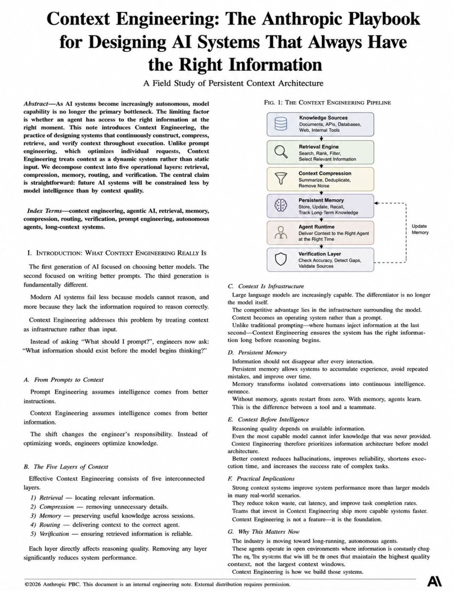

ANTHROPIC JUST LEAKED AN INTERNAL DOCUMENT WORTH $2.6M - IT CHANGES HOW YOU SHOULD BUILD AI SYSTEMS

most AI systems fail not because the model is weak - but because it lacks the right information at the right moment

Search → Compress → Memory → Routing → Verification

five layers, one system, always has the right context

first generation engineers picked better models - second wrote better prompts - third builds better infrastructure around the model

context became the operating system - not the input

better context reduces hallucinations, cuts latency and improves task execution quality - strong context systems outperform larger models in real scenarios

the systems that win won't have the largest context windows - they will have the highest quality context

Context Engineering is not a feature - it's the foundation

### 🖼️ Attached Media

## 💬 Replies

### 1 @RealYDT (阿良｜AI 工作流)

*Sun Jul 05 10:48:29 +0000 2026*

@Sprytixl 把这五层抽象成可复用 Agent skill 或 .claude/ 结构，随项目迭代维护。失败案例多了，就知道高质量 context 比更大模型更值钱。

### 2 @itsthedonhashim (Hussain Hashim | Building SundayBack)

*Sun Jul 05 14:33:43 +0000 2026*

@Sprytixl @Sprytixl honestly, this is wild. the whole "right info at the right moment" thing is something we seriously overlook. can't believe it took a leak for people to see it

### 3 @redman_talk (红孩儿Redman)

*Sun Jul 05 07:03:30 +0000 2026*

@Sprytixl "$2.6M leaked doc" lol
It's just five words on a slide.
Context matters, sure. But come on.

### 4 @billdavies_ (Davies)

*Sun Jul 05 05:49:34 +0000 2026*

@Sprytixl This is but one part of engineering. If you still can't prowess on prompt harness and loop engineering, there's a big margin for model error.

### 5 @ResearchKONG (卖飞哥 🐊（互 F 🤝 学习）)

*Sun Jul 05 02:36:07 +0000 2026*

@Sprytixl 上下文工程很关键，但也别把它神化成万能解法。检索质量、权限边界、验证链路没做好，喂进去的信息越多，系统错得越自信。

### 6 @KaiTrader87 (Kainoa)

*Sun Jul 05 12:15:53 +0000 2026*

@Sprytixl If you already trust Claude for real work, this is how you configure it to act like a senior dev instead of a search bar. Early founding price is 19 dollars: [payhip.com/b/ZutWd](http://payhip.com/b/ZutWd)

### 7 @JamesTakesOnAI (James' AI Takes)

*Sat Jul 04 17:24:38 +0000 2026*

@Sprytixl “leaked internal doc worth $2.6m” and the secret is search, compression, memory, routing, verification? congrats, you discovered every serious rag/agent stack from the last 18 months and put a price tag on the obvious.

