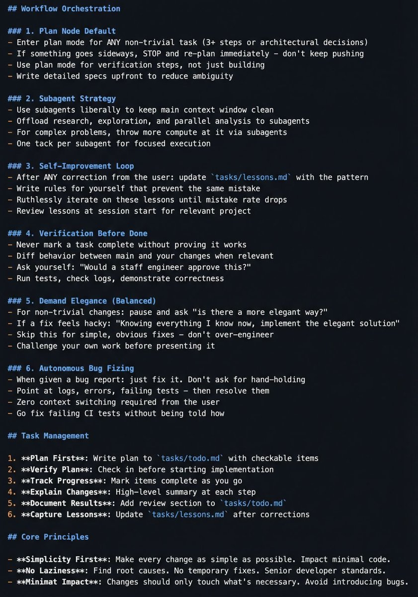

This 𝗖𝗟𝗔𝗨𝗗𝗘.𝗺𝗱 file will make you 10x engineer 👇

It combines all the best practices shared by Claude Code creator:

Boris Cherny (creator of Claude Code at Anthropic) shared on X internal best practices and workflows he and his team actually use with Claude Code daily. Someone turned those threads into a structured 𝗖𝗟𝗔𝗨𝗗𝗘.𝗺𝗱 you can drop into any project.

It includes:
• Workflow orchestration
• Subagent strategy
• Self-improvement loop
• Verification before done
• Autonomous bug fixing
• Core principles

This is a compounding system. Every correction you make gets captured as a rule. Over time, Claude's mistake rate drops because it learns from your feedback.

If you build with AI daily, this will save you a lot of time.

### 🖼️ Attached Media

## 💬 Replies

### 1 @srishticodes (Srishti) (Author)

*Sun Feb 22 05:52:26 +0000 2026*

[x.com/srishticodes/s…](https://x.com/srishticodes/status/2025448247767302428?s=20)

### 2 @srishticodes (Srishti) (Author)

*Sun Feb 22 09:02:53 +0000 2026*

Here is the full md file content:

\## Workflow Orchestration

\### 1. Plan Node Default
\- Enter plan mode for ANY non-trivial task (3+ steps or architectural decisions)
\- If something goes sideways, STOP and re-plan immediately - don't keep pushing
\- Use plan mode for verification steps, not just building
\- Write detailed specs upfront to reduce ambiguity

\### 2. Subagent Strategy
\- Use subagents liberally to keep main context window clean
\- Offload research, exploration, and parallel analysis to subagents
\- For complex problems, throw more compute at it via subagents
\- One tack per subagent for focused execution

\### 3. Self-Improvement Loop
\- After ANY correction from the user: update \`tasks/lessons.md\` with the pattern
\- Write rules for yourself that prevent the same mistake
\- Ruthlessly iterate on these lessons until mistake rate drops
\- Review lessons at session start for relevant project

\### 4. Verification Before Done
\- Never mark a task complete without proving it works
\- Diff behavior between main and your changes when relevant
\- Ask yourself: "Would a staff engineer approve this?"
\- Run tests, check logs, demonstrate correctness

\### 5. Demand Elegance (Balanced)
\- For non-trivial changes: pause and ask "is there a more elegant way?"
\- If a fix feels hacky: "Knowing everything I know now, implement the elegant solution"
\- Skip this for simple, obvious fixes - don't over-engineer
\- Challenge your own work before presenting it

\### 6. Autonomous Bug Fixing
\- When given a bug report: just fix it. Don't ask for hand-holding
\- Point at logs, errors, failing tests - then resolve them
\- Zero context switching required from the user
\- Go fix failing CI tests without being told how

\## Task Management

1\. \*\*Plan First\*\*: Write plan to \`tasks/todo.md\` with checkable items
2\. \*\*Verify Plan\*\*: Check in before starting implementation
3\. \*\*Track Progress\*\*: Mark items complete as you go
4\. \*\*Explain Changes\*\*: High-level summary at each step
5\. \*\*Document Results\*\*: Add review section to \`tasks/todo.md\`
6\. \*\*Capture Lessons\*\*: Update \`tasks/lessons.md\` after corrections

\## Core Principles

\- \*\*Simplicity First\*\*: Make every change as simple as possible. Impact minimal code.
\- \*\*No Laziness\*\*: Find root causes. No temporary fixes. Senior developer standards.
\- \*\*Minimat Impact\*\*: Changes should only touch what's necessary. Avoid introducing bugs.

### 3 @cryptonerdcn (NerdC)

*Sun Feb 22 08:59:49 +0000 2026*

@srishticodes Transcript:
[x.com/cryptonerdcn/s…](https://x.com/cryptonerdcn/status/2025495571457278009?s=20)

### 4 @vec0zy (cozy)

*Sun Feb 22 08:06:42 +0000 2026*

@srishticodes just use my skill instead of copying a prompt or file over to every project
[github.com/vxcozy/workflo…](https://github.com/vxcozy/workflow-orchestration)

### 5 @srishticodes (Srishti) (Author)

*Sun Feb 22 08:53:44 +0000 2026*

@vec0zy thanks for sharing this.

### 6 @0xarch1tect (The Architect)

*Sun Feb 22 02:47:58 +0000 2026*

full md file if anyone is interested (fixed the typeo in #6)
vvvvvvvvvvvvvvvvvvvvvvvvvvvvv

\## Workflow Orchestration

\### 1. Plan Node Default
\- Enter plan mode for ANY non-trivial task (3+ steps or architectural decisions)
\- If something goes sideways, STOP and re-plan immediately - don't keep pushing
\- Use plan mode for verification steps, not just building
\- Write detailed specs upfront to reduce ambiguity

\### 2. Subagent Strategy
\- Use subagents liberally to keep main context window clean
\- Offload research, exploration, and parallel analysis to subagents
\- For complex problems, throw more compute at it via subagents
\- One tack per subagent for focused execution

\### 3. Self-Improvement Loop
\- After ANY correction from the user: update \`tasks/lessons.md\` with the pattern
\- Write rules for yourself that prevent the same mistake
\- Ruthlessly iterate on these lessons until mistake rate drops
\- Review lessons at session start for relevant project

\### 4. Verification Before Done
\- Never mark a task complete without proving it works
\- Diff behavior between main and your changes when relevant
\- Ask yourself: "Would a staff engineer approve this?"
\- Run tests, check logs, demonstrate correctness

\### 5. Demand Elegance (Balanced)
\- For non-trivial changes: pause and ask "is there a more elegant way?"
\- If a fix feels hacky: "Knowing everything I know now, implement the elegant solution"
\- Skip this for simple, obvious fixes - don't over-engineer
\- Challenge your own work before presenting it

\### 6. Autonomous Bug Fixing
\- When given a bug report: just fix it. Don't ask for hand-holding
\- Point at logs, errors, failing tests - then resolve them
\- Zero context switching required from the user
\- Go fix failing CI tests without being told how

\## Task Management

1\. \*\*Plan First\*\*: Write plan to \`tasks/todo.md\` with checkable items
2\. \*\*Verify Plan\*\*: Check in before starting implementation
3\. \*\*Track Progress\*\*: Mark items complete as you go
4\. \*\*Explain Changes\*\*: High-level summary at each step
5\. \*\*Document Results\*\*: Add review section to \`tasks/todo.md\`
6\. \*\*Capture Lessons\*\*: Update \`tasks/lessons.md\` after corrections

\## Core Principles

\- \*\*Simplicity First\*\*: Make every change as simple as possible. Impact minimal code.
\- \*\*No Laziness\*\*: Find root causes. No temporary fixes. Senior developer standards.
\- \*\*Minimat Impact\*\*: Changes should only touch what's necessary. Avoid introducing bugs.

### 7 @srishticodes (Srishti) (Author)

*Sun Feb 22 04:48:08 +0000 2026*

@0xarch1tect amazing, thanks for sharing

### 8 @T3metrics (Tom)

*Sun Feb 22 00:10:01 +0000 2026*

@srishticodes way to make it easy to copy/paste. useless post.

### 9 @srishticodes (Srishti) (Author)

*Sun Feb 22 04:51:33 +0000 2026*

@T3metrics just upload the photo to claude code, it can extract it for you :)

### 10 @martinclasen (Martin Clasen)

*Sun Feb 22 04:02:41 +0000 2026*

@srishticodes Thanks!

You can download it from:
[github.com/clasen/Skills/…](https://github.com/clasen/Skills/blob/main/AGENT.md)

### 11 @srishticodes (Srishti) (Author)

*Sun Feb 22 04:49:30 +0000 2026*

@martinclasen amazing, thanks for sharing

### 12 @Eric_M_Stevens (Eric Stevens)

*Sat Feb 21 22:42:58 +0000 2026*

@srishticodes i run separate [CLAUDE.md](http://CLAUDE.md) files for different agents handling different parts of the business. the real power isnt one file, its when each agent has its own context and they stop needing you to translate between them

### 13 @srishticodes (Srishti) (Author)

*Sun Feb 22 04:52:18 +0000 2026*

@Eric\_M\_Stevens cool

### 14 @harjjotsinghh (harjot.co)

*Sat Feb 21 17:03:24 +0000 2026*

@srishticodes 10x engineer? Better hone craft-no shortcuts work long-term.

### 15 @srishticodes (Srishti) (Author)

*Sat Feb 21 17:07:02 +0000 2026*

@harjjotsinghh Yes it’ll help

### 16 @thita_ai (Thita AI)

*Sun Feb 22 04:02:18 +0000 2026*

@srishticodes [CLAUDE.md](http://CLAUDE.md) is less about prompts and more about process design.
Once you treat AI like a junior engineer with feedback loops, output quality compounds.
If you actually wanna learn AI with a structured roadmap, we have got that covered:
[thita.ai/ai-roadmap](https://thita.ai/ai-roadmap)

### 17 @srishticodes (Srishti) (Author)

*Sun Feb 22 04:03:14 +0000 2026*

@thita\_ai Thanks for sharing. I have been following this AI roadmap and its been really helpful!

### 18 @rv_RAJvishnu (Vish)

*Sat Feb 21 20:01:32 +0000 2026*

@srishticodes the part about keeping [CLAUDE.md](http://CLAUDE.md) scoped to project-specific patterns instead of generic rules was a game changer for me. went from fighting the model to it actually understanding my codebase conventions

### 19 @srishticodes (Srishti) (Author)

*Sun Feb 22 04:50:04 +0000 2026*

@rv\_RAJvishnu amazing, so far the response is great

### 20 @rv_RAJvishnu (Vish)

*Sat Feb 21 21:31:30 +0000 2026*

@srishticodes the biggest unlock for me was adding project-specific context to [CLAUDE.md](http://CLAUDE.md) instead of generic rules. once it knows your stack and conventions it stops guessing and starts building exactly what you need

### 21 @srishticodes (Srishti) (Author)

*Sun Feb 22 04:50:29 +0000 2026*

@rv\_RAJvishnu yes amazing

### 22 @Vadimkus3 (Vadimkus)

*Sun Feb 22 04:19:54 +0000 2026*

Workflow Orchestration
1\. Plan Node Default
• Enter plan mode for ANY non-trivial task (3+ steps or architectural decisions)
• If something goes sideways, STOP and re-plan immediately – don't keep pushing
• Use plan mode for verification steps, not just building
• Write detailed specs upfront to reduce ambiguity
2\. Subagent Strategy
• Use subagents liberally to keep main context window clean
• Offload research, exploration, and parallel analysis to subagents
• For complex problems, throw more compute at it via subagents
• One task per subagent for focused execution
3\. Self-Improvement Loop
• After ANY correction from the user: update tasks/lessons.md with the pattern
• Write rules for yourself that prevent the same mistake
• Ruthlessly iterate on these lessons until mistake rate drops
• Review lessons at session start for relevant project
4\. Verification Before Done
• Never mark a task complete without proving it works
• Diff behavior between main and your changes when relevant
• Ask yourself: "Would a staff engineer approve this?"
• Run tests, check logs, demonstrate correctness
5\. Demand Elegance (Balanced)
• For non-trivial changes: pause and ask "is there a more elegant way?"
• If a fix feels hacky: "Knowing everything I know now, implement the elegant solution"
• Skip this for simple, obvious fixes – don't over-engineer
• Challenge your own work before presenting it
6\. Autonomous Bug Fixing
• When given a bug report: just fix it. Don't ask for hand-holding
• Point at logs, errors, failing tests – then resolve them
• Zero context switching required from the user
• Go fix failing CI tests without being told how
Task Management
1\. Plan First: Write plan to tasks/todo.md with checkable items
2\. Verify Plan: Check in before starting implementation
3\. Track Progress: Mark items complete as you go
4\. Explain Changes: High-level summary at each step
5\. Document Results: Add review section to tasks/todo.md
6\. Capture Lessons: Update tasks/lessons.md after corrections
Core Principles
• Simplicity First: Make every change as simple as possible. Impact minimal code.
• No Laziness: Find root causes. No temporary fixes. Senior developer standards.
• Minimal Impact: Changes should only touch what's necessary. Avoid introducing bugs.

### 23 @srishticodes (Srishti) (Author)

*Sun Feb 22 04:46:27 +0000 2026*

@Vadimkus3 thanks for sharing this

### 24 @NitinthisSide_ (Nitin.nn)

*Sun Feb 22 03:34:16 +0000 2026*

@srishticodes You Can Check It Out :)

### 25 @srishticodes (Srishti) (Author)

*Sun Feb 22 04:43:37 +0000 2026*

@NitinthisSide\_ great article, recommended

### 26 @mrmichaeljstew (Michael Stewart)

*Sun Feb 22 08:17:06 +0000 2026*

@srishticodes Been using Claude Code in my daily workflow and the subagent strategy is the one that made the biggest difference. Keeping main context clean while offloading research to subagents maps to a real problem in infrastructure automation where you're juggling multiple systems at once.

### 27 @srishticodes (Srishti) (Author)

*Sun Feb 22 08:54:14 +0000 2026*

@mrmichaeljstew amazing, this is very useful

### 28 @NitinthisSide_ (Nitin.nn)

*Sun Feb 22 16:02:21 +0000 2026*

@srishticodes This is what I found Today !!!!

### 29 @srishticodes (Srishti) (Author)

*Sun Feb 22 16:04:47 +0000 2026*

@NitinthisSide\_ this is so underrated

### 30 @NitinthisSide_ (Nitin.nn)

*Sun Feb 22 00:13:10 +0000 2026*

@srishticodes 🙃😂😂

### 31 @srishticodes (Srishti) (Author)

*Sun Feb 22 04:45:32 +0000 2026*

@NitinthisSide\_ lol, estimates timelines in months and proceeds to do in hours

### 32 @rv_RAJvishnu (Vish)

*Sun Feb 22 08:01:42 +0000 2026*

@srishticodes the self-improvement loop is the real unlock here. once you start capturing corrections as rules, the compound effect after a few weeks is wild. went from constant hand-holding to mostly autonomous runs on my codebase

### 33 @srishticodes (Srishti) (Author)

*Sun Feb 22 08:53:53 +0000 2026*

@rv\_RAJvishnu true that

### 34 @sriram_gsr16 (HeYSriram.TSX)

*Sat Feb 21 17:02:23 +0000 2026*

@srishticodes this actually sounds useful not just hype

love the idea... have you tried it in a real project yet?

### 35 @srishticodes (Srishti) (Author)

*Sat Feb 21 17:07:32 +0000 2026*

@sriram\_gsr16 Yes I am trying

