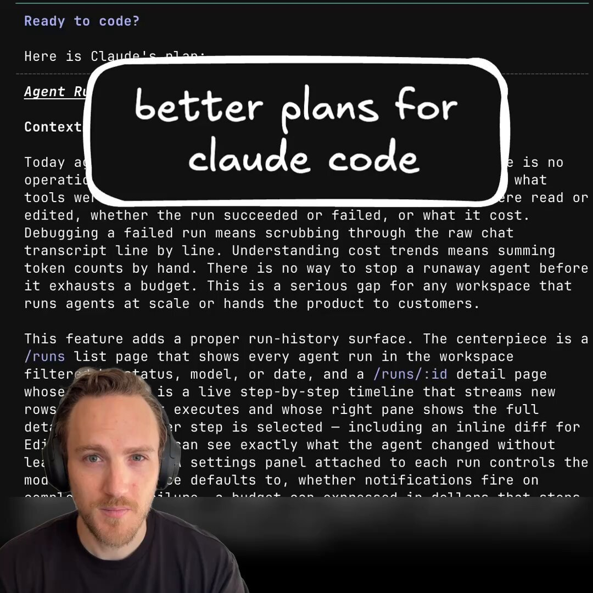

Introducing /visual-plan - a skill to generate rich, visual plans for Claude Code and Codex.

Plan mode in Claude Code is incredible.

But I always find my eyes glazing over when it gives me this huge markdown essay in my terminal.

I found I can make much better visual plans with reusable components.

So I made a skill called \`/visual-plan\`.

It generates plans as MDX with visual, interactive components. Diagrams, interactive API specs, schema design changes, annotated code, and even pan and zoomable wireframes.

So for any UI work, you can look at a wireframe first, comment on it, iterate, and then have the agent work.

I’ve found this to be a much more intuitive interface for reasoning about what the agent is doing.

It’s somewhat inspired by that popular post about how HTML is better than Markdown.

But HTML can be slow and verbose to write. And it doesn’t look good checked into a repo.

This has really made me feel like humans and engineering are entering a new abstraction phase, where we reason about things at the plan level.

As long as the plan is good, agents are getting more and more reliable at executing on it.

Almost to the degree that we trust the C compiler to compile to assembly reliably.

Plans are the new intermediate representation.

I also made a skill for the reverse of this, called \`/visual-recap\`.

After the agent works, it gives you a recap of everything it did.

Same idea: wireframes, interactive API specs and diffs, schemas, annotated code, etc.

So now when you’re reviewing what the agent did for you, or looking at a pull request of somebody else’s code, you can see a visual recap instead of just reading a wall of text.

It’s all free and open source. You can find it on my GitHub. 

Will link to it in the reply because we all know how dumb these algorithms are with links.

### 🖼️ Attached Media

## 💬 Replies

### 1 @Steve8708 (Steve (Builder.io)) (Author)

*Tue Jun 16 15:31:15 +0000 2026*

Skill and source here: [github.com/BuilderIO/skil…](https://github.com/BuilderIO/skills)

### 2 @jamesqquick (James Q Quick)

*Tue Jun 16 16:54:38 +0000 2026*

@Steve8708 Pretty interesting. I've been getting more and more into visual mockups before moving forward with implementation. I like this!

### 3 @Steve8708 (Steve (Builder.io)) (Author)

*Tue Jun 16 16:54:58 +0000 2026*

@jamesqquick awesome, if you try it lmk your feedback

### 4 @mdowney (Mike Downey)

*Tue Jun 16 17:52:25 +0000 2026*

@Steve8708 This is a great idea!

### 5 @Steve8708 (Steve (Builder.io)) (Author)

*Tue Jun 16 18:00:01 +0000 2026*

@mdowney thanks Mike! Try it and lmk your feedback

### 6 @Dipanshu_AI (Dipanshu Kushwaha)

*Wed Jun 17 02:47:24 +0000 2026*

@Steve8708 That sounds awesome! Visual plans definitely make things clearer. It's great to see tools evolving to be more user-friendly. Can't wait to try it out!

### 7 @Steve8708 (Steve (Builder.io)) (Author)

*Wed Jun 17 03:02:21 +0000 2026*

@Dipanshu\_AI lmk your feedback when you do!

### 8 @DennisonBertram (Dennison)

*Tue Jun 16 16:56:43 +0000 2026*

@Steve8708 how did you make this video?

### 9 @Steve8708 (Steve (Builder.io)) (Author)

*Tue Jun 16 17:00:10 +0000 2026*

@DennisonBertram quicktime + descript

### 10 @greenstevester (greenstevester)

*Tue Jun 16 17:57:11 +0000 2026*

@Steve8708 From one steve to another steve - thankyou. 

My future self thanks you.

My eyes thank you, after staring bleary-eyed at plans at 1am which resemble an oxford PHD level thesis-eske plan.

I will use the Sh\*t out of your skill.

### 11 @Steve8708 (Steve (Builder.io)) (Author)

*Tue Jun 16 17:59:43 +0000 2026*

@greenstevester hell yes, lmk your feedback when you do

### 12 @Anunirva777 (Anunirva)

*Wed Jun 17 12:59:40 +0000 2026*

@Steve8708 This is so great. We can combine this in the workflow of @mattpocockuk grill with docs - prd - visual

### 13 @Steve8708 (Steve (Builder.io)) (Author)

*Wed Jun 17 13:35:37 +0000 2026*

@Anunirva777 @mattpocockuk 100% - great combo imo

### 14 @johnnynelai (Johnny Nel | AI for Founders)

*Tue Jun 16 15:44:58 +0000 2026*

@Steve8708 people scroll past text walls but visuals? they stick. that's why i always diagram AI outputs first

### 15 @Steve8708 (Steve (Builder.io)) (Author)

*Tue Jun 16 16:06:29 +0000 2026*

@JohnnyNel\_ 100%

### 16 @ShayanSpiel (Shayan)

*Tue Jun 16 17:57:59 +0000 2026*

@Steve8708 Great job Steve!

HTML/CSS is becoming the new design medium.

We're seeing the same in The Spiel Engine, where agents generate content banners as HTML artifacts directly from build sessions.

### 17 @Steve8708 (Steve (Builder.io)) (Author)

*Tue Jun 16 17:59:17 +0000 2026*

@ShayanSpiel thanks Shayan!

### 18 @K_aditya25 (Aditya Kharbanda)

*Tue Jun 16 16:28:24 +0000 2026*

This is great! Been working with the plan mode in codex for a while now and it's tiring to read that LONG essay of a plan everytime. This seems like a good solution to that.

However, I'm worried about the extra token usage. I had the same concern with @trq212 's html approach. On an entry level paid plan, it would eat through my usage unfortunately.

### 19 @Steve8708 (Steve (Builder.io)) (Author)

*Tue Jun 16 16:31:09 +0000 2026*

the good news is mdx is way more token efficient than html. and you can add your own reusable components for things you need too

would also add that finding issues in a wireframe will be way more token efficient then finding it after the final code is generated

also you can tweak the skill to your needs too. like tell it how many tokens to use for what

### 20 @m0rg0t (Anton Lenev)

*Tue Jun 16 15:36:37 +0000 2026*

@Steve8708 Nice!

And by the way, what are you using for recording screencast with zooming/focusing on active elements?

### 21 @Steve8708 (Steve (Builder.io)) (Author)

*Tue Jun 16 15:44:13 +0000 2026*

@m0rg0t I just use quicktime recorder for recording and descript for editing

### 22 @asvs_kartheek (Kartheek Akella)

*Tue Jun 16 19:19:22 +0000 2026*

@Steve8708 This is really good thank you so much. Are you planning to open source the rendering of these mdz files too without agent-native mcp server?

### 23 @Steve8708 (Steve (Builder.io)) (Author)

*Tue Jun 16 19:54:43 +0000 2026*

@asvs\_kartheek absolutely - its full open source over here [github.com/BuilderIO/agen…](https://github.com/BuilderIO/agent-native/)

### 24 @iss_salem (Islam Salem)

*Wed Jun 17 19:54:40 +0000 2026*

@Steve8708 Really nice idea, I like it so much especially that I can comment right on the plan easily and then that can be sent to the agent. 

Feedback:
I had some issues creating and resolving comments

Also was trying the local approach but the CLI didn’t seem to have the options in docs

### 25 @Steve8708 (Steve (Builder.io)) (Author)

*Wed Jun 17 20:01:28 +0000 2026*

@iss\_salem thanks @iss\_salem - would you be able to DM me more info? the more you can share the better, can have my agents debug/fix :D

### 26 @jordanwaparker (Jordan Parker 🪬)

*Tue Jun 16 16:05:11 +0000 2026*

@Steve8708 Always love seeing you ship, Steve. 🤝

### 27 @Steve8708 (Steve (Builder.io)) (Author)

*Tue Jun 16 16:06:20 +0000 2026*

@jordanwaparker thanks Jordan!

### 28 @thekevmok (KEV MOK)

*Wed Jun 17 01:51:27 +0000 2026*

@Steve8708 Jesus this is insane. Testing it out now

### 29 @Steve8708 (Steve (Builder.io)) (Author)

*Wed Jun 17 01:56:15 +0000 2026*

@thekevmok great, lmk your feedback when you do

