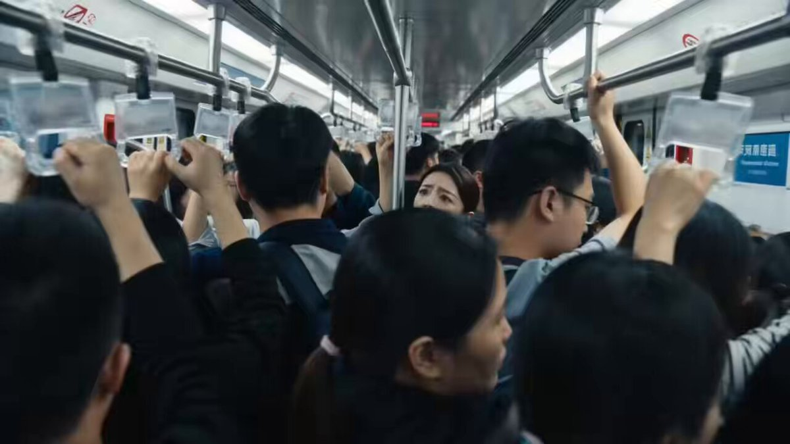

学会逆向思维有多爽？生活中的一些逆向思维小技巧，学会逆向思维的重要性。反向思考。之前的角色内容需要和谐一下（重制加长版），本视频由小云雀Seedance2.0创作生成 #小云雀创作者计划 #小云雀AI #ai创作浪潮计划 #逆向思维 

## 💬 Replies

### 1 @dunjinh (David Dun)

*Fri Jul 03 07:04:43 +0000 2026*

@yuqiyong 很反感这种东西，但社会现实确实如此，正所谓劣币驱逐良币。虽然人性本身确实如此，但好的制度设计和好的社会应该可以尽量规避这样的结果。比如撒谎会受到惩罚

### 2 @yuqiyong (Sunshine) (Author)

*Fri Jul 03 13:13:07 +0000 2026*

@dunjinh 学习

### 3 @7BMtVIefoqbCDND (乐死我了_)

*Fri Jul 03 16:36:04 +0000 2026*

@yuqiyong 逆向思维=对自己有利的说法转换成对他人有利的说法

### 4 @yuqiyong (Sunshine) (Author)

*Fri Jul 03 23:14:28 +0000 2026*

@7BMtVIefoqbCDND 是的

### 5 @DavisNc9527 (Davis.AI.Explorer)

*Fri Jul 03 06:39:28 +0000 2026*

@yuqiyong 坐出租车那个小伙子的场景对大多数人应该都有帮助吧，为了不让乘客弄脏车，师傅肯定会加速

### 6 @yuqiyong (Sunshine) (Author)

*Fri Jul 03 13:13:13 +0000 2026*

@DavisNc9527 学习

### 7 @ceiling_fang (Ceiling Fang)

*Fri Jul 03 06:14:52 +0000 2026*

@yuqiyong ……年轻人智商有限啊

### 8 @yuqiyong (Sunshine) (Author)

*Fri Jul 03 13:13:02 +0000 2026*

@ceiling\_fang 学习

### 9 @rainbear00 (Rain Bear)

*Fri Jul 03 18:07:07 +0000 2026*

@yuqiyong 这是教情商高，还是撒谎骗人呢？

### 10 @yuqiyong (Sunshine) (Author)

*Sat Jul 04 01:01:17 +0000 2026*

@rainbear00 智商

