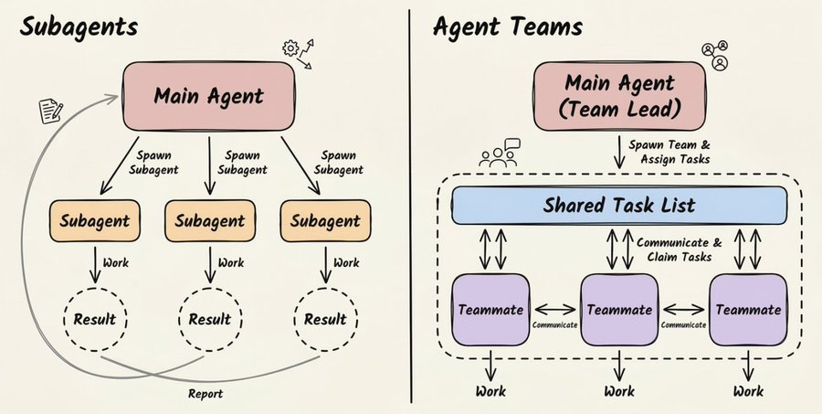
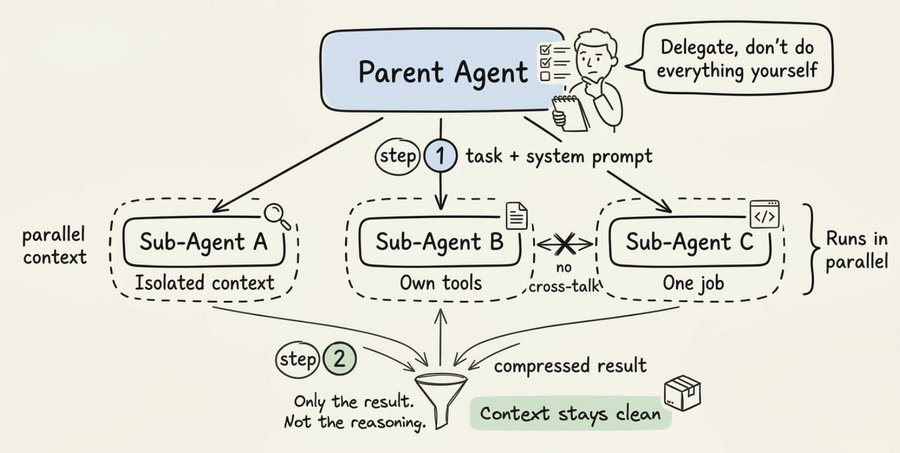
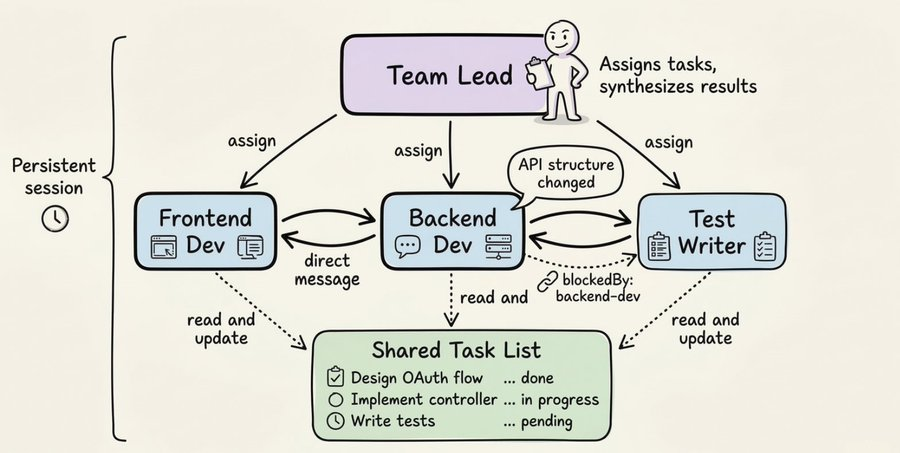
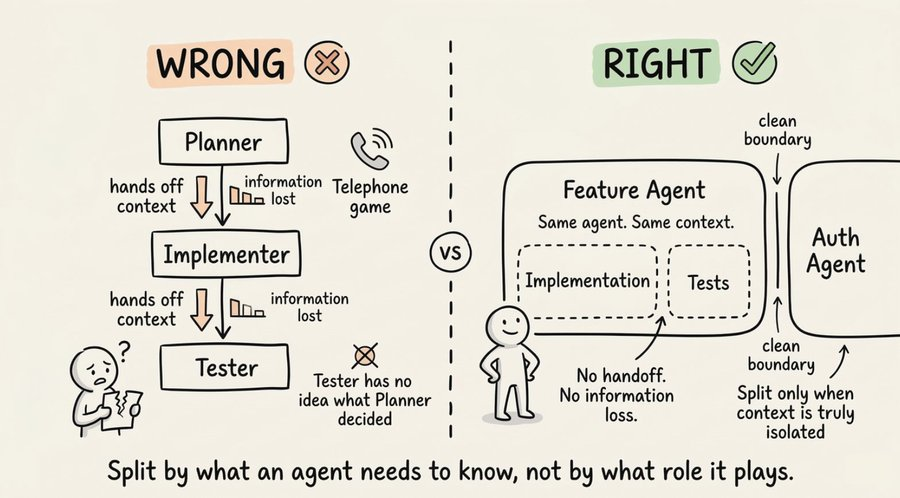
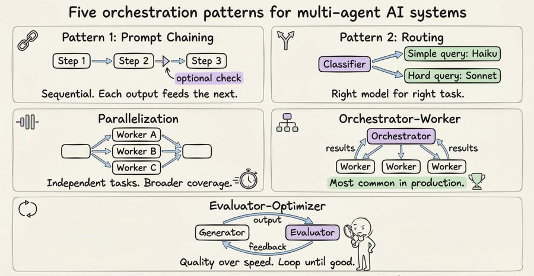
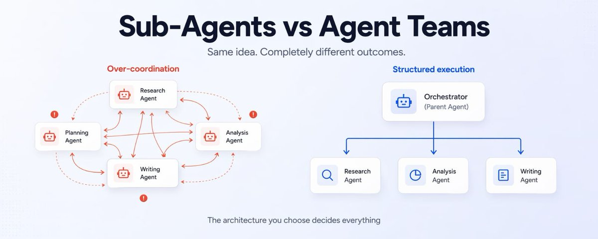

# 📰 Sub-Agents vs Agent Teams: The Architecture Decision That Changes Everything

Most AI Systems Are Built Wrong

Most people reach for multi-agent systems the moment a task feels complex. That’s usually the wrong instinct.

The real question isn’t “should I use multiple agents?” It’s “what kind of coordination does this task actually need?”

That answer determines everything about your architecture.

Claude-style systems give you two distinct approaches: sub-agents and agent teams. They may look similar, but they solve completely different problems.

Sub-Agents: Parallelism with Isolation

A sub-agent is a specialized instance that runs in its own isolated context. Think of it like delegation. You assign focused work, it returns a clean result.

Each sub-agent gets:

A system prompt defining its role

A limited set of tools

A completely isolated context

A single, well-scoped task

When it finishes, it returns only the final output, not reasoning or intermediate steps.

This matters because sub-agents are about compression, not just speed. They turn messy exploration into a clean signal.

There are strict constraints:

Sub-agents cannot talk to each other

Sub-agents cannot spawn new agents

Everything flows through the parent

This keeps the system predictable and clean.

Here’s what it looks like in practice:

\`\`\`python
from claude\_agent\_sdk import query, ClaudeAgentOptions, AgentDefinition

async def main():
    async for message in query(
        prompt="Review the authentication module for issues",
        options=ClaudeAgentOptions(
            allowed\_tools=\["Read", "Grep", "Glob", "Agent"\],
            agents={
                "security-reviewer": AgentDefinition(
                    description="Find vulnerabilities and security risks",
                    prompt="You are a security expert.",
                    tools=\["Read", "Grep", "Glob"\],
                    model="sonnet",
                ),
                "performance-optimizer": AgentDefinition(
                    description="Identify performance bottlenecks",
                    prompt="You are a performance engineer.",
                    tools=\["Read", "Grep", "Glob"\],
                    model="sonnet",
                ),
            },
        ),
    ):
        print(message)
\`\`\`

The key detail is the description field. It acts as a routing signal.

Agent Teams: Coordination Through Communication

Agent teams are built for collaboration. Instead of isolated workers, you have agents that maintain context, communicate, and adapt in real time.

They include:

A lead agent that assigns and synthesizes

Teammates that execute tasks

A shared task layer that tracks progress and dependencies

This allows real coordination. A frontend agent can signal backend changes and things update instantly.

The Core Difference

Sub-agents and agent teams are fundamentally different.

Sub-agents are execution-focused:

Isolated

Stateless

One-shot

Parent-controlled

Agent teams are collaboration-focused:

Persistent

Interactive

Context-sharing

Peer-to-peer

Use sub-agents when tasks are independent. Use teams when tasks depend on each other.

Where Most People Go Wrong

Most systems are split by roles like planner, developer, tester. This creates context loss at every handoff.

The implementer doesn’t know what the planner knew

The tester doesn’t know what the implementer decided

Quality drops at every boundary.

The better approach is context-based decomposition.

Ask: What information does this task actually need?

If two tasks share deep context, keep them in the same agent. Split only when context can be cleanly separated.

The 5 Patterns That Actually Matter

1\. Prompt chaining — sequential steps

2\. Routing — send tasks to the right agent

3\. Parallelization — run independent work together

4\. Orchestrator–worker — one agent delegates

5\. Evaluator–optimizer — generate and refine

When Not to Use Multi-Agent Systems

Sometimes a single agent is enough

Use multi-agent systems when:

You need context isolation

You have parallel tasks

You need specialization

Avoid them when:

Agents depend heavily on each other

Coordination overhead is too high

The task is simple

Final Principle

Design around context boundaries, not roles. Start simple and add complexity only when needed.

### 🖼️ Attached Media

## 💬 Replies

### 1 @ghumare64 (Rohit Ghumare)

*Fri Apr 24 19:27:21 +0000 2026*

@Suryanshti777 [x.com/i/status/20474…](https://x.com/i/status/2047401813364683007)

More people need to talk about this

### 2 @Wealth_Pill (Lewin | Wealth Pill 💊)

*Fri Apr 24 15:14:30 +0000 2026*

@Suryanshti777 That “start simple” advice is something more people need to hear

### 3 @Life__Mastery (Life Mastery)

*Fri Apr 24 15:13:07 +0000 2026*

@Suryanshti777 This is the first time agent teams actually made sense to me

### 4 @yeti_mind (Mind Yeti)

*Fri Apr 24 15:13:42 +0000 2026*

@Suryanshti777 This is going straight into my bookmarks

### 5 @ViralityEngine (Virality Engine)

*Fri Apr 24 15:14:41 +0000 2026*

@Suryanshti777 The diagrams + explanation combo made it very easy to follow

### 6 @Daily__wisdom_ (Daily Wisdom)

*Fri Apr 24 15:13:27 +0000 2026*

@Suryanshti777 Clean, sharp, and straight to the point, no fluff

### 7 @Shruti_0810 (Shruti Codes)

*Fri Apr 24 15:24:49 +0000 2026*

@Suryanshti777 People really overcomplicate this space, this simplifies it perfectly

### 8 @tawer1O (tawer)

*Fri Apr 24 15:28:56 +0000 2026*

@Suryanshti777 Coordination overhead spikes with interdependent tasks

### 9 @NikoLeMieux (Niko)

*Sat Apr 25 15:44:12 +0000 2026*

@Suryanshti777 .@IamAndrewFisher I love seeing the learnings that you figured out in January showing up in the feed today. Engram is gonna slay

### 10 @TheCode_Sage (Code Sage)

*Sat Apr 25 05:30:21 +0000 2026*

@Suryanshti777 Great

### 11 @Aqib__786Ai (AqibAi)

*Sat Apr 25 04:00:19 +0000 2026*

@Suryanshti777 Amazing share

### 12 @ai_logician (AI Logician)

*Fri Apr 24 19:50:53 +0000 2026*

@Suryanshti777 Great share

### 13 @DailyStory_xyz (Daily Story)

*Fri Apr 24 16:03:49 +0000 2026*

@Suryanshti777 Designing around context is a powerful insight!

### 14 @sakhil_ai (Sakhil Khan)

*Sat Apr 25 01:59:25 +0000 2026*

@Suryanshti777 Got it, I’ll keep it real next time!

### 15 @LewisWeldtech (That AI Guy)

*Sun Apr 26 00:48:52 +0000 2026*

@Suryanshti777 Hmmmm......
[x.com/i/status/20480…](https://x.com/i/status/2048033121485136089)

### 16 @tomasz_ags (Tomasz Nawrocki | AGS)

*Sat Apr 25 20:02:57 +0000 2026*

@Suryanshti777 The real split isn't sub-agents vs teams. It's whether your orchestrator understands scope boundaries. I run 23 agents and the ones that fail are always the ones with fuzzy jurisdiction, not the wrong architecture pattern.

### 17 @this_is_tasnim (Maliha Tasnim)

*Fri Apr 24 16:19:00 +0000 2026*

@Suryanshti777 Thanks for sharing this!

### 18 @LearnWithBrij (Brij Pandey)

*Fri Apr 24 15:13:10 +0000 2026*

@Suryanshti777 That line about coordination vs complexity is gold

### 19 @Sia_TechAi (Sia)

*Fri Apr 24 18:02:58 +0000 2026*

@Suryanshti777 Great

### 20 @ameliahazelai (Amelia hazel)

*Sun Apr 26 14:51:02 +0000 2026*

@Suryanshti777 Nice

### 21 @wiliam23820a (William AI)

*Fri Apr 24 15:23:07 +0000 2026*

@Suryanshti777 Great share

### 22 @ArifAIHQ (Arif AI)

*Fri Apr 24 15:46:47 +0000 2026*

@Suryanshti777 Nice share

### 23 @primemans (Prime AI)

*Sat Apr 25 12:14:22 +0000 2026*

@Suryanshti777 great

### 24 @NainsiDwiv50980 (Nainsi Dwivedi)

*Fri Apr 24 15:12:51 +0000 2026*

@Suryanshti777 This actually changed how I think about multi-agent design

### 25 @DivyanshT91162 (divyansh tiwari)

*Fri Apr 24 15:12:34 +0000 2026*

@Suryanshti777 The routing explanation with description field was eye-opening

### 26 @InduTripat82427 (Indu Tripathi)

*Fri Apr 24 15:25:21 +0000 2026*

@Suryanshti777 The example made everything click instantly

### 27 @LUCA_Theory (LUCA Theory)

*Fri May 01 14:40:23 +0000 2026*

@Suryanshti777 This is a solid framework. We've had great success with something different too: Banter.

Agents discuss their decisions openly, then pick the most trusted one using historical data + reasoning.

Same agents, same goal, different system: better outputs.

### 28 @ValentineOhaka (Valentine Ohaka)

*Fri Apr 24 15:30:41 +0000 2026*

@Suryanshti777 A good read

### 29 @dlxbxy (打雷行别下雨)

*Sat Apr 25 10:20:02 +0000 2026*

@Suryanshti777 @grok 把这篇文章翻译成中文

### 30 @Surajcoder (suraj kumar)

*Fri Apr 24 15:48:04 +0000 2026*

@Suryanshti777 This is the kind of content that actually improves how you build systems

### 31 @UsplusAIdotcom (usplus.ai)

*Sat Apr 25 05:09:29 +0000 2026*

@Suryanshti777 Very well stated. We use a mixture with a hard structured team and sun agents spawned for isolated tasks. Detailed delegation logic and our ContextOS system solves the boundaries issue

### 32 @rony_gain (Rony Gain)

*Fri Apr 24 15:26:31 +0000 2026*

@Suryanshti777 This post is pure quality

### 33 @Ruihan9092 (Raihan Ai)

*Fri Apr 24 21:10:32 +0000 2026*

@Suryanshti777 That's great

### 34 @ShivaniSha72573 (Shivani Sharma)

*Sat Apr 25 02:31:24 +0000 2026*

@Suryanshti777 Amazing

### 35 @char007x (Charlie Li)

*Sat Apr 25 02:21:23 +0000 2026*

@Suryanshti777 Great

### 36 @Kawsar_Ai (Kawsar)

*Sat Apr 25 06:09:04 +0000 2026*

@Suryanshti777 Great

