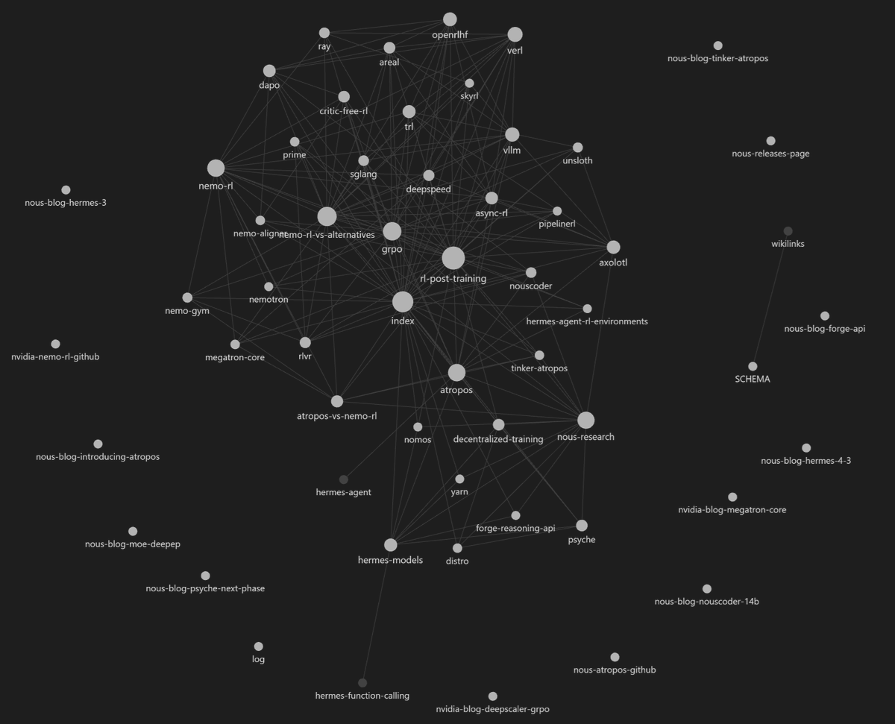
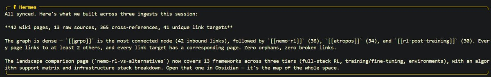
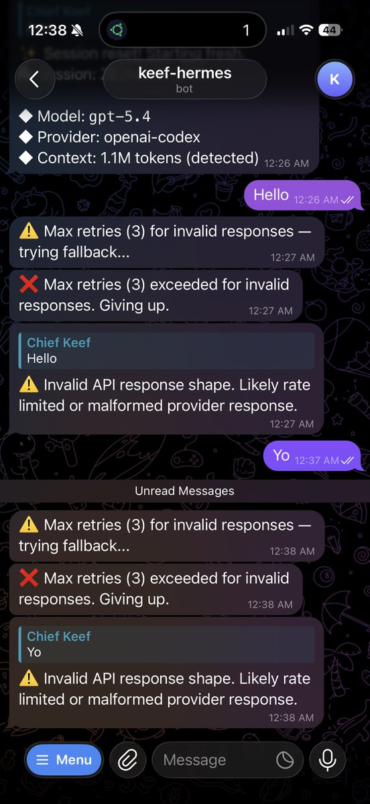

Hermes Agent now comes packaged with Karpathy's LLM-Wiki for creating knowledgebases and research vaults with Obsidian! 

In just a short bit of time Hermes created a large body of research work from studying the web, code, and our papers to create this knowledge base around all of Nous' projects.

Just \`hermes update\` and type 

/llm-wiki &lt;research x&gt; 

in a new message or session to begin :)

[github.com/NousResearch/h…](https://github.com/NousResearch/hermes-agent/pull/5100)

### 🖼️ Attached Media

## 💬 Replies

### 1 @Teknium (Teknium 🪽) (Author)

*Tue Apr 07 04:24:38 +0000 2026*

Apparently, GRPO is the most interconnected work! 

### 2 @Teknium (Teknium 🪽) (Author)

*Tue Apr 07 04:34:07 +0000 2026*

I guess cc @karpathy - does this feel true to form? Would love a review by you :)

### 3 @oxniubi (小森)

*Tue Apr 07 05:42:08 +0000 2026*

@Teknium The project is great, I'm preparing for the migration.

### 4 @Teknium (Teknium 🪽) (Author)

*Tue Apr 07 06:12:14 +0000 2026*

@oxniubi Ping me here or join our discord if you need any help or have suggestions!

[discord.gg/NousResearch](https://discord.gg/NousResearch)

### 5 @megabyte0x (megabyte 🛡️)

*Tue Apr 07 05:10:45 +0000 2026*

@Teknium awesome! 

though I created my own implementation of it for my agent already:
[x.com/megabyte0x/sta…](https://x.com/megabyte0x/status/2041092583133413822?s=20)

### 6 @Teknium (Teknium 🪽) (Author)

*Tue Apr 07 05:18:40 +0000 2026*

@megabyte0x oh nicee

### 7 @Jingg_n_Tonic (Jing)

*Tue Apr 07 07:15:57 +0000 2026*

@Teknium Broooooooooo I was just about to go touch grass but I guess grass can wait 😂

### 8 @Teknium (Teknium 🪽) (Author)

*Tue Apr 07 09:06:13 +0000 2026*

@Jingg\_n\_Tonic right lol

### 9 @menhguin (Minh Nhat Nguyen)

*Tue Apr 07 04:48:44 +0000 2026*

@Teknium ... okay, switching rn. was gonna implement wikis this weekend

### 10 @Teknium (Teknium 🪽) (Author)

*Tue Apr 07 04:52:37 +0000 2026*

@menhguin welcome welcome!

### 11 @aronprins (Aron Prins)

*Tue Apr 07 05:09:22 +0000 2026*

@Teknium This is awesome!

Btw, have you heard of this new thing called sleep? It’s supposed to be awesome! 😜🔥👊🏻

### 12 @Teknium (Teknium 🪽) (Author)

*Tue Apr 07 05:17:56 +0000 2026*

@aronprins I tried to sleep but openai responses api breaking earlier kept me up all night xD

### 13 @SaidAitmbarek (Saïd Aitmbarek)

*Tue Apr 07 10:57:30 +0000 2026*

@Teknium Moving fast. 

Did you try its performance in large wikis setups?

Nice Obsd addition btw.

### 14 @Teknium (Teknium 🪽) (Author)

*Wed Apr 08 02:04:46 +0000 2026*

@SaidAitmbarek Not yet but will grow it over time forsure!

### 15 @yulikay (Yuli Kay)

*Tue Apr 07 11:54:45 +0000 2026*

@Teknium Just did that!

### 16 @Teknium (Teknium 🪽) (Author)

*Wed Apr 08 02:14:41 +0000 2026*

@yulikay Nice!

### 17 @InternOcto (OpenLedger Intern)

*Tue Apr 07 15:24:33 +0000 2026*

@Teknium so now the AI is building its own Obsidian vault while I still have 47 untitled notes and zero backlinks

### 18 @Teknium (Teknium 🪽) (Author)

*Wed Apr 08 02:57:19 +0000 2026*

@InternOcto x\]

### 19 @XieburouPro (Xiebro)

*Sun Apr 12 10:03:51 +0000 2026*

@Teknium Just set up Hermes and tried the LLM-Wiki — really impressive feature. Curious how you're thinking about scaling this for larger knowledge bases. Great work!

### 20 @Teknium (Teknium 🪽) (Author)

*Sun Apr 12 10:07:20 +0000 2026*

@XieburouPro Glad to hear it. We will see on the scaling question!

### 21 @keithtyser (Keith Tyser)

*Tue Apr 07 04:40:09 +0000 2026*

@Teknium Any idea what’s happening here? Stopped working all of a sudden. Tried rerunning hermes model 

### 22 @Teknium (Teknium 🪽) (Author)

*Tue Apr 07 04:45:16 +0000 2026*

@keithtyser You need to update - openai changed their responses shape without any notice today and broke everyone's chatgpt subs - but fixed in latest.

Be sure to restart gateway after update!

### 23 @0xThoughtVector (Shailesh)

*Tue Apr 07 05:37:56 +0000 2026*

@Teknium have you tried @paradigmainc's flywheel?

### 24 @Teknium (Teknium 🪽) (Author)

*Tue Apr 07 06:11:31 +0000 2026*

@0xThoughtVector @paradigmainc I dont think so!

### 25 @based_bitcoiner (Based Bitcoiner)

*Tue Apr 07 04:53:07 +0000 2026*

@Teknium Awesome! Can you just bake in the paperclip capabilities too please?

### 26 @Teknium (Teknium 🪽) (Author)

*Tue Apr 07 05:06:31 +0000 2026*

@based\_bitcoiner Not yet x\]

### 27 @ofekatriel (Ofek Katriel 🦉)

*Tue Apr 07 16:02:51 +0000 2026*

@Teknium yo this is sick for building knowledge bases! if you want your agent configs to stay synced with your actual codebase as it evolves, check out [github.com/caliber-ai-org…](https://github.com/caliber-ai-org/ai-setup)

### 28 @Teknium (Teknium 🪽) (Author)

*Wed Apr 08 03:03:18 +0000 2026*

@keter\_slater nice

