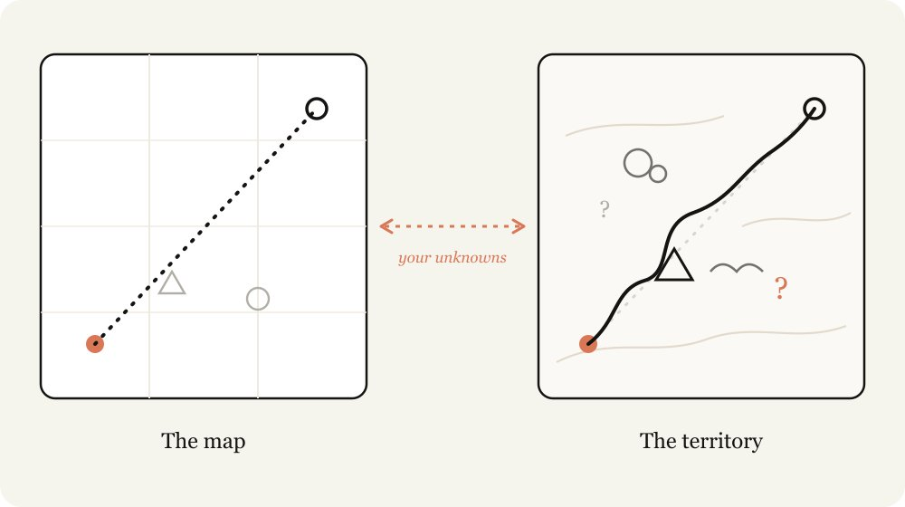
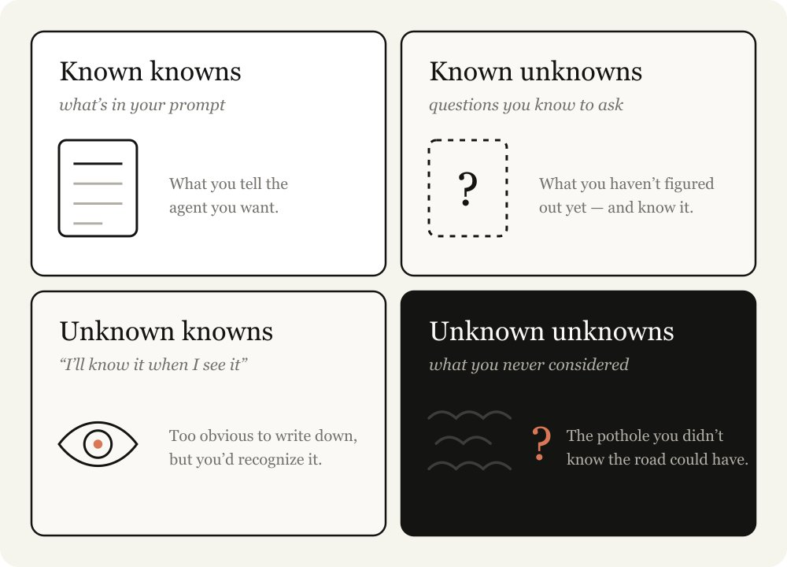
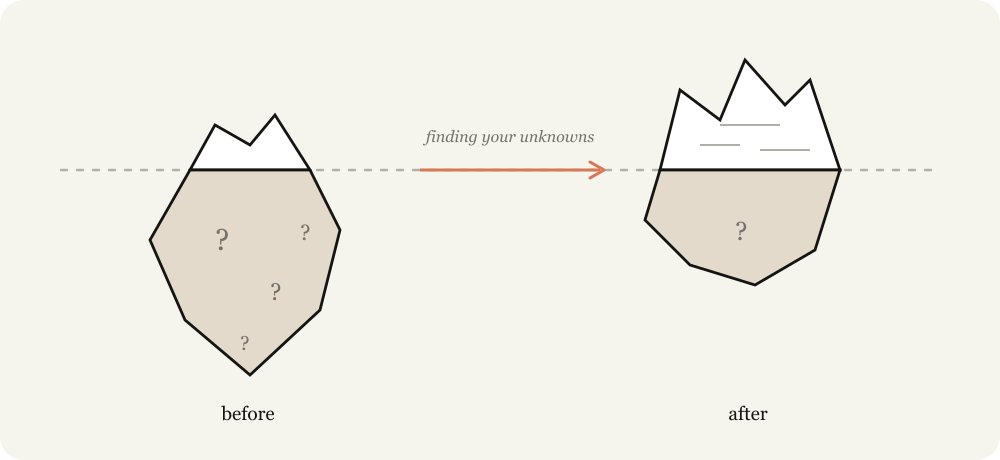
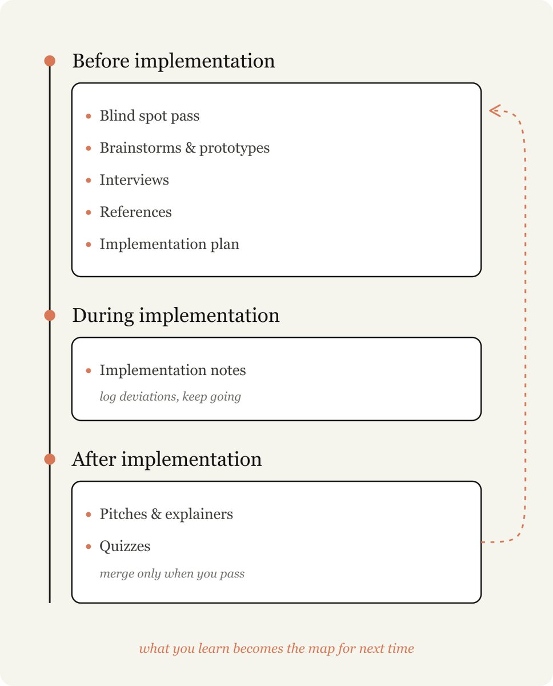
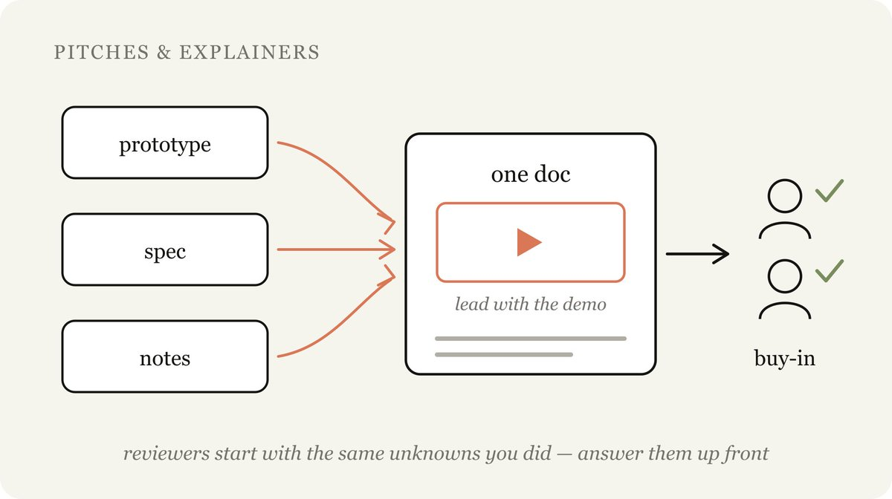
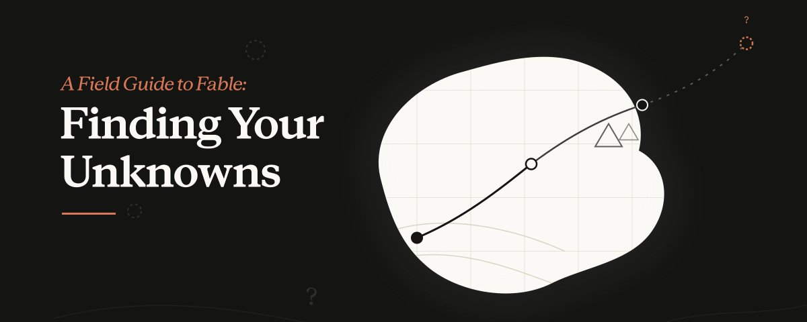
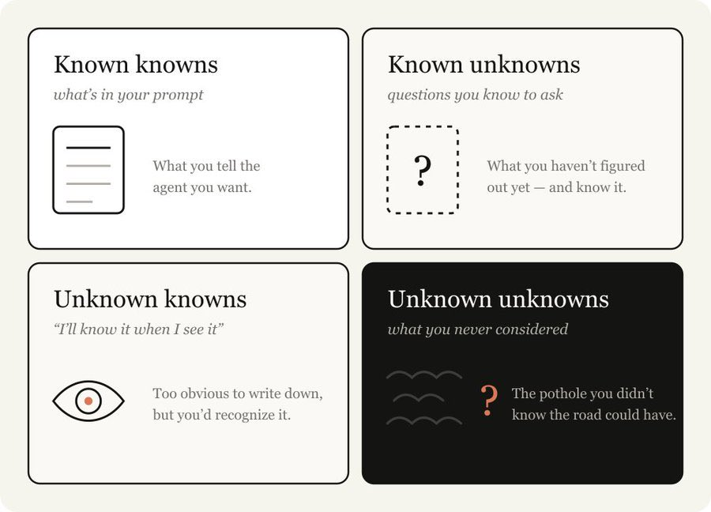

# 📰 A Field Guide to Fable: Finding Your Unknowns

Working with Claude Fable 5 keeps re-teaching me an old lesson: the map is not the territory.

The map, a representation of the work to be done, is my prompts and skills and context, it’s what I give Claude. The territory is where the work needs to happen, the codebase, the real world, its actual constraints.

The difference between the map and the territory is what I call unknowns. When Claude runs into an unknown, it needs to make a decision based on its best guess of what I want. The more work being done, the more unknowns Claude might run into

Fable is the first model where I find the quality of the work is bottlenecked by my ability to clarify its unknowns.

Importantly, just planning ahead isn’t always enough. You can find unknowns deep in implementation, or your unknowns may point you to the fact that you should actually be solving the problem in a different way altogether.

I’ve found that working with Fable is an iterative process of discovering my unknowns before, during, and after implementation.

I've made some [example artifacts for finding unknowns here,](https://thariqs.github.io/html-effectiveness/unknowns/) but be sure to come back to build the intuition for when to use them.

## Knowing your unknowns

What are your unknowns? When I come to Claude with a problem I tend to break it down in 4 ways:

- Known Knowns: This is essentially what is in my prompt. What do I tell the agent that I want?

- Known Unknowns: What haven't I figured out yet, but I’m aware that I haven’t?

- Unknown Knowns: What's so obvious I’d never write it down, but would recognize it if I saw it?

- Unknown Unknowns: What haven't I considered at all? What knowledge am I not aware of? Do I know how good something can be?

The best agentic coders are good have relatively few unknowns. Watching someone like [Boris](https://www.google.com/url?q=https://www.linkedin.com/in/bcherny&sa=D&source=editors&ust=1783101769343560&usg=AOvVaw0NSN4RLOEaJ_k7bIWfat2t) or [Jarred](https://www.google.com/url?q=https://www.linkedin.com/in/jarred-sumner-a8772425&sa=D&source=editors&ust=1783101769343738&usg=AOvVaw1jFeuVIbBffAC5464Tk_TD) prompt, it is obvious to me that they know what they want in-detail. They are deeply in-sync with both the codebase and the model behaviors.

But they also assume unknowns. In many ways, reducing and planning for your unknowns is the skill of agentic coding. But luckily, this is a skill you can improve at, by working with Claude.

## Help Claude help you

Instructing Claude is a delicate balance. If you are too specific, Claude will follow your instructions even when a pivot may be more appropriate. If you are too vague, Claude will often make choices and assumptions based on industry best practices that may not be a fit for your task.

When you don’t account for your unknowns you fail both ways. You don't know when the path will be filled with obstacles and you don’t know when the path will be clear, but you still want Claude to veer.

Claude can help you discover your unknowns faster. It can search through your codebase and the internet extremely quickly and it knows much more about the average topic than you. It can also iterate from failure faster.

The most important part of this process is to give Claude context about your starting point. For example, tell it where you are in your thought process; disclose your experience with the problem and codebase; and let it work with you like a thought partner.

I've previously written about using [HTML with Claude](https://x.com/trq212/status/2052809885763747935), in almost all of these cases, a HTML artifact is the best way to visualize and represent it.

In this article I detail some of the patterns I use to uncover these unknowns. I don't use every technique each time, but it's a useful collection of techniques to have.

# Pre-implementation

## Blind Spot Pass

When starting work, one of the most useful things you can do is understand your blindspots. For example, if you’re writing a feature in a new part of the codebase or using Claude to help you with unfamiliar work like iterating on a design, you’re likely to have a lot of unknown unknowns.

You may not know what questions to ask, what good looks like, what historical work has been done or what potholes to avoid.

To do this, you can ask Claude to help you find your unknown unknowns and explain them to you. I like to use the literal words “blindspot pass” and “unknown unknowns”. Giving it context on who you are and what you know is usually important for

Example Prompts:

- “I'm working on adding a new auth provider but I know nothing about the auth modules in this codebase. Can you do a blindspot pass to help me figure out my relevant unknown unknowns and help me prompt you better.”

- “I don’t know what color grading is but I need to grade this video. Can you teach me to understand my unknown unknowns about color grading, so that I can prompt better?”

## Brainstorms and prototypes

When I’m working in an area with a lot of unknown knowns, involving criteria I only know to define when I see it, I like to ask Claude to brainstorm and prototype with me.

It’s extremely valuable to identify and verbalize unknown knowns early during prototyping, because finding them out during implementation can be (relatively) expensive. Small changes in a feature or spec can cause drastically different implementations in code and it can be more difficult for your agent to revert previous changes.

For example, you may just want to see how a button added to a frame looks without having to wire up a backend route or maintaining additional state in the frontend.

Visual design is something that for me is difficult to articulate, but I know what I want when I see it. In these cases, I’ll ask for several design approaches to an artifact.

I also start almost every coding session with an exploration or brainstorming phase. This helps me start with intent to define the project’s scope. Claude often finds high-value approaches I would have missed and sometimes misses the forest through the trees. Brainstorming prevents me from setting too narrow or too wide a scope.

Example prompts:

- "I want a dashboard for this data but I have no visual taste and don't know what's possible. Make me an HTML page with 4 wildly different design directions so I can react to them.”

- “Before wiring anything up, make a single HTML file mocking the new editor toolbar with fake data. I want to react to the layout before you touch the treal app."

- "Here's my rough problem: users churn after onboarding. Search the codebase and brainstorm 10 places we could intervene, from cheapest to most ambitious. I'll tell you which ones resonate."

## Interviews

Once I’ve done sufficient brainstorming, I likely still have unknowns.

In this case, I ask Claude to interview me about any unknowns or ambiguities. When asking Claude to interview you, try and give it context about your problem to guide its questions. Here are some examples.

Example prompts:

- "Interview me one question at a time about anything ambiguous, prioritize questions where my answer would change the architecture."

## References

Sometimes you can’t describe what you want in detail. For example, you might not have the language or it might be so complicated that it would take you quite a while.

In this case, the best answer is a reference. While you can include diagrams, documentation or pictures, the absolute best reference is source code.

If you have a library that implements something in a certain way or a design component you really like, just point Fable at the folder and tell it what to look for, even if it’s in a different language.

This is also the way Claude Design works. You don't have to hand it a file (although you can do that too). You can point it at a module on a website you like, and it reads the underlying code, not just the screenshot. This provides much richer detail around the markup, structure, and how the component is actually built.

Example prompts:

- This Rust crate in vendor/rate-limiter implements the exact backoff behavior I want. Read it and reimplement the same semantics in our TypeScript API client.

## Implementation Plans

When I think I’m ready to implement, I tend to ask Claude to put together an implementation plan for me to review that focuses on the parts that might be most likely to change, for example to review data models, type interfaces or UX flows. This allows Claude to surface things I might actually need to alter.

Example Prompts:

- Write an implementation plan in HTML, but lead with the decisions I'm most likely to tweak with: data model changes, new type interfaces, and anything user-facing. Bury the mechanical refactoring at the bottom, I trust you on that part."

## During implementation

## Implementation notes

Once I am satisfied with my plan, I make a new session and pass any artifacts to the prompt. For example, I might pass in a spec file and a prototype and ask an agent to implement it.

But the truth is that no matter how much planning you do, there are always unknown unknowns lurking. The agent may find during its work that it needs to take a different tack due to an edge case it found in the code.

I ask Claude Code to keep a temporary ‘[implementation-notes.md](https://www.google.com/url?q=http://implementation-notes.md&sa=D&source=editors&ust=1783101769359369&usg=AOvVaw1Iqvg51JpzkrkRtHHIjyOL)’ (or .html) file where it keeps track of decisions it makes so we can learn from our next attempt.

Example prompts:

- "Keep an [implementation-notes.md](https://www.google.com/url?q=http://implementation-notes.md&sa=D&source=editors&ust=1783101769359896&usg=AOvVaw1wFqbnqbAuO_GYnGk8_1bh) file. If you hit an edge case that forces you to deviate from the plan, pick the conservative option, log it under 'Deviations', and keep going."

# Post implementation

## Pitches and explainers

One of the most important parts of shipping something is getting buy-in and approvals.  Building pitch and explainer artifacts in the final document helps:

- Accelerate understanding when reviewers start with the same unknowns you did

- Accelerate approvals when experts want to see you accounted for the unknowns and common failure points they would have anticipated

Example prompts:

- "Package the prototype, the spec, and the implementation notes into a single doc I can drop in Slack to get buy-in. Lead with the demo GIF."

## Quizzes

After a long working session, Claude might have accomplished a lot more than I realized. Reading the code diffs can only give me a light understanding of what happened, since much of the behavior will depend on existing code paths.

Asking Claude to quiz me about the change after giving me a bunch of context helps me understand what happens. I only merge after I pass the quiz perfectly.

Example prompts:

- “I want to make sure I understand everything that's happened in this change. Give me a HTML report on the changes for me to read and understand with context, intuition, what was done, etc. and a quiz at the bottom on the changes that I must pass.”

## How this comes together: launching Fable

The [launch video for Fable](https://www.google.com/url?q=https://x.com/ClaudeDevs/status/2064399512664526853&sa=D&source=editors&ust=1783101769363678&usg=AOvVaw1MyZd5YMjjShztWHzo8N9u) was edited entirely by Claude Code. This was a new domain for me and I’m by no means an expert.

So I started with what I did know. I knew that Claude could use code to edit videos and transcribe them, but I wasn’t sure if it was accurate enough. I then asked Claude to explain to me how transcription like Whisper worked, and whether I would be able to accurately cut out things like ums or large pauses using ffmpeg.

I wanted Claude to create a UI that was timed with the words I was saying, but wasn’t sure if it would be able to so I asked Claude to create a prototype video using Remotion and a transcription to see if it would work.

Finally, the video itself looked a bit muted, which I knew was the result of color grading but I didn’t really know what color grading was. My first pass attempt was to try and get Claude to do a few variations to pick, but I realized that I didn’t know what “good” looked like when it came to color grading. So instead, I asked Claude to teach me about color grading to discover my unknowns.

You can watch a more in-depth explanation on that [here](https://x.com/trq212/status/2064826394589442448/video/1).

## Matching the Map and Territory

The better models get, the more you can achieve with the right approach. When a long-horizon task comes back wrong, it's likely you need to spend more time defining your unknowns or creating an implementation plan that allows for Claude to improvise through them.

Every explainer, brainstorm, interview, prototype, and reference is a cheap way to find out what you didn't know before it gets expensive to fix.

So start your next project by asking Claude to help you find your unknowns.

### 🖼️ Attached Media

## 💬 Replies

### 1 @trq212 (Thariq) (Author)

*Mon Jul 06 17:41:26 +0000 2026*

this is now on the Claude blog! [claude.com/blog/a-field-g…](https://claude.com/blog/a-field-guide-to-claude-fable-finding-your-unknowns)

### 2 @jxnlco (jason)

*Fri Jul 03 18:10:48 +0000 2026*

@trq212 I thought fable was good at SVGs

### 3 @trq212 (Thariq) (Author)

*Fri Jul 03 18:48:42 +0000 2026*

@jxnlco your quips are usually better

### 4 @Madisonkanna (Madison Kanna)

*Fri Jul 03 17:46:09 +0000 2026*

@trq212 

### 5 @trq212 (Thariq) (Author)

*Fri Jul 03 17:47:16 +0000 2026*

@Madisonkanna do you have notifications on, how was that so fast

### 6 @evrimagaci (Evrim Ağacı)

*Fri Jul 03 19:10:01 +0000 2026*

Great write-up, thank you! Not that it impacts understanding but I've noticed some grammatic errors and sentence fragments, might be worthwhile to do a polish pass. Ex:

"The best agentic coders are good have relatively few unknowns."

"Giving it context on who you are and what you know is usually important for" (stub)

Hope this helps.

### 7 @trq212 (Thariq) (Author)

*Fri Jul 03 21:43:07 +0000 2026*

@evrimagaci Ah gold catch thank you!

### 8 @ahmetbilicanxyz (Ahmet Bilican)

*Sat Jul 04 19:50:53 +0000 2026*

@trq212 Such a cool article. Thank you for the effort you put in these blogs to make sure they are clean and concise.

### 9 @trq212 (Thariq) (Author)

*Sat Jul 04 20:22:43 +0000 2026*

@ahmetbilicanxyz Glad you enjoyed it!

### 10 @antoniolupetti (Antonio Lupetti)

*Fri Jul 03 20:22:39 +0000 2026*

Hi @trq212, this is a very interesting point. Thanks for writing it. From my limited experience with personal projects of moderate complexity, I've found that both Fable and Opus are surprisingly good at understanding what I want to do and at filling in unknowns on their own. Quite often, Claude is already doing part of the process you describe, at least for projects of this scale. It has ideas, fills in missing context, and adjusts its direction with little input from me.

That said, I can completely see how, on large projects, extensive codebases, or unfamiliar domains, the gap between the map and the territory is much more evident, and the work on those unknowns is much more important. But for everyday personal tasks, including tedious or time-consuming ones, Claude is already very close to the experience you describe.

### 11 @LexnLin (Leon Lin)

*Fri Jul 03 17:59:30 +0000 2026*

@trq212 all these images made with fable?

### 12 @Miguel07Code (Miguel Ángel)

*Fri Jul 03 19:12:19 +0000 2026*

@trq212 made a @HyperFrames\_ video explaining the article with Fable 5 

### 13 @arrakis_ai (CHOI)

*Sat Jul 04 07:42:15 +0000 2026*

@trq212 It feels like the Johari Window is evolving into a framework for working with AI models. The better you are at uncovering your own unknown unknowns, the better the model performs.

### 14 @morganlinton (Morgan)

*Fri Jul 03 19:38:04 +0000 2026*

@trq212 Great article Thariq, and we are definitely the bottleneck now. So much for all of us to learn, exciting times!

### 15 @ThomasBurkhartB (Thomas Burkhart 💙)

*Fri Jul 03 18:00:51 +0000 2026*

@trq212 Fable wasted almost all of its quotas on a workflow where is spawned 100 explore agents with Fable instead of Sonnet.

### 16 @jacob_posel (Jacob Posel)

*Fri Jul 03 21:46:03 +0000 2026*

@trq212 This aligns with our thinking.

Here's a skill we use to surface unknowns before implementation: [github.com/indigoai-us/hq…](https://github.com/indigoai-us/hq-core/blob/main/.claude/skills/brainstorm/SKILL.md)

### 17 @pbakaus (Paul Bakaus)

*Sun Jul 05 17:14:56 +0000 2026*

@trq212 very timely and good reminder, and a good technique for any capable model!

### 18 @alphabatcher (Alpha Batcher)

*Fri Jul 03 18:06:08 +0000 2026*

@trq212 big applause for article about Fable 

thanks Thariq

### 19 @thkostolansky (Tim Kostolansky)

*Fri Jul 03 20:13:48 +0000 2026*

@trq212 do u not use mythos?

### 20 @quionie (Q)

*Fri Jul 03 22:53:34 +0000 2026*

@trq212 👏👏

### 21 @rasdani_ (Daniel Auras)

*Fri Jul 03 19:01:56 +0000 2026*

@trq212 @grok can you just extract and return the example prompts mentioned in this article

### 22 @notjazii (J A Z I I)

*Fri Jul 03 17:51:14 +0000 2026*

@trq212 pls don't take fable away from plans

### 23 @MTorygreen (Tory | io.net 🦾)

*Fri Jul 03 19:02:17 +0000 2026*

@trq212 The same unknown-unknowns problem applies to compute infrastructure too. Teams building on AI APIs hit latency cliffs and capacity ceilings in production, when the fix is expensive. The blindspot pass works there too. Ask what breaks at scale before committing to an architecture

### 24 @ChouaIsaac (Isaac Choua)

*Mon Jul 06 18:36:12 +0000 2026*

@trq212 @ClaudeDevs Only have until tomorrow to test this with very little tokens left 😭

### 25 @gerardsans (Gerard Sans | Axiom 🇬🇧)

*Tue Jul 07 12:38:45 +0000 2026*

@trq212 @ClaudeDevs Check this out:

### 26 @gerardsans (Gerard Sans | Axiom 🇬🇧)

*Sat Jul 04 17:44:13 +0000 2026*

@trq212 [x.com/gerardsans/sta…](https://x.com/gerardsans/status/2073409959165845873)

### 27 @gerardsans (Gerard Sans | Axiom 🇬🇧)

*Sat Jul 04 15:14:30 +0000 2026*

@trq212 I won’t say hi to Claude.
I won’t say hi to Claude.
…

### 28 @gerardsans (Gerard Sans | Axiom 🇬🇧)

*Fri Jul 03 22:01:41 +0000 2026*

@trq212 [x.com/gerardsans/sta…](https://x.com/gerardsans/status/2073155835132264514)

### 29 @inflectivAI (Inflectiv AI ⧉)

*Fri Jul 03 18:08:30 +0000 2026*

@trq212 The distinction between different types of unknowns is useful for getting better results from AI coding tools. Starting with more context about what you already know seems to reduce poor assumptions later.

### 30 @knowixbuilds (Knowix)

*Fri Jul 03 18:14:17 +0000 2026*

@trq212 What an amazing article this is Thariq

### 31 @TahiGichigi (Tahi)

*Fri Jul 03 18:48:57 +0000 2026*

@trq212 Great little artifact for starting a project with Claude 

### 32 @vivek_naskar (Vivek Naskar)

*Fri Jul 03 20:21:48 +0000 2026*

@trq212 This was a good read, Thariq! Well done, get again! 👏

### 33 @fullyallocated (/director)

*Fri Jul 03 22:10:16 +0000 2026*

@trq212 I know it's not your fault but content like this really triggers me because I asked Claude to do an alignment interview to help surface any potential unknown assumptions and that triggered the safety classifiers. I can't even apply this advice.

