# 📰 Lessons from Building Claude Code: How We Use Skills 

Skills have become one of the most used extension points in Claude Code. They’re flexible, easy to make, and simple to distribute.

But this flexibility also makes it hard to know what works best. What type of skills are worth making? What's the secret to writing a good skill? When do you share them with others?

We've been using skills in Claude Code extensively at Anthropic with hundreds of them in active use. These are the lessons we've learned about using skills to accelerate our development.

## What are Skills?

If you’re new to skills, I’d recommend [reading our docs](https://code.claude.com/docs/en/skills) or watching our newest course on [new Skilljar on Agent Skills](https://anthropic.skilljar.com/introduction-to-agent-skills), this post will assume you already have some familiarity with skills.

A common misconception we hear about skills is that they are “just markdown files”, but the most interesting part of skills is that they’re not just text files. They’re folders that can include scripts, assets, data, etc. that the agent can discover, explore and manipulate.

In Claude Code, skills also have a [wide variety of configuration options](https://code.claude.com/docs/en/skills#frontmatter-reference) including registering dynamic hooks.

We’ve found that some of the most interesting skills in Claude Code use these configuration options and folder structure creatively.

# Types of Skills

After cataloging all of our skills, we noticed they cluster into a few recurring categories. The best skills fit cleanly into one; the more confusing ones straddle several. This isn't a definitive list, but it is a good way to think about if you're missing any inside of your org.

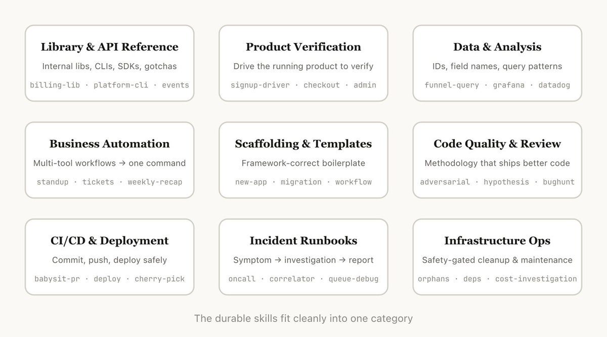

## 1\. Library & API Reference

Skills that explain how to correctly use a library, CLI, or SDKs. These could be both for internal libraries or common libraries that Claude Code sometimes has trouble with. These skills often included a folder of reference code snippets and a list of gotchas for Claude to avoid when writing a script.

Examples:

- billing-lib — your internal billing library: edge cases, footguns, etc.

- internal-platform-cli — every subcommand of your internal CLI wrapper with examples on when to use them

- frontend-design — make Claude better at your design system

## 2\. Product Verification

Skills that describe how to test or verify that your code is working. These are often paired with an external tool like playwright, tmux, etc. for doing the verification.

Verification skills are extremely useful for ensuring Claude's output is correct. It can be worth having an engineer spend a week just making your verification skills excellent.

Consider techniques like having Claude record a video of its output so you can see exactly what it tested, or enforcing programmatic assertions on state at each step. These are often done by including a variety of scripts in the skill.

Examples:

- signup-flow-driver — runs through signup → email verify → onboarding in a headless browser, with hooks for asserting state at each step

- checkout-verifier — drives the checkout UI with Stripe test cards, verifies the invoice actually lands in the right state

- tmux-cli-driver — for interactive CLI testing where the thing you're verifying needs a TTY

## 3\. Data Fetching & Analysis

Skills that connect to your data and monitoring stacks. These skills might include libraries to fetch your data with credentials, specific dashboard ids, etc. as well as instructions on common workflows or ways to get data.

Examples:

- funnel-query — "which events do I join to see signup → activation → paid" plus the table that actually has the canonical user\_id

- cohort-compare — compare two cohorts' retention or conversion, flag statistically significant deltas, link to the segment definitions

- grafana — datasource UIDs, cluster names, problem → dashboard lookup table

## 4\. Business Process & Team Automation

Skills that automate repetitive workflows into one command. These skills are usually fairly simple instructions but might have more complicated dependencies on other skills or MCPs. For these skills, saving previous results in log files can help the model stay consistent and reflect on previous executions of the workflow.

Examples:

- standup-post — aggregates your ticket tracker, GitHub activity, and prior Slack → formatted standup, delta-only

- create-&lt;ticket-system&gt;-ticket — enforces schema (valid enum values, required fields) plus post-creation workflow (ping reviewer, link in Slack)

- weekly-recap — merged PRs + closed tickets + deploys → formatted recap post

## 5\. Code Scaffolding & Templates

Skills that generate framework boilerplate for a specific function in codebase. You might combine these skills with scripts that can be composed. They are especially useful when your scaffolding has natural language requirements that can’t be purely covered by code.

Examples:

- new-&lt;framework&gt;-workflow — scaffolds a new service/workflow/handler with your annotations

- new-migration — your migration file template plus common gotchas

- create-app — new internal app with your auth, logging, and deploy config pre-wired

## 6\. Code Quality & Review

Skills that enforce code quality inside of your org and help review code. These can include deterministic scripts or tools for maximum robustness. You may want to run these skills automatically as part of hooks or inside of a GitHub Action.

- adversarial-review — spawns a fresh-eyes subagent to critique, implements fixes, iterates until findings degrade to nitpicks

- code-style — enforces code style, especially styles that Claude does not do well by default.

- testing-practices — instructions on how to write tests and what to test.

## 7\. CI/CD & Deployment

Skills that help you fetch, push, and deploy code inside of your codebase. These skills may reference other skills to collect data.

Examples:

- babysit-pr — monitors a PR → retries flaky CI → resolves merge conflicts → enables auto-merge

- deploy-&lt;service&gt; — build → smoke test → gradual traffic rollout with error-rate comparison → auto-rollback on regression

- cherry-pick-prod — isolated worktree → cherry-pick → conflict resolution → PR with template

## 8\. Runbooks

Skills that take a symptom (such as a Slack thread, alert, or error signature), walk through a multi-tool investigation, and produce a structured report.

Examples:

- &lt;service&gt;-debugging — maps symptoms → tools → query patterns for your highest-traffic services

- oncall-runner — fetches the alert → checks the usual suspects → formats a finding

- log-correlator — given a request ID, pulls matching logs from every system that might have touched it

## 9\. Infrastructure Operations

Skills that perform routine maintenance and operational procedures — some of which involve destructive actions that benefit from guardrails. These make it easier for engineers to follow best practices in critical operations.

Examples:

- &lt;resource&gt;-orphans — finds orphaned pods/volumes → posts to Slack → soak period → user confirms → cascading cleanup

- dependency-management — your org's dependency approval workflow

- cost-investigation — "why did our storage/egress bill spike" with the specific buckets and query patterns

# Tips for Making Skills

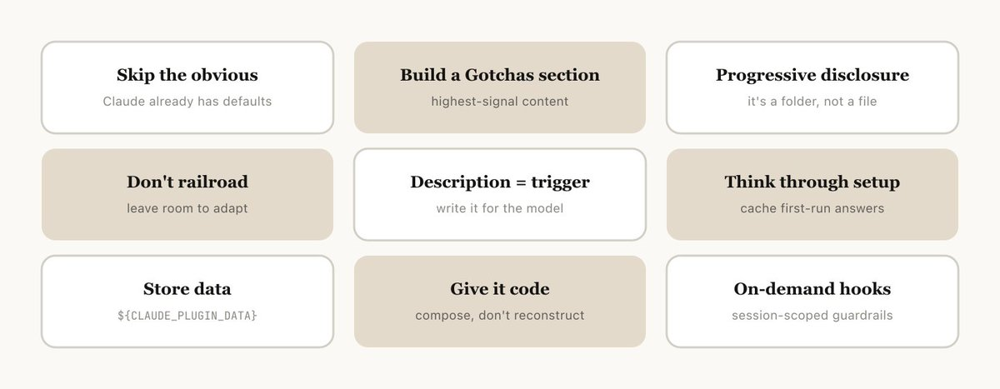

Once you've decided on the skill to make, how do you write it? These are some of the best practices, tips, and tricks we've found.

We also recently released [Skill Creator](https://claude.com/blog/improving-skill-creator-test-measure-and-refine-agent-skills) to make it easier to create skills in Claude Code.

## Don’t State the Obvious

Claude Code knows a lot about your codebase, and Claude knows a lot about coding, including many default opinions. If you’re publishing a skill that is primarily about knowledge, try to focus on information that pushes Claude out of its normal way of thinking.

The [frontend design skill](https://github.com/anthropics/skills/blob/main/skills/frontend-design/SKILL.md) is a great example — it was built by one of the engineers at Anthropic by iterating with customers on improving Claude’s design taste, avoiding classic patterns like the Inter font and purple gradients.

## Build a Gotchas Section

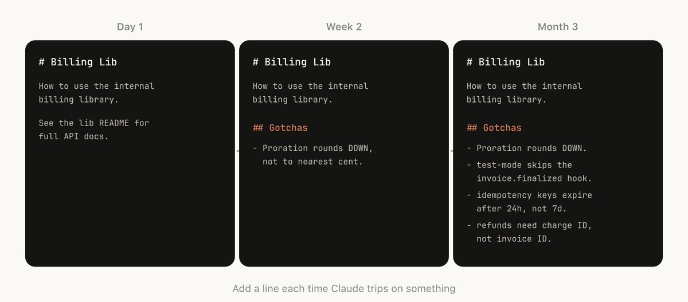

The highest-signal content in any skill is the Gotchas section. These sections should be built up from common failure points that Claude runs into when using your skill. Ideally, you will update your skill over time to capture these gotchas.

## Use the File System & Progressive Disclosure

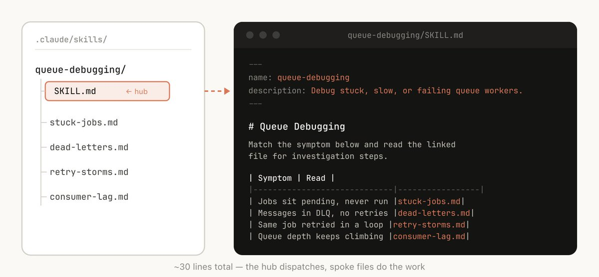

Like we said earlier, a skill is a folder, not just a markdown file. You should think of the entire file system as a form of context engineering and progressive disclosure. Tell Claude what files are in your skill, and it will read them at appropriate times.

The simplest form of progressive disclosure is to point to other markdown files for Claude to use. For example, you may split detailed function signatures and usage examples into references/api.md.

Another example: if your end output is a markdown file, you might include a template file for it in assets/ to copy and use.

You can have folders of references, scripts, examples, etc., which help Claude work more effectively.

## Avoid Railroading Claude

Claude will generally try to stick to your instructions, and because Skills are so reusable you’ll want to be careful of being too specific in your instructions. Give Claude the information it needs, but give it the flexibility to adapt to the situation. For example:

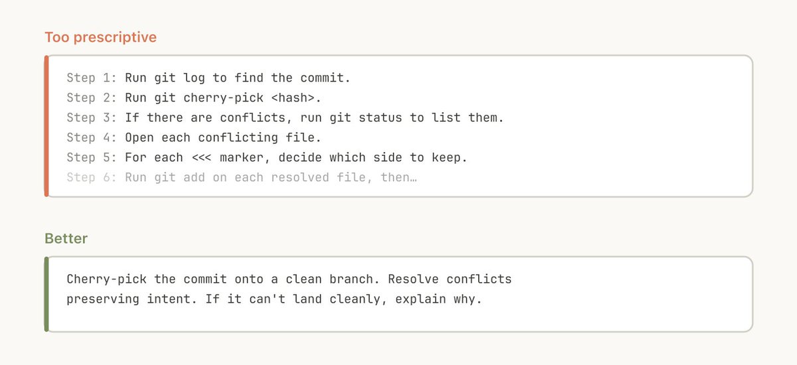

## Think through the Setup

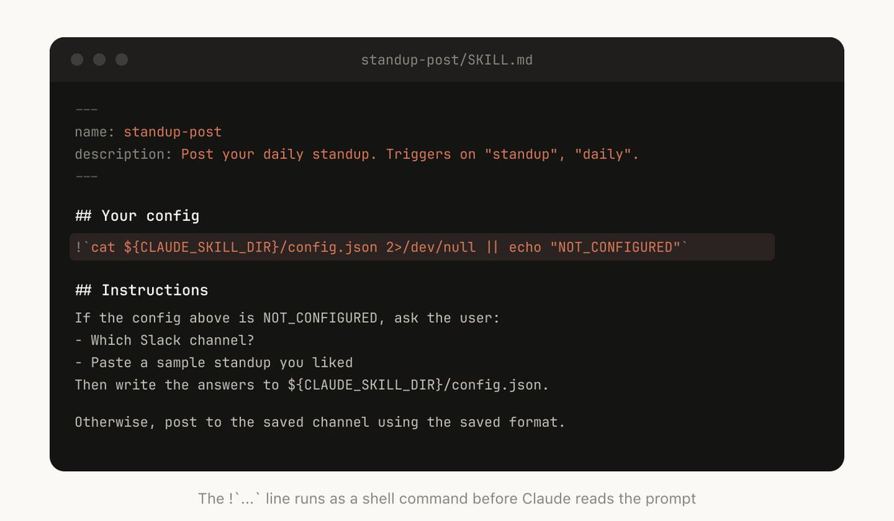

Some skills may need to be set up with context from the user. For example, if you are making a skill that posts your standup to Slack, you may want Claude to ask which Slack channel to post it in.

A good pattern to do this is to store this setup information in a config.json file in the skill directory like the above example. If the config is not set up, the agent can then ask the user for information.

If you want the agent to present structured, multiple choice questions you can instruct Claude to use the AskUserQuestion tool.

## The Description Field Is For the Model

When Claude Code starts a session, it builds a listing of every available skill with its description. This listing is what Claude scans to decide "is there a skill for this request?" Which means the description field is not a summary — it's a description of when to trigger this PR.

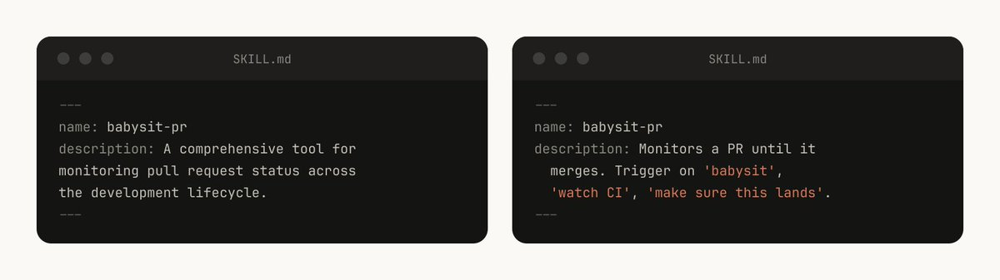

## Memory & Storing Data

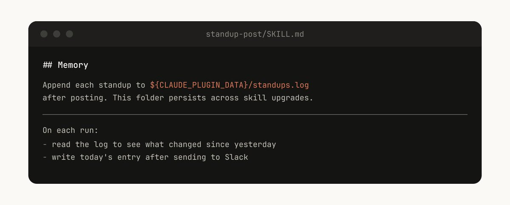

Some skills can include a form of memory by storing data within them. You could store data in anything as simple as an append only text log file or JSON files, or as complicated as a SQLite database.

For example, a standup-post skill might keep a standups.log with every post it's written, which means the next time you run it, Claude reads its own history and can tell what's changed since yesterday.

Data stored in the skill directory may be deleted when you upgrade the skill, so you should store this in a stable folder, as of today we provide \`${CLAUDE\_PLUGIN\_DATA}\` as a stable folder per plugin to store data in.

## Store Scripts & Generate Code

One of the most powerful tools you can give Claude is code. Giving Claude scripts and libraries lets Claude spend its turns on composition, deciding what to do next rather than reconstructing boilerplate.

For example, in your data science skill you might have a library of functions to fetch data from your event source.  In order for Claude to do complex analysis, you could give it a set of helper functions like so:

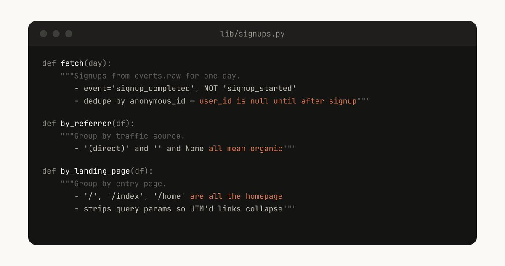

Claude can then generate scripts on the fly to compose this functionality to do more advanced analysis for prompts like “What happened on Tuesday?”

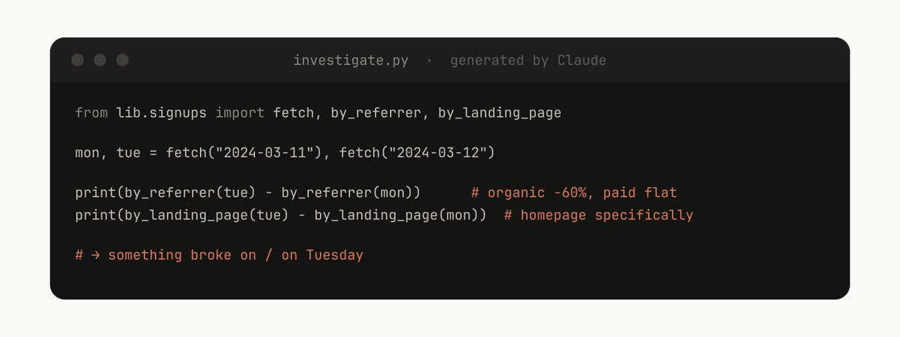

## On Demand Hooks

Skills can include hooks that are only activated when the skill is called, and last for the duration of the session. Use this for more opinionated hooks that you don’t want to run all the time, but are extremely useful sometimes.

For example:

- /careful — blocks rm -rf, DROP TABLE, force-push, kubectl delete via PreToolUse matcher on Bash. You only want this when you know you're touching prod — having it always on would drive you insane

- /freeze — blocks any Edit/Write that's not in a specific directory. Useful

- when debugging: "I want to add logs but I keep accidentally 'fixing' unrelated

# Distributing Skills

One of the biggest benefits of Skills is that you can share them with the rest of your team.

There are two ways you might to share skills with others:

- check your skills into your repo (under ./.claude/skills)

- make a plugin and have a Claude Code Plugin marketplace where users can upload and install plugins (read more on the [documentation](https://code.claude.com/docs/en/plugin-marketplaces) here)

For smaller teams working across relatively few repos, checking your skills into repos works well. But every skill that is checked in also adds a little bit to the context of the model. As you scale, an internal plugin marketplace allows you to distribute skills and let your team decide which ones to install.

## Managing a Marketplace

How do you decide which skills go in a marketplace? How do people submit them?

We don't have a centralized team that decides; instead we try and find the most useful skills organically. If you have a skill that you want people to try out, you can upload it to a sandbox folder in GitHub and point people to it in Slack or other forums.

Once a skill has gotten traction (which is up to the skill owner to decide), they can put in a PR to move it into the marketplace.

A note of warning, it can be quite easy to create bad or redundant skills, so making sure you have some method of curation before release is important.

## Composing Skills

You may want to have skills that depend on each other. For example, you may have a file upload skill that uploads a file, and a CSV generation skill that makes a CSV and uploads it. This sort of dependency management is not natively built into marketplaces or skills yet, but you can just reference other skills by name, and the model will invoke them if they are installed.

## Measuring Skills

To understand how a skill is doing, we use a PreToolUse hook that lets us log skill usage within the company ([example code here](https://gist.github.com/ThariqS/24defad423d701746e23dc19aace4de5)). This means we can find skills that are popular or are undertriggering compared to our expectations.

# Conclusion

Skills are incredibly powerful, flexible tools for agents, but it’s still early and we’re all figuring out how to use them best.

Think of this more as a grab bag of useful tips that we’ve seen work than a definitive guide. The best way to understand skills is to get started, experiment, and see what works for you. Most of ours began as a few lines and a single gotcha, and got better because people kept adding to them as Claude hit new edge cases.

I hope this was helpful, let me know if you have any questions.

### 🖼️ Attached Media

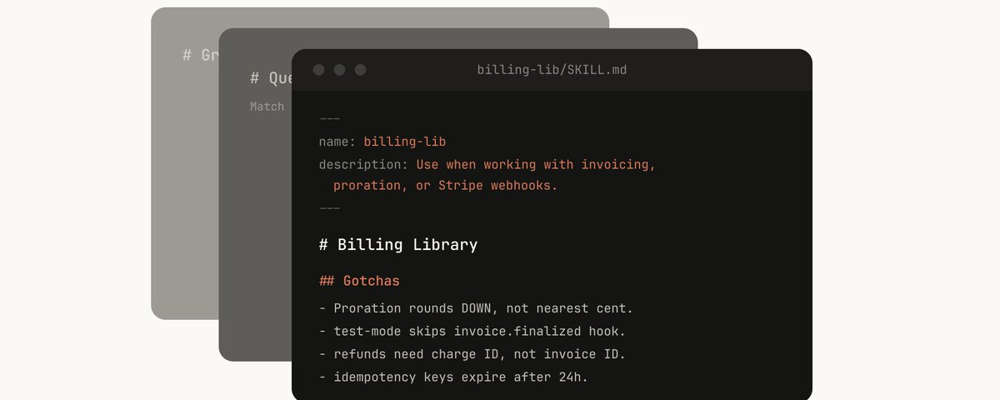

## 💬 Replies

### 1 @heynavtoor (Nav Toor)

*Tue Mar 17 18:01:27 +0000 2026*

@trq212 skills are one of those features that seem simple at first but completely change how you work with Claude Code once you set them up right

### 2 @berryxia (Berryxia.AI)

*Tue Mar 17 21:19:05 +0000 2026*

@trq212 @GoSailGlobal I want to translate it into Chinese for more people to see. Thank you, brother.

### 3 @heyNaitik (Naitik Mehta)

*Tue Mar 17 16:58:20 +0000 2026*

@trq212 One of my fav hacks has been to give skills a “last used” date, and have my Claudemd file audit all unused skills every 2 weeks. Keeps the skills list fresh and prevents it from bloating or overlapping skills!

### 4 @trq212 (Thariq) (Author)

*Tue Mar 17 17:06:34 +0000 2026*

@heyNaitik ohh thats really smart actually, do you do it programatically with a hook?

### 5 @chrislakin (Chris Lakin)

*Tue Mar 17 17:21:56 +0000 2026*

@trq212 How do you write these articles? Surely Claude helps, but also they never seem \_that\_ AI generated…? 

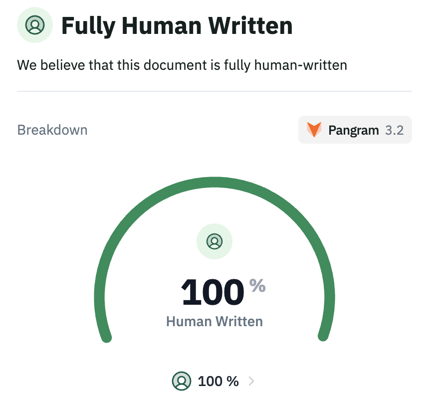

### 6 @trq212 (Thariq) (Author)

*Tue Mar 17 18:36:25 +0000 2026*

This one took me longer than most, I wrote it over 1.5 weeks (though obviously doing a lot more alongside).

Claude does a lot of research for me, e.g. it researched and categorized all our skills and helps generate a bunch of examples. I had it do a first pass which helps me structure my thought, but I think I threw out basically all of the copy for it.

It does generate all of the images, though I usually have it do multiple takes and I'll choose one.

As many have said, writing is an exploratory process that forces you to think and distill ideas. I try and only publish things where I feel like there are genuine insights, which can be tough. 

My friend @aadilpickle says when writing "You have nothing until you have everything". I think you can tell when you have something and I felt like I didn't have anything until like like a week into the process.

### 7 @zarazhangrui (Zara Zhang)

*Tue Mar 17 18:19:31 +0000 2026*

Thanks for the writeup! 
I noticed that the distribution & measurement of skill are all tailored towards internal use cases; what about public-facing/open source skills? I have built some skills but current there's no marketplace to distribute/monetize them, and no way for me to know how many people have used it

### 8 @trq212 (Thariq) (Author)

*Tue Mar 17 18:23:46 +0000 2026*

@zarazhangrui ty for feedback!

we are working on making it easier for community plugins to be surfaced, but agree there's not enough here yet (CC @noahzweben @dickson\_tsai )

### 9 @hamostaf04 (hamza mostafa)

*Tue Mar 17 17:16:05 +0000 2026*

very cool! i’m curious if you think you can get some of these skills (like runbook especially) for free via memory? i find that when i ask CC to debug/monitor logs on a project, it saves to memory the helpful commands and workflows, but that does not necessarily meet the definition of a skill per se - it just happens to recall exact workflow an execute very similarly

### 10 @trq212 (Thariq) (Author)

*Tue Mar 17 17:20:04 +0000 2026*

@hamostaf04 yeah for sure, some overlap I think there's some between the primitives, the benefit of skills is that you can make them user-invocable too, maybe I should add a section here

### 11 @aadilpickle (aadilpickle)

*Wed Mar 18 01:38:08 +0000 2026*

@trq212 bro impression mogged me ive never written anything close to this popular

### 12 @trq212 (Thariq) (Author)

*Wed Mar 18 01:42:10 +0000 2026*

@aadilpickle have you tried writing about agentic coding instead of like, the human condition

### 13 @Cascadia_AI (Jared Dunn)

*Tue Mar 17 17:29:37 +0000 2026*

@trq212 Ever since I got Claude. I spend more time reading things like this and not actually working on projects. I'm not all that bright and it makes my head hurt. Can you guys start making these into cartoons?

### 14 @trq212 (Thariq) (Author)

*Tue Mar 17 17:32:39 +0000 2026*

@Cascadia\_AI uhh

### 15 @luongnv89 (Luong NGUYEN)

*Tue Mar 17 17:57:21 +0000 2026*

great write up, thanks.

I feel there are still some missing/ or at least some problems we should address sooner or later:

\- versioning: when you and your college use the same skills in the same repo - but got different results

\- role/expert domain: idk how to call it out, but imagine you got a skill to analyze a data file, 2 different roles will likely want to see different point of view of the data.

\- owner/category: soon we will have many duplicated skills. design skill from Anthropic, design skill from google, etc. model will be confused, and you still want to keep them all in your skill set.

\- evaluation: this is kind of tricky, how can we say design skill from google is better the design skill from Anthropic.

\- a proper agent skill manager: for audit, install, uninstall, versioning, etc. I am working on my own version (cli & tui: [github.com/luongnv89/agen…](https://github.com/luongnv89/agent-skill-manager)).

### 16 @trq212 (Thariq) (Author)

*Tue Mar 17 18:03:55 +0000 2026*

@luongnv89 these are helpful questions, will think more on it- thank you!

### 17 @LostSynthCat (LostSynthCat)

*Tue Mar 17 17:30:51 +0000 2026*

@trq212 Can you please write blog posts instead of X articles

### 18 @trq212 (Thariq) (Author)

*Tue Mar 17 17:32:09 +0000 2026*

@LostSynthCat we'll move them to the blog, I'm sorry haha

### 19 @Gerry (gerry🗯)

*Tue Mar 17 17:55:53 +0000 2026*

@trq212 @RLanceMartin Hey you should publish these off platform too

### 20 @trq212 (Thariq) (Author)

*Tue Mar 17 17:56:16 +0000 2026*

@Gerry @RLanceMartin working on it

### 21 @eatpraydiehard (easy e)

*Tue Mar 17 16:56:46 +0000 2026*

@trq212 do you guys use mostly subagents w/ skills or skills that launch subagents? feels like there is a lot of overlap between the two patterns

### 22 @trq212 (Thariq) (Author)

*Tue Mar 17 17:07:05 +0000 2026*

@eatpraydiehard yeah agree, we could simplify, I think we use both patterns as needed

### 23 @__rmrf (rmrf)

*Tue Mar 17 17:59:56 +0000 2026*

@trq212 How to handle sensitive keys in Skills though?

### 24 @trq212 (Thariq) (Author)

*Tue Mar 17 18:00:39 +0000 2026*

@\_\_rmrf ah this is a good point, I should add a section here

### 25 @aabyzov (Anton Abyzov)

*Tue Mar 17 18:14:36 +0000 2026*

@trq212 Also have you considered lazy loading of skills? 

When you realize that something that you have in the marketplace would boost the current project dev pace or maybe even a third party that you know is verified and reliable...

### 26 @trq212 (Thariq) (Author)

*Tue Mar 17 18:15:41 +0000 2026*

@aabyzov ah like skill search? that's cool, we haven't built it yet but you could... build a skill search skill

### 27 @GiladPeleg (Gilad Peleg)

*Wed Mar 18 07:04:34 +0000 2026*

@trq212 Looks like another category is needed for meta skill analysis/lint/review

### 28 @trq212 (Thariq) (Author)

*Wed Mar 18 07:13:38 +0000 2026*

@GiladPeleg oh yes actually agree

