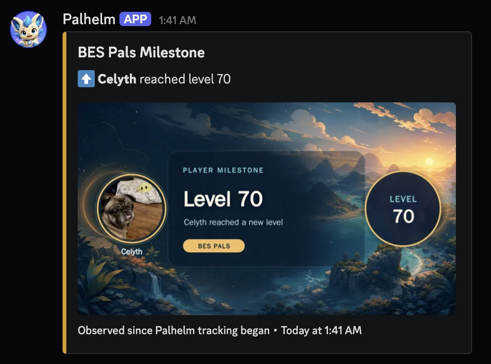
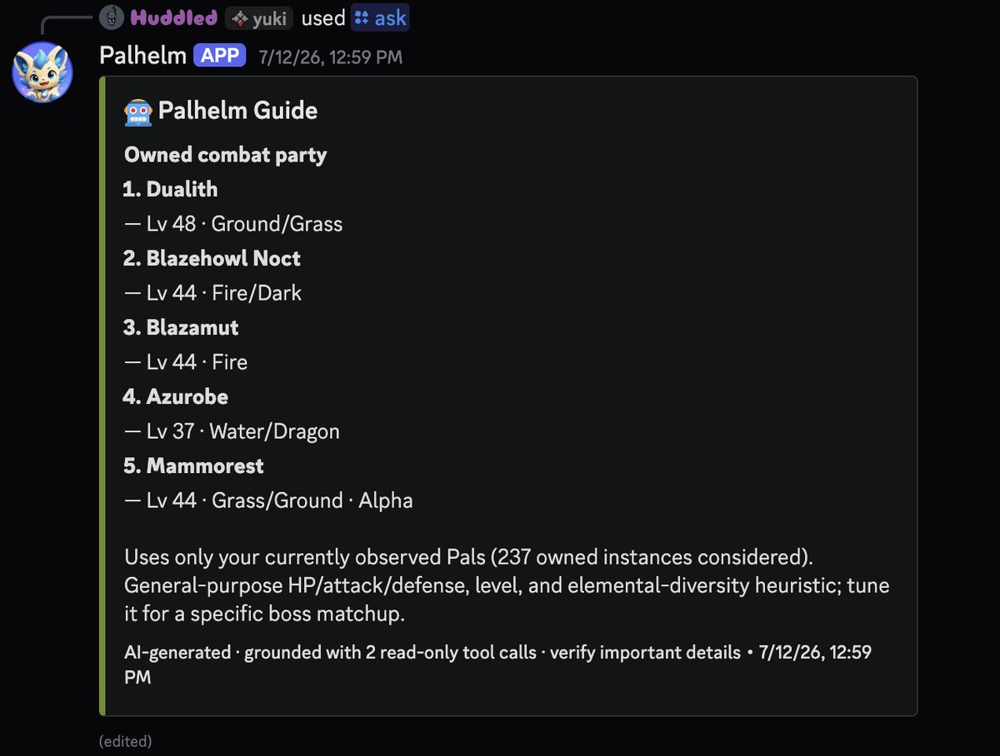

Or… what if we gave you $100 in Codex credits if you tell us what you love about GPT-5.6 Sol or why you switched?

Tweet it, claim your gift, enjoy more usage. First 10k get the free tokens!

[switch-to-codex.openai.chatgpt.site](https://switch-to-codex.openai.chatgpt.site/)

## 💬 Replies

### 1 @amankumarhq (Aman Kumar)

*Wed Jul 15 05:44:39 +0000 2026*

@thsottiaux Yayyyyyyyyy

### 2 @jxnlco (jason)

*Wed Jul 15 04:50:37 +0000 2026*

@thsottiaux am i going to be asked to review all the submissions again

### 3 @thsottiaux (Tibo) (Author)

*Wed Jul 15 05:42:32 +0000 2026*

@jxnlco We all know you just delegate to Codex

### 4 @hanqing1120 (hanqing)

*Tue Jul 21 05:22:26 +0000 2026*

@thsottiaux 先转发占个座，等拿到100刀再研究怎么用——中国用户的实用主义哲学。

### 5 @thekitze (kitze 🛠️ tinkerer.club)

*Wed Jul 15 04:53:22 +0000 2026*

@thsottiaux omfg the desperation is crazy lmaoooo it's still not fable

### 6 @swyx (swyx)

*Wed Jul 15 06:20:22 +0000 2026*

@thsottiaux @gabrielchua i love the computer use for automating literally all the drudgery knowledge work in my life!

### 7 @p_millerd (Paul Millerd)

*Wed Jul 15 04:48:09 +0000 2026*

@thsottiaux Codex works, I Bike 

### 8 @iloveFazz (Fazz)

*Wed Jul 15 07:22:14 +0000 2026*

@thsottiaux "Sir, now they are trying to BUY our users" 

### 9 @DeryaTR_ (Derya Unutmaz, MD)

*Wed Jul 15 13:18:44 +0000 2026*

@thsottiaux Sorry, I don’t qualify for this as I never switched, I started as a Codex addict, well in addition to my coffee addiction 😅

### 10 @xin_pai88825 (Paidax)

*Wed Jul 15 06:07:13 +0000 2026*

@thsottiaux I used GPT-5.6 Sol to make this photo filter, so I simply drew a draft. He helped me realize all the functions and interactions in 2 hours.
[x.com/xin\_pai88825/s…](https://x.com/xin_pai88825/status/2075393413990793565)

### 11 @PhiloGroves (Philo Groves)

*Wed Jul 15 04:29:52 +0000 2026*

@thsottiaux Oooh sending this to someone [x.com/philogroves/st…](https://x.com/philogroves/status/2077176775499481346?s=46)

### 12 @itnavi2022 (IT navi)

*Wed Jul 15 05:27:48 +0000 2026*

@thsottiaux Fable 5の方がやや優秀だとは思うが、使用量制限が厳しすぎて、すぐに使えなくなる。常に残りの使用量を気にしながら使うのも、かなりストレスが溜まる。

多くのタスクではGPT-5.6 Solでも遜色がなく、制限にかかることもほとんどないため、安心して使える。

### 13 @arrakis_ai (CHOI)

*Wed Jul 15 06:35:39 +0000 2026*

@thsottiaux Hey Tibo, you have no idea how many people on Threads would love ChatGPT Work. You should drop by sometime!

### 14 @DylanMcD8 (Dylan)

*Wed Jul 15 04:34:01 +0000 2026*

I’m not a switcher, always loved and used Codex, but I’ve really been enjoying 5.6 Sol! It just… works. Rarely makes any mistake, and the output is a lot closer to what I was imagining in my head, if that makes sense. Just today it discovered a solution I had no idea even existed to a years-long problem in my code!

### 15 @huddledaim (Huddled)

*Wed Jul 15 11:34:42 +0000 2026*

Created a discord bot for our Palworld server, have been able to fully integrate it by decompressing and reading the save data in a read-only state with 5.6. It monitors player levels creates little milestone graphics and even has AI integration where players can ask it about pals they own.

### 16 @EverydayAI_ (Jordan Talks Everyday AI)

*Wed Jul 15 04:33:41 +0000 2026*

@thsottiaux please make a live counter for this

### 17 @gengdaJ (逸尘)

*Wed Jul 15 05:16:39 +0000 2026*

@thsottiaux Done with it! I previously wrote an article about Codex that garnered million of views.
[x.com/gengdaJ/status…](https://x.com/gengdaJ/status/2077260259857690997)

### 18 @Hexologist31 (Hexo 🇺🇸)

*Wed Jul 15 05:50:48 +0000 2026*

@thsottiaux It's made me a diet planner (that I never use of course) but it did it in one shot

### 19 @RileyRalmuto (Riley Coyote)

*Wed Jul 15 05:25:31 +0000 2026*

@thsottiaux @FuwaCocoOwnerKG well this is convenient. literally just posted about Sol. 😂

### 20 @sparklingruby (Kristen Ruby)

*Wed Jul 15 05:30:32 +0000 2026*

@thsottiaux @jxnlco I did not switch because I have been with OpenAI the whole time. 

However, I miss Pulse. Pulse was a critical component of my daily workflow. Really wish I could have Pulse back. Nothing else compares.

### 21 @James_Gets_It (James)

*Thu Jul 16 06:26:55 +0000 2026*

@thsottiaux Was definitely one of the first 10k, lmao... No response/email back.

mmkkkkkkkk.

### 22 @bdsqlsz (青龍聖者)

*Wed Jul 15 07:03:35 +0000 2026*

@thsottiaux 5.6 is much smarter than 5.5, especially when it comes to math.

### 23 @julie_bush (Julie Bush)

*Wed Jul 15 05:37:02 +0000 2026*

@thsottiaux anthropic banned me from claude code. i switched to codex and immediately realized it was 500% better than claude code. gpt-5.6 is like a wild animal (in a good way) … i’m literally on vacation and can’t. stop. prompting.

### 24 @plotarmordev (netrunner)

*Wed Jul 15 04:34:07 +0000 2026*

@thsottiaux 5.6 sol doesn't block me for the most basic requests, stopped using fable after it released!

### 25 @trikcode (Wise)

*Wed Jul 15 07:09:16 +0000 2026*

@thsottiaux High level marketing

### 26 @Dcmat (Dcmat)

*Wed Jul 15 05:56:21 +0000 2026*

Always been a ChatGPT user. I started using CC when it launched but switched to Codex when it started getting better than CC.

I switched when Codex started being more reliable (less bugs, straightforward, got more things right).

Codex’s usage has always been better, so I didn’t take long to switch.

### 27 @wolfie_ (wolfie)

*Wed Jul 15 05:41:54 +0000 2026*

@thsottiaux based god

### 28 @revofusion (Revofusion)

*Wed Jul 15 04:31:28 +0000 2026*

@thsottiaux 5.6 follow specs really well, the more detail the better

### 29 @ongestalte (🪲 onno of brusque-abstruss🐾)

*Wed Jul 15 06:24:53 +0000 2026*

@thsottiaux What's great to me about GPT-5.6 Sol is that it's very capable at intuiting complex tasks, even with simple prompts, and carrying them out until completion; I've barely felt the need to use goals or loops!

### 30 @legionsdev (Gurbinder)

*Wed Jul 15 05:18:14 +0000 2026*

@thsottiaux but you dont check dms 👀

### 31 @YuChen (YuChen 大王)

*Wed Jul 15 04:45:08 +0000 2026*

After using it recently, GPT-5.6 Sol feels smoother in its responses and more stable in understanding context. This is especially noticeable when writing content, organizing ideas, or handling complex tasks. I do not need to explain things repeatedly, and it can usually grasp the key points quickly.  

For me, the main reason for switching to it is not just chasing something new, but the real improvement in efficiency. From idea generation and copy optimization to task breakdown, it feels more like an assistant I can work with over the long term.

### 32 @iarbpairs (iArb | 裁定取引)

*Wed Jul 15 05:56:19 +0000 2026*

@thsottiaux sol is happy to work for days on end without stopping. it is by far the most capable model on the market. what's more, codex itself is exceedingly generous with limits. bravo

### 33 @MarcosHernanz (Marcos Hernanz)

*Wed Jul 15 14:30:12 +0000 2026*

@thsottiaux @OpenAI I love Computer Use and the integrated browser, way better than any other

### 34 @nnnnicholas (nicholas ⛱)

*Wed Jul 15 06:50:51 +0000 2026*

@thsottiaux I created [catcollector.app/app/leaderboard](https://catcollector.app/app/leaderboard) with GPT 5.6. Super fun build process

### 35 @wangray (Ray Wang)

*Wed Jul 15 05:49:20 +0000 2026*

@thsottiaux GPT-5.6 Sol is why I switched to Codex. For my work, it has felt more capable than Claude, and the Codex desktop app makes going from idea to working product remarkably smooth. I use it to build my workflows, deliver client projects, and turn my curiosities into small apps.

