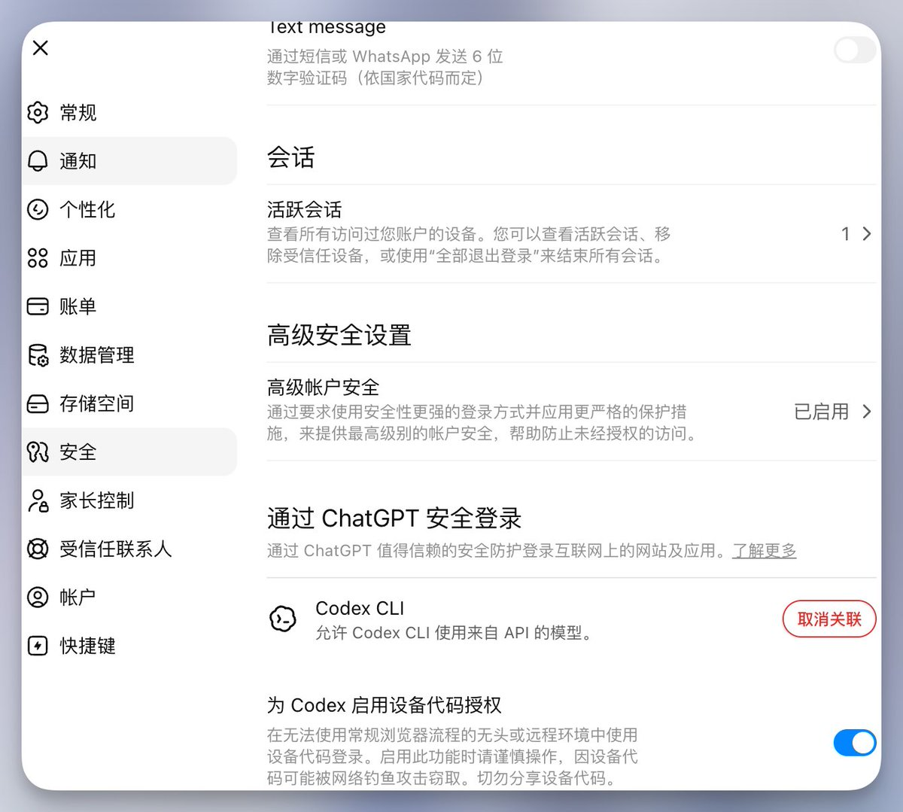
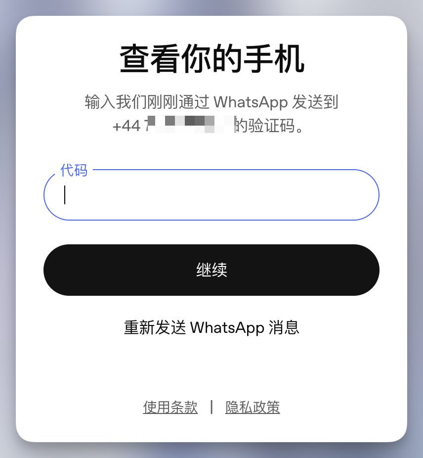

我自己的ChatGPT账号，登录codex的时候，基本都遇到了二次手机号验证，注意，是第二次手机号验证，设置了以后，都解决了呀，现在登录没有在让我验证手机号的情况，我发了教程以后，每个账号都退出再登录，很丝滑！

[x.com/tigeryan718/st…](https://x.com/tigeryan718/status/2061534208926102003?s=20)

## 💬 Replies

### 1 @tigeryan718 (Tiger) (Author)

*Tue Jun 02 03:53:41 +0000 2026*

### 2 @tigeryan718 (Tiger) (Author)

*Wed Jun 03 02:45:10 +0000 2026*

[x.com/tigeryan718/st…](https://x.com/tigeryan718/status/2062002381953605713?s=46)

### 3 @aaa1432528 (GPTUser)

*Tue Jun 02 02:34:39 +0000 2026*

@tigeryan718 闭嘴吧 屌用没有

### 4 @Bulimaole (Rowan)

*Tue Jun 02 05:28:33 +0000 2026*

@tigeryan718 能登录进去，就是用不了API,大家直接用CC转吧用deepseek的模型

### 5 @samxqu8 (sam)

*Tue Jun 02 10:17:18 +0000 2026*

@tigeryan718 6月2号，18点，亲测不信了，大家还是老实准备卡吧，还是谢谢老师的分享

### 6 @liu360567 (book or technique)

*Tue Jun 02 09:36:05 +0000 2026*

@tigeryan718 Works like a charm now! 
Had me sweating there for a bit. 
Your fix is a lifesaver, thanks for sharing.

### 7 @abtcstorm (风清扬)

*Tue Jun 02 03:59:27 +0000 2026*

@tigeryan718 哥，你这是损害了一些人的利益啊，他们当然要污蔑你

### 8 @apliuq (雾中行)

*Tue Jun 02 03:42:57 +0000 2026*

@tigeryan718 不行不行，这么好的东西，我要搬走😂

### 9 @yirancrypto (亦然)

*Tue Jun 02 04:19:54 +0000 2026*

@tigeryan718 不管有没有用 半夜3点多写出来分享给大家就已经很值得点赞了👍

### 10 @zzzkl (zzzkl)

*Tue Jun 02 08:15:26 +0000 2026*

@tigeryan718 没用，开了一样要验证，用了好几年的号了，几年前自己的 giffgaff，但是搞丢了，号也废了 

### 11 @lyj1115 (Linker)

*Tue Jun 02 05:34:54 +0000 2026*

@tigeryan718 我在添加两种安全方式这里就报错了，说我未知错误

### 12 @FrankWa24055392 (luminecs)

*Tue Jun 02 04:00:18 +0000 2026*

@tigeryan718 如果是第一次手机号验证呢？有效吗？

### 13 @li_side666 (side li)

*Tue Jun 02 07:47:40 +0000 2026*

@tigeryan718 实际测试就算加了 mfa 也会触发二次验证

### 14 @heywenxi (文西)

*Tue Jun 02 08:21:15 +0000 2026*

@tigeryan718 免费体验1个月的账号，使用codex 的时候还是会发.

### 15 @njetflixx (DIZZY)

*Tue Jun 02 07:23:15 +0000 2026*

@tigeryan718 Not working for me at all. Tested on 3 accounts

### 16 @muzhi1991study (SparseMind)

*Tue Jun 02 04:25:25 +0000 2026*

@tigeryan718 我试了没用的 chatgpt 登录可以，codex 还是要输入 WhatsApp 的验证码😂

### 17 @Csy552537629835 (Csy)

*Mon Jul 06 05:26:50 +0000 2026*

@tigeryan718 第一次遇到二次验证的时候，怎么操作都不行，等了两天自己好了 各种高级认证都开了 结果今天突然又要二次认证

### 18 @MengmengW49082 (mengmeng wang)

*Tue Jun 02 17:07:49 +0000 2026*

@tigeryan718 一次也没认证过的应该不行我试过了？还有就是认证过的现在需要认证可以吗？

