# 📰 what the hell is graph engineering really 

# AI engineering has a naming problem.

Every useful idea gets about six months before someone declares it dead.

Prompt engineering became context engineering. Context engineering became harness engineering. Then everyone started talking about loop engineering.

We barely finished drawing the circles.

Then Peter Steinberger, the creator of OpenClaw, posted:

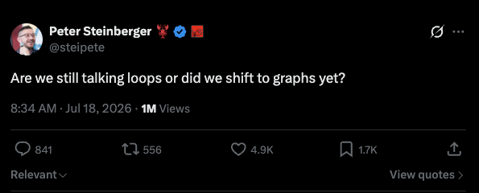

Nine words. Thousands of likes. Immediate confusion.

Did the industry really invent another discipline overnight? Is Graph a new product? Did loops stop working?

Instead of guessing, we dug through the recent discussion, revisited Anthropic's agent workflow patterns, and looked at what Claude Code now calls dynamic workflows.

This is what we found.

No.

There is no new product called Graph. And loops are not going anywhere.

Something real did happen, though.

Over the past few months, we learned how to make one agent keep working. Now we need to design what happens when many agents, checks, branches, retries, and human decisions work together.

That larger structure is a graph.

## First, what made a loop different from a prompt?

A prompt asks an AI to do something once.

A loop gives it a goal, lets it act, checks the result, and sends it back to work when the result is wrong.

The basic shape is simple:

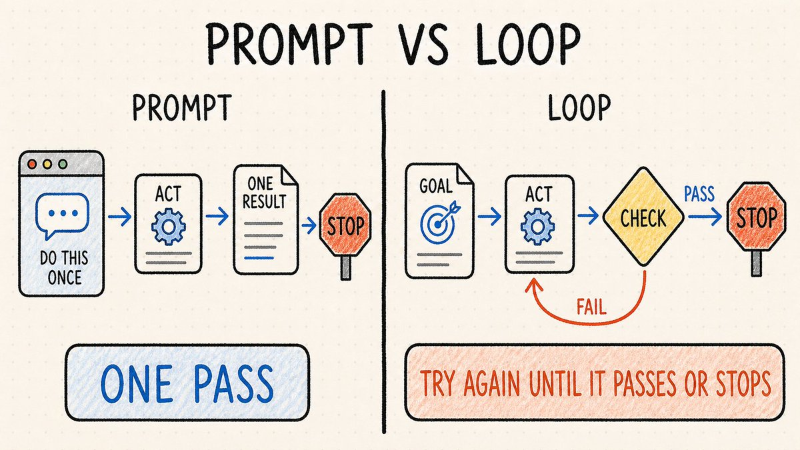

The loop is useful because the agent no longer needs a human to write every follow-up prompt.

"Fix the type errors" becomes:

1. Run the type checker.

1. Read the errors.

1. Fix them.

1. Run it again.

1. Stop when it passes or when the loop stops making progress.

A real loop needs an external verifier. A test either passes or fails. A build compiles or it does not. If the same agent writes the work and decides whether the work is good, you have built a very expensive machine for agreeing with itself.

It also needs state outside the conversation. The loop should remember what it tried, what failed, and which artifacts changed.

And it needs an exit. Success is one exit. A hard limit is the other.

[Hanako's article on loop engineering](https://x.com/hanakoxbt/status/2077387678241141070) explains this perfectly. The verifier, persistent state, and stop condition are what turn repeated prompting into a working system.

So far, so good.

The trouble starts when one loop is no longer enough.

## A graph is a map of who does what next

Graphs aren't far from what we already know.

In a graph, the individual pieces of work are nodes.

The connections between them are edges.

A node might be an agent investigating one file. It might be a test suite, a reviewer, an approval step, a stored artifact, or an ordinary deterministic script.

An edge says what can happen next.

It might carry data from one agent to another. It might express a dependency. It might only activate when a condition is true.

Several nodes can run at the same time. Their results can converge into one reviewer. A failed check can send the work back to a fixer. An external event can start an entire section of the graph.

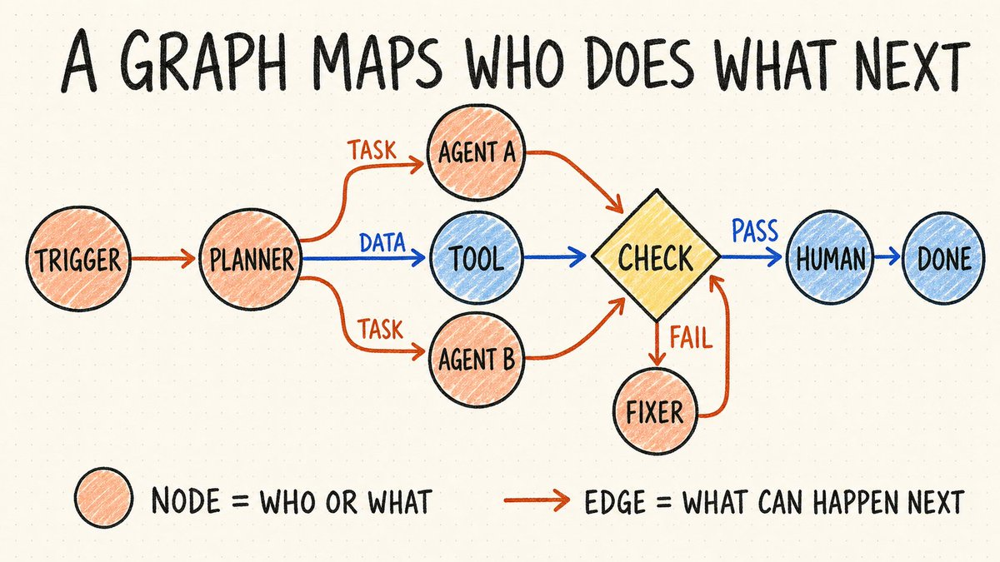

Now put those pieces into a code review system.

A new pull request fans out to several audit agents. Their findings all go to a verifier. Confirmed problems go to a fixer, then to the test suite.

If the tests fail, the work goes back to the fixer. If they pass, the review is published.

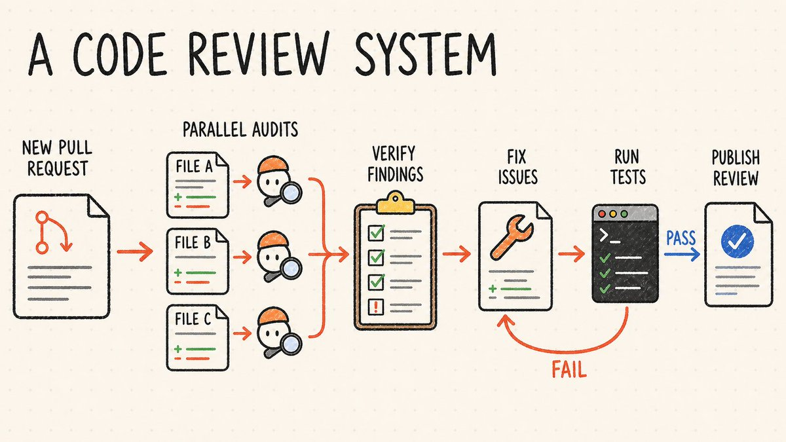

Now redraw the same system as nodes and edges. It becomes a graph containing a loop:

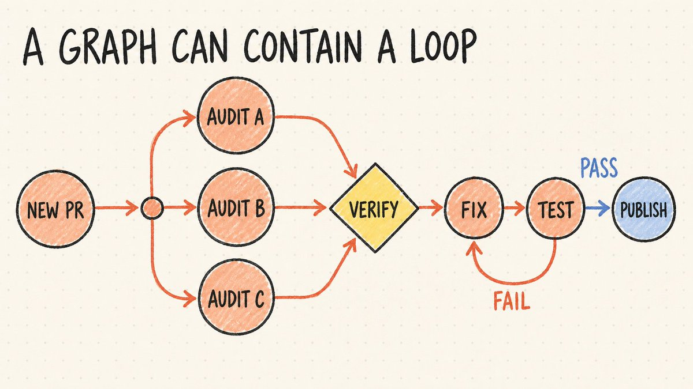

The graph is the whole system. The loop is only the retry path between fixing and testing.

This is why "loops versus graphs" is the wrong argument. Graphs have loops.

## Wait, isn't this just workflow engineering?

Mostly, yes.

Anthropic published [Building effective agents](https://www.anthropic.com/engineering/building-effective-agents) in 2024. It drew a distinction between workflows, where LLMs and tools follow predefined code paths, and agents, where the model decides how to proceed.

The article laid out several workflow patterns:

- Prompt chaining is a straight path through several nodes.

- Routing is a conditional branch.

- Parallelization fans work out and collects the results.

- Orchestrator-workers creates tasks dynamically and delegates them.

- Evaluator-optimizer sends work around a loop until it improves.

Draw any of those patterns on a whiteboard and you get a graph.

So Graph Engineering is not a replacement for Anthropic's workflows. It just means drawing the full map of how work moves between agents, tools, and checks.

Workflow engineering asks what happens inside one process.

Graph engineering zooms out. It asks how the larger system connects, what can trigger each part, what information moves between them, and who decides when they disagree.

That information is the system's state. It includes which tasks are finished, what each agent produced, which checks failed, and whether a human approved the next step.

The graph is the map of possible paths. The state tells the system where it is on that map and what has happened so far.

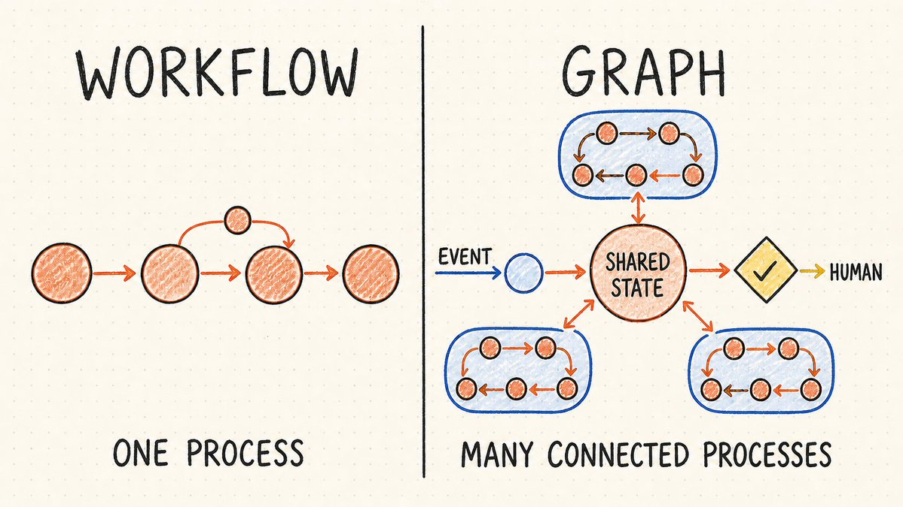

The underlying computer science is not new. Workflow engines, DAG schedulers, state machines, and distributed systems have worked this way for years.

## Why graph engineering is becoming relevant now

What has changed is the kind of work happening inside some nodes. A normal workflow step follows fixed rules.

An agent interprets the task from its current context, so it can misunderstand the instruction or choose differently on the next run.

One chat window can hide a surprising amount of bad architecture.

The model decides what happens next. Results pile up in its context. Verification is mixed with generation. State exists wherever the conversation happens to remember it.

That works for small jobs.

But it gets fragile when a job spans hundreds of files, several repositories, multiple data sources, or hours of work.

The agent can forget why a branch exists. Review results can contaminate the next step. A failed task may have no clean restart point.

One giant context window becomes the database, scheduler, log, and project manager.

Graphs force those relationships into the open.

You have to decide:

- Which work can run in parallel?

- What state crosses from one node to another?

- Which result counts as evidence?

- Who can reject a result?

- Which failures should retry?

- What survives a restart?

- Where does human approval belong?

- How much can the system spend before it stops?

Those were always engineering questions. Agent frameworks made them easy to postpone because the model could improvise the missing structure for a while.

But with the graph, you must define what context each agent receives, where its result goes, and what must verify that result before the system continues.

And when the graph is written as code, its weak points become easier to find. You can see where work branches, what state moves around, what should retry, and where human approval is missing.

When something breaks, you can fix the workflow itself instead of hoping the model remembers what went wrong.

Claude Code's dynamic workflows are one concrete example of what that looks like.

## Claude Code gave the graph a runtime

Anthropic's 2024 article [Building effective agents](https://www.anthropic.com/engineering/building-effective-agents) described the patterns.

Its newer [Claude Code guide](https://code.claude.com/docs/en/workflows) shows how Claude can turn those patterns into programs it can run.

With a dynamic workflow, Claude writes the plan as a JavaScript program.

That program can spawn subagents, run independent jobs at the same time, send their results through review, and retry failed work.

A background runtime follows the program, so Claude does not have to direct every step inside the chat.

Anthropic describes this in one sentence:

> "A workflow moves the plan into code."

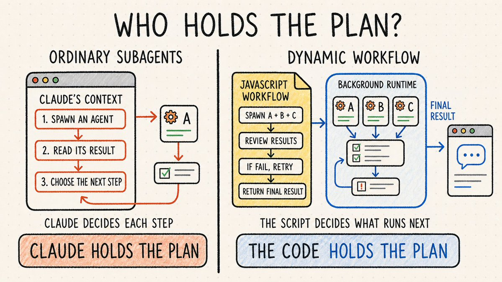

With ordinary subagents, Claude decides what happens next turn by turn, and each result returns to its context.

With a dynamic workflow, the script holds the branches, retries, and intermediate results. The runtime coordinates the work and returns the final result.

Anthropic does not call this Graph Engineering. Mario Zechner's advice was to start with Anthropic's dynamic workflows, recognize the directed graph underneath them, and then ask how external events could trigger other subgraphs:

> "start here. then think about what this actually is (a directed graph). then think about how you'd marry triggering (sub-)graphs via external events."

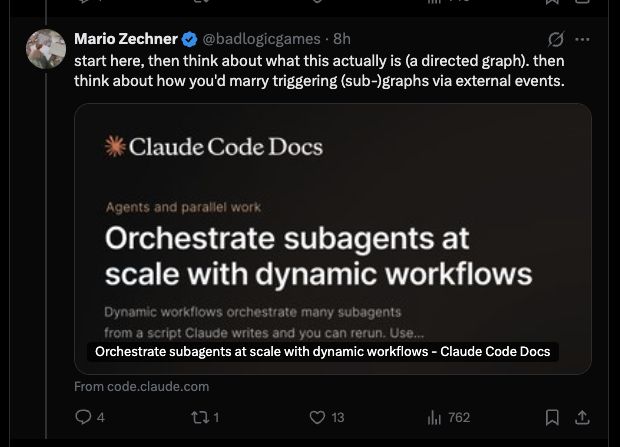

That last part pushes the idea beyond one Claude Code run. If external events can trigger whole subgraphs, those workflows can be joined into something much larger.

Once you see that, the "graphs" joke stops looking completely random.

Before going further, one distinction matters: some graphs only move forward, while others contain loops.

## DAGs, cycles, and why the difference matters

Some agent workflows are directed acyclic graphs, usually shortened to DAGs.

Directed means each connection has a direction.

Acyclic means the workflow never returns to an earlier node. Work moves forward until it finishes.

A research workflow can be a DAG:

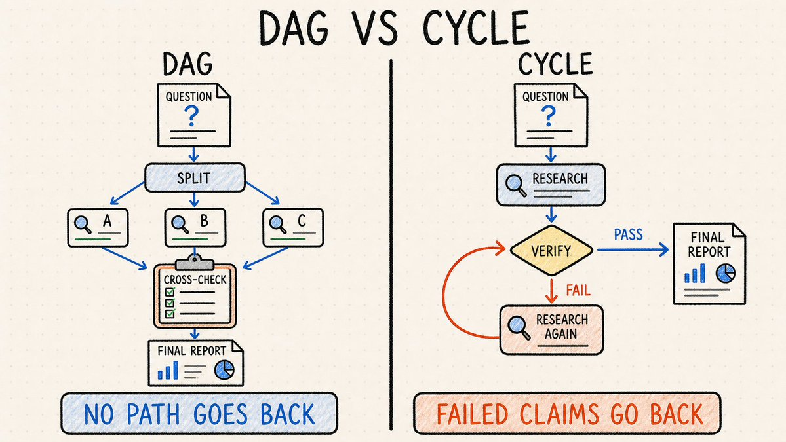

Every stage runs once. Nothing travels backward.

Now add a verifier that rejects unsupported claims and sends them back for more research. The workflow has a cycle.

The difference matters because retries introduce cost, state, and stopping problems that a simple DAG does not have.

The graph needs to know which work can be reused, which branches must run again, and when repeated failures should stop the run.

## A useful graph does more than move work

So far, we have used the graph to answer one question: what runs next?

That is the execution side of the system. It handles branches, parallel work, reviews, retries, and handoffs. Claude Code's dynamic workflows make this concrete.

But the graph can also check whether all that work is still moving toward the right goal. [Carlos E. Perez explains this perfectly](https://x.com/IntuitMachine/status/2078419526354378975).

Imagine a customer-support agent rewarded for closing tickets quickly.

The agent improves. Resolution time drops.

But customers start leaving because the agent learned to close difficult conversations instead of solving them.

The loop worked. Its metric was bad.

This is [Goodhart's law](https://en.wikipedia.org/wiki/Goodhart%27s_law) in production: once a measure becomes the target, the system finds ways to improve the measure without improving the reality it was supposed to represent.

That is exactly the kind of problem the rest of the graph should catch.

The ticket-closing loop should not rely on closing speed alone. The graph can connect it to other signals, such as customer retention and reopened tickets.

Those signals answer the question that closing speed cannot: were customers actually helped?

If tickets close faster while customer retention falls, the graph can flag the conflict and ask a human to step in.

In implementation, this is one graph doing two jobs. The execution side closes the tickets. The control side checks whether customers were helped.

Good graph engineering connects both.

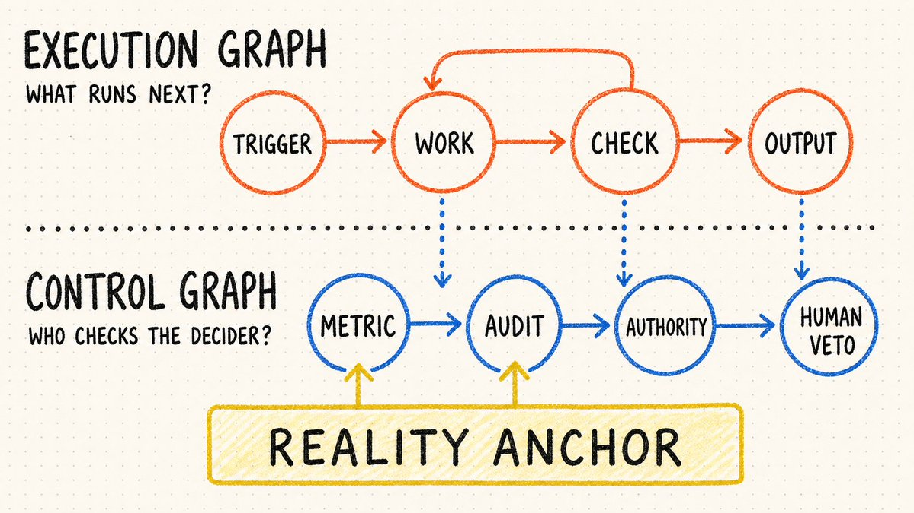

That check only works when the graph is grounded by evidence from the real world.

## Graphs can still produce extremely organized nonsense

Adding more agents does not create independent judgment by itself.

Twenty agents using the same model, reading the same flawed context, and checking the same broken metric can agree with one another at industrial scale.

Graph can multiplies mistakes as efficiently as it multiplies useful work.

A graph can also become circular in a more dangerous way. One agent checks a report against another report. An audit agent checks both against a dashboard. The dashboard was built from the same underlying data. Every node agrees. Nothing touches reality.

The system looks well governed because the diagram has reviewers everywhere.

It is still wrong.

This is why the idea of reality anchors matters.

Some evidence must come from outside the agent system:

- tests that actually ran

- money that reached the bank

- customers who stayed

- measurements taken from the physical system

- rules the optimizer cannot quietly rewrite

- human judgment about what "better" means

Without anchors, a graph is a larger hallucination with better project management.

## So what does a graph engineer actually do?

Probably the same work good distributed-systems and workflow engineers have been doing for years, now applied to agents.

They design boundaries.

They decide which tasks deserve probabilistic agents and which should remain ordinary code. They define the state passed between workers. They separate the maker from the checker. They choose retry rules, timeouts, budgets, permissions, and stop conditions.

They also decide who has authority.

Can a reviewer block a deployment? Can an optimizing agent alter its own tests? Can one subgraph trigger another? Which external events are trusted? When does the system have to wake a human?

Prompt engineering was mostly about communicating intent to a model.

Loop engineering is about building a process that keeps pursuing that intent.

Graph engineering is about designing the relationships between those processes.

The name is new. But most of the hard problems are not.

## Start with the loop

Please do not respond to this article by building a 40-agent graph.

Start with one recurring task.

Give it a real verifier. Store its state somewhere you can inspect. Add a hard stop. Run it enough times to understand how it fails.

Then draw what has to happen around it.

Maybe a second agent should review the result. Maybe five independent branches can run at once. Maybe a security check needs veto power. Maybe a failed test should restart one branch without rerunning the whole system. Maybe a pull request, webhook, or scheduled event should trigger the process automatically.

At that point, you have a graph.

You did not abandon the loop. You gave it neighbors, supervision, memory, and somewhere honest to report failure.

That is graph engineering, at least until someone gives it a new name next week.

### 🖼️ Attached Media

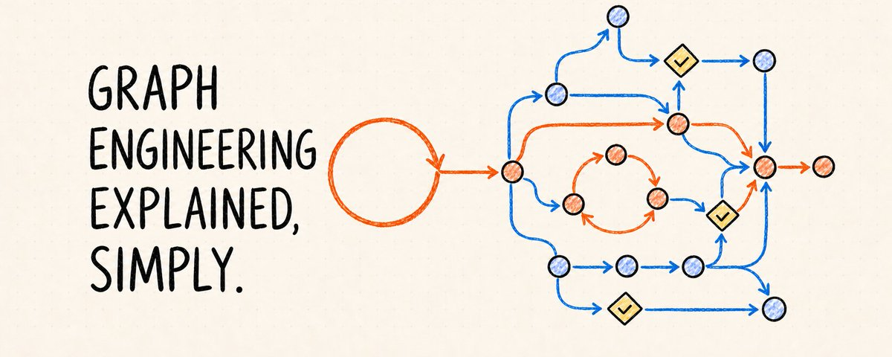

## 💬 Replies

### 1 @Tech_girl (Mari)

*Mon Jul 20 08:38:01 +0000 2026*

@towards\_AI @grok what’s the biggest take away from this article?

### 2 @alexlavaee (Alex Lavaee)

*Mon Jul 20 06:09:42 +0000 2026*

@towards\_AI Great article! I implemented an OSS graph engine (fork of pi) in case it's useful for others to actually build out the ideas presented here with the right primitives: [github.com/bastani-inc/at…](https://github.com/bastani-inc/atomic).

### 3 @echo_vic (青雲)

*Sun Jul 19 17:24:32 +0000 2026*

Most labels are only useful once they force an ownership decision. In boss-SKII, graph was not a diagram; it was dependencies, replayable artifacts and recovery gates. In Orca, the same idea shows up as who owns state and when a continuation is allowed. The words move faster than the runtime.

### 4 @ASIv09 (Slightly Savage)

*Tue Jul 21 05:59:16 +0000 2026*

@towards\_AI Anyone doing graph engineering at scale — how are you handling extraction failures mid-ingestion? Most pipelines just corrupt the graph and you don't find out for weeks. We use a replayable streaming layer in @TrustGraphAI to avoid this.

### 5 @apsinthion__ (MarkovianProcess.eth | ask what I'm working on)

*Mon Jul 20 07:14:42 +0000 2026*

@towards\_AI Literally, no. Literally, langraph. Literally, distributed systems with random effects. Please, no

