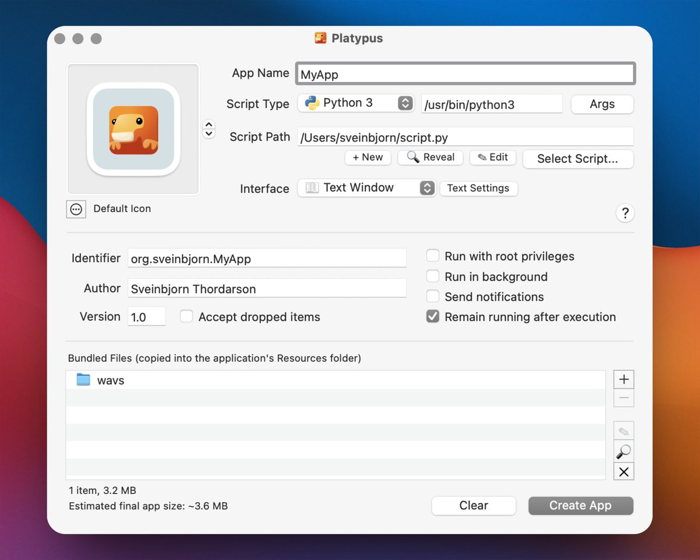

假如你想把一个命令脚本变成一个原生的 Mac 应用，可以试试 Platypus 这个工具，很简单配置一下就可以打包出来，基本够用，这样你可以很方便把你写的命令行工具分享给到不懂技术的小伙伴使用，PS 他的 Logo 我很喜欢。
[sveinbjorn.org/platypus](https://sveinbjorn.org/platypus) 

## 💬 Replies

### 1 @frank_mupt (Frank)

*Thu Oct 02 03:26:28 +0000 2025*

@HiTw93 收藏了  出了 cli 命令之外运行环境配置可能也是一个大门槛

### 2 @HiTw93 (Tw93) (Author)

*Thu Oct 02 03:33:41 +0000 2025*

@Spades317 是的，其实很方便给到不懂技术的人分发使用

### 3 @lhfflb (Phil)

*Tue Nov 04 21:20:18 +0000 2025*

@HiTw93 这个是不是可以帮助小白，一键部署开源项目

### 4 @LingJingMaster (Ling_Jing)

*Wed Oct 01 04:56:42 +0000 2025*

@HiTw93 @readwise save thread

### 5 @to_na_do (Tonado)

*Wed Oct 01 05:57:48 +0000 2025*

@HiTw93 感觉会很有用，但是竟然没有想到具体的场景

### 6 @daemonzhang6 (Art Lab)

*Wed Oct 01 01:02:43 +0000 2025*

@HiTw93 Nice

### 7 @menmer0859 (haom3ng)

*Wed Oct 01 02:56:28 +0000 2025*

@HiTw93 你真的是个宝藏(๑乛◡乛๑)

### 8 @avtopos (avtopos)

*Wed Oct 01 14:03:44 +0000 2025*

@HiTw93 还可以试试系统自带的automator，挺强大的

### 9 @dfwfreeman (达福散人)

*Thu Oct 02 03:40:56 +0000 2025*

@HiTw93 Mac自带Automator 也可以

