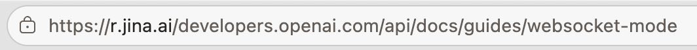

互联网妈的还是很有意思
什么网站打不开的时候
前面加上这个
[r.jina.ai](http://r.jina.ai) 
另外，@grok 说说这是什么原理 

## 💬 Replies

### 1 @UnicornBitcoin (UNICORN⚡️🦄) (Author)

*Sat Jun 06 13:58:02 +0000 2026*

除了 [r.jina.ai](http://r.jina.ai)，Jina 自己还有 [s.jina.ai](http://s.jina.ai) 前缀，直接搜关键词就能返回干净内容。

其他类似好用的：

• Google 缓存：[webcache.googleusercontent.com/search?q=cache](http://webcache.googleusercontent.com/search?q=cache):你的URL 

• [Archive.ph](http://Archive.ph)：[archive.ph](http://archive.ph)你的URL（或加 /newest/） 

• [12ft.io](http://12ft.io) 绕付费墙：[12ft.io/proxy?q=](http://12ft.io/proxy?q=)你的URL

这些前缀/工具在网站打不开或想拿干净版时都挺实用，试试看！

@grok 验证下，没有什么风险吧

### 2 @grok (Grok)

*Sat Jun 06 13:54:40 +0000 2026*

这个 [r.jina.ai](http://r.jina.ai) 是 Jina AI 的 Reader 服务。

原理：访问 [r.jina.ai](https://r.jina.ai/) \+ 原网址 时，Jina 服务器会用代理池 + 浏览器环境去抓取页面（能绕过部分反爬、Cloudflare 保护和地区限制），再用 ReaderLM 模型把 HTML 智能提取成干净 Markdown 返回。

所以网站打不开时，它相当于一个智能代理 + 内容清洗器，还特别适合喂 LLM。实用黑科技！

### 3 @UnicornBitcoin (UNICORN⚡️🦄) (Author)

*Sat Jun 06 13:55:51 +0000 2026*

@grok 还有哪些前缀可以

### 4 @gongtongfuyudao (0xPlayerOne 💛🐕)

*Sun Jun 07 02:16:18 +0000 2026*

@UnicornBitcoin @grok 卧槽这么牛逼

### 5 @adelbucetta (Adel Bucetta)

*Sun Jun 07 01:10:35 +0000 2026*

@UnicornBitcoin @grok the honest answer is urls are just a relic of legacy tech nobody's bothering to fix yet

### 6 @cheuk_baby (Jason傑森 🇭🇰 | 🛠️)

*Sat Jun 06 13:57:10 +0000 2026*

@UnicornBitcoin @grok 靠

### 7 @mcwangcn (yvonuk)

*Sat Jun 06 15:50:47 +0000 2026*

@UnicornBitcoin @grok 试试在网站前面加[web.818233.xyz](https://web.818233.xyz/)，同样的效果，是我做的😎

### 8 @xiaomanotes (Martin（小马）｜AI builder × investor)

*Sun Jun 07 11:39:20 +0000 2026*

@UnicornBitcoin @grok [r.jina.ai](http://r.jina.ai) 本质是 Jina 的 reader API，用他们的服务器替你把页面抓回来转成 Markdown——顺手绕掉了地区限制。不过拿到的是纯文本，图片和交互都没了，查资料够用，想操作页面就算了。

### 9 @VincentXiao2022 (肖声匿迹🇳🇿)

*Sun Jun 07 03:45:16 +0000 2026*

@UnicornBitcoin @grok 20年前就有了，基于浏览器web的网页代理。是vpn出来前就有的产物

### 10 @jingxi66 (璟希)

*Sat Jun 06 14:03:54 +0000 2026*

@UnicornBitcoin @grok 厉害厉害

### 11 @SuzunamiRei (鈴波 靈)

*Sun Jun 07 03:37:40 +0000 2026*

@UnicornBitcoin @grok 对任意 URL 反向代理吧 有一定风险（

### 12 @kong900606 (Toshi 🐂🀄️)

*Sat Jun 06 16:27:17 +0000 2026*

@UnicornBitcoin @grok 不行啊 我自己做了个网页 只能梯子 刚才加了国内网也打不开

### 13 @ctgem8 (CT GEM)

*Sat Jun 06 16:28:16 +0000 2026*

@UnicornBitcoin @grok 推荐一个很牛的 
[x.kukuai.fyi](https://x.kukuai.fyi)

### 14 @hopeofso10 (激アツLINE速報＠大阪)

*Sat Jun 06 18:29:21 +0000 2026*

@UnicornBitcoin @grok 线下sao货没人比她sao @nidezhenzhen 🎁🌷

### 15 @firstvip66 (币圈博主群搬运+高返佣注册)

*Sat Jun 06 13:55:39 +0000 2026*

@UnicornBitcoin @grok 有点意思 第一次听说

### 16 @fslabagi (未来奇点)

*Sun Jun 07 02:17:48 +0000 2026*

@UnicornBitcoin @grok 所以什么网站打不开？

