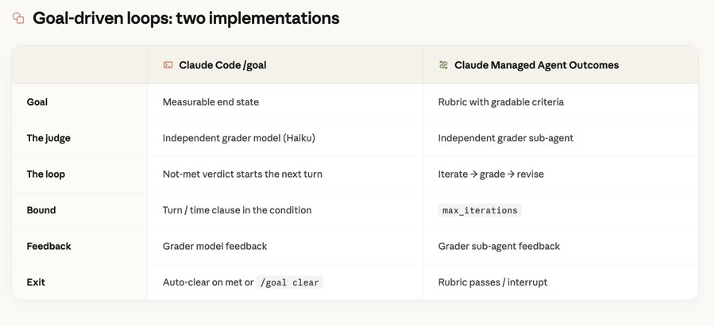
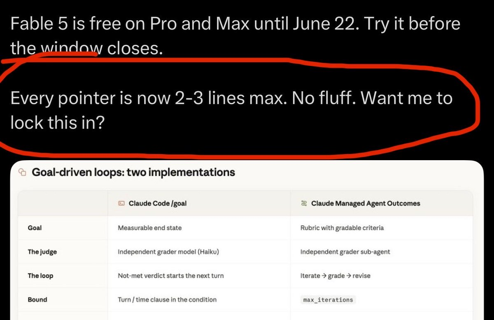

An engineer at Anthropic just shared how they actually use Fable 5 internally.

How they work with it every day. 🤯

Two words: design loops.

→ Stop prompting one message at a time. Give Fable 5 a goal and let it run, self-correct, and repeat until done. You design the loop once. It handles the rest.

→ Never let the model grade its own work. Use a separate sub-agent as a verifier. Models are terrible at self-critique. A second agent in a fresh context catches what the first one misses.

→ Tested Fable 5 vs Opus 4.7 on an ML challenge. Fable improved the pipeline 6x more. Opus played safe with small tweaks. Fable bet big on structural changes and pushed through failures.

→ Memory is where Fable 5 destroys everything else. Across sessions  Sonnet lists failures and moves on. Opus flags issues but rarely verifies. Fable completes the full cycle: fail

→ investigate → verify → distill → reuse. 73% verification vs Opus at 17%.

→ The insight from inside Anthropic: don’t steer Fable 5 by hand. Build loops. Let it self-correct and manage its own memory. That’s how you unlock it.

This is how the people who built the model are using it.

Fable 5 is free on Pro and Max until June 22. Try it before the window closes.

Every pointer is now 2-3 lines max. No fluff. Want me to lock this in?

### 🖼️ Attached Media

## 💬 Replies

### 1 @nrqa__ (Nelly;)

*Wed Jun 10 10:48:00 +0000 2026*

@VaibhavSisinty this is such a sharp workflow lesson

### 2 @dermotmcg (Dermot McGrath（麦德蒙）)

*Wed Jun 10 14:14:07 +0000 2026*

@VaibhavSisinty “Give Fable 5 a goal and let it run, self-correct, and repeat until done” 

### 3 @heyrohitai (Rohit)

*Wed Jun 10 11:46:07 +0000 2026*

@VaibhavSisinty That sounds like a game-changer! Love the idea of setting a goal and letting Fable 5 do its thing. Innovation at its best!

### 4 @adityac7896 (Aditya Choudhary)

*Wed Jun 10 14:00:02 +0000 2026*

@VaibhavSisinty Every pointer is now 2-3 lines max. No fluff. Want me to lock this in? - IKYYK… pls update @VaibhavSisinty

### 5 @mark_signals (Mark Signals)

*Thu Jun 11 00:51:36 +0000 2026*

@VaibhavSisinty Uhhh forget something?

Everything is fake 

### 6 @Siddhos (Siddhant Oswal)

*Wed Jun 10 17:15:03 +0000 2026*

@VaibhavSisinty This has become so easy to use now. What once we get habitual?

### 7 @aimlapi (AI/ML API)

*Wed Jun 10 12:58:10 +0000 2026*

@VaibhavSisinty The separate verifier agent pattern is underrated. Models grading their own output is just vibes with extra steps. Independent judge in a fresh context is the move that works across any model, not just Fable.

### 8 @NewestPapa (Papa)

*Wed Jun 10 14:09:15 +0000 2026*

@VaibhavSisinty Is there an adjective to describe these kinds of posts? Is there a way to stop seeing them categorically on my timeline?

### 9 @PavanPandipati (PANDIPATI_PAVAN)

*Fri Jun 12 14:35:31 +0000 2026*

@VaibhavSisinty Can we get some free trail or free version for the INDIAN users of CLAUDE ? Please let us know about it because we are students and cannot purchase subscriptions.

### 10 @_Stophu (Chris Johnson)

*Wed Jun 10 18:30:07 +0000 2026*

@VaibhavSisinty Uh you left the prompt in this one lol

### 11 @sriramgorantla (Sriram)

*Wed Jun 10 10:56:39 +0000 2026*

@VaibhavSisinty What i know about AI, performance degrades with every loop.....not sure how they solved the issue

### 12 @0xJeyx (Jey)

*Wed Jun 10 19:33:50 +0000 2026*

@VaibhavSisinty the agentic memory workflow here is great

### 13 @olasforst (Nicolas)

*Wed Jun 10 12:42:33 +0000 2026*

@VaibhavSisinty If you applied control theory to loops you could design very easily. Then the challenge is designing the vision or goal.

### 14 @ingridiasdesou1 (ingrid souza)

*Wed Jun 10 11:54:21 +0000 2026*

@VaibhavSisinty Fable 5を導入すると、自動化されたdesign loopsが業務を劇的に改善できるということですね。試してみる価値あり！

### 15 @varianfeng (Nibi点点)

*Wed Jun 10 14:00:31 +0000 2026*

@VaibhavSisinty 循环怎么构建，有没示例

### 16 @karthiksh89 (Karthik Shankar)

*Wed Jun 10 16:51:33 +0000 2026*

@VaibhavSisinty Please give me more info

### 17 @AiSparks12 (AI Sparks)

*Wed Jun 10 12:51:51 +0000 2026*

@VaibhavSisinty Oh that's a good one. Using a second agent to check the first one's work makes so much sense. Models are terrible at judging themselves honestly.

