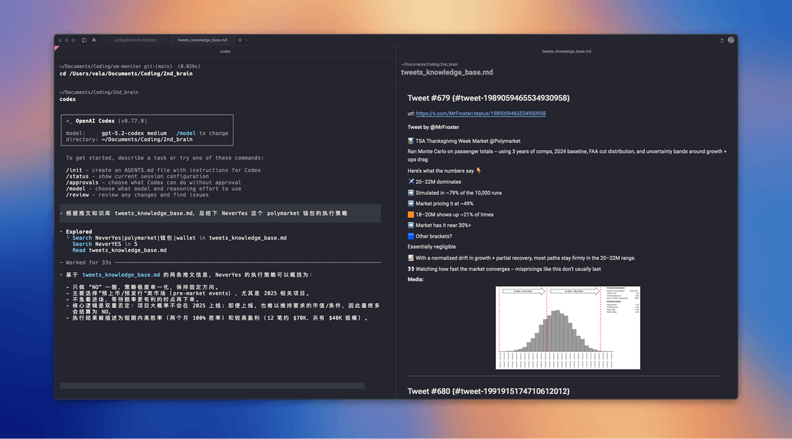
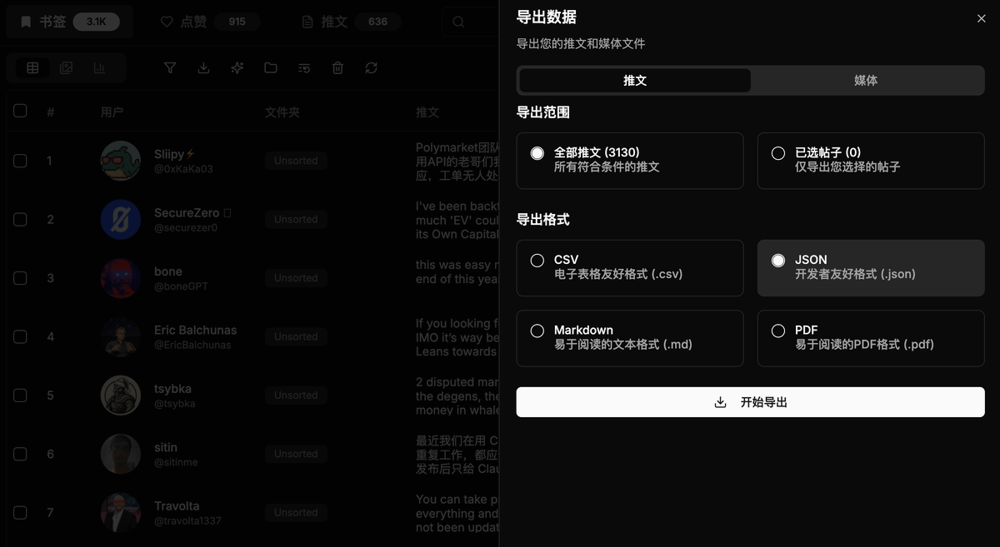
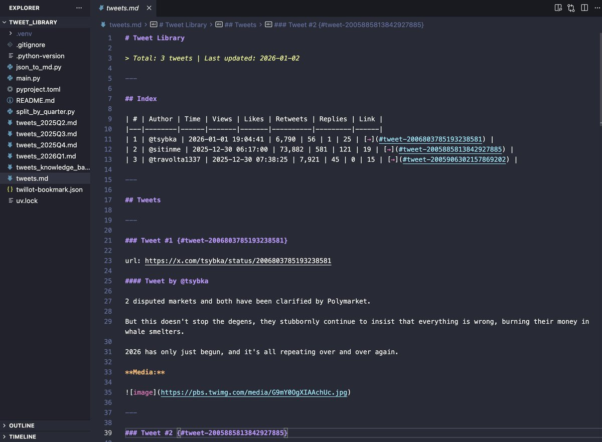
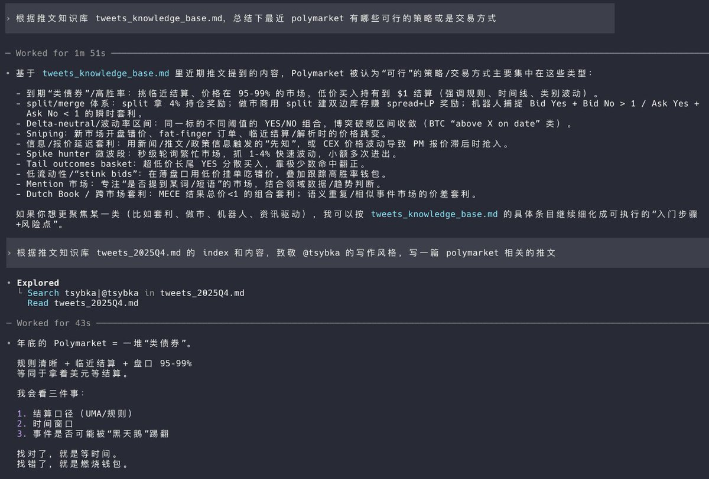

新的一年，戒掉信息囤积症，用 Warp + Codex 把积灰的 X 书签快速变成自己的 AI 记忆库。

最开始是因为 X 自己的书签搜索太难用了，东西存得越多，找得越痛苦。昨晚突然意识到，为什么不直接把编程里最强的搜索工作流拿过来呢，3000 条 X 书签作为 AI 记忆库，利用 Codex CLI 的检索能力，想到什么就直接问，甚至可以让 Agent 调用 SKILL 直接完成任务。

试了下效果还是相当惊喜的，9 万行的 markdown 直接丢进去，都不需要什么向量数据库，30 秒就能针对复杂问题给出相当准确的回答。之所以选择 Codex 一方面是因为量大实惠，还有就是回答总是诚实而简短，特别适合解释问题，不像 Opus 有时会编。

### 🖼️ Attached Media

## 💬 Replies

### 1 @QuantVela (Vela) (Author)

*Fri Jan 02 14:58:52 +0000 2026*

操作方法也很简单，第一步先把 X 书签导出 json，可以使用油猴脚本 twitter-web-exporter 或 twillot 这类产品。注意安装插件时要隔离钱包环境。 

### 2 @QuantVela (Vela) (Author)

*Fri Jan 02 14:58:53 +0000 2026*

第二步整理出你想要的 markdown 格式，让 AI 写个脚本把 json 转成 markdown。这个是因为无论 AI 还是人眼，检索 markdown 都比 json 更高效。我使用的是 Index 关键信息+逐条原文的格式。 

### 3 @QuantVela (Vela) (Author)

*Fri Jan 02 14:58:54 +0000 2026*

最后打开 Warp 或者你喜欢的终端， 进入 Codex，就可以自由提问啦。总结类任务自然是不在话下。让 Agent 试着模仿写条推文，似乎也有内味了？😂K

### 4 @Wiggin_Han (里昂叉 | Leon X)

*Sat Jan 03 01:07:48 +0000 2026*

@QuantVela 好玩！我也试试

### 5 @QuantVela (Vela) (Author)

*Sat Jan 03 02:46:26 +0000 2026*

@Wiggin\_Han 哈哈欢迎入坑！

### 6 @ascetic0x (ascetic)

*Fri Jan 02 21:59:09 +0000 2026*

@QuantVela that's dope!

### 7 @QuantVela (Vela) (Author)

*Sat Jan 03 02:51:38 +0000 2026*

@ascetic0x honored you saw this, huge respect. your edge on polymarket is on another level🫡

### 8 @rubickecho (rubickecho)

*Thu Jan 22 03:11:25 +0000 2026*

@QuantVela 为什么不把 Vela 的经验拿来用呢🥳非常实用！

### 9 @QuantVela (Vela) (Author)

*Thu Jan 22 05:09:50 +0000 2026*

@rubickecho 哈哈，你居然能翻到这么久以前的

### 10 @2011sk8_ (nico_jojo)

*Sat Jan 03 05:43:33 +0000 2026*

@QuantVela 我也有一样的问题。还折腾了一下把书签导出来做自动分类的事情。看起来你这个方法很简单有效。

### 11 @QuantVela (Vela) (Author)

*Sat Jan 03 09:23:57 +0000 2026*

@2011sk8\_ 分类整理一遍能印象深刻些，就是比较花时间

### 12 @wang_xiaolou (日拱一卒王小楼)

*Mon Jan 26 01:47:29 +0000 2026*

@QuantVela 有没有别的方法导出书签，不想用油猴😂

### 13 @wang_xiaolou (日拱一卒王小楼)

*Mon Jan 26 01:45:30 +0000 2026*

@QuantVela 牛逼，这个方法好哎

### 14 @tienho_nyx (Nyx)

*Fri Jan 02 15:41:57 +0000 2026*

@QuantVela codex cli 很有用

### 15 @codewithimanshu (Himanshu Kumar)

*Sat Jan 03 06:34:03 +0000 2026*

@QuantVela I've used Warp; now, I easily kick the information hoarding habit.

### 16 @Leexiaopa (Leexiaopa)

*Sat Jan 03 13:08:16 +0000 2026*

@QuantVela 感谢,这块一直有痛点

### 17 @KtownSexyindian (Ktown | Btc Maxi)

*Sat Jan 03 13:29:09 +0000 2026*

@QuantVela turns your dusty bookmarks into an actual weapon. this workflow is sharp

### 18 @suke2826 (马克)

*Sat Jan 03 00:25:50 +0000 2026*

@QuantVela 互关一下吧

