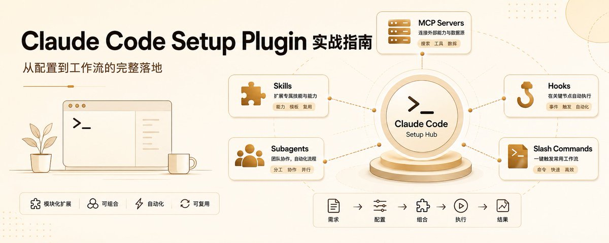

# 📰 claude-code-setup 插件实战指南：让 Claude Code 真正读懂你的项目：

## 为什么需要这个插件？

大部分人装完 Claude Code 后，直接让它帮忙写个脚本，用着用着就觉得一般。不是模型能力不够，而是 Claude 没有掌握项目的全貌。

Claude Code 默认能访问你的文件系统，但它缺少一个关键环节：项目上下文的主动发现。它知道你有一个 [extractor.py](https://extractor.py/)，但它不知道这个文件在整个架构里的角色、不知道你的编码规范、不知道你已有哪些工具链。就像一个聪明的实习生，代码全给他了，但没人告诉他项目怎么跑、规则是什么、坑在哪。

> claude-code-setup 填补的就是这个空白。

---

## 插件做了什么

它不是一个简单的推荐列表生成器。它的工作流程是：

1. 深度扫描：读取 pyproject.toml、package.json、Cargo.toml 等项目配置文件，识别技术栈和依赖

1. 结构分析：遍历 src/、tests/、data/ 等目录，理解项目的模块划分和架构模式

1. 模式匹配：发现你已有的工具（测试框架、lint 配置、CI/CD）、未使用的能力（空白的 .claude/ 目录）、可自动化的重复劳动

1. 生成推荐：基于分析结果，给出 5 个维度的定制化建议——每一条都带着"为什么这对你的项目有用"的解释

1. 逐条确认：不自动应用任何东西，每条推荐让你自己决定是否启用

它的核心价值在于：不是给你通用的 AI 建议，而是理解你的代码之后，给你量身定做的方案。

---

## 安装与使用

装完 Claude Code 后，在项目目录里执行：

\`\`\`markdown
\# 一条命令安装
/plugin install claude-code-setup@claude-plugins-official

\# 触发项目分析
recommend automations for this project
\`\`\`

插件不会瞎猜——它会实际读你的项目文件：

\`\`\`markdown
🔍 扫描 resume-parser/
├─ ✅ 检测到: Poetry, FastAPI, Pydantic, scikit-learn
├─ ✅ 发现: PDF 解析 (pypdf), NLP (spacy), 向量数据库 (chromadb)
├─ ✅ 识别: auth 中间件, 异步 worker, 测试 fixtures
├─ ✅ 注意到: .env.example, Dockerfile, GitHub Actions CI

💡 正在生成定制化推荐...

\`\`\`

关键：插件不自动应用任何东西。它会解释每条推荐为什么重要，让你逐条选择是否启用。

---

## 五大能力详解

1\. MCP Server — 让 Claude 操作工具，不只是谈论

MCP Server 让 Claude 直接调用你的工具栈。

配置样例（写入 .claude/settings.json）：

\`\`\`json
{
  "mcpServers": {
    "python-repl": {
      "command": "uvx",
      "args": \["mcp-server-python", "--project", "."\],
      "description": "在项目的 virtualenv 里执行 Python 代码"
    },
    "filesystem": {
      "command": "uvx",
      "args": \["@modelcontextprotocol/server-filesystem", "/resume-parser"\],
      "description": "安全的、限定范围的文件操作"
    },
    "chromadb": {
      "command": "uvx",
      "args": \["mcp-server-chroma", "--path", "./data/vectors"\],
      "description": "查询简历嵌入向量进行语义搜索"
    }
  }
}
\`\`\`

有 MCP 后，你说"解析这份新简历 PDF，提取技能，匹配 senior-engineer 画像"，Claude 会：

- 通过 Python REPL MCP 调用 pypdf 提取文本

- 运行你的 normalizer.py 清洗数据

- 查询 ChromaDB 做语义匹配

- 返回结构化的匹配分数

没有 MCP：Claude 只会描述怎么做。有了 MCP：直接做给你看。

---

2\. Skill — 固化编码规范

Skill 是用自然语言写的操作手册，把团队的编码模式固化到 .claude/skills/ 下。

\`\`\`markdown
&lt;!-- .claude/skills/resume-parsing.md --&gt;
\## 本项目中的简历解析
1\. 始终以 \`src/parser/extractor.py::ResumeExtractor\` 作为入口
2\. 用 \`dateutil.parser\` + \`src/utils/dates.py\` 标准化日期
3\. 用 Pydantic 对照 \`data/schemas/resume\_v2.json\` 校验输出
4\. 以 \`logger.debug()\` 记录解析置信度, 附上下文
5\. 不要硬编码字段映射 — 用 \`src/config/field\_aliases.py\`

\## ML 集成规则
\- 新特征必须经过 \`src/ml/feature\_engineering.py\`
\- 嵌入必须用 \`src/ml/embeddings.py\` 中的封装
\- 始终缓存向量结果到 \`data/cache/embeddings/\`
\`\`\`

之后让 Claude "添加从简历头部提取 GitHub 个人主页的功能"，它会：

- 按你的类结构编辑 extractor.py

- 在 Pydantic schema 中增加校验

- 更新 config 的字段别名

- 在 tests/unit/test\_extractor.py 中写测试

---

3\. Hook — 关键节点自动守门

Hook 是 Python/bash 脚本，在 Claude 工作流的特定时刻自动触发。

pre-edit hook — 修改文件前拦截不安全操作：

\`\`\`python
\# .claude/hooks/pre-edit.py
import sys, json, re
from pathlib import Path
data = json.load(sys.stdin)
file\_path = Path(data.get("file\_path", ""))

PROTECTED\_PATTERNS = \[
    r"src/parser/\_generated/.\*",   # 自动生成的解析器
    r"data/samples/.\*\\\\.pdf",       # 原始简历文件
    r"\\\\.env.\*",                     # 密钥
\]
if any(re.match(p, str(file\_path)) for p in PROTECTED\_PATTERNS):
    print(json.dumps({"block": True, "reason": f"⚠️ {file\_path} 受保护。请使用 CLI 工具"}))

if file\_path.suffix == ".py":
    print(json.dumps({"post\_action": {"command": \["ruff", "check", "--fix", str(file\_path)\]}}))
print(json.dumps({"block": False}))
\`\`\`

post-test hook — 测试失败时自动分析：

\`\`\`markdown
\# .claude/hooks/post-test.sh
pytest $@ --tb=short -q
if \[ $? -ne 0 \]; then
    echo "🔍 正在用 Claude 分析失败原因..."
    echo "分析这些测试失败并建议修复方案:" $(cat pytest-failures.log)
fi
\`\`\`

---

4\. Subagent — 领域专用 Agent

与其让通用 Claude 包办一切，不如启动专为此任务打造的 agent。

\`\`\`markdown
\# .claude/agents/resume-validator.yaml
name: resume-validator
description: &gt;
  专门校验简历解析输出的 agent。检查 schema 合规性、数据质量、
  字段缺失、日期格式不一致、可疑的技能夸大。
skills:
  \- skills/pydantic-validation.md
  \- skills/data-quality-checks.md
trigger:
  \- files\_matching: \["src/parser/\*\*", "tests/\*\*/test\_extractor\*"\]
  \- on\_command: "/validate-parse"
\`\`\`

执行 /validate-parse src/parser/extractor.py，它会：

- 检查所有 Pydantic model 有 validate\_assignment=True

- 验证 PDF 的错误处理

- 确保边界情况测试覆盖

- 返回可操作的建议

---

5\. 斜杠命令 — 把复杂流程变成一行

把多步工作流打包成自定义命令：

\`\`\`markdown
&lt;!-- .claude/commands/benchmark-parser.md --&gt;
运行端到端解析基准测试:
1\. 从 \`data/samples/benchmark/\` 加载 10 份样例简历
2\. 用 \`ResumeExtractor\` + 计时埋点逐份解析
3\. 计算: 平均延迟、内存峰值、字段完整率 %
4\. 与 \`data/baselines/v1.2.json\` 中的基线对比
5\. 生成 Markdown 报告到 \`reports/benchmark-$(date).md\`
6\. 如果性能衰退 &gt;5%, 通过 \`src/monitoring/alerts.py\` 告警
用法: /benchmark-parser --samples=20 --compare=v1.2
\`\`\`

输出效果：

\`\`\`bash
/benchmark-parser
✅ 已加载 20 份样例 (PDF:12, DOCX:5, TXT:3)
⏱️  平均解析时间: 1.24s (±0.3s) — ✅ 在基线范围内
🧠  字段完整率: 98.7% (↑1.2% vs v1.2)
⚠️  检测到衰退: PDF 解析内存峰值 +7.1%
🔍  建议: Profile \`pypdf\` 图片提取逻辑 extractor.py:142
📄  报告已保存: reports/benchmark-20260507.md
\`\`\`

---

## 完整推荐链

触发 recommend automations 后，插件会输出一份完整的推荐清单：

\`\`\`markdown
🔌 MCP Server:
  → python-repl MCP        (检测到 Poetry virtualenv)
  → chromadb MCP           (检测到向量搜索)
📚 Skill:
  → resume-parsing.md      (标准化提取逻辑)
  → ml-feature-engineering.md (可复现 pipeline)
🪝 Hook:
  → pre-edit schema-guard  (保护 Pydantic 模型)
  → post-test coverage-check (强制覆盖率 ≥90%)
🤖 Subagent:
  → resume-validator       (数据质量保障)
  → security-auditor       (扫描日志中 PII 泄露)
⚡ Slash Command:
  → /benchmark-parser      (性能衰退追踪)
  → /deploy-check          (生产前校验)
\`\`\`

---

## 安装前后对比

之前：.claude/ 只有空的 settings.json

\`\`\`markdown
&gt; "给解析器加上 LinkedIn URL 提取功能"
Claude:
\- 瞎猜你的类结构，用泛型正则（国际格式直接翻车）
\- 忘了更新 Pydantic schema，没加测试，日志也漏了

\`\`\`

之后：.claude/ 有完整的配置体系

\`\`\`markdown
.claude/
├── settings.json        ← MCP: python-repl, chromadb, postgres
├── skills/
│   ├── resume-parsing.md
│   └── ml-feature-engineering.md
├── hooks/
│   ├── pre-edit-schema-guard.py
│   └── post-test-coverage-check.sh
├── agents/
│   ├── resume-validator.yaml
│   └── security-auditor.yaml
└── commands/
    ├── benchmark-parser.md
    └── deploy-check.md

\`\`\`

\`\`\`markdown
&gt; "给解析器加上 LinkedIn URL 提取功能"
Claude:
✅ 用你的 FieldExtractor 基类编辑 extractor.py
✅ 在共享库中添加正则 + fallback
✅ 更新 ResumeSchema
✅ 添加 pytest 用例
✅ 用 logger.debug() 记录提取置信度
✅ 编辑后自动运行 ruff + mypy
✅ 建议: "要加入基准测试套件吗？(/benchmark-parser)"
\`\`\`

---

## 插件生态命令

\`\`\`bash
/plugin discover --tag=python   # 浏览 Python 相关插件
/plugin install &lt;name&gt;@&lt;source&gt; # 安装插件
/plugin list                    # 查看已激活插件
/plugin update --tag=python     # 更新插件
\`\`\`

## 5 分钟上手

\`\`\`bash
pip install anthropic\[claude-code\]
cd your-project
claude
/plugin install claude-code-setup@claude-plugins-official
recommend automations for this project
\# 建议先启用 python-repl MCP + 项目 skill
\# 再加 hook + subagent
\`\`\`

安全提醒

插件可执行代码、访问文件系统、安装依赖。请始终：

1. 安装前审查源码（点击插件源码链接）

1. 先用 --dry-run 预览推荐

1. 用虚拟环境 (uv venv, poetry shell) 做隔离

社区插件像对待 PyPI 包一样：审查，测试，再信任。

## 

## 参考

- [Claude Code Is a Mess, Until You Install This Official Plugin](https://pub.towardsai.net/claude-code-is-a-mess-until-you-install-this-official-plugin-f94e7cac723f)

- [Plugins for Claude Code](https://claude.com/plugins)

- [Claude Code Docs](https://code.claude.com/docs)

如果这篇对你有帮助：
• 先收藏，之后配置时直接翻出来用。
• 关注 @vincemask，后面继续拆 Claude Code / Agent 工程化实践。

### 🖼️ Attached Media

## 💬 Replies

### 1 @ThanksuTrump (猫投鹰 (鹰哥))

*Thu May 21 12:12:58 +0000 2026*

总算有人把Claude Code的遮羞布扯下来了。缺的就是项目记忆，每次重启对话都从零猜你架构，再强的模型也经不住这么糟蹋。 这插件思路是对的，但别急着全装。MCP server和python-repl这种是真刚需，能直接上手改代码比看一百遍描述强多了。Skill固化规范也值，但写过就知道，不跟着项目迭代就是僵尸文件，三个月之后比注释还假，反而误导模型。 至于hooks和subagent，大部分项目纯属过度工程。pre-edit guard写不好就是给自己挖坑，AI改不动代码的时候你就知道惨了。斜杠命令留一两个跑benchmark的足矣，别为了酷而酷。 建议先只开MCP + 最小skill集，跑通了再慢慢加。你们.claude/目录里现在有多少死配置？我赌超过一半是三个月前的古董，删都不敢删。

### 2 @vincemask (Vince 聊开发) (Author)

*Thu May 21 12:13:30 +0000 2026*

@ThanksuTrump 说到点子上了 👍

### 3 @MinLiBuilds (实践哥 Li)

*Thu May 21 12:13:35 +0000 2026*

@vincemask 平时还真没注意呢，这个对新项目很友好

### 4 @vincemask (Vince 聊开发) (Author)

*Thu May 21 12:16:35 +0000 2026*

@MinLiBuilds 对的，新项目一开始用这个梳理配置，能少踩不少坑。

### 5 @huanghllose (liang)

*Thu May 21 12:18:15 +0000 2026*

@vincemask 太专业了，这个插件让你做起项目来如虎添翼

### 6 @vincemask (Vince 聊开发) (Author)

*Thu May 21 12:21:15 +0000 2026*

@huanghllose 用起来吧

### 7 @ModengSir (Modengsir AI)

*Thu May 21 12:10:34 +0000 2026*

@vincemask claude 后来都没有怎么研究，就直接跳到codex 了，不过都是相通的

### 8 @vincemask (Vince 聊开发) (Author)

*Thu May 21 12:12:58 +0000 2026*

@ModengSir claude 和 codex 都是好工具，功能都没有上限，关键是你想怎么用它

### 9 @MainCaseZ (Main CaseZ·美學)

*Thu May 21 12:54:00 +0000 2026*

@vincemask 非常之酷

我感觉我得去下载cc了

### 10 @vincemask (Vince 聊开发) (Author)

*Thu May 21 13:01:47 +0000 2026*

@MainCaseZ 指挥codex 一键安装 claude code

### 11 @yanhengshao (一辈子放牛 Cowboy)

*Thu May 21 12:20:39 +0000 2026*

@vincemask 学习✌️

### 12 @bccdc5 (Ethen(伊森）)

*Thu May 21 13:14:42 +0000 2026*

@vincemask 刚开始安装cc.这个先学习一下

### 13 @xjzzsyx (zs zhang)

*Mon Jun 29 08:58:36 +0000 2026*

@vincemask 收益匪浅，非常感谢！！！

