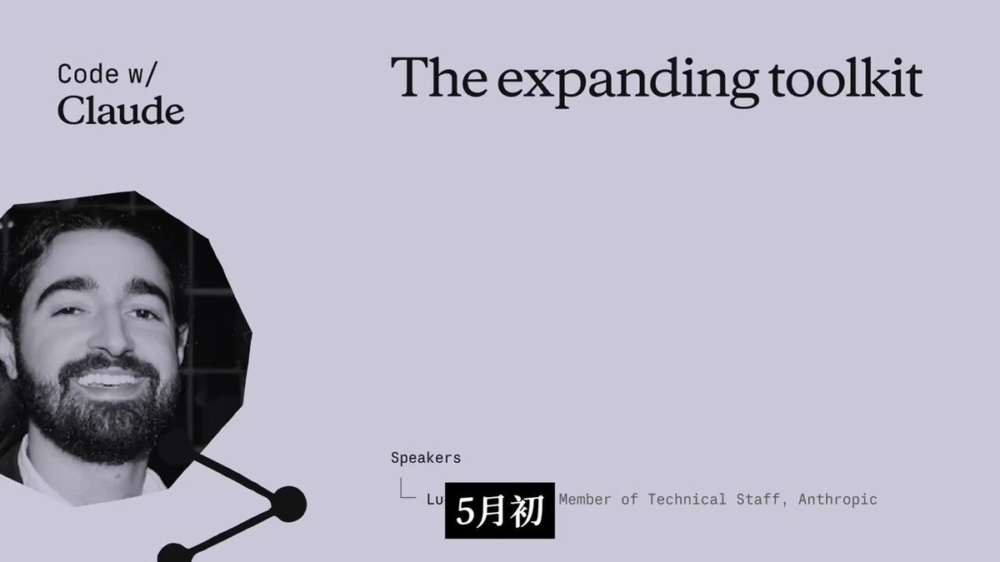

Anthropic 这个演讲有点东西。🤯

以前写 Agent 还得自己费劲搞路由（Router）、重试机制、上下文压缩，现在演讲者直接说：这些“脚手架”模型已经内置了，别费劲造轮子了。

最炸裂的是最后那个 Demo：让 Claude 自己打开浏览器，复现前端 Bug，改代码，然后再自己拖拽卡片测试……这闭环太丝滑了。😱

感觉以后写代码真的是“描述需求 -&gt; AI 自己测 -&gt; AI 自己修”了。

推荐做 Agent 开发的朋友看看，尤其是讲 Tool Use 和 Computer Use 的部分，进化速度有点吓人。👇

### 🖼️ Attached Media

## 💬 Replies

### 1 @QT9277 (阿台🕊️)

*Sun May 10 12:19:08 +0000 2026*

@VincentLogic Anthropic的Agent开发已进化到“描述需求，AI自测自修”的丝滑闭环。

### 2 @ChainLog7 (joker)

*Sun May 10 12:20:07 +0000 2026*

@VincentLogic 啊？Agent都到这一步了？😅

### 3 @LyonShrimp (Lyon)

*Mon May 11 01:46:49 +0000 2026*

@VincentLogic all in LLMs，黏性更高，未来想换模型的代价成本更高。

### 4 @DalinHuang (Dalin Huang)

*Mon May 11 01:27:55 +0000 2026*

@VincentLogic 记得一年多前 claude api的thinking已经好过自己做的，就知道专注做tools + 数据就好了

### 5 @Keji715 (柯基是只猫)

*Mon May 11 11:28:37 +0000 2026*

@VincentLogic 给 AI 一个可以测试的环境，可以大幅度地降低自己的精力投入

### 6 @stometaverse (Stometa)

*Mon May 11 14:08:44 +0000 2026*

@VincentLogic 脚手架内置方向是对的, 但 demo 里最容易忽略的风险: agent 自己改代码再自己测, generator/evaluator 没分离. 真正的 regression 90% 出在中间步骤的 tool 调用上, 单看 final answer 看不出来. 闭环丝滑和结果可靠是两回事.

### 7 @mikeng_io (ᎷᎥᏦᏋ ᏁᎶ)

*Mon May 11 10:58:30 +0000 2026*

@VincentLogic 所以以前是我自己寫 router + retry + context compression 現在變成 Anthropic 內建我失業了是吧... 😂

### 8 @JmCrimson (JM Crimson)

*Mon May 11 07:50:19 +0000 2026*

@VincentLogic 求原链接～

