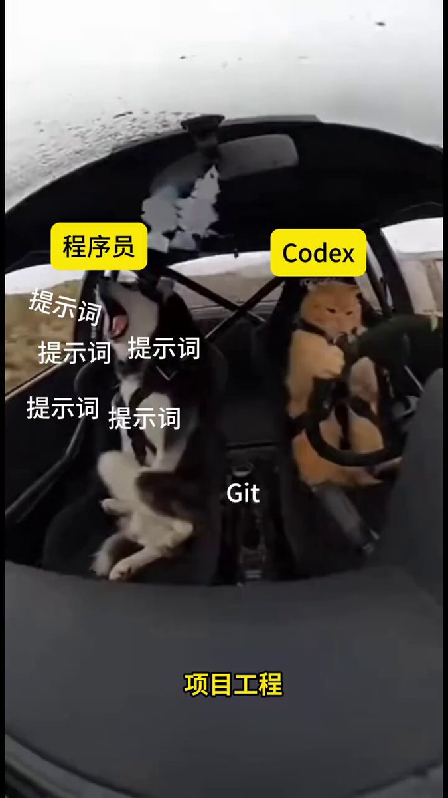

Git 在手，提示词满天飞，这大概就是 AI 时代最真实的样子。 

## 💬 Replies

### 1 @Vincent_AINotes (Vincent) (Author)

*Fri Jun 05 15:41:25 +0000 2026*

以前写代码靠手速。

现在更像是：

你负责判断方向，
Codex 负责执行细节，
Git 负责留下轨迹。

AI 时代的程序员，拼的不只是会不会写代码，而是能不能把需求说清楚。

### 2 @vesmallu (Ve)

*Sat Jun 06 03:09:49 +0000 2026*

@VincentLogic 哈哈，太他妈形象了，而且还要动手去拉手刹

### 3 @adelbucetta (Adel Bucetta)

*Sat Jun 06 02:41:08 +0000 2026*

@VincentLogic the honest answer is that we're still figuring out what 'ai era' even means for us as builders, because every tool that emerges just reveals a new set of problems to solve

### 4 @Vincent_AINotes (Vincent) (Author)

*Sat Jun 06 03:31:09 +0000 2026*

@adelbucetta 对，"揭示新问题"才是真正的成本。我们今天做的工具，就是明天要做的工具的作业。

### 5 @halley_wang112 (梦旅人🇩🇪Halley)

*Fri Jun 05 16:29:22 +0000 2026*

@VincentLogic 我们二哈不像是发射信号，像是在制造噪音？

### 6 @Vincent_AINotes (Vincent) (Author)

*Fri Jun 05 17:07:43 +0000 2026*

@halley\_wang112 哈哈，噪音没错，但 100 条提示词里能筛出 1 条真信号——这就是新技能。

### 7 @ThouShaltAtone (长蘑蘑🏳️‍🌈)

*Sat Jun 06 03:45:46 +0000 2026*

@VincentLogic 码农就没有会写提示词的，语文不行，人家都说不好。

### 8 @Vincent_AINotes (Vincent) (Author)

*Sat Jun 06 05:33:11 +0000 2026*

@ThouShaltAtone 对，所以码农写 prompt 的尽头是 YAML。

### 9 @mufenglabs (沐风)

*Sat Jun 06 03:16:23 +0000 2026*

@VincentLogic 哈哈，形象

### 10 @Vincent_AINotes (Vincent) (Author)

*Sat Jun 06 03:29:27 +0000 2026*

@mufenglabs 哈哈 戳中～ 其实那个 Git 在手是写实，离开 Git 啥也开不动。

### 11 @TaXue2025 (踏雪寻仙)

*Sat Jun 06 04:43:57 +0000 2026*

@VincentLogic 这年头的程序员要具备万里挑一的职业素养

### 12 @Vincent_AINotes (Vincent) (Author)

*Sat Jun 06 05:35:43 +0000 2026*

@TaXue2025 对，"万里挑一"是结果。"读得懂 Git、写得明白 prompt、改得了 issue"——三件套合一的才是。

### 13 @OKXie (Pat)

*Sat Jun 06 11:47:38 +0000 2026*

@VincentLogic @onedogecoin 其实坐在驾驶座上让FSD自动驾驶用疯狂模式的我也和这只狗子一样。

### 14 @Vincent_AINotes (Vincent) (Author)

*Sat Jun 06 12:07:17 +0000 2026*

@OKXie @onedogecoin 对，都是"坐在驾驶座上没在开车"的。

### 15 @kuk47377341 (Kithe)

*Sat Jun 06 12:40:57 +0000 2026*

@VincentLogic 笑死，太真实了😂

